# 探索性数据分析的广泛逐步指南

> 原文：<https://towardsdatascience.com/an-extensive-guide-to-exploratory-data-analysis-ddd99a03199e?source=collection_archive---------0----------------------->

## 我对任何数据集执行 EDA 的个人指南


> ***务必*** [***订阅此处***](https://terenceshin.medium.com/membership) ***或至我的*** [***独家快讯***](https://terenceshin.substack.com/embed) ***千万不要错过另一篇关于数据科学的指南、窍门和技巧、生活经验等！***

# 什么是探索性数据分析？

**探索性数据分析(EDA)** ，也称为数据探索，是数据分析过程中的一个步骤，其中使用了多种技术来更好地理解所使用的数据集。

“理解数据集”可以指许多事情，包括但不限于…

*   提取重要变量，留下无用变量
*   识别异常值、缺失值或人为错误
*   理解变量之间的关系或缺乏关系
*   最终，最大限度地提高您对数据集的洞察力，并最大限度地减少流程后期可能出现的潜在错误

这就是为什么这很重要。

你听说过“垃圾进，垃圾出”这句话吗？

对于 EDA，更像是“垃圾入，执行 EDA，**可能是**垃圾出。”

通过进行 EDA，你可以将一个**几乎**可用的数据集变成一个完全可用的数据集。我并不是说 EDA 可以神奇地使任何数据集变得干净——这不是真的。然而，许多 EDA 技术可以解决每个数据集中存在的一些常见问题。

> 探索性数据分析主要做两件事:
> 
> 1.它有助于清理数据集。
> 
> 2.它让你更好地理解变量和它们之间的关系。

# EDA 的组件

对我来说，探索数据有几个主要部分:

1.  了解您的变量
2.  清理数据集
3.  分析变量之间的关系

在本文中，我们将看看前两个组件。

> ***请务必*** [***订阅此处***](https://terenceshin.medium.com/membership) ***或至我的*** [***独家快讯***](https://terenceshin.substack.com/embed) ***千万不要错过另一篇关于数据科学的文章指南、技巧和提示、生活经验等！***

# 1.了解您的变量

你不知道你不知道什么。如果你不知道自己不知道什么，那么你怎么知道你的见解是否有意义？你不会的。

举个例子，我正在研究 NFL 提供的数据(这里是数据[这里是数据](https://www.kaggle.com/c/nfl-playing-surface-analytics/overview/evaluation))，看看我是否能发现任何关于增加受伤可能性的变量的见解。我得到的一个见解是，中后卫积累的伤病是后卫的八倍多。然而，我不知道后卫和后卫之间的区别是什么，正因为如此，我不知道我的见解是否有意义。当然，我可以谷歌一下这两者之间的区别，但是我不能总是依赖谷歌！现在您可以明白为什么理解您的数据如此重要了。让我们看看如何在实践中做到这一点。

作为一个例子，我使用了我用来创建我的第一个随机森林模型的相同数据集，二手车数据集[这里](https://www.kaggle.com/austinreese/craigslist-carstrucks-data)。首先，我导入了我知道我的分析需要的所有库，并进行了一些初步的分析。

```
#Import Libraries
import numpy as np
import pandas as pd
import matplotlib.pylab as plt
import seaborn as sns#Understanding my variables
df.shape
df.head()
df.columns
```

**。shape** 返回我的数据集的行数乘以列数。我的输出是(525839，22)，这意味着数据集有 525839 行和 22 列。

**。head()** 返回我的数据集的前 5 行。如果您想查看每个变量的一些示例值，这很有用。

**。columns** 返回数据集中所有列的名称。

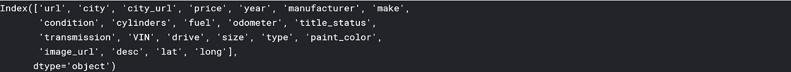

df.columns 输出

一旦我知道了数据集中的所有变量，我想更好地理解每个变量的不同值。

```
df.nunique(axis=0)
df.describe().apply(lambda s: s.apply(lambda x: format(x, 'f')))
```

**。nunique(axis=0)** 返回每个变量的唯一值的数量。

**。describe()** 总结了数字变量的计数、平均值、标准差、最小值和最大值。接下来的代码只是将每一行格式化为常规格式，并取消科学符号([见此处](https://stackoverflow.com/questions/40347689/dataframe-describe-suppress-scientific-notation/47207283))。

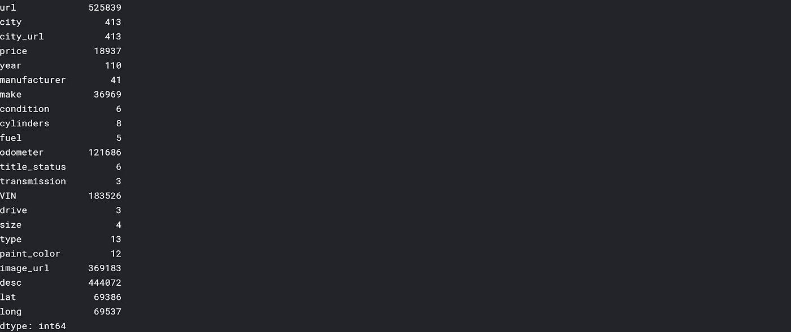

df.nunique(轴=0)输出

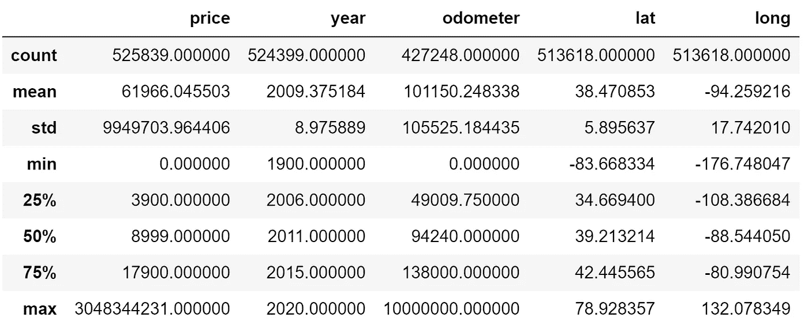

df.describe()。apply(lambda s:s . apply(lambda x:format(x，' f '))输出

很快，我注意到了价格、年份和里程表的问题。例如，最低和最高价格分别为 0.00 美元和 3，048，344，231.00 美元。您将在下一节看到我是如何处理这个问题的。我仍然想更好地理解我的离散变量。

```
df.condition.unique()
```

使用**。unique()** ，我看了看我的离散变量，包括‘条件’。


df.condition.unique()

你可以看到彼此有很多同义词，比如‘优秀’和‘如新’。虽然这不是最好的例子，但在某些情况下，将不同的单词组合在一起是最理想的。例如，如果您正在分析天气模式，您可能希望将“多云”、“灰色”、“多云，有可能下雨”和“大部分多云”简单地重新分类为“多云”。

稍后您将看到，由于有太多的空值，我最终省略了这个列，但是如果您想要重新分类条件值，您可以使用下面的代码:

```
# Reclassify condition column
def clean_condition(row):

    good = ['good','fair']
    excellent = ['excellent','like new']       

    if row.condition in good:
        return 'good'   
    if row.condition in excellent:
        return 'excellent'    
    return row.condition# Clean dataframe
def clean_df(playlist):
    df_cleaned = df.copy()
    df_cleaned['condition'] = df_cleaned.apply(lambda row: clean_condition(row), axis=1)
    return df_cleaned# Get df with reclassfied 'condition' column
df_cleaned = clean_df(df)print(df_cleaned.condition.unique())
```

你可以看到下面的值被重新分类了。


print(df _ cleaned . condition . unique())输出

# 2.清理数据集

现在，您已经知道了如何根据需要对离散数据进行重分类，但是还有许多事情需要注意。

**a .删除冗余变量**

首先我去掉了我认为多余的变量。这包括 url、图像 url 和城市 url。

```
df_cleaned = df_cleaned.copy().drop(['url','image_url','city_url'], axis=1)
```

**b .变量选择**

接下来，我想去掉任何有太多空值的列。多亏了我的朋友 Richie，我使用下面的代码删除了 40%或更多数据为空值的列。根据具体情况，我可能会提高或降低阈值。剩余的列如下所示。

```
NA_val = df_cleaned.isna().sum()def na_filter(na, threshold = .4): #only select variables that passees the threshold
    col_pass = []
    for i in na.keys():
        if na[i]/df_cleaned.shape[0]<threshold:
            col_pass.append(i)
    return col_passdf_cleaned = df_cleaned[na_filter(NA_val)]
df_cleaned.columns
```

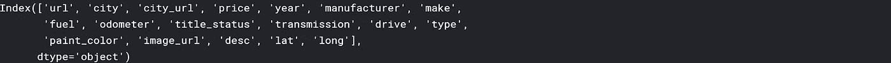

**c .剔除异常值**

回到前面提到的问题，我为价格、年份和里程表设置了参数，以删除设置边界之外的任何值。在这种情况下，我用我的直觉来确定参数——我肯定有确定最佳边界的方法，但我还没有深入研究过！

```
df_cleaned = df_cleaned[df_cleaned['price'].between(999.99, 99999.00)]
df_cleaned = df_cleaned[df_cleaned['year'] > 1990]
df_cleaned = df_cleaned[df_cleaned['odometer'] < 899999.00]df_cleaned.describe().apply(lambda s: s.apply(lambda x: format(x, 'f')))
```

您可以在下面的结果中看到最小值和最大值发生了变化。

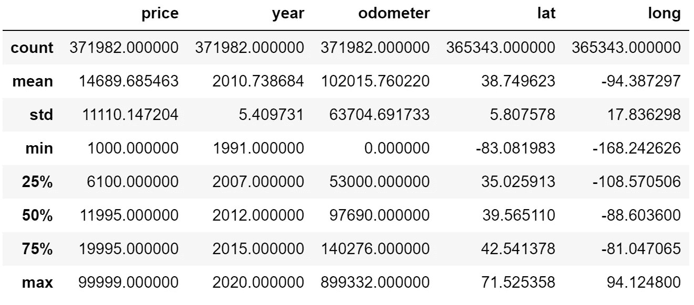

d.**删除空值行**

最后，我用了**。dropna(axis=0)** 删除任何包含空值的行。在下面的代码之后，我从 371982 行增加到 208765 行。

```
df_cleaned = df_cleaned.dropna(axis=0)
df_cleaned.shape
```

# 3.分析变量之间的关系

## 相关矩阵

当分析我的变量时，我喜欢做的第一件事是通过相关矩阵将其可视化，因为这是对我的所有变量形成总体理解的最快方式。回顾一下，**相关性**是描述两个变量之间关系的度量——如果你想了解更多，你可以查看我的统计小抄[这里](https://medium.com/@terenceshin/week-2-52-stats-cheat-sheet-ae38a2e5cdc6)。)因此，**相关矩阵**是显示许多变量之间的相关系数的表格。我使用 **sns.heatmap()** 来绘制二手车数据集中所有变量的相关矩阵。

```
# calculate correlation matrix
corr = df_cleaned.corr()# plot the heatmap
sns.heatmap(corr, xticklabels=corr.columns, yticklabels=corr.columns, annot=True, cmap=sns.diverging_palette(220, 20, as_cmap=True))
```

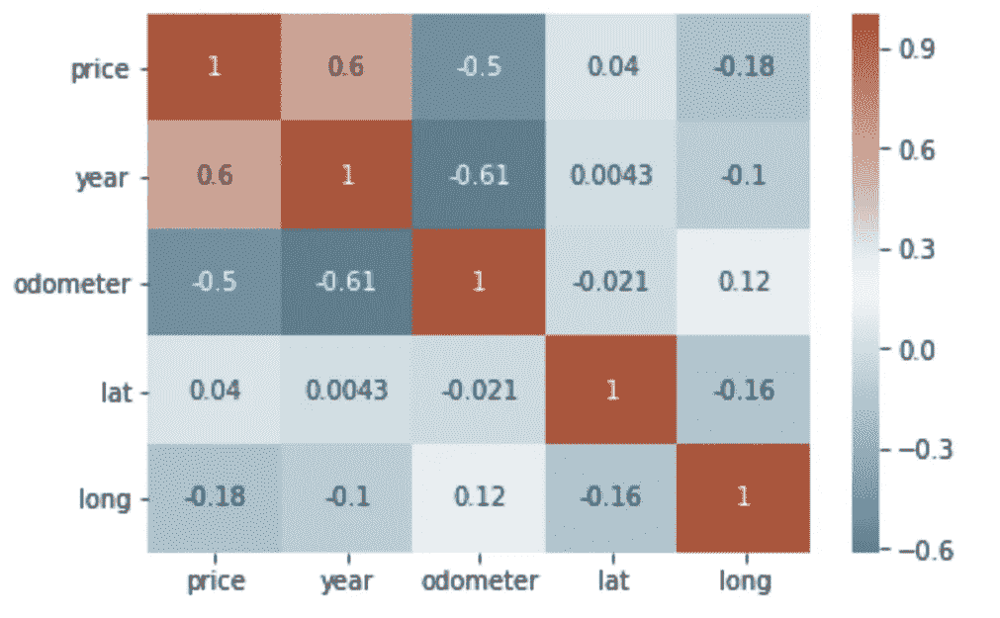

我们可以看到，价格与年份正相关，价格与里程表负相关。这是有道理的，因为新车通常更贵，里程数多的车相对更便宜。我们还可以看到年份和里程表之间存在负相关关系——越新的汽车行驶的里程数越少。

## 散点图

就数据可视化而言，很难击败关联热图，但就数据而言，散点图无疑是最有用的可视化之一。

散点图是一种沿着两个轴“绘制”两个变量值的图表，如年龄和身高。散点图非常有用，原因有很多:像相关矩阵一样，它允许您快速了解两个变量之间的关系，它对于识别异常值非常有用，并且在多项式多元回归模型中非常有用(我们将在下一篇文章中讨论)。我用了**。plot()** 并将图形的“种类”设置为**散点图。**我还将 x 轴设置为“里程表”, y 轴设置为“价格”,因为我们想看看不同级别的里程如何影响价格。

```
df_cleaned.plot(kind='scatter', x='odometer', y='price')
```

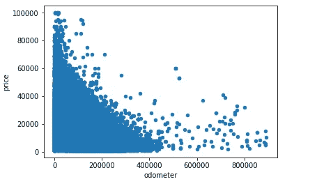

这和相关矩阵讲述了同样的故事——里程表和价格之间存在负相关。散点图的巧妙之处在于，它传达的信息不仅仅是这些。你可以假设的另一个观点是里程对价格的影响是递减的。换句话说，一辆车在生命早期积累的里程数对价格的影响要比它在生命后期的影响大得多。你可以看到这一点，因为这些图一开始显示了一个陡峭的下降，但随着里程数的增加，下降幅度变小了。这就是为什么人们说买一辆全新的汽车不是一个好的投资！

```
df_cleaned.plot(kind='scatter', x='year', y='price')
```

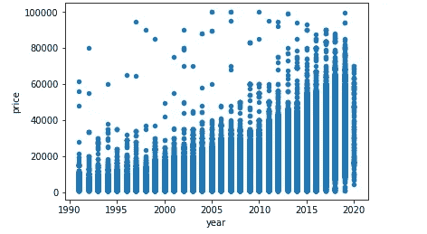

再举一个例子，上面的散点图显示了年份和价格之间的关系——车越新，可能就越贵。

另外， **sns.pairplot()** 是在所有变量之间创建散点图的好方法。

```
sns.pairplot(df_cleaned)
```

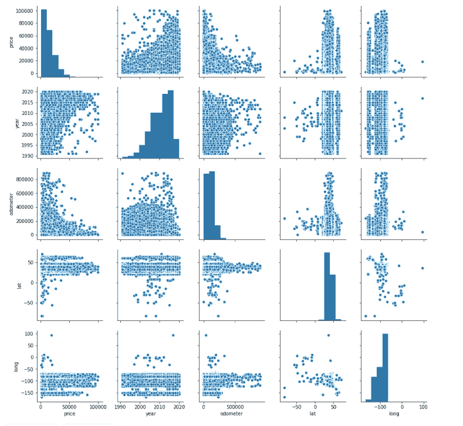

## 柱状图

相关矩阵和散点图有助于探索两个变量之间的关系。但是如果你只想探索一个单独的变量呢？这就是直方图发挥作用的时候了。直方图看起来像条形图，但它们显示了一组变量的值的分布。

```
df_cleaned['odometer'].plot(kind='hist', bins=50, figsize=(12,6), facecolor='grey',edgecolor='black')df_cleaned['year'].plot(kind='hist', bins=20, figsize=(12,6), facecolor='grey',edgecolor='black')
```

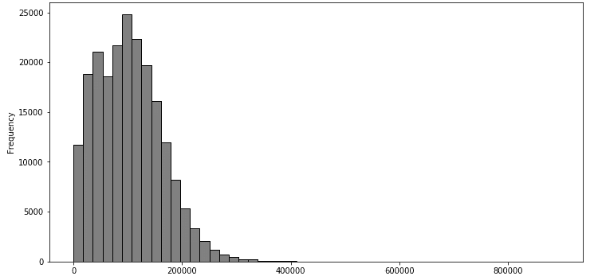

```
df_cleaned['year'].plot(kind='hist', bins=20, figsize=(12,6), facecolor='grey',edgecolor='black')
```

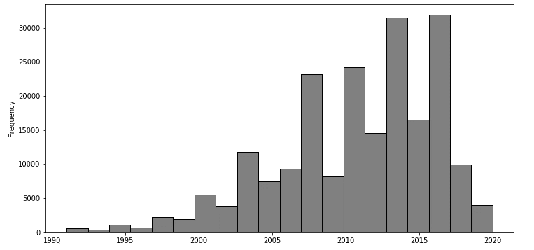

我们可以很快注意到，普通汽车的里程表从 0 到刚刚超过 200，000 公里，一年大约从 2000 年到 2020 年。这两个图的区别在于“里程表”的分布是正偏的，而“年份”的分布是负偏的。偏斜度很重要，尤其是在金融等领域，因为许多模型都假设所有变量都是正态分布的，而事实通常并非如此。

## 箱线图

另一种可视化变量分布的方法是箱线图。这次我们以“价格”为例。

```
df_cleaned.boxplot('price')
```

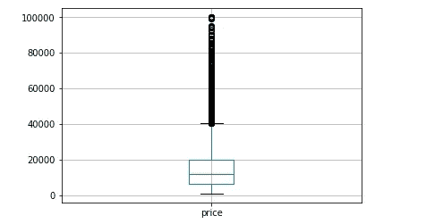

箱线图不像上面显示的其他图表那样直观，但它以自己的方式传达了很多信息。下图解释了如何读取箱线图。很快，您可以看到价格上限中有许多异常值，并且大多数价格都在 0 到 40，000 美元之间。

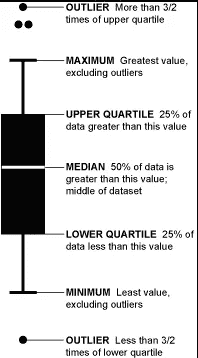

根据数据集的不同，您还可以使用其他几种类型的可视化效果，如堆积条形图、面积图、小提琴图，甚至地理空间图。

通过探索性数据分析的三个步骤，您将对您的数据有一个更好的理解，这将使您更容易选择您的模型、您的属性并对其进行整体优化。

# 感谢阅读！

> ***如果您喜欢这篇文章，请务必点击*** [***订阅此处***](https://terenceshin.medium.com/membership) ***或至我的*** [***独家快讯***](https://terenceshin.substack.com/embed) ***千万不要错过另一篇关于数据科学指南、技巧和提示、生活经验等的文章！***