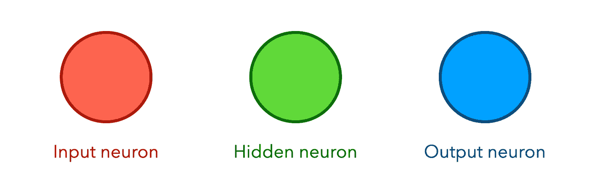
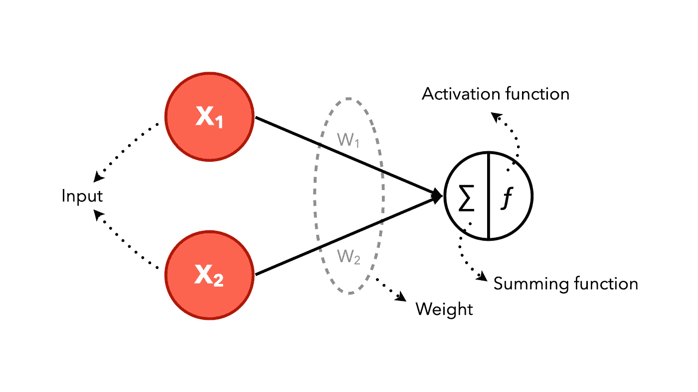
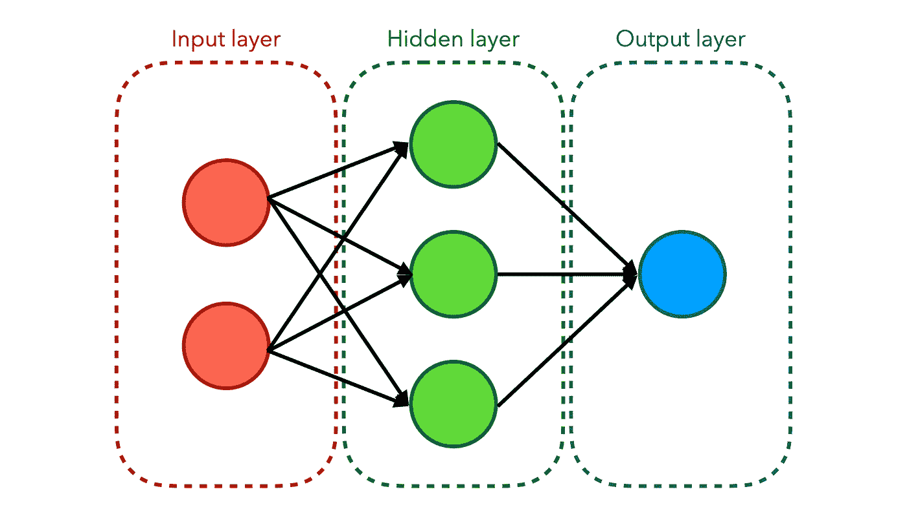
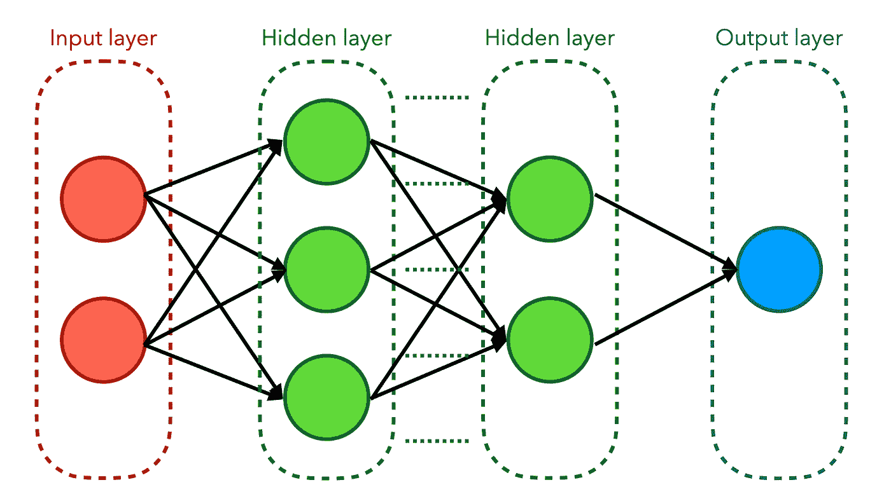
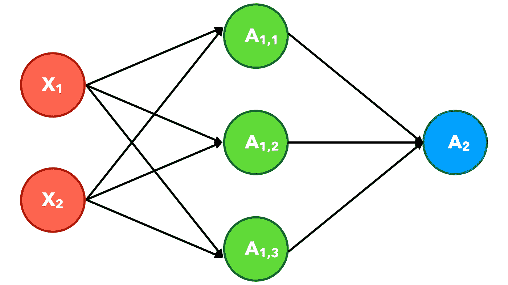
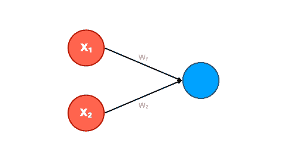
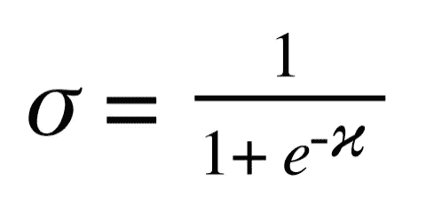
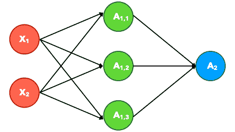
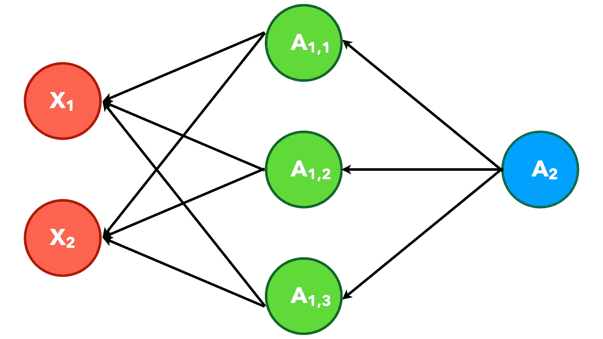

# 人工神经网络图解指南

> 原文：<https://towardsdatascience.com/an-illustrated-guide-to-artificial-neural-networks-f149a549ba74?source=collection_archive---------18----------------------->

## 带插图的分步人工神经网络教程

在当前时代，关于**人工智能**的研究发展非常迅速。生活的方方面面开始和这个名词结合。从金融领域开始到汽车领域，当然不会脱离 AI。

随着人工智能的发展，一种快速发展的方法是**人工神经网络(ANN)** 。从 AI 发展之初，到今天深度学习的发展，ANN 在其中都有一份。所以这种方法是对人工智能发展最有影响的方法之一也就不足为奇了。

但为什么这种方法对 AI 的发展影响如此之大？为什么这个术语如此流行？而什么是人工神经网络？在本文中，我们将回答这个问题。

# 什么是人工神经网络？

人工神经网络是人工智能的一个分支，它采用人脑的工作方式将刺激组合处理成输出。

人工神经网络的一个重要组成部分是神经元。像人脑由许多脑细胞组成一样，ANN 也由相互连接的神经元集合组成。在神经元内部，有刺激接收器、刺激处理器和输出部分。输出产生的信息可以传递给其他神经元。

人工神经网络很受欢迎，因为它可以解决用其他方法难以解决的复杂问题。这种方法也成为了发展**深度学习**的先行者，深度学习是机器学习的子领域之一，专注于具有多个深层结构的人工神经网络。如果你没有看过我关于深度学习的文章，可以查看下面的链接。

 [## 人工智能、机器学习和深度学习——有什么区别？

### 人工智能、机器学习和深度学习的简单解释以及它们之间的区别

towardsdatascience.com](/artificial-intelligence-machine-learning-and-deep-learning-what-the-difference-8b6367dad790) 

# 人工神经网络的组成

正如上一节所解释的，人工神经网络有一部分叫做神经元。通常，ANN 有三个神经元，即输入神经元、隐藏神经元和输出神经元。

神经元

在隐藏神经元和输出神经元中，有一个函数用于从前一个神经元生成输出。这个函数称为激活函数。神经元的输出可以被传递，稍后将成为更多神经元的输入。

激活功能

人工神经网络的输出是一个值，它代表了被寻找的变量的预测。ANN 的下一个重要部分是重量。权重被用作将进入神经元的输入乘数。每个相互连接的神经元都有自己的权重。每个神经元都可以加上偏置，这是加到神经元输入上的常数。

另外，还有一层。一层由一个或多个神经元组成。人工神经网络有三层，即输入层、隐藏层和输出层。如果该结构只有输入层和输出层，则称为单层感知器。

单层感知器

同时，如果它在输入层和输出层之间至少有一层(隐藏层),那么它被称为多层感知器。

多层感知器

如果多层感知器有许多隐藏层，则称为深度神经网络。在本文中，我们只关注多层感知器(1 个隐藏层)。

深度神经网络

# 它是如何工作的？

如前所述，ANN 可以通过研究已经提供的数据模式来进行预测和分类。提供的数据越多，通过这种方法可以学习的模式就越多。一般来说，神经网络中常用的主要有两个过程，即前馈和反向传播。

前馈是基于输入值计算输出值的算法，而反向传播是基于从输出值获得的误差训练神经网络(改变权重)的算法。

神经网络中的学习过程从初始化权重值、**学习速率**和**时期**开始。我们还必须确定输入神经元、隐藏神经元和输出神经元的数量。Epoch 是 ANN 中的一个迭代。我们可以确定学习过程中的迭代次数，如果达到一定的迭代次数，学习过程就会停止。我们还可以确定最小误差值来停止学习过程。

学习率是决定学习速度的一个值，学习率的值越大，机器学习的速度越快，但将很难得到最优结果，反之，学习率越小，机器学习的速度越慢，但得到最优结果的可能性越大。

## **前馈**

前馈

前馈过程集中于寻找已经用预定参数建立的系统的输出。这些产出的结果将与预定的目标进行比较。让我们看看下面的插图。

单层感知器

上图是一个使用单层感知器的例子。`x1`和`x2`是我们使用的输入数据，而`w1`和`w2`是权重。通常，权重值是随机确定的[-1…1]。计算输出的过程如下。

1.  将权重乘以神经元的输入，然后将它们相加。
2.  将权重与输入相乘的结果输入到激活函数中

比如我们有`x1`和`x2`的值分别是 1 和 0，`w1`和`w2`的值分别是 0.25 和 0.75。然后计算是这样的`x1 * w1 + x2 * w2 = 1 * 0.25 + 0 * 0.75 = 0.25`。然后，将该值输入激活函数。我们将在这里使用的激活函数是 **sigmoid** 函数。通过使用 sigmoid 函数，结果是 0.56。

Sigmoid 函数

那么，如果结构由 3 层组成，即输入层、隐藏层和输出层，会怎样呢？基本一样。上述激活函数的值将是隐藏层的值，该值将被转发到输出层。更多细节，让我们看看下面的插图。

多层感知器

在我们获得输出层的值之后，下一个过程是从输出层获得误差值。该误差值稍后将成为改变权重值的参数。计算误差也有许多方法，如 MSE(均方误差)、SSE(误差平方和)等。

误差计算

## 反向传播

反向传播

反向传播侧重于更新和评估前馈中使用的参数(权重)。重量值将根据获得的误差值而改变。从`Target value — output value`获得的误差值。

权重更新通常使用优化算法。人工神经网络中使用的优化算法各不相同，如 Adam(自适应矩估计)、RMSProp、梯度下降等。

关于反向传播计算的更多细节，你可以看来自 [3Blue1Brown](https://www.youtube.com/channel/UCYO_jab_esuFRV4b17AJtAw) 的视频。

在我们更新了之前的权重之后，我们已经完成了一次迭代。下一步是通过重复前馈过程进入第二次迭代。这个过程将继续重复，直到我们之前指定的停止条件。

反向传播动画

## 接下来呢？

在训练过程被认为是充分的之后，ANN 模型可以用于分类过程。进行分类的方法类似于前馈过程，在前馈过程中，输入的数据将在人工神经网络中的神经元上通过权重乘法进行处理。这里的权重乘法与前馈的区别在于，所使用的权重是在训练过程中获得的最佳权重。当该过程在输出层时，获得的输出是每个神经元的十进制数，该十进制数将被转换成来自系统的预测类标签。

在看到 ANN 的结构和学习过程后，可能会产生许多问题。ANN 获得良好性能的最合适的结构是什么？还有哪些参数可以用来提高系统性能？所用神经元的最佳数量是多少？等等。如果我们对案例和数据集的结构和参数进行试错实验，所有这些问题都会得到解答。每个数据集将具有不同的最佳参数和结构。

本文是与 Naufal Dzaky Anwari 合作的成果，如果您会说印尼语并想阅读印尼语版本，请访问此链接。

 [## 潘端贝甘巴尔人工神经网络

### Langkah kerja 人工神经网络

medium.com](https://medium.com/milooproject/panduan-bergambar-artificial-neural-network-53d3648f0c58)