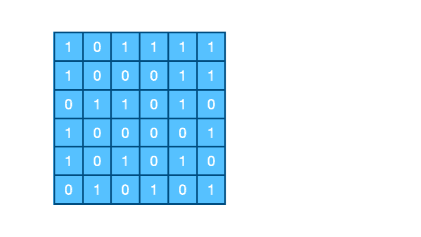
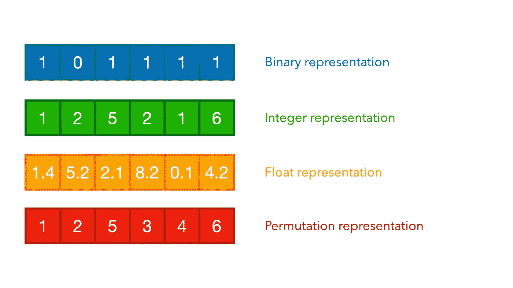
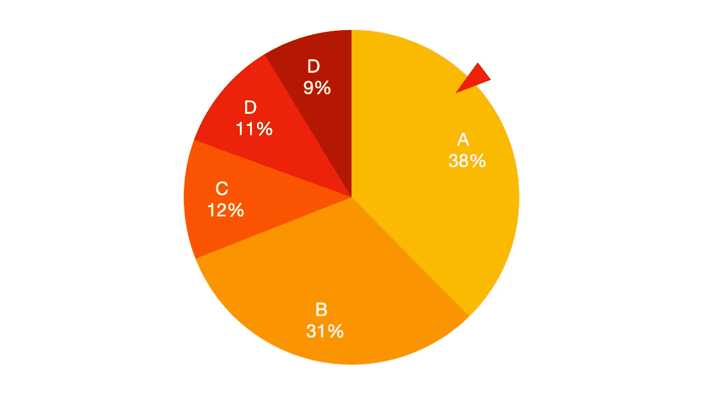
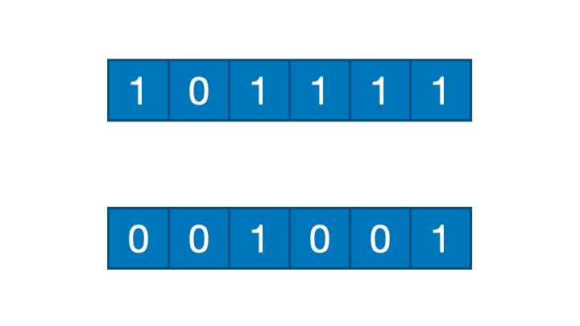
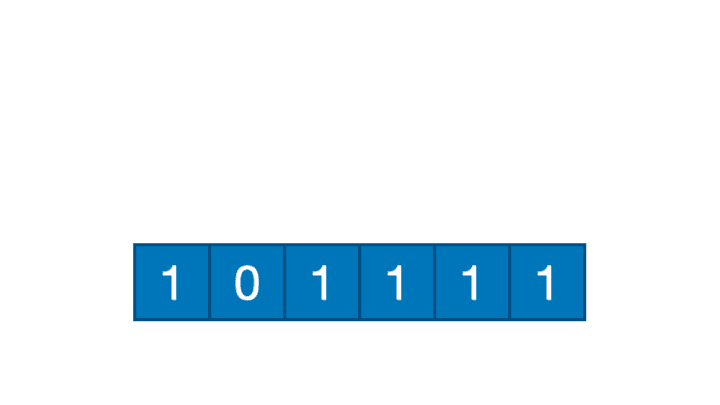
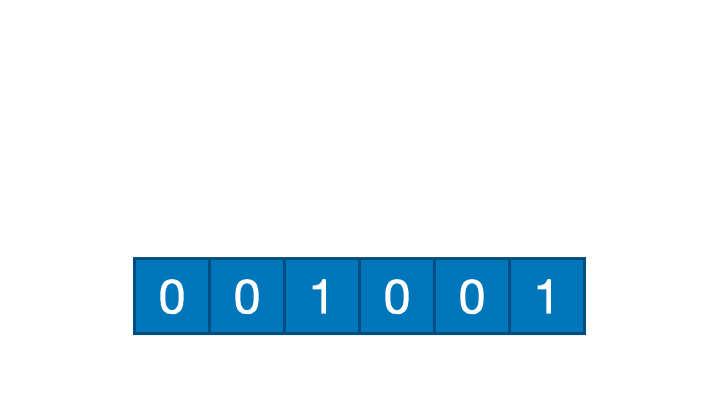
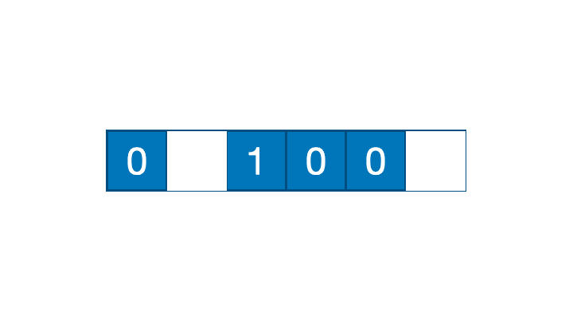

# 遗传算法图解指南

> 原文：<https://towardsdatascience.com/an-illustrated-guide-to-genetic-algorithm-ec5615c9ebe?source=collection_archive---------18----------------------->

## 一步一步的遗传算法教程，并附有插图

遗传算法

在之前的帖子中，我们讨论了什么是一般的**人工智能** (AI)。如果我们只知道来自外部的信息，那么信息就不那么丰富了。所以在这篇文章中，我将更详细地介绍人工智能领域中存在的一种方法。

 [## 人工智能、机器学习和深度学习——有什么区别？

### 人工智能、机器学习和深度学习的简单解释以及它们之间的区别

towardsdatascience.com](/artificial-intelligence-machine-learning-and-deep-learning-what-the-difference-8b6367dad790) 

在这个场合，我将讨论一个包含在人工智能领域的算法，即**遗传算法**。遗传算法是受生物进化和自然选择过程启发的**进化计算****【EC】**的一部分。

遗传算法通常用于克服优化和搜索问题。该算法是一种通用算法，因此它可以容易地在各种问题中实现，并且可以为搜索解的每次迭代提供更好的结果。遗传算法可以从范围广泛且具有许多最佳点的候选集合中找到最佳解决方案，并且与类似的方法如**爬山**、**深度优先搜索**等相比，结果往往会趋向于全局最优。

由于以下优点，遗传算法可用于解决许多情况。

*   由许多同时提出的预期解决方案组成
*   每次迭代都为更好的解决方案提供了一个候选方案
*   大的解空间不是问题
*   一种快速有效的算法

## 遗传算法术语

在我们进一步讨论之前，我们必须首先了解遗传算法中常用的术语。

群体、染色体、基因型和表型

*   人口，收集可能的解决方案。
*   染色体，一个可能的解决方案
*   基因型，染色体中包含的元素
*   表现型，基因型值

此外，该算法中还经常使用其他术语。

*   适应度函数，决定每个染色体权重的函数
*   适应值，从适应函数的结果中获得的值
*   解码和编码，在某些情况下，表现型可以改变为其他形式。例如二进制、实数、置换和整数。解码和编码就是把它从一种形式变成另一种形式的过程。
*   遗传算法过程中的迭代次数。

关于它的使用的更多细节和例子，我将在下一节解释。

# 遗传算法的阶段

在我们学习了遗传算法的优点和术语之后，现在我们将描述遗传算法产生解决方案的各个阶段。

在这里，我将概括地解释这些阶段。具体情况，也许我会在下一篇文章中解释。一般来说，遗传算法包括以下步骤。

## 初始化群体

遗传算法的初始阶段是初始化种群。在这个阶段，我们必须确定要使用的染色体的数量和长度。对于确定人口数量本身，没有规定数量。人口数量越多，产生的解就越多样，从而增加了获得最优解的可能性。

染色体长度的确定通常根据所处理的情况进行调整。例如，如果在函数`f(x,y) = 5 * x — 10 * y`最大化的情况下，那么染色体的长度是 2，因为有两个变量，即我们要寻找的 x 和 y。另一个例子是，如果情况是**旅行推销员问题(TSP)** ，那么染色体的长度被调整为要访问的地方的数量。

此外，我们还必须确定要使用的染色体的表示法。有一些常用的表示法，如二进制、整数、浮点和置换表示法。根据待解决的案例调整代表性的确定。

表现

我们还必须确定这个遗传算法过程何时停止。常用的方法有 2 种，第一种是确定适应值上的阈值，第二种是确定代数。

此外，我们还必须确定交叉概率和变异概率的值。由于这个原因，它将随着过程被进一步解释。

## 适合度计算

初始化群体后，下一步是计算每个染色体的适应值。适应度函数可以变化，这取决于要解决的问题。例如，如果我们想找到函数`f(x,y) = 5 * x — 10 * y`的最大值，那么计算的方法就是在函数中包含`x`和`y`的值。

## 选择

在获得所有适应值之后，然后选择父母。确定要选择的父对的数量，然后按照以下方式进行选择。有几种方法可以选择亲代染色体。

1.  随机选择，一种从亲本中随机选择染色体对的方法，不受适应值的影响。更简单地说，它只需要生成随机值来选择索引作为父染色体。
2.  锦标赛选择，这种选择方法根据体能值进行选择。选择首先显示一些随机值作为索引来选择几个准父母，然后用最佳适应值进行选择。
3.  轮盘赌选择，这种选择方法的使用是基于每个染色体的概率。轮盘赌中染色体比例的大小会根据适应值而变化。通过从所有适合度的范围中提高一个随机值来进行选择。

轮盘赌选择

## 交叉

选好亲本后，下一步我们要做的就是做一个杂交。交叉是产生新染色体的过程。交叉是在两条染色体之间进行的，交叉的结果是两条染色体。

有两种确定新染色体的方法，即世代法和稳态法。

1.  世代相传。使用这种方法，新染色体的数量与旧染色体的数量相同，在迭代结束时，旧群体被新群体取代。
2.  稳态。与世代法不同的是，在稳态下，新染色体的数量与旧染色体的数量不一样，而是只有一条或两条。新的染色体将取代旧的染色体。

世代与稳定状态

如果你还记得，在初始化过程中，我们必须确定交叉的概率。这是概率的函数。该概率用于确定是否发生交叉。一般来说，使用的交叉概率是 0.8，但您可以自由确定概率，因为没有最佳概率的确定性。

我们必须生成从 0 到 1 的随机值，如果随机值小于或等于概率，则执行交叉。可以进行的交叉类型如下。

*   一点交叉。这种交叉将基因从一个染色体交换到另一个染色体，通过一个交叉点产生新的染色体。

单点交叉

*   多点交叉。这种交叉将基因从一个染色体交换到另一个染色体，通过几个交叉点产生新的染色体。

多点交叉

*   均匀交叉。这种交叉通过基于概率的每个索引将基因从一个染色体交换到另一个染色体。每个基因都有一个概率，就像硬币一样，例如，如果头出现了，那么它就被交换，如果尾出现了，基因的位置就保持不变。

均匀交叉

所有的切割点都是随机获得的。

## 变化

几乎与交叉相同，由于突变的概率，突变并不总是发生。通常使用的突变概率是 0.1。与交叉概率一样，对于变异概率的值没有明确的规定。

在这个过程中，突变改变了基因的表型(改变了基因的价值)。突变可以用一个点完成，也可以用多个点完成，也可以交换点。

*   一点突变

一点突变

*   多点突变

多点突变

*   互换突变

互换突变

## 幸存者选择

下一步是为下一次迭代获得另一个群体。一些不重要的染色体将被丢弃，并被经过交叉和变异过程的新染色体所取代。

在遗传算法的应用中，最好使用精英主义的原则，在这个过程中总是存储最好的染色体，以便总是有适应度最高的染色体。如果新的染色体组合看起来更好，那么先前存储的一条染色体与新的染色体交换。

确定新种群后，接下来的过程就是计算新种群的适应度值。这将继续重复，直到满足终止条件。如前所述，通常使用的终止条件是使用阈值适应值或确定最大代数。

如果进程已经停止，那么这个遗传算法的解就是适应值最大的染色体。