# 零膨胀泊松回归模型图解指南

> 原文：<https://towardsdatascience.com/an-illustrated-guide-to-the-zero-inflated-poisson-model-b22833343057?source=collection_archive---------4----------------------->


[野生与风景河流](https://commons.wikimedia.org/wiki/File:Deschutes_Wild_and_Scenic_River_(28260152076).jpg) ( [CC BY 2.0](https://creativecommons.org/licenses/by/2.0/deed.en) )

## 另外还有一个 Python 教程，介绍如何在有多余零的数据集上训练 ZIP 模型

在本文中，我们将学习如何为基于**计数的数据集**构建回归模型，其中因变量包含**过量的零值数据**。

**计数数据集**是因变量为事件的数据集，例如:

*   每小时通过十字路口的车辆数量。
*   每月急诊室就诊次数
*   每年提出的机动车辆保险索赔数量
*   在大量生产的印刷电路板中发现的缺陷数量。


包含许多零计数的数据集(图片由[作者](https://sachin-date.medium.com/)提供)

许多真实世界的现象产生的计数几乎总是零。例如:

*   机器每月发生故障的次数
*   每年发现的系外行星数量
*   生活在世界上每一个城市的亿万富翁的数量。

使用传统的计数数据模型，如[](/an-illustrated-guide-to-the-poisson-regression-model-50cccba15958)**[**二项式**](/the-binomial-regression-model-everything-you-need-to-know-5216f1a483d3) 或 [**负二项式**](/negative-binomial-regression-f99031bb25b4) 回归模型，很难处理这些数据。**

**这是因为此类数据集**包含的零值计数数量比使用传统模型的概率分布**预期观察到的数量多。**

**例如，如果您假设一个现象遵循以下*泊松(5)* 过程，您将期望看到零计数不超过 0.67%的时间:**

**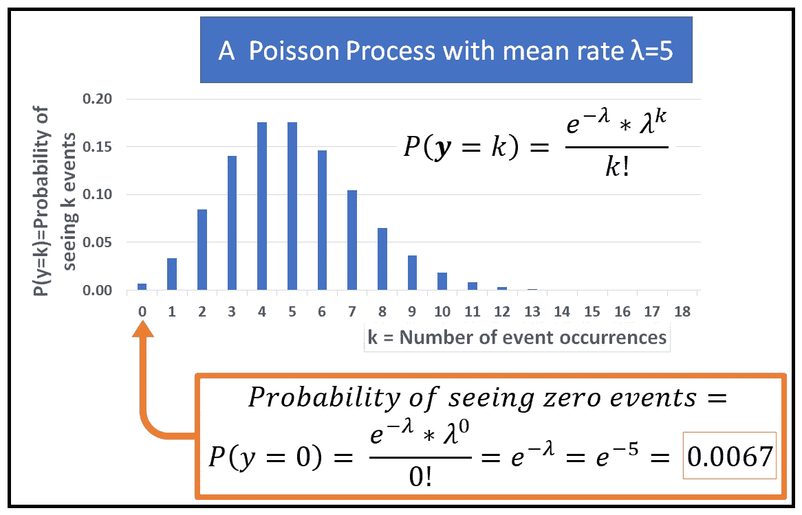**

**泊松(5)过程将在大约 0.67%的观测值中产生零(图片由[作者](https://sachin-date.medium.com/)提供)**

**如果您观察到的零计数远远多于这个数，那么数据集包含了过多的零。**

**如果对这样的数据集使用标准的泊松或二项式或 NB 回归模型，它可能拟合得很差，并且会生成质量很差的预测，无论您对其参数做了多少调整。**

**那么，面对这种带有多余零的数据，建模者该怎么办呢？**

## **零膨胀泊松回归模型**

**幸运的是，有一种方法可以修改标准计数模型，如泊松或负二项式模型，以解释额外零的存在。事实上，至少有两种方法可以做到这一点。一种技术被称为**跨栏模式**，第二种技术被称为**零充气模式**。**

**在本文中，我们将详细研究零膨胀回归模型。具体来说，我们将关注**零膨胀泊松回归模型**，通常被称为 **ZIP 模型**。**

****ZIP 模型的结构****

**在了解如何修改常规泊松模型的结构以处理过多的零计数之前，让我们先简要了解一下它的结构。**

**想象一个数据集，包含 *n* 个样本和 *p* 个样本的回归变量。因此，回归变量*可以用一个大小为*(n×p)*的矩阵来表示， ***X*** 矩阵中的每一行 ***x_i*** 都是一个大小为*(1×p)*的向量，对应于因变量值 *y_i* :***

***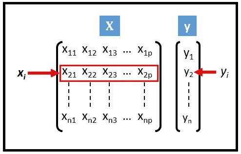***

***矩阵符号中的数据集( ***y，X*** )(图片由[作者](https://sachin-date.medium.com/)提供)***

***如果我们假设 ***y*** 是一个泊松分布的随机变量，我们可以为这个数据集建立一个泊松回归模型。泊松模型由两部分组成:***

1.  ***泊松 **P** 概率 **M** ass **F** 函数(PMF)表示为 *P(y_i=k)* 用于计算在给定λ事件/单位时间的平均事件率的情况下，在任何单位间隔内观察到 *k* 事件的概率。***
2.  ***用于将平均速率λ 表示为回归变量 ***X* 的函数的链接函数。*****

***下图对此进行了说明:***

***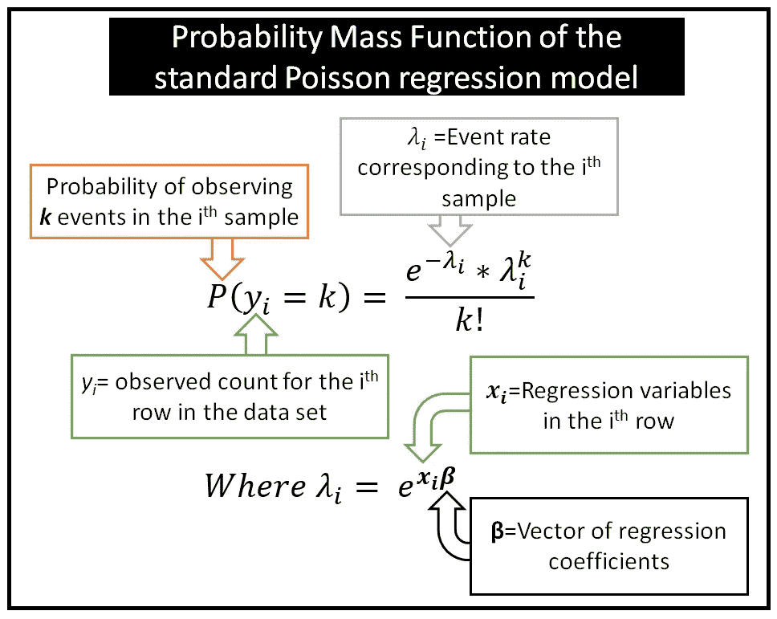***

***标准泊松回归模型的概率质量函数(图片由[作者](https://sachin-date.medium.com/)提供)***

***通常，我们假设有一些潜在的过程按照泊松 *PMF: P(y_i=k)* 产生观察到的计数。***

***零膨胀泊松模型背后的直觉是 ***存在第二个潜在过程，该过程确定计数是零还是非零*** 。一旦计数被确定为非零，常规泊松过程就会根据泊松过程的 PMF 来确定其实际非零值。***

***因此， **ZIP** 回归模型由三部分组成:***

1.  ***PMF *P(y_i=0)* 用于计算观察到零计数的概率。***
2.  ***第二个 PMF *P(y_i=k)* ，用于计算观察到 *k* 事件的概率，给定 k > 0 。***
3.  ***用于将平均速率λ 表示为回归变量 ***X* 的函数的链接函数。*****

***下图对此进行了说明:***

***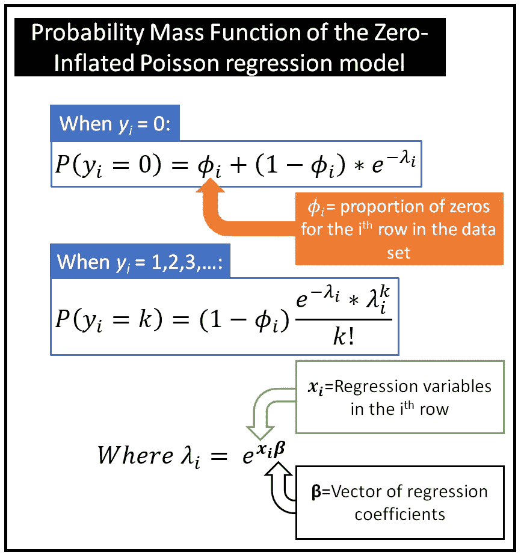***

***ZIP 模型的概率质量函数(图片由[作者](https://sachin-date.medium.com/)提供)***

***如前所述， *y_i* 是随机变量，表示对应于回归变量行***x _ I****=【x _ i1，x_i2，x_i3，…，x_ip】的观察计数。****

****ϕ_i* 是数据集中第 I 行***(****y _ I****，x_i)*** 对应的多余零的比例的度量；。***

## ***了解ϕ_i***

***理解 *ϕ_i* 的简单方法如下:***

***假设你取 *y_i* 的 1000 个观测值，每一个都与 ***相同*** 组合的回归变量值***x _ I****=【x _ i1，x_i2，x_i3，…，x_ip】。*由于 *y_i 是*一个遵循泊松分布的*随机变量*，你可能会在 1000 次观察的每一次中看到不同的 *y_i* 值。***

***假设在你观察到的 1000 个 *y_i* 值中，你观察到 874 个零值。您确定在这 874 个零值中，您为 *y_i* 假设的常规泊松分布将只能解释最多 7 个零值。所以剩下的 867 个零值是多余的零观测值。所以对于数据集中的第*行和第*行， *ϕ_i* =867/1000 = 0.867。***

***当数据集在因变量中没有任何多余的零时，***【ϕ】***的值计算出为零，并且 ZIP 模型的 PMF 减少到标准泊松模型的 PMF(您可以通过将 ZIP 模型的 PMF 中的*设置为 0 来轻松验证这一点)。****

## ****如何估计 *ϕ？*****

****那么我们如何估算ϕ_i 的价值呢？****

****估算 *ϕ_i* 的一种简单而粗略的方法是将每个***【ϕ】****_ I*设定为以下比率:****

****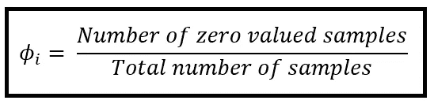****

****一种简单但不准确的方法来估计*_ I(图片由[作者](https://sachin-date.medium.com/))*****

*****也许计算 *ϕ_i* 的一种更现实的方法是将其作为回归变量 ***X*** 的函数进行估计。这通常是通过将 ***y*** 变量转换为二进制 0/1 随机变量***y’***(***y _ prime***)来完成的，如果底层的*为 0，则取值为 0，在所有其他情况下取值为 1。然后我们在转换后的***y’***上拟合一个**逻辑回归模型**。然后，我们在数据集[ ***X，y'*** ]上训练逻辑回归模型，并且它产生拟合概率的向量***_ 拟合的*** *=[ _1，_2，_3，...，_n]，*(因为这就是逻辑回归模型所做的)*。*******

*****一旦我们得到了***_ 拟合的*** *矢量，我们就简单地把它设置为* ***矢量ϕ.********

******从而【ϕ_1= _1，ϕ_2= _2，ϕ_3= _3,…,ϕ_n= _ n】*。*****

*****以上估算 ***ϕ*** 的过程如下图 *:******

*****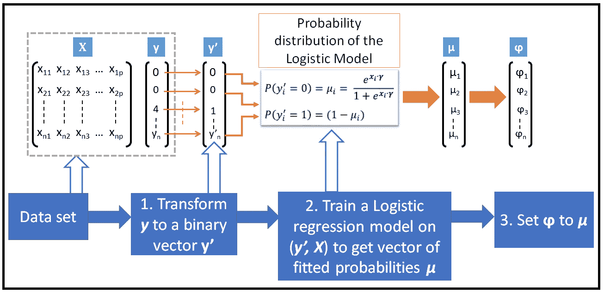*****

*****估计*多余零点参数* ***ϕ*** 的训练序列(图片由[作者](https://sachin-date.medium.com/))*****

*****一旦估算出了*向量，我们就将它插入到 ZIP 模型的概率函数中，并使用所谓的 **M** 最大值 **L** 似然性 **E** 估计( **MLE** )技术来训练具有超额计数的数据集上的 ZIP 模型。******

```
****Please see my article on [**Poisson Regression Model**](/an-illustrated-guide-to-the-poisson-regression-model-50cccba15958) for an explanation of how **MLE** works.****
```

******下图说明了 **ZIP** 模型的训练顺序:******

******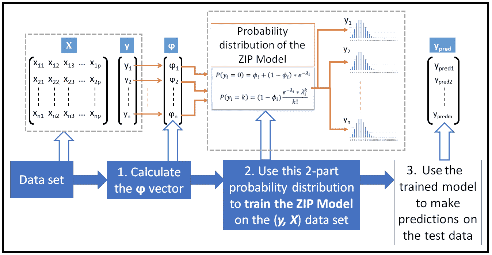******

******ZIP 模型的训练序列(图片由[作者](https://sachin-date.medium.com/)提供)******

******令人欣慰的是，有许多统计软件包可以自动完成估算*ϕ的整个过程，并使用估算的*ϕ在数据集上使用 MLE 技术训练 ZIP 模型。********

******在本文的其余部分，我们将使用 Python *statsmodels* 库在一行代码中构建和训练一个 ZIP 模型。******

## *****如何使用 Python 训练 ZIP 模型*****

*****在我们关于 ZIP 模型的 Python 教程中，我们将使用 250 组人进行的野营旅行的数据集:*****

*****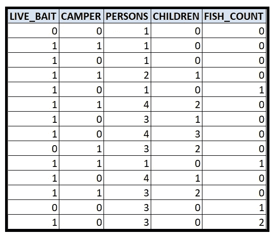*****

*****野营旅行数据集(图片由[作者](https://sachin-date.medium.com/)提供)*****

*****数据集在[这里](https://gist.github.com/sachinsdate/09cfd42b7701c48ec68b04c786786434)可用。以下是该数据集的几个显著特征:*****

*   *****露营者在旅途中可能会也可能不会去钓鱼。*****
*   *****如果一群人去钓鱼，他们可能没有或没有钓到鱼。*****
*   *****我们不仅要估计捕获了多少鱼(如果野营小组进行了捕鱼)，还要估计野营小组捕获任何鱼的概率。*****

*****因此，这里涉及两个不同的数据生成过程:*****

1.  *****一个决定一个野营团体是否沉迷于一个成功的捕鱼活动的过程:ZIP 模型将在内部使用一个逻辑回归模型，该模型在前面已经解释过，用于模拟这个二元过程。*****
2.  *****第二个过程是确定一个野营小组捕获了多少条鱼，假设该小组至少捕获了一条鱼:ZIP 模型将使用常规泊松模型来建模第二个过程。*****

*******数据集中的变量*******

*****野营旅行数据集包含以下变量:*****

*****被捕获的鱼的数量。这将是我们的因变量 ***y*** 。*****

*******LIVE_BAIT:** 表示是否使用了活诱饵的二元变量。*****

*******露营车:**钓鱼团是否使用露营车。*****

*******人数:**钓鱼组总人数。注意，在一些群体中，他们可能都没有捕鱼。*****

*******孩子:**露营组的孩子数量。*****

*****以下是因变量 FISH_COUNT 的频率分布:*****

*****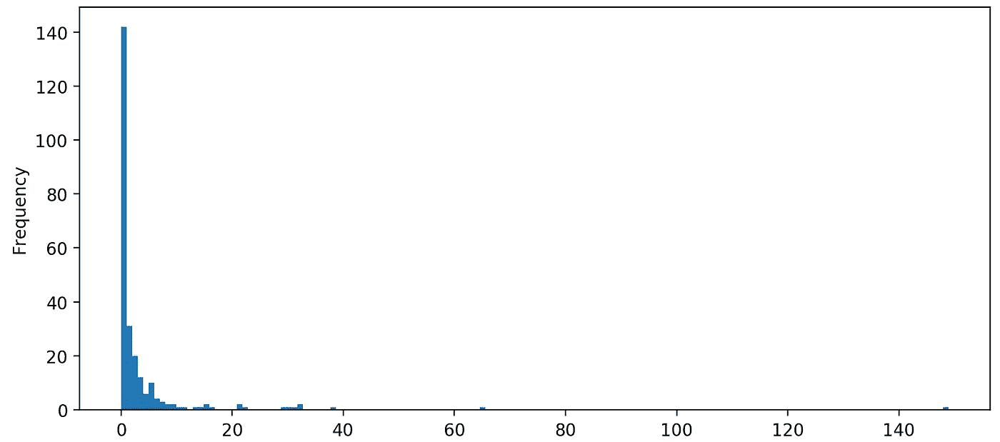*****

*****FISH_COUNT 的频率分布(图片由[作者](https://sachin-date.medium.com/)*****

*****正如我们所看到的，在这个数据集中*可能*有多余的零。我们将在这个数据集上训练一个 ZIP 模型来测试这个理论，并有望实现比常规泊松模型更好的拟合。*****

## *****回归目标*****

*****我们对该数据集的回归目标如下:*****

*****根据 LIVE_BAIT、CAMPER、PERSONS 和 CHILDREN 变量的值，预测野营小组捕获的鱼的数量(FISH_COUNT)。*****

## *****回归策略*****

*****我们的回归策略如下:*****

1.  *****FISH_COUNT 将是因变量 ***y*** ，【LIVE_BAIT，CAMPER，PERSONS，CHILDREN】将是解释变量 ***X*** 。*****
2.  *****我们将使用 Python ***statsmodels 库*** 在( ***y，X*** )数据集上训练 ZIP 回归模型。*****
3.  *****我们将使用 ZIP 模型对模型在其训练期间未见过的测试数据集进行一些预测。*****

*****让我们从导入所有需要的包开始:*****

```
*****import** pandas **as** pd
**from** patsy **import** dmatrices
**import** numpy **as** np
**import** statsmodels.api **as** sm
**import** matplotlib.pyplot **as** plt***
```

*****接下来，我们将把 fish 数据集加载到内存中。这里是数据集的[链接:](https://gist.github.com/sachinsdate/09cfd42b7701c48ec68b04c786786434)*****

```
***df = pd.read_csv(**'fish.csv'**, header=0)***
```

*****让我们打印数据集的前几行:*****

```
***print(df.**head**(10))***
```

*****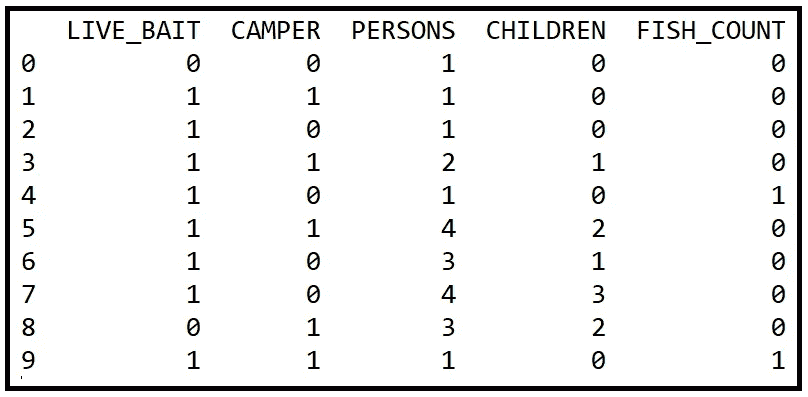*****

*****数据集的前 10 行(图片由[作者](https://sachin-date.medium.com/)提供)*****

*****让我们也打印出 FISH_COUNT 值的频率分布:*****

```
***df.**groupby**('FISH_COUNT').**count**()***
```

*****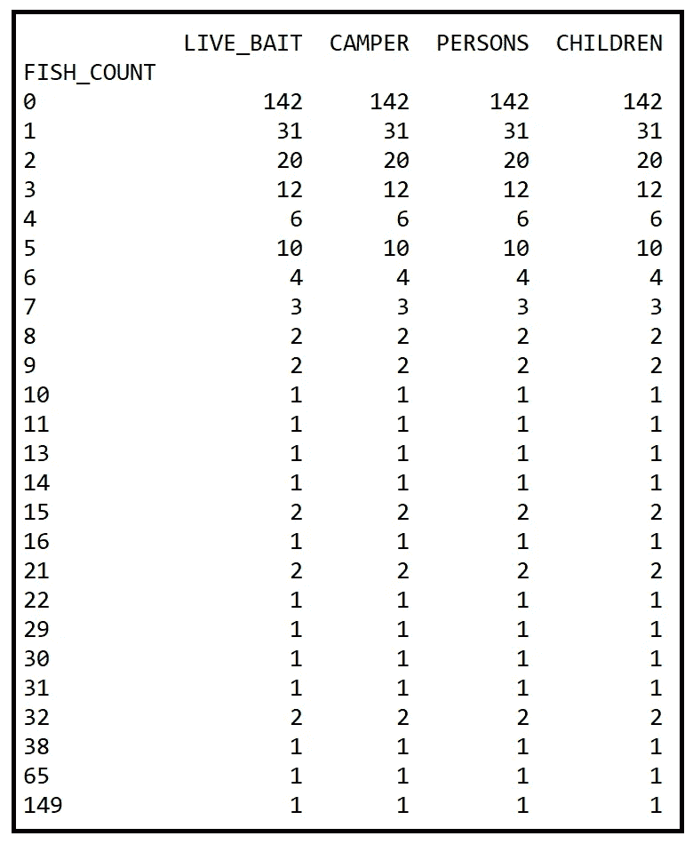*****

*****鱼类数量的频率分布(图片由[作者](https://sachin-date.medium.com/)提供)*****

*****创建训练和测试数据集。请注意，目前我们没有进行分层随机分割:*****

```
***mask = np.random.**rand**(len(df)) < 0.8
df_train = df[mask]
df_test = df[~mask]
print(**'Training data set length='**+str(len(df_train)))
print(**'Testing data set length='**+str(len(df_test)))>> Training data set length=196
>> Testing data set length=54***
```

*****在[**Patsy**](https://patsy.readthedocs.io/en/latest/quickstart.html)**符号中设置回归表达式。我们告诉 Patsy，FISH_COUNT 是我们的因变量 ***y*** ，它取决于回归变量 LIVE_BAIT、CAMPER、PERSONS 和 CHILDREN:*******

```
*****expr = **'FISH_COUNT ~ LIVE_BAIT  + CAMPER + CHILDREN + PERSONS'*******
```

*******让我们使用 Patsy 为训练和测试数据集绘制出 ***X*** 和 ***y*** 矩阵。*******

```
*****y_train, X_train = **dmatrices**(expr, df_train, return_type=**'dataframe'**)y_test, X_test = **dmatrices**(expr, df_test, return_type=**'dataframe'**)*****
```

*******使用 statsmodels 的[**ZeroInflatedPoisson**](https://www.statsmodels.org/stable/generated/statsmodels.discrete.count_model.ZeroInflatedPoisson.html)类，我们在训练数据集上构建并训练一个 ZIP 回归模型。*******

*******但是在我们这样做之前，让我解释一下如何使用类构造函数的两个参数:*******

*   **********膨胀:****zeroinflatedpoisson*模型类将在内部使用一个*逻辑回归*模型来估计参数 ***ϕ*** 。因此，我们将模型参数*膨胀设置为‘logit*’。我们还可以尝试将它设置为其他二项式链接函数，如“probit”。*******
*   **********exog_infl:*** 我们还想请 ZIP 模型估计 *ϕ* 作为与母模型相同的一组回归变量的函数，即:LIVE_BAIT、CAMPER、PERSONS 和 CHILDREN。因此，我们将参数 *exog_infl* 设置为 X_train。如果您只想使用 X_train 的一个子集，您可以这样做，或者您可以将 *exog_infl* 设置为一组完全不同的回归变量。*******

*******下面一行代码在我们的训练数据集上构建和训练 ZIP 模型。*******

```
*****zip_training_results = **sm**.**ZeroInflatedPoisson**(***endog****=*y_train, ***exog****=*X_train, ***exog_infl****=*X_train, ***inflation****=*'logit').**fit**()*****
```

*******打印培训总结:*******

```
*****print(zip_training_results.**summary**())*****
```

*******以下是培训总结(我在输出中突出显示了重要元素):*******

*******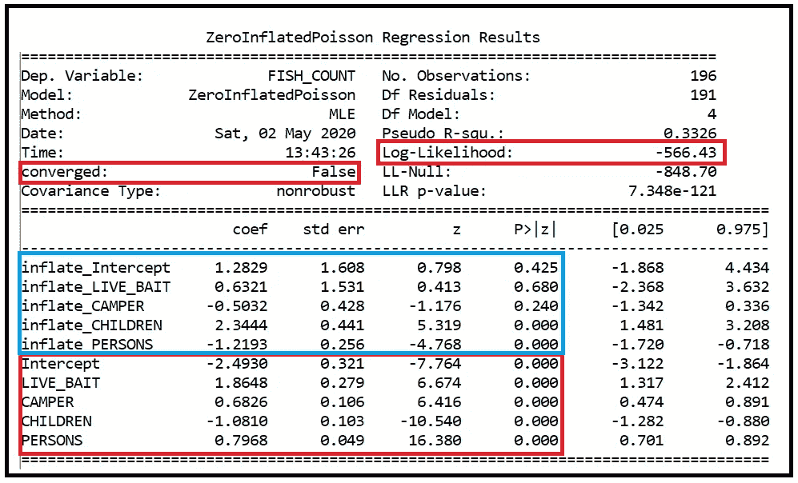*******

*******ZIP 模型的训练总结(图片由[作者](https://sachin-date.medium.com/)提供)*******

*********解释培训输出*********

*******蓝框包含嵌套逻辑回归模型用来估计野营小组**是否捕获任何鱼的概率***【ϕ】***的变量信息。*********

*****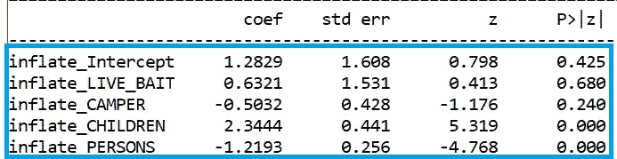*****

*****(图片由[作者](https://sachin-date.medium.com/)提供)*****

*****注意，逻辑回归模型没有发现对估计*ϕ有用的截距、LIVE_BAIT 和 CAMPER 变量。发现它们的回归系数在 95%的置信水平下不具有统计显著性，如各自的 *p* 值所示:
*inflate _ Intercept =****0.425****，
inflate _ LIVE _ BAIT =****0.680****和
inflate _ CAMPER =****0*********

*******观察结果 1*******

*****逻辑回归模型确定对估计是否有鱼被捕获的概率有用的唯一两个变量是儿童和人。*****

*******观察 2*******

*****人的回归系数为负(inflate _ PERSONS**-1.2193**)，这意味着随着野营组人数的增加，该组没有鱼被捕获的概率降低。这符合我们的直觉。*****

*****红框包含关于父泊松模型在 FISH_COUNT > 0 的条件下用于估计 FISH_COUNT 的变量的信息。*****

*****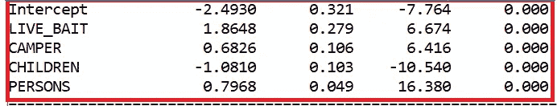*****

*****(图片由[作者](https://sachin-date.medium.com/)提供)*****

*******观察结果 3*******

*****我们可以看到，所有 5 个回归变量的系数在 99%的置信水平下具有统计显著性，正如它们的 p 值小于 0.01 所证明的那样。事实上，所有 5 个变量的 p 值都小于 0.001，因此显示为 0.000。*****

*******观察结果 4*******

*****儿童的系数为负(儿童-1.0810)，这意味着随着野营组中儿童数量的增加，该组捕获的鱼的数量减少！*****

*******观察 5*******

*****该模型的最大对数似然为-566.43。这个值对于比较模型与其他模型的拟合优度很有用(见文末的趣味练习)。*****

*******观察 6*******

*****最后，请注意，ZIP 模型的训练算法无法收敛于训练数据集，如下所示:*****

*****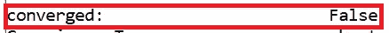*****

*****(图片由[作者](https://sachin-date.medium.com/)提供)*****

*****如果它已经收敛，也许它会导致一个更好的拟合。*****

*******预测*******

*****我们将获得 ZIP 模型对测试数据集的预测，并计算均方根误差 w.r.t .实际值:*****

```
*****zip_predictions = zip_training_results.predict(X_test,exog_infl=X_test)predicted_counts=np.round(zip_predictions)actual_counts = y_test[dep_var]

print(**'ZIP RMSE='**+str(np.sqrt(np.sum(np.power(np.subtract(predicted_counts,actual_counts),2)))))>> **ZIP RMSE=**55.65069631190611*****
```

*****让我们绘制预测的和实际的鱼数量:*****

```
*****fig = plt.figure()fig.suptitle(**'Predicted versus actual counts using the ZIP model'**)predicted, = plt.plot(X_test.index, predicted_counts, **'go-'**, label=**'Predicted'**)actual, = plt.plot(X_test.index, actual_counts, **'ro-'**, label=**'Actual'**)plt.legend(handles=[predicted, actual])plt.show()*****
```

*****我们看到下面的情节:*****

*****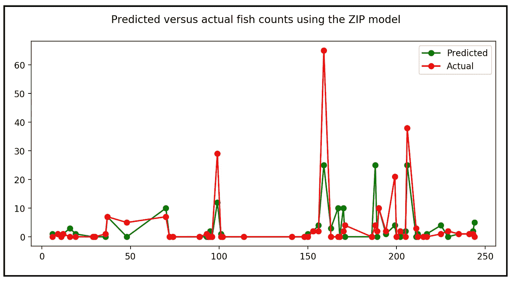*****

*****预测与实际捕获的鱼(图片由[作者](https://sachin-date.medium.com/)提供)*****

*****这就完成了我们对零膨胀泊松回归模型的研究。*****

## *****有趣的练习*****

1.  *****阅读以下文章:[泊松回归模型图解指南](/an-illustrated-guide-to-the-poisson-regression-model-50cccba15958)*****
2.  *****使用 Python 和 statsmodels，在露营旅行数据集上训练标准泊松模型，并将该模型的性能与 ZIP 模型的性能进行比较。你可能会对你的发现感到惊讶。*****
3.  *****使用 statsmodels 在两个模型的训练摘要中报告的最大对数似然值，比较两个模型在训练数据集上的拟合优度。最大 L1 越大，拟合优度越好。*****
4.  *****在测试数据集上比较两个模型的 RMSE 分数。*****

*****快乐造型！*****

## *****建议进一步阅读的主题*****

*   *****[泊松过程:你需要知道的一切](/the-poisson-process-everything-you-need-to-know-322aa0ab9e9a)*****
*   *****[泊松分布公式的直觉](/the-intuition-for-the-poisson-distribution-formula-34c5e52f4e04)*****
*   *****[泊松回归模型图解指南](/an-illustrated-guide-to-the-poisson-regression-model-50cccba15958)*****
*   *****[真实世界数据集的广义泊松模型](/generalized-poisson-regression-for-real-world-datasets-d1ff32607d79)*****
*   *****[负二项回归模型:逐步指南](/negative-binomial-regression-f99031bb25b4)*****
*   *****[A. Colin Cameron 和 Pravin K. Trivedi，计数数据的回归分析](http://faculty.econ.ucdavis.edu/faculty/cameron/racd2/)*****
*   *****Lambert，D. (1992)，[零膨胀泊松回归及其在制造缺陷中的应用](https://www.researchgate.net/publication/254333007_Zero-Inflated_Poisson_Regression_With_An_Application_to_Defects_in_Manufacturing)，《技术计量学》，34，1–14。*****

******感谢阅读！我写关于数据科学的主题，特别关注回归和时间序列分析。******

******如果您喜欢这篇文章，请关注我的*[***Sachin Date***](https://timeseriesreasoning.medium.com)*以获得关于回归和时间序列分析主题的提示、操作方法和编程建议。******