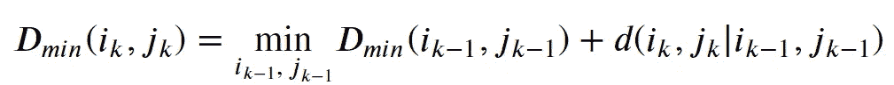
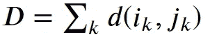
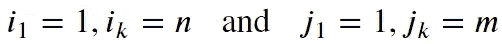
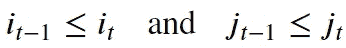
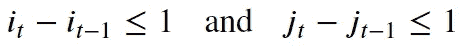
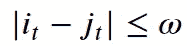
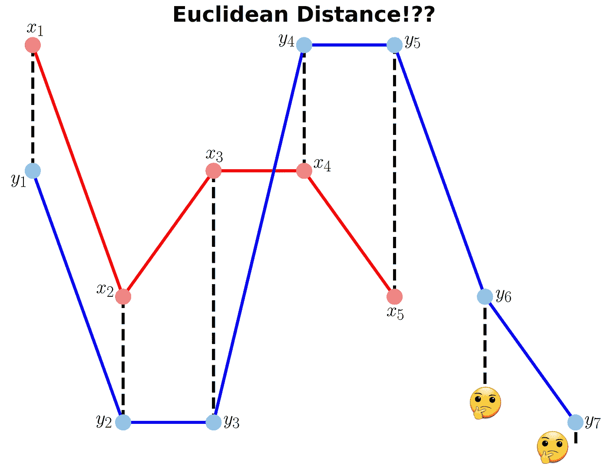
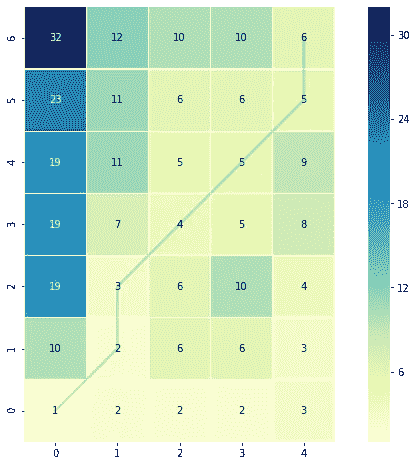
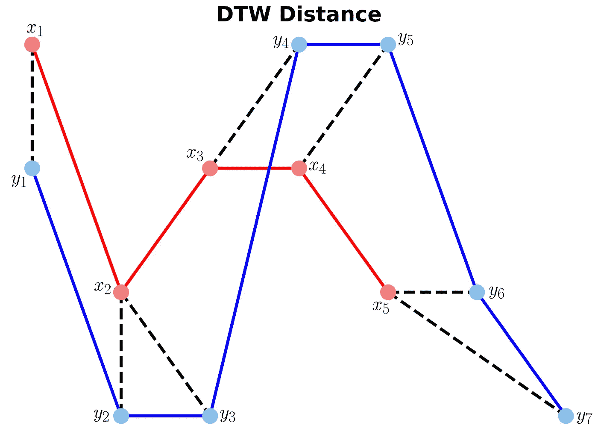
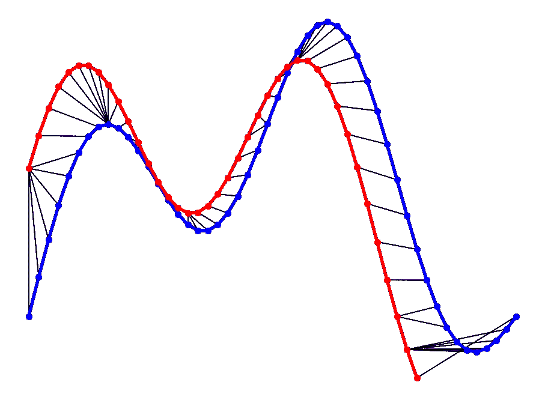

# 动态时间弯曲的说明性介绍

> 原文：<https://towardsdatascience.com/an-illustrative-introduction-to-dynamic-time-warping-36aa98513b98?source=collection_archive---------1----------------------->

## [入门](https://towardsdatascience.com/tagged/getting-started)

## +背后的数学

D 动态时间扭曲(DTW)是一种比较两个不完全同步的时间序列的方法。它是一种计算两个序列之间最佳匹配的方法。DTW 在许多领域都很有用，如语音识别、数据挖掘、金融市场等。测量两个时间序列之间的距离是数据挖掘中常用的方法。

在这篇文章中，我们将回顾 DTW 背后的数学。然后，提供两个说明性的例子来更好地理解这个概念。如果你对背后的数学不感兴趣，请跳到例子。

# 制定

假设我们有如下两个序列:

*𝑋=𝑥[1]，𝑥[2]，…，x[i]，…，x[n]*

*Y=y[1]，y[2]，…，y[j]，…，y[m]*

序列𝑋和𝑌可以被排列以形成𝑛-by-𝑚网格，其中每个点(𝑖，j)是𝑥[𝑖]和𝑦[𝑗].之间的比对

扭曲路径𝑊映射𝑋和𝑌的元素，以最小化它们之间的距离。𝑊是一系列网格点(𝑖，𝑗).稍后我们将看到一个弯曲路径的例子。

## 弯曲路径和 DTW 距离

到(𝑗_𝑘𝑖_𝑘)的最佳路径可以通过下式计算:



其中𝑑是欧几里德距离。然后，总路径开销可以计算如下



# 扭曲函数的限制

使用动态编程方法来比对两个序列，从而找到扭曲路径。遍历所有可能的路径是“组合爆炸”[1]。因此，为了提高效率，限制可能的扭曲路径的数量很重要，因此列出了以下约束条件:

*   **边界条件**:该约束确保弯曲路径从两个信号的起点开始，到它们的终点结束。



*   **单调性条件**:该约束保持了点的时间顺序(不及时返回)。



*   **连续性(步长)条件**:该约束将路径过渡限制到相邻的时间点(不是时间跳跃)。



除了上述三个约束条件之外，对于允许的翘曲路径，还有其他不太常见的条件:

*   **扭曲窗口条件**:允许的点可以被限制在宽度为𝜔(正整数)的给定扭曲窗口内。



*   **坡度条件**:可通过限制坡度来约束翘曲路径，从而避免在一个方向上的极端移动。

一个可接受的扭曲路径有以下**棋王**走法的组合:

*   水平移动:(𝑖，𝑗) → (𝑖，𝑗+1)
*   垂直移动:(𝑖，𝑗) → (𝑖+1，𝑗)
*   对角线移动:(𝑖，𝑗) → (𝑖+1，𝑗+1)

# 履行

让我们导入所有需要的 python 包。

```
import pandas as pd
import numpy as np# Plotting Packages
import matplotlib.pyplot as plt
import seaborn as sbn# Configuring Matplotlib
import matplotlib as mpl
mpl.rcParams['figure.dpi'] = 300
savefig_options = dict(format="png", dpi=300, bbox_inches="tight")# Computation packages
from scipy.spatial.distance import euclidean
from fastdtw import fastdtw
```

让我们定义一种方法来计算弯曲路径的累积成本矩阵 *D* 。成本矩阵使用欧几里德距离来计算每两点之间的距离。计算欧几里得距离矩阵和累积成本矩阵的方法定义如下:

# 示例 1

在这个例子中，我们有两个长度不同的序列 *x* 和 *y* 。

```
# Create two sequences
x = [3, 1, 2, 2, 1]
y = [2, 0, 0, 3, 3, 1, 0]
```

我们无法计算出 *x* 和 *y* 之间的欧几里德距离，因为它们的长度不相等。



例 1:*x*与 y 的欧氏距离(可能吗？🤔)(图片由作者提供)

# 计算 DTW 距离和扭曲路径

许多 Python 包仅通过提供序列和距离类型(通常为欧几里得距离)来计算 DTW。这里，我们使用 DTW 的一个流行的 Python 实现，即 [FastDTW](https://github.com/slaypni/fastdtw) ，它是一个近似的 DTW 算法，具有更低的时间和内存复杂度[2]。

```
dtw_distance, warp_path = fastdtw(x, y, dist=euclidean)
```

注意，我们使用的是我们之前导入的 [SciPy](https://pypi.org/project/scipy/) 的距离函数 *Euclidean* 。为了更好地理解扭曲路径，让我们首先计算累积成本矩阵，然后在网格上可视化路径。以下代码将绘制累计成本矩阵的热图。

```
cost_matrix = compute_accumulated_cost_matrix(x, y)
```

示例 1:绘制(并保存)累计成本矩阵热图的 Python 代码



示例 1:累积成本矩阵和扭曲路径(图片由作者提供)

颜色条显示网格中每个点的成本。可以看出，扭曲路径(蓝线)在网格上的成本最低。让我们通过打印这两个变量来看看 DTW 距离和弯曲路径。

```
>>> DTW distance:  6.0
>>> Warp path: [(0, 0), (1, 1), (1, 2), (2, 3), (3, 4), (4, 5), (4, 6)]
```

扭曲路径从点(0，0)开始，经过 6 次移动后在点(4，6)结束。让我们使用之前定义的函数来计算累积成本 most，并将这些值与热图进行比较。

```
cost_matrix = compute_accumulated_cost_matrix(x, y)
print(np.flipud(cost_matrix)) # Flipping the cost matrix for easier comparison with heatmap values!>>> [[32\. 12\. 10\. 10\.  6.]  
     [23\. 11\.  6\.  6\.  5.]   
     [19\. 11\.  5\.  5\.  9.]  
     [19\.  7\.  4\.  5\.  8.]  
     [19\.  3\.  6\. 10\.  4.]  
     [10\.  2\.  6\.  6\.  3.]  
     [ 1\.  2\.  2\.  2\.  3.]]
```

上面打印的成本矩阵具有与热图相似的值。

现在让我们绘制两个序列，并连接映射点。绘制 *x* 和 *y* 之间的 DTW 距离的代码如下所示。

示例 1:绘制(并保存)x 和 y 之间的 DTW 距离的 Python 代码



示例 1:*x*和 y 之间的 DTW 距离(图片由作者提供)

# 示例 2

在本例中，我们将使用两个正弦信号，并通过计算它们之间的 DTW 距离来了解它们是如何匹配的。

示例 2:生成两个不同长度的正弦信号(x1 和 x2)

与示例 1 一样，让我们使用 FastDTW 软件包计算 *x1* 和 *x2* 信号的 DTW 距离和弯曲路径。

```
distance, warp_path = fastdtw(x1, x2, dist=euclidean)
```

示例 2:绘制(并保存)x1 和 x2 之间的 DTW 距离的 Python 代码



示例 2:x1 和 x2 之间的 DTW 距离(图片由作者提供)

从上图可以看出，当两个信号具有相似的模式时，这两个信号之间的 DTW 距离特别大。两个信号之间的极值(最大和最小点)被正确映射。此外，与欧几里德距离不同，当使用 DTW 距离时，我们可以看到多对一映射，特别是如果两个信号具有不同的长度。

您可能会从上图中发现动态时间扭曲的问题。你能猜出它是什么吗？

问题在于时间序列的首尾不匹配。这是因为 DTW 算法不能承受端点处的翘曲不变性。简而言之，其效果是序列终点的微小差异将倾向于对估计的相似性做出不成比例的贡献[3]。

# 结论

DTW 是一种寻找两个序列之间最佳比对的算法，也是我们工具箱中有用的距离度量。当我们处理两个非线性序列时，这种技术很有用，特别是当一个序列是另一个序列的非线性拉伸/收缩版本时。扭曲路径是“棋王”移动的组合，从两个序列的头部开始，以它们的尾部结束。

你可以在这里找到这篇博文的笔记本。感谢阅读！

# 参考

[1] Donald J. Berndt 和 James Clifford，[利用动态时间弯曲发现时间序列中的模式](https://www.aaai.org/Papers/Workshops/1994/WS-94-03/WS94-03-031.pdf)，第三届知识发现和数据挖掘国际会议

[2] Salvador，S. and P. Chan， [FastDTW:走向线性时空中的精确动态时间弯曲](https://cs.fit.edu/~pkc/papers/tdm04.pdf) (2007)，智能数据分析

[3]迭戈·费塔多·希尔瓦，*等人，*，[关于端点对动态时间扭曲的影响](https://core.ac.uk/display/147806669) (2016)，SIGKDD 关于时间序列挖掘和学习的研讨会

# 有用的链接

[1][https://nipunbatra.github.io/blog/ml/2014/05/01/dtw.html](https://nipunbatra.github.io/blog/ml/2014/05/01/dtw.html)

[2][https://databricks . com/blog/2019/04/30/understanding-dynamic-time-warping . html](https://databricks.com/blog/2019/04/30/understanding-dynamic-time-warping.html)