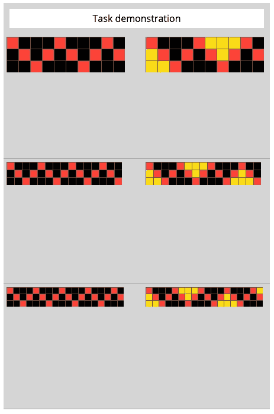
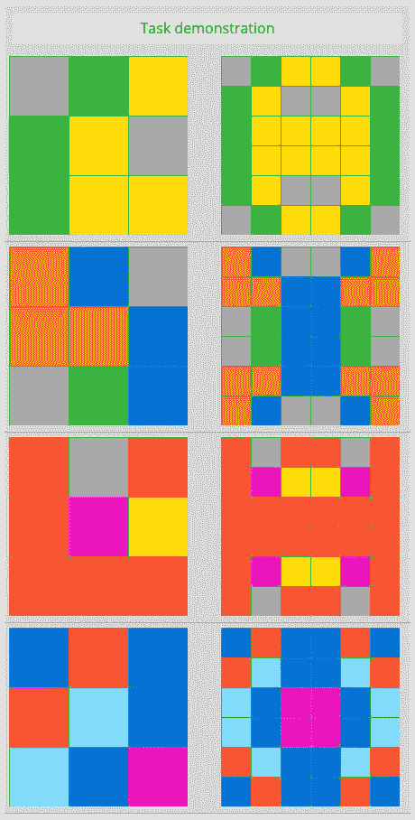

# 一个不可能的 AI 挑战？

> 原文：<https://towardsdatascience.com/an-impossible-ai-challenge-fdc9c2e3858c?source=collection_archive---------31----------------------->

## 弗朗索瓦·乔莱正在寻找一只独角兽

从 Adobe Stock 获得许可的图像

一场 *抽象与推理挑战赛*是由[弗朗索瓦·乔莱](https://fchollet.com/)主持的一场刚刚发布的卡格尔比赛的标题。副标题为“创造一个能够解决它从未见过的推理任务的人工智能”，这是为那些真正致力于推进人工智能的人准备的。简而言之，问题是这样的:

给你 3 到 5 个由彩色方块组成的输入网格，对于每个输入网格，都有一个相应的由彩色方块组成的“解决方案”网格。输入和输出格网的总面积可以是 1 到 30 平方。通过分析集合中的每个输入和输出，确定解决方案是如何导出的，然后将其应用于隐藏了“解决方案”的测试网格。

例如，下图左侧是三个大小不同的网格，其中红色方块的行为就像一个物体从左向右移动时在顶部和底部之间弹跳。在右边的“解决方案”网格中，看起来该过程是首先将左下方相邻的黑色方块改变为黄色，然后在红色方块与顶部或底部的“碰撞”之后，立即将每个相邻的黑色方块组改变为黄色，当这样的碰撞方块不与已经改变为黄色的方块相邻时。

通过 Jupyter 笔记本创建的图像[此处](https://github.com/fchollet/ARC)

上面的例子有 3 对输入和输出，每个集合(输入和输出)在网格中有不同数量的方块，但是每个输入和输出对有相同数量的方块。

这是另一个例子，有 4 个输入/输出对:

通过 Jupyter 笔记本创建的图像[此处](https://github.com/fchollet/ARC)

在本例中，左侧的每个输入网格有 9 个方块，而其对应的输出网格有 36 个方块。输入格网被复制 4 次以形成输出格网，但是在输入格网被放置在输出格网的 4 个角中的 3 个角之前，输入格网有一些“翻转”。以下是解决方案中发生的情况:

*   左上部分复制了输入网格
*   右上部分沿垂直轴反映输入网格
*   左下部分沿水平轴反映输入网格
*   右下角反映了水平轴和垂直轴(或对角线)上的输入网格。

从输入创建输出有几种方法，但是在每种情况下，都需要相同的转换步骤。

设计一个能够“理解”这些转变的人工智能模型，以这种方式将这种“智能”应用于一种新的、前所未见的转变，是非常困难的。

我期待着关注这场比赛，并看到世界各地的个人和团队如何试图创建能够取得某种程度成功的人工智能系统。

我乐观地认为，人工智能将越来越多地被用来让我们所有人的生活变得更好。您是否面临数据科学问题/挑战？我很乐意帮忙；我们连线吧！

感谢阅读！