# 对全球新冠肺炎疫情进行深入分析

> 原文：<https://towardsdatascience.com/an-in-depth-analysis-of-the-global-pandemic-of-covid-19-bd5a3bdea155?source=collection_archive---------26----------------------->

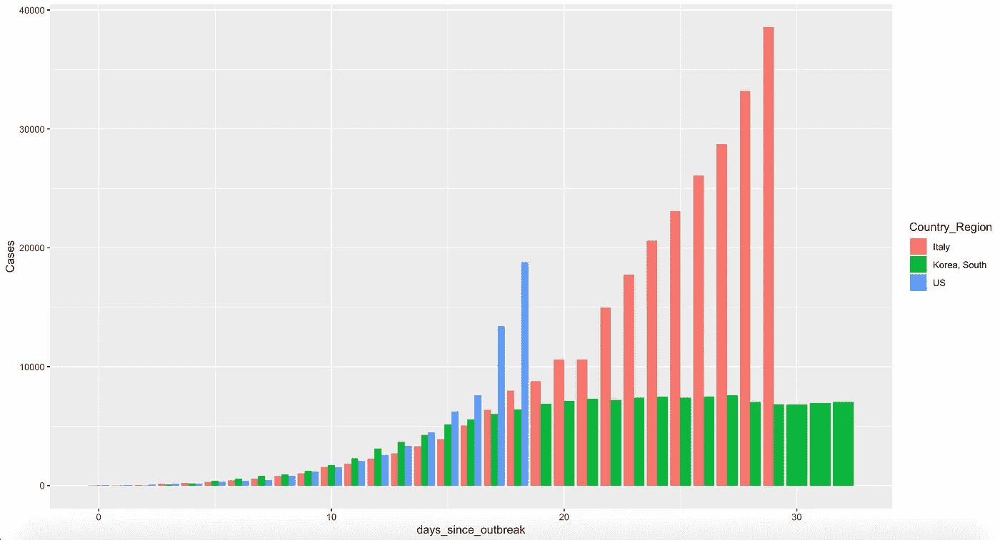

# 使用这些工具掌握数据可视化

## 新冠肺炎疫情在全球范围内相比如何？

我最近发表了一篇文章，探讨了约翰·霍普斯金大学最近在新冠肺炎发布的数据；虽然我们能够做出一些有趣的发现，但收集数据提供更全面的情况似乎是恰当的。

亲自访问此页面获取数据:[https://www.tableau.com/covid-19-coronavirus-data-resources](https://www.tableau.com/covid-19-coronavirus-data-resources)

让我们立即开始一些基本的探索性数据分析。

# 数据熟悉

下载下来拉进来！

```
covid_tab <- read.csv('covid_tableau.csv')
```

让我们看看如何使用`head`功能！

```
head(covid_tab)
```

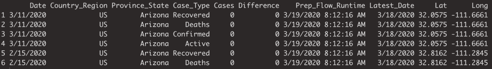

我在这里的第一个要求是，这是在日期、国家、省、案例类型级别上构建的。类似于 JHU 的数据，但有一个关键的区别。这就是案件类型。如果我们能够了解在任何给定的地点和时间的活动、死亡和恢复的分类，这对我们评估情况及其进展有很大帮助。

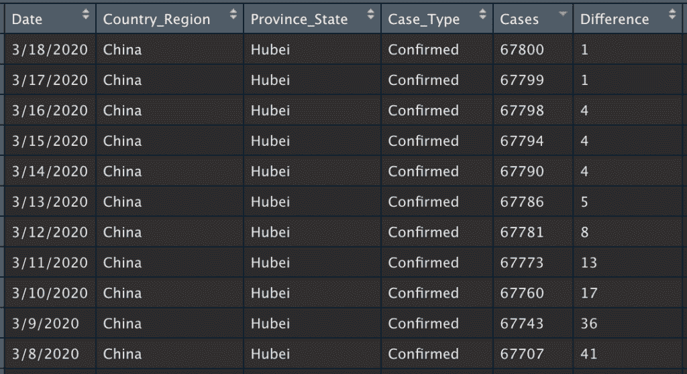

您还会注意到，差异列表示每种案例类型每天的变化，而案例是当前的总数。

```
glimpse(covid_tab)
```

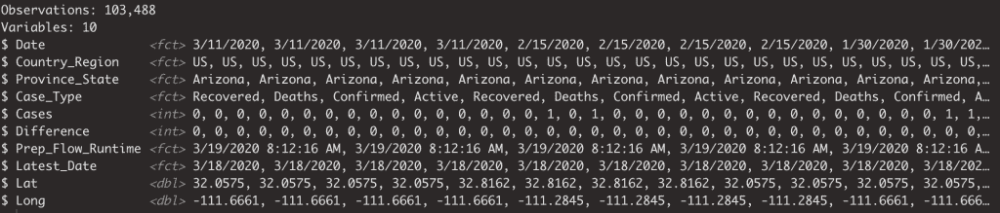

Glimpse 还提供了数据集维度、数据类型、样本等的一些上下文。

```
summary(covid_tab)
```


这根据数据类型给出了一些有趣的统计数据。数值的范畴、最小值、最大值、四分位数、平均值、中值的出现次数。

另一个快速注意事项是，我发现案例类型有以下值:


我想了解活动、死亡和恢复加起来是否等于确认，它们是否相互排斥，或者这些不同的值将如何被利用。

```
covid_tab %>% group_by(Country_Region, Case_Type ) %>% summarise(max(Cases))
```

按国家/地区和案例类型分组，因为我知道案例是累积的，所以我只取了最大值，并评估了它们是如何累加的。

看看这个样本！

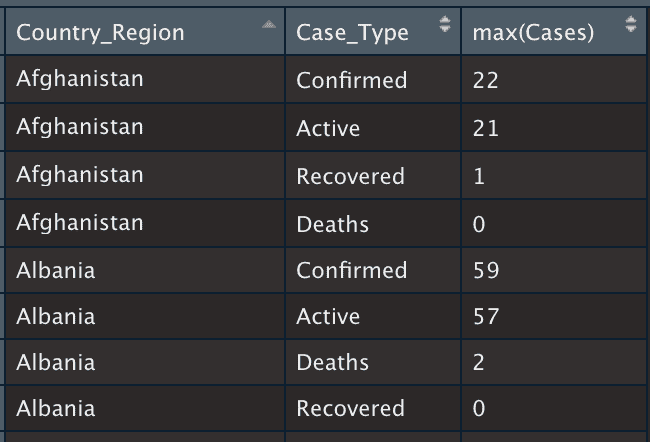

以阿富汗和阿尔巴尼亚为例，您可以看到活动、死亡和康复加起来就是确诊。

# 睁大你的眼睛！

在我们继续之前，有一个小提示，您可能已经注意到，当我们运行`glimpse`时，`Date`列作为一个因素被调用。

为什么这是一个问题？

因为任何可视化都会把因子值当作字符串，并相应地排序。

看看下面的图表。我们所看到的中间的大幅下降实际上代表了这个月的前几天。

使用像这样的基本命令来清理它。注意你需要使用的格式。我不会在这里深究，但是让函数知道数据“来自”哪里是很重要的。

```
covid_tab$Date <- as.Date(covid_tab$Date, format = "%m/%d/%Y")
```

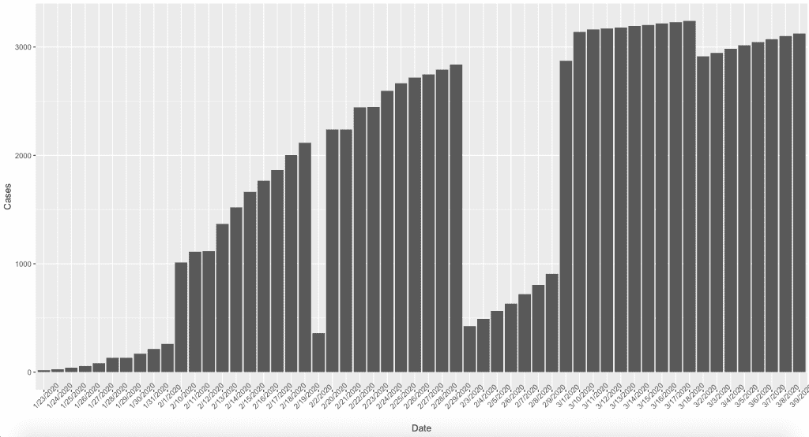

如果我们现在再次运行该命令，我们会得到以下结果


作为探索性数据分析的一部分，还可以经历许多其他步骤；与其在这里继续，我们将深入一些数据可视化。

# 可视化趋势、模式和关系！

## 一次一个开始

现在我们对数据有了一个很好的理解

跳进…我刚刚在上面展示了这个，但是我将展示我们如何到达那里。

在这里，我们希望看到所有累计确诊病例。

我采用数据框架，过滤“已确认”病例，按日期分组，按病例汇总，并创建一个条形图。

```
covid_tab %>% filter(Case_Type == 'Confirmed')%>% 
 group_by(Date) %>% 
 summarise(Cases = sum(Cases))%>% 
 ggplot(aes(x = Date, y = Cases))+ geom_bar(stat = 'identity')+   
 theme(axis.text.x = element_text(angle = 45))
```

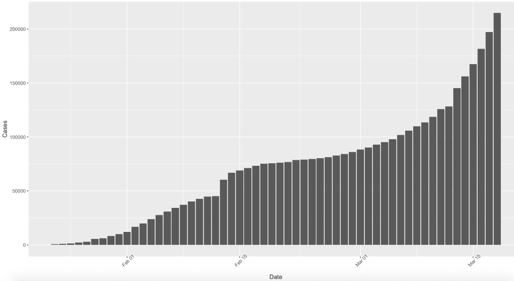

然后，我们可以针对每种案例类型再次执行此操作。对于探索性的数据分析过程来说，这通常很有意义。

```
covid_tab %>%
 filter(Case_Type == 'Deaths')%>%
 group_by(Date)%>% 
 summarise(Deaths = sum(Cases))%>% ggplot(aes(x = Date, y =
 Deaths))+ 
 geom_bar(stat = 'identity')+ theme(axis.text.x = element_text(angle
 = 45))
```

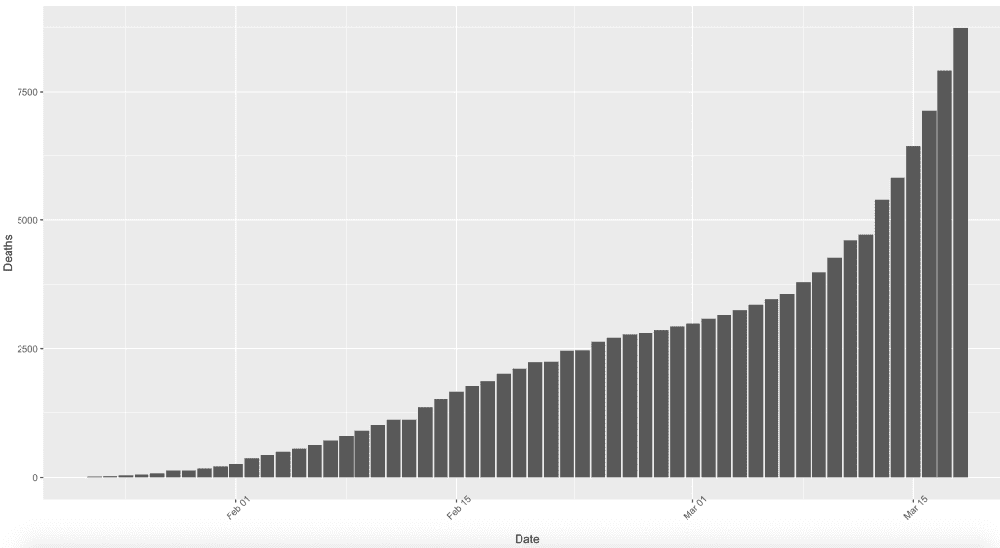

类似地，我们可以这样做来表示死亡的每日变化，只是通过按`Difference`字段汇总死亡来代替。

```
covid_tab %>%
 filter(Case_Type == 'Deaths')%>%
 group_by(Date)%>%
 summarise(Deaths = sum(Difference))%>%
 ggplot(aes(x = Date, y = Deaths))+
 geom_bar(stat = 'identity')+
 theme(axis.text.x = element_text(angle = 45))
```


# 可视化多个变量

## 案例、国家和案例类型之间有什么关系？

类似于我们上面创建的，下面我们做同样的事情，现在按他们的`Case_Type`分解总数。

正如你在我的代码中看到的，我已经从`Case_Type`中删除了所有出现的‘确认’一词。我想我们可以包括它，它看起来就像一个求和条，紧挨着更多的粒度条。

```
covid_tab %>%
 filter(!grepl('Confirmed', Case_Type)) %>%
 group_by(Date, Case_Type) %>%
 summarise(Cases = sum(Cases))%>%
 ggplot(aes(x = Date, y = Cases, fill = Case_Type))+
 geom_bar(stat = 'identity')+
 theme(axis.text.x = element_text(angle = 45))
```


虽然这种观点是好的，但我实际上更喜欢包括位置参数“道奇”。那么这个图表在 case_type 的不同值之间看起来会更有可比性。

```
covid_tab %>%
 filter(!grepl('Confirmed', Case_Type))%>%
 group_by(Date, Case_Type)%>%
 summarise(Cases = sum(Cases))%>%
 ggplot(aes(x = Date, y = Cases, fill = Case_Type))+
 geom_bar(stat = 'identity', position = 'dodge')+
 theme(axis.text.x = element_text(angle = 45))
```

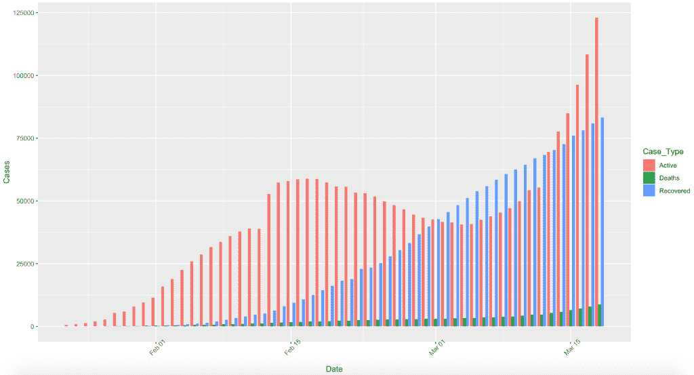

现在，我们对这些数字每天的变化有了更好的了解。我们看到 3 月初活跃案例大幅下降，上周左右又有所回升。

恢复的案例持续增长，甚至超过了总活跃案例，几周后再次领先。

## 每日差异情况

我们在这里看到的是，活跃病例的新发生率在 2 月底大幅下降，但随后在 3 月中旬大幅上升。

```
covid_tab %>%
 filter(!grepl('Confirmed', Case_Type))%>%
 group_by(Date, Case_Type)%>%
 summarise(Difference = sum(Difference))%>%
 ggplot(aes(x = Date, y = Difference, fill = Case_Type))+   
 geom_bar(stat = 'identity')+
 theme(axis.text.x = element_text(angle = 45))
```

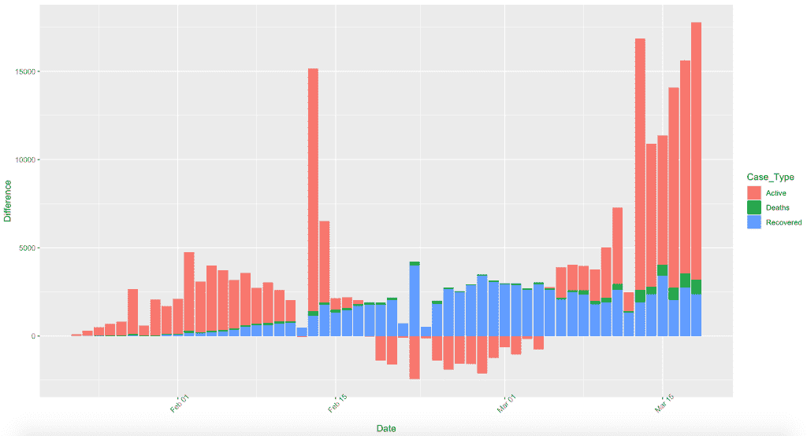

应该有助于更好地告知这是从哪里来的是通过地理变量打破这一点。我们将从国家级开始，然后再看看省级。

## 深入了解国家和案例类型

这段代码需要解释一些事情。RStudio 中的图例被夸大了，因为该数据集中包含了 100 多个国家。所以我创建了国家总数，在给定的时间内取最高的病例数。然后，我将它加入到我们一直使用的熟悉的命令中，并使用它来过滤出没有达到给定病例数的国家，这给了我们最高的 16 个左右的国家。

在那里，我们创建一个类似的可视化，这次用 country 替换 case type。我们可以将多个类别合并到我们的可视化中，但我们将把它留到以后。

```
country_totals <- covid_tab %>%
 group_by(Country_Region)%>%
 summarise(max_cases = max(Cases)) covid_tab %>%
 left_join(country_totals, by = 'Country_Region')%>%
 filter(grepl('Confirmed', Case_Type) & max_cases >= 1000)%>% 
 group_by(Date, Case_Type, Country_Region)%>%
 summarise(Cases = sum(Cases))%>%
 ggplot(aes(x = Date, y = Cases, fill = Country_Region))+
 geom_bar(stat = 'identity')+
 theme(axis.text.x = element_text(angle = 45))
```

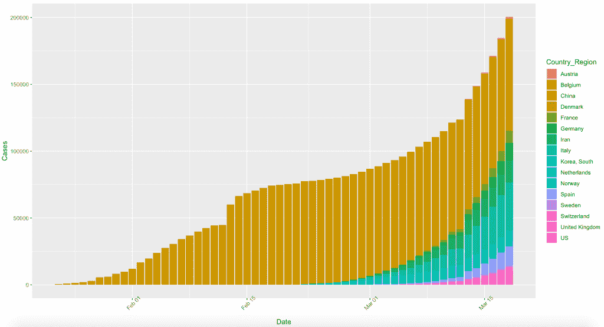

正如你所猜测的，你可以看到中国在大部分疫情中占主导地位，意大利自 2 月下旬以来出现。

现在让我们用每日差异来检查一下。在这里，我们看到的是活动案例数量的每日变化。

```
covid_tab %>%
 left_join(country_totals, by = 'Country_Region')%>%
 filter(grepl('Active', Case_Type) & max_cases >= 1000 & Date > 
 '2 020-02-15')%>%
 group_by(Date, Case_Type, Country_Region)%>%
 summarise(Difference = sum(Difference))%>%
 ggplot(aes(x = Date, y = Difference, fill = Country_Region))+
 geom_bar(stat = 'identity', position = 'dodge')+
 theme(axis.text.x = element_text(angle = 45))
```

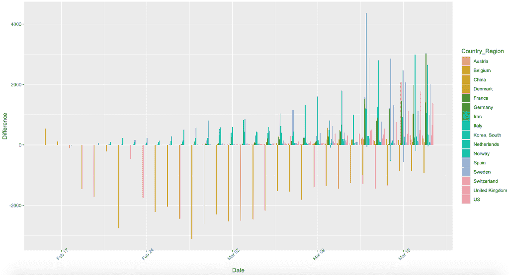

这产生了一个有趣的一瞥，让我们了解在任一方向上给定时间的变化强度。

# 包含多个类别

## 刻面

这不是最漂亮的视觉效果，因为在下面的分面图中，国家有很多级别，每个窗格的体积也不一样。也就是说，打破这种多分类变量可以提供一个有趣的视角。

与前面的命令类似，这里我们在底部添加了 facet_wrap 命令，这使得我们将图表分成不同的窗格，以显示包含的分类变量的每个值。

```
covid_tab%>%
 left_join(country_totals, by = 'Country_Region')%>%
 filter(!grepl('Confirmed', Case_Type) & max_cases >= 1000 & Date >
 '2020-02-15') %>% group_by(Date, Case_Type, Country_Region) %>%
 summarise(Cases = sum(Cases))%>% ggplot(aes(x = Date, y = Cases,
 fill = Country_Region))+ geom_bar(stat = 'identity', position =
 'dodge')+ theme(axis.text.x = element_text(angle = 45))+
 facet_wrap(~Case_Type)
```

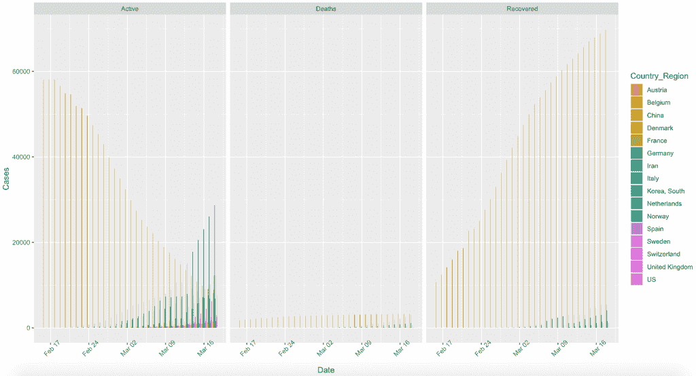

在活跃窗格中，我们可以看到中国的活跃数量明显下降，而意大利在上周的大多数情况下迅速上升，超过了中国。

对于死亡，我们可以通过这个时间窗口看到中国保持静止，而意大利在增长。

由于明显滞后于中国的爆发，其他国家仍比其复苏曲线晚几天或几周。

## 没有中国

我们可以做同样的事情，只是排除中国，以更好地了解疫情更为流行的相对情况。

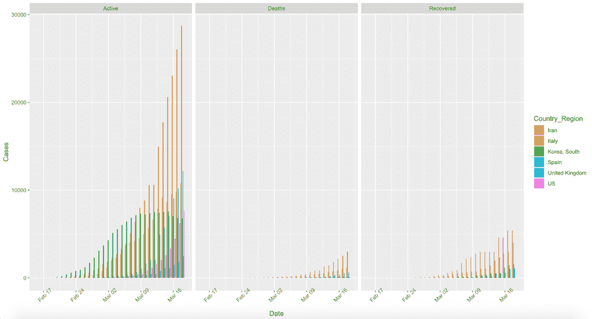

## 让我们仔细看看

这里有趣的是我们在第一个窗格中看到的。关注的不是数量，而是任何一个国家的曲线形状。

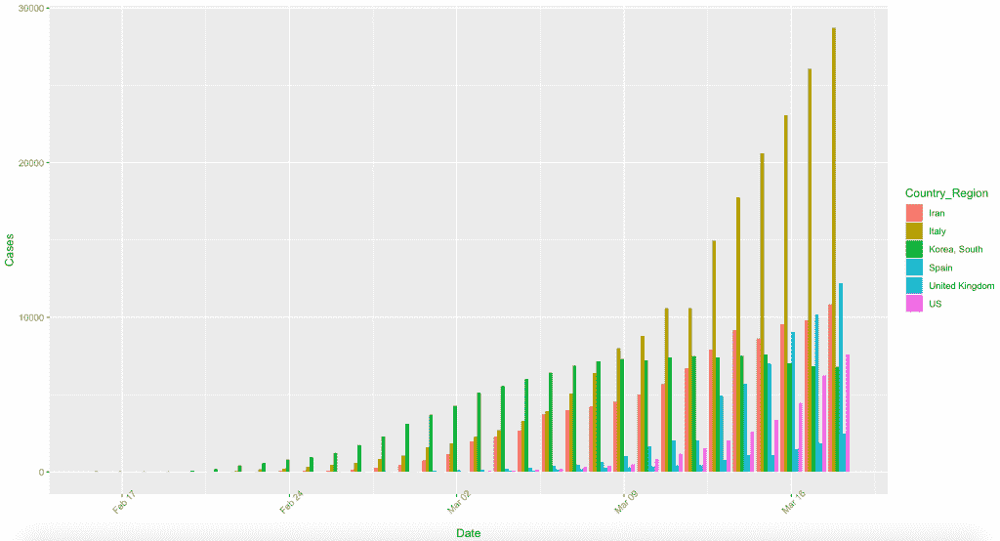

虽然我们看到一些指数增长，相反，韩国经历了这种对称分布；病例上升的速度几乎和病例下降的速度一样快。

## 让我们按国家分面

我们现在将把这张图表分成几个部分，以便更清楚地看到国与国之间的差异。

请记住，这种模式可能是由于测试斜坡。围绕大规模测试有传言称，韩国推出得非常快。我不知道不同国家的测试部署/斜坡有什么不同，所以我不能说，但这是要记住的事情。

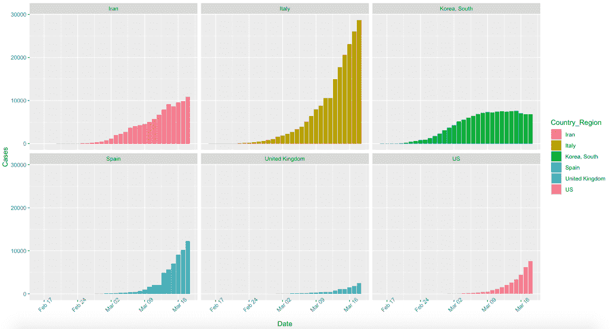

```
covid_tab %>%
 filter(!grepl('Confirmed', Case_Type) &
 grepl('China|Korea|US|United Kingdom|Italy|Spain|Iran',
 Country_Region) & Date > '2020-02-15')%>%
 group_by(Date, Case_Type, Country_Region)%>%
 summarise(Cases = sum(Cases))%>%
 ggplot(aes(x = Date, y = Cases, fill = Case_Type))+
 geom_bar(stat = 'identity', position = 'dodge')+
 theme(axis.text.x = element_text(angle = 45))+
 facet_wrap(~Country_Region)
```

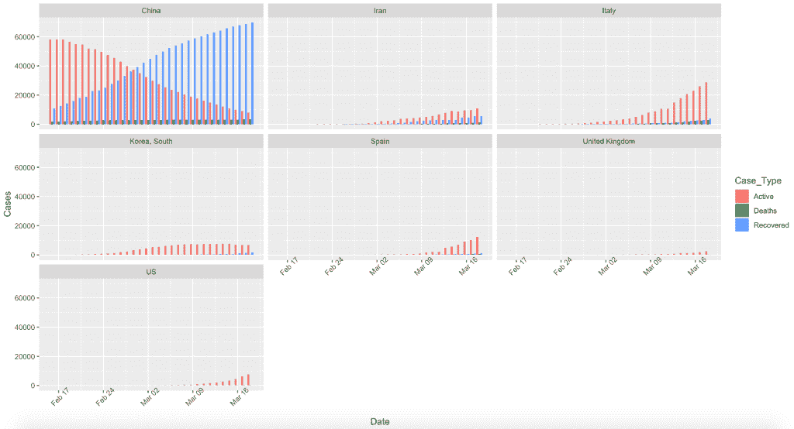

下面，我将删除中国，以提高其他落后国家的可解释性。

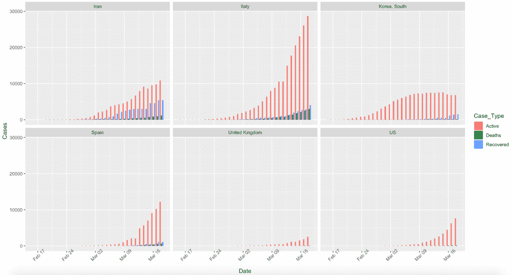

# 与意大利的直接比较

谈到我们当前的发展轨迹，人们把美国比作意大利。已经说过很多次了，我们落后他们 10 天。我们来调查一下！

我想做的是确定某个国家的第一例冠状病毒，并从那里给出自爆发以来的每一天。然后我们将在 X 轴上画出这个，看看我们看起来比意大利落后多少天。这将有助于我们了解不同国家之间的相似或相异之处。

我做的第一件事是创建第一天的数据集。在这里，我们按国家分组，筛选出任何爆发前的日期，并取第一个日期。

然后，我们将其加入到我们的数据集中，并将 days_since_outbreak 指标作为我们的 x 轴。

```
first_day <- covid_tab%>%
 filter(grepl('Active', Case_Type) & grepl('US|Italy', Country_Region) & Cases > 0)%>%
 group_by(Country_Region)%>%
 summarise(first_date = min(Date)) covid_tab %>%
 filter(grepl('Active', Case_Type) & grepl('US|Italy', Country_Region))%>%
 group_by(Date, Case_Type, Country_Region)%>%
 summarise(Cases = sum(Cases))%>% left_join(first_day, by = 'Country_Region')%>%
 mutate(days_since_outbreak = as.numeric(as.Date(Date) - as.Date(first_date)))%>%
 ggplot(aes(x = days_since_outbreak, y = Cases, fill = Country_Region))+
 geom_bar(stat = 'identity', position = 'dodge')
```

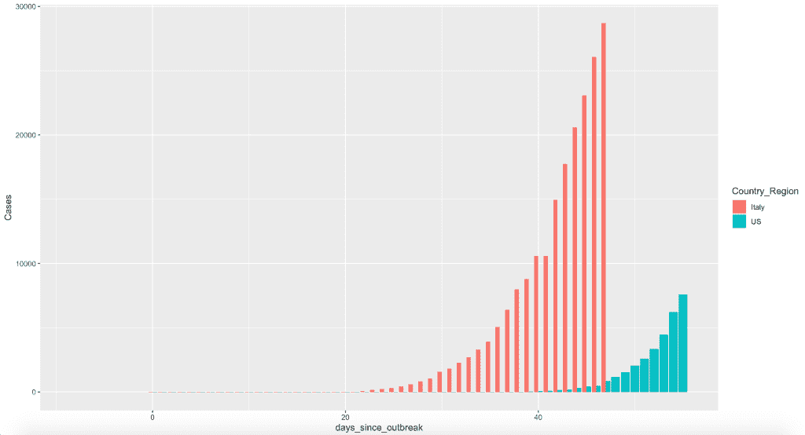

看一下自爆发以来的天数…

令人惊讶的是，美国的第一个病例实际上是在 2010 年 1 月 23 日确诊的。美国的增长在大约一个月的时间里没有真正开始。请记住，这在很大程度上取决于报告。

相反，意大利的第一天是在 8 天后的 1 月 31 日。有趣的是他们经历指数增长的速度有多快。

我又做了一次，但是我选择了“第一次约会”,是根据每个国家发展非常迅速的日期。这里我们可以看到，一旦美国达到类似的轨迹，我们实际上看到感染的速度更快。

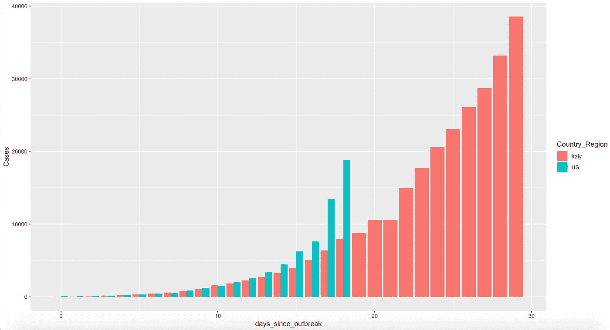

人们可以立即推测说，也许美国已经更快地动员了测试能力——这可能是我们看到更快增长的原因，或者，这可能是由于缺乏早期干预。不言而喻，这可能是由于任何其他因素。

## 看看韩国

韩国是测试速度最快的国家。让我们来看看他们是如何比较一致的。


南韩驱车通过新冠肺炎测试站


正如我们所看到的，在韩国曲线开始变平之前，增长在几周内保持相似。这并不一定能告诉我们任何关于测试能力或测试速度的信息，但它确实提供了一幅有趣的图片，展示了每个国家的相对增长和下降；当然也回避了这样一个问题:韩国是如何如此迅速地拉平曲线的？

# 增长

最大的担忧之一是病毒的增长。病毒会以多快的速度席卷任何一个国家？

与我们所做的其他一些分析类似，我想观察各个国家的增长率。

我是这样计算增长率的:今天的总例数—昨天的例数/昨天的例数；从而得出与昨天总数相关的每日变化。

您将在下面的代码片段中看到，在按日期排序并按国家分组后，我使用了 lag 函数将前一天的总数提取到当天的记录中。

从那里，我简单地用先前定义的公式创建了一个字段。

我还重新考虑了将第 0 天定为病毒活跃的第一天的想法。

```
covid_growth <- covid_tab%>%
 filter(grepl('Active', Case_Type) & grepl('China|Korea|US|United
 Kingdom|Italy|Spain|Iran', Country_Region))%>%
 group_by(Date, Case_Type, Country_Region)%>%
 summarise(Difference = sum(Difference), Cases = sum(Cases))%>%
 arrange(Date)%>% group_by(Country_Region)%>%
 mutate(lag_cases = lag(Cases), growth = round((Cases - lag_cases) / lag_cases,2))%>%
 ungroup()%>%
 left_join(first_day, by = 'Country_Region')%>%
 mutate(days_since_outbreak = as.numeric(as.Date(Date) -
 as.Date(first_date)))covid_growth%>%
 filter(days_since_outbreak > 0)%>%
 ggplot(aes(x = days_since_outbreak, y = growth, col =
 Country_Region))+
 geom_line(stat = 'identity')
```

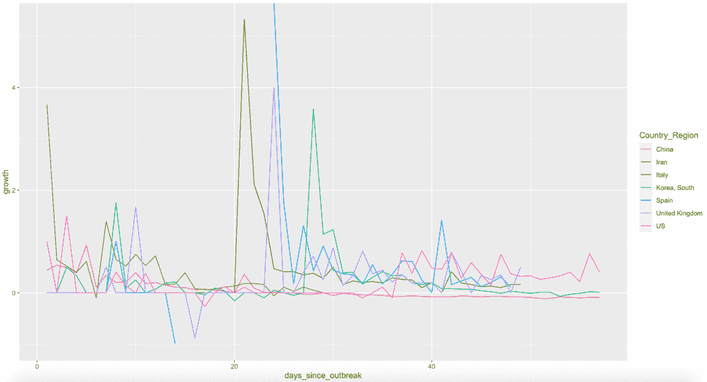

鉴于不祥的“翻倍率”，日增长率的下降令人欣慰。“倍增率”是一个在病毒背景下经常被提及的指标。它代表给定国家的病毒在一天内翻倍的天数。在 1 附近有一条一致的线，我们可以假设一个翻倍率持续保持强劲。

很明显，有些日子的增长率高达前一天的 4 倍，但好消息是，我们看到百分比增长率一天比一天持续下降。

# 结论

还有更多的东西可以投入进去！

我希望这已经被证明是有用的，因为你试图更好地了解世界上正在发生的事情，你的公司，或者你正在做的任何事情！

数据科学快乐！

***编者按:*** [*走向数据科学*](http://towardsdatascience.com/) *是一份以数据科学和机器学习研究为主的中型刊物。我们不是健康专家或流行病学家，本文的观点不应被解释为专业建议。想了解更多关于疫情冠状病毒的信息，可以点击* [*这里*](https://www.who.int/emergencies/diseases/novel-coronavirus-2019/situation-reports) *。*

*原载于 2020 年 3 月 22 日 http://datasciencelessons.com**T21*[。](https://datasciencelessons.com/2020/03/22/covid-19-data-visualization-mastery/)