# 关于随机变量的深入速成课程

> 原文：<https://towardsdatascience.com/an-in-depth-crash-course-on-random-variables-a3905d03e322?source=collection_archive---------26----------------------->

## 统计学和数据科学的基础

rawpixel.com 创建的商业向量—[www.freepik.com](http://www.freepik.com)

# 目录

1.  随机变量
2.  概率分布函数
3.  你应该知道的著名 PMF
4.  你应该知道的著名 pdf
5.  均值和方差
6.  常见分布的均值和方差
7.  协方差和相关性

# 前言

令人惊讶的是，在线数据科学课程中并没有真正教授随机变量，这很可笑，因为它们是统计学的基础，而统计学是数据科学的基础！

因此，这旨在提供一个关于随机变量基础的综合速成课程。让我们开始吧！

# 随机变量

**随机变量(RV)** ，通常表示为 X，它的可能值是随机现象的数值结果。更简单地说，随机变量有一组值，它可以随机取这些值中的任何一个。随机变量是从样本空间到现实生活的函数。

有两种类型的随机变量，离散的和连续的。

## 离散随机变量

**离散随机变量**是其中可能值的数量是有限的或可数无限的。

离散 RVs 的示例包括某一天进入杂货店的人数、一个家庭中的儿童人数或一盒 24 个有缺陷电池的数量。

## **连续随机变量**

**连续随机变量**是其中可能值的数量是不可数的无穷大。

连续 RVs 的例子包括人的身高和体重。

# 概率分布函数

每个随机变量都有一个相关的概率分布函数。概率分布函数本质上给出了与获得每个可能值或值的区间相关的概率。

有三种类型的概率分布函数:概率质量函数(pmf)、概率密度函数(pdf)和累积分布函数(cdf)。

## 概率质量函数(pmf) →对于离散 RVs

概率质量函数(pmf)是一个**离散**随机变量的概率分布，它是与每个可能值相关的概率列表。

用更专业的术语来说，如果 *X* 是一个分立的 RV，那么它的 pmf 是:

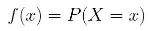

注:0 ≤ *f(x)* ≤ 1 且∑ *f(x)* = 1

## 概率密度函数(pdf) →连续 RVs

概率密度函数(pdf)是一个函数，其积分被计算以找到与**连续**随机变量相关的概率。

用更专业的术语来说，如果 *X* 是连续的 RV，那么 *f(x)* 是 *X* 的 pdf，如果它满足以下条件:

*   ∫ *f(x)dx* = 1(曲线下的面积为 1)
*   *f(x)* > 0 为所有 x(曲线没有负值)

单个点的概率等于零。所以，你得通过求定积分来求一个区间的概率:

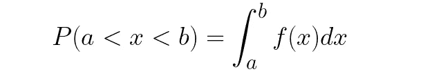

## 累积分布函数

累积分布函数(cdfs)适用于离散和连续函数。cdf 是针对每个值 *x* 给出随机变量 *X* 小于或等于 X 的概率的函数。

用更专业的术语来说，对于任何 RV *X* ，cdf 定义如下:

对于离散 RVs，您只需简单地将小于或等于 *x* 的所有值的概率相加。

对于连续 RVs，你可以简单地找到 RV 从点 0 到 *x* 的定积分。

这里有一些你应该知道的关于 CDF 的定理:

*   F(-∞) = 0
*   F(x)是单调非减的(只能随着 x 的增加而增加或保持不变)。
*   P(X>x) = 1 - F(x)
*   P(a
*   f(x) = F’(x) → the derivative of the cdf gives you the pdf

If this doesn’t make sense to you, don’t worry. Here’s an example…

## Example of PMF and CDF

Suppose we flip two coins. Then let *x* =出现的人头数。

只有三种可能:头数= 0、1 或 2。我们可以将与每个可能结果相关的概率总结如下:

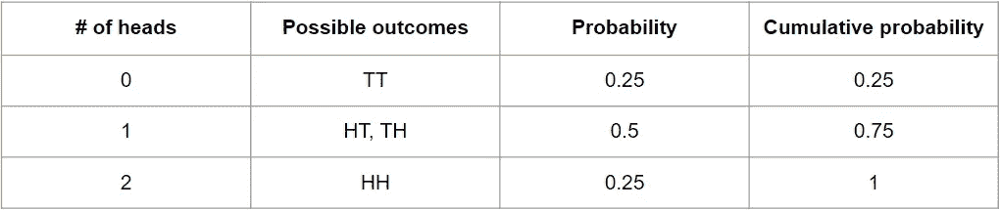

PMF 简单地用概率列表示，它显示了每个可能结果的概率。

类似地，CDF 简单地用累积概率列表示，它显示获得可能值或更少值的概率。

# 你应该知道的著名 PMF

## 离散均匀分布

*X* 具有离散均匀分布，如果其 pmf 为:

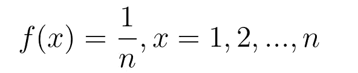

举例:抛一个骰子， *x* = 1，2，3，4，5，6。因此 *n* = 6，所有 *x* 的 pmf 等于 1/6。

## 二项分布

设 X 表示来自 *n* 次独立试验的成功次数，成功概率等于 *p* 。然后 *X* 具有参数 *n* 和 *p* 的二项分布。(符号:X∞Bin(n，p))

如果 X 具有二项式分布，那么在 *n* 试验中 *k* 成功的概率由 pmf 给出:

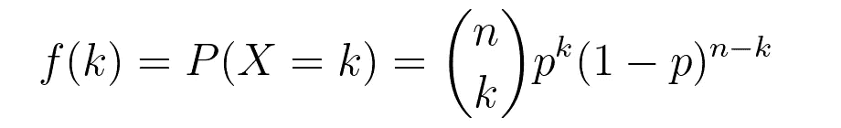

## 泊松分布

如果 x 的 pmf 如下所示，则 x 具有参数为λ的毒物分布:

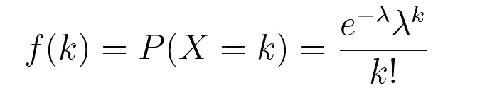

# 你应该知道的著名 pdf

## 均匀分布

X 具有均匀分布(符号:X～Unif(a，b ),如果 X 同样可能在 a 和 b 之间的任何位置。它的 pdf 是:

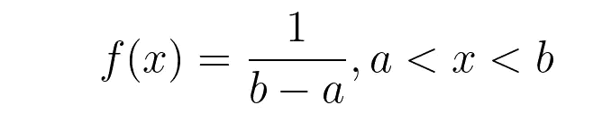

## 指数分布

x 具有参数为λ的指数分布，如果它具有 pdf:

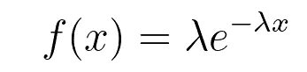

# 期望值和方差

期望值或平均值是平均值，是所有可能的 x 的加权平均值，其权重由 f(x)给出。如果 RV 的期望值或平均值为:

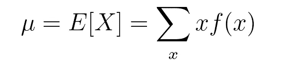

对于离散房车

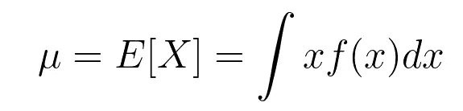

对于连续房车

方差是对分布或离差的度量。X 的方差为:

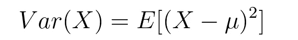

# **常见分布的均值和方差**

## x～伯努利(p)

E[X] = p

Var(X) = pq

## x～泊松(λ)

E[X] = λ

Var(X) = λ

## x～统一(a，b)

E[X] = (a+b)/2

Var(X) = (a-b) /12

## x ~法线(，σ)

E[X] =

Var(X) = σ

## x ~指数(λ)

E[X] = 1/ λ

Var(X) = 1/λ

# 协方差和相关性

这两个度量都定义了 X 和 y 之间的关联程度。

## 协方差

X 和 Y 之间的协方差为:

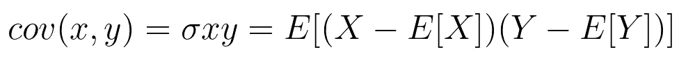

同样，一种更简单的计算方法是:

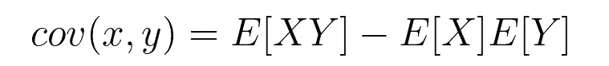

注意协方差只考虑线性相关。如果 X 和 Y 以非线性方式相关，它们可能有协方差= 0。

如果 X 和 Y 是独立的，那么 X 和 Y 之间的协方差为零。请注意，协方差为 0 并不意味着它们是独立的。

## 相互关系

衡量两个变量之间的关系强度，范围从-1 到 1；协方差的标准化版本。

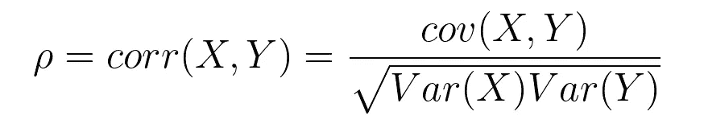

# 感谢阅读！

读完这篇文章后，希望你对随机变量、概率分布函数等有一个基本的了解。如果你觉得你需要更多地研究这些概念，我会查看我的[免费数据科学资源](https://docs.google.com/document/d/1UV6pvCi9du37cYAcKNtuj-2rkCfbt7kBJieYhSRuwHw/edit#heading=h.8dxlgh60ooti)，它涵盖了概率基础和概率分布。

## 特伦斯·申

*   *每周查看我的免费数据科学资源***的新资料！**
*   **如果你喜欢这个，* [*在 Medium 上关注我*](https://medium.com/@terenceshin) *了解更多**
*   **让我们连线上*[*LinkedIn*](https://www.linkedin.com/in/terenceshin/)*