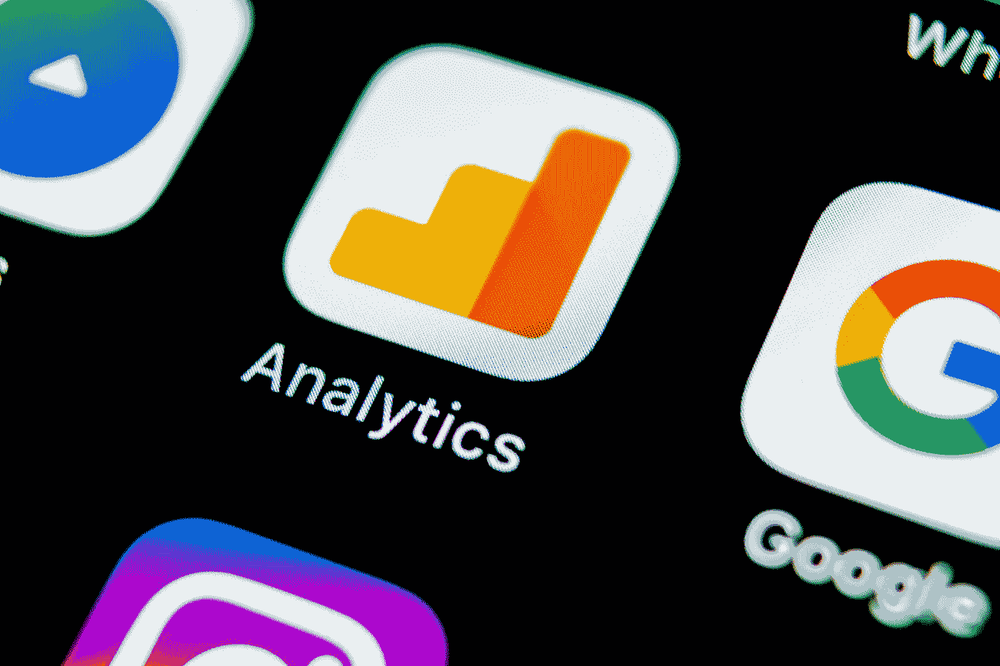
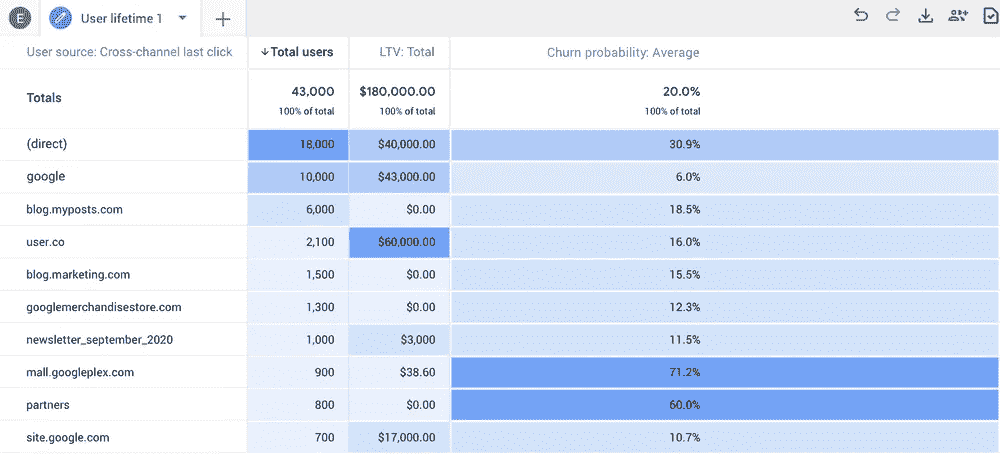
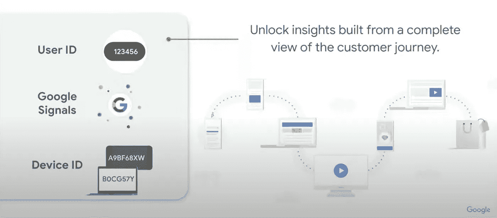
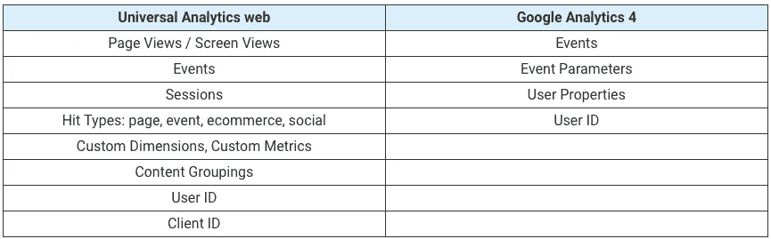
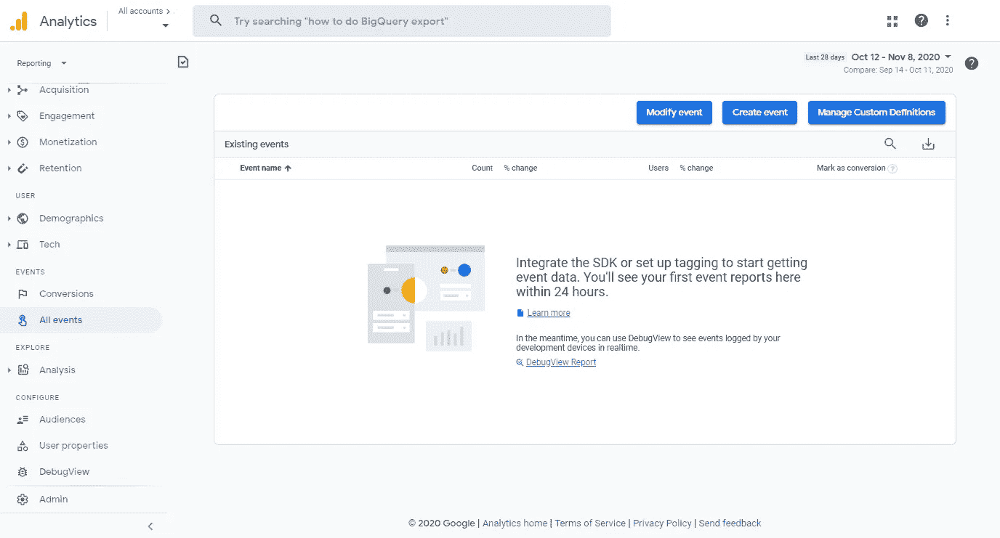
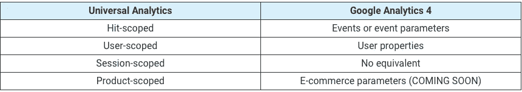

# 深入了解谷歌分析 4:新功能、优势和劣势

> 原文：<https://towardsdatascience.com/an-in-depth-look-at-google-analytics-4-new-capabilities-benefits-and-disadvantages-4880b6e10e6c?source=collection_archive---------12----------------------->

来源:[沉积照片](https://ru.depositphotos.com/207664034/stock-photo-sankt-petersburg-russia-may-2018.html)

## 在本文中，我们将讨论什么是 Google Analytics 4，它与 Universal Analytics 有何不同，它给企业带来了什么价值，以及您可以用它解决什么问题。

大约一年前，[谷歌团队推出了 App + Web 功能](https://www.owox.com/blog/news/google-analytics-app-web/)，它允许你将来自网站和移动应用的数据整合到一个谷歌分析资源中。从那以后，谷歌测试了这种新型资源，对其进行了修改，最终确定了它，并以不同的名称将其推出了测试版。认识一下[谷歌分析 4](https://blog.google/products/marketingplatform/analytics/new_google_analytics/) 。

# 什么是谷歌分析 4？

谷歌分析 4 是谷歌分析中的一个新的资源类型。它看起来与通用分析(UA)资源略有不同，而且配置起来更容易、更快。在演示中，谷歌团队多次将这种新型资源称为分析的未来，引用了以下内容:

1.  围绕事件构建的可扩展跨平台分析
2.  所有谷歌分析用户都可以使用机器学习(ML)和自然语言处理(NLP)功能
3.  维护隐私和避免设置 cookies 的需要是首要任务
4.  与所有谷歌产品无缝集成
5.  跨平台用户识别，因此您可以跨设备和平台查看用户的完整路径

让我们仔细看看这些好处。

# 可扩展的跨平台分析

基于事件的方法允许您跨多个设备和平台收集可靠且一致的数据。

在 Google Analytics 的标准 web 版本中，一切都是围绕用户会话构建的，而在 Firebase 中，一切都是围绕事件构建的。因此，很难分析用户在平台之间的转换，因为没有通用的用户行为衡量标准。即使有原始数据，你也需要花大力气建立高质量的用户流量。

谷歌分析 4 结合了所有围绕事件的分析。这使您可以为所有设备和平台收集相同的标准化数据，提高数据质量，并为您提供跨用户路径的单一报告。

# 机器学习

Google Analytics 4 的主要优势之一是其机器学习和自然语言处理(NLP)功能，您可以使用它来:

*   预测转换的概率，并基于该概率为谷歌广告创建受众预测
*   就数据中的重要趋势向您发出警告(例如，由于用户需求的变化而引起的产品需求)
*   在报告中查找异常
*   预测客户流失的可能性，这样你就可以有效地投资留住客户

图片由作者提供

谷歌团队计划继续朝着这个方向发展，并添加新的预测，如 ARPU，以便所有谷歌分析 4 用户可以调整他们的营销策略，并使用机器学习见解提高他们的投资回报率。

# 隐私是重中之重

1.  Google Analytics 4 以隐私为中心，使用 gtag。js 库，没有 cookies 也能工作。因此，我们可以预计，在不久的将来，谷歌将放弃[客户端 ID](https://www.owox.com/blog/use-cases/google-analytics-client-id/) ，而只依赖内部设备和浏览器标识符以及 CRM 中生成的跨平台用户 ID 标识符。
2.  Google Analytics 4 中的 IP 匿名化是默认配置的，不能更改。

# 与谷歌工具无缝集成

到目前为止，最先进的集成是与 YouTube 的集成。谷歌正在积极努力提高 YouTube 活动的评估质量(例如，允许您跟踪观看转换)。这将让你找到这些问题的答案:

*   我的 YouTube 广告活动如何影响特定的观众参与指标？
*   我的 YouTube 活动如何影响跳出率、我网站上的事件(不一定是转换)等？

通过更深入的 Google Ads 集成，您可以创建受众并开展活动，以相关和有用的产品吸引新客户，无论他们使用什么设备。

此外，在 Universal Analytics 中， [BigQuery 导出功能](https://support.google.com/analytics/answer/3437618?hl=en)仅对付费版本的用户开放，而在 Google Analytics 4 中，该功能对所有人都是免费的。您可以在 Google Analytics 4 资源设置中激活 BigQuery 云存储中的数据收集。

# 跨平台用户识别

谷歌分析 4 考虑的是与你的公司互动的个人用户，而不是他们使用的设备和浏览器。

它使用三个级别的身份识别来实现这一点:

*   用户标识
*   谷歌信号
*   设备 id

图片由作者提供

通过实施基于事件的分析，Google Analytics 4 使您能够更好地跟踪用户从首次接触到转化和重新订购的路径。此外，如果用户使用不同的设备多次完成同一事件，则该事件的数据将被合并到单个触摸点。例如，如果客户将一件商品放入智能手机上的购物车，然后放入笔记本电脑，“添加到购物车”事件将只计算一次。

# 谷歌分析 4 和通用分析的区别

让我们比较一下通用分析和谷歌分析 4 中的关键跟踪概念:

谷歌分析 4

*   分析是围绕事件而不是会话构建的。由于会话是一个人造的概念，谷歌建议放弃它们。如果需要会话数据，可以通过在 Google BigQuery 中处理原始数据来自己构建。
*   有针对整个网站的高级数据收集设置和随每个事件而变化的设置。
*   借助内置的端到端 user_id 报告，您不需要创建单独的视图来使用 user_id。

在 Google Analytics 4 中，有三种类型的事件及其参数，就像 Firebase 中一样。

# 谷歌分析 4 中的三种事件和设置

*   **自动收集** —例如:page_view、session_start、view_search_results、scroll、file_download ( [查看文档中完整的事件列表。](https://support.google.com/analytics/answer/9234069))
*   **推荐活动**分为商业领域:零售和电子商务、旅游、游戏([见完整列表](https://support.google.com/analytics/answer/9267735?hl=en&ref_topic=9756175#))。)
*   **自定义** —您想要实施和监控的所有其他事件([受 Google Analytics 4 限制。](https://support.google.com/analytics/answer/9267744?hl=en))

推荐事件和自定义事件是独立实现的。

# 每个事件可以有额外的定义

图片由作者提供

自定义定义是对大多数报告端到端的维度和指标，并帮助您保持在 [Google Analytics 4 限制](https://support.google.com/analytics/answer/9267744?hl=en)内。

# 没有类别、动作或事件快捷方式

Google Analytics 4 没有类别、动作和事件快捷方式这样的概念。

对于现有设置和收集的数据，这些属性映射到事件设置。如果你想在 Google Analytics 4 报告中看到属性，你需要[注册](https://support.google.com/analytics/answer/9478675)它们。

# 页面视图已成为 page_view 事件

如果您实现了“config”gtag . js 片段，这些事件会被自动收集。

page_view 事件具有以下预设参数:

*   页面位置
*   页面路径
*   页面标题
*   页面 _ 推荐人

# 谷歌分析 4 中的会话和会话计数

Google Analytics 4 报表有会话，但它们与通用分析中的会话有所不同:

1.  会话由自动收集的 session_start 事件触发。
2.  会话持续时间是第一个和最后一个事件之间的间隔。
3.  交互被自动识别(不需要调度交互事件)。
4.  延迟案例处理超时为 72 小时(UA Properties 中为 4 小时)。如果您比较 Google Analytics 4 和 Universal Analytics 报告中的会话数量，您可能会发现前者的会话数量较少，因为在会话完成后发送的点击可以在 72 小时内分配到正确的会话。因此，会议报告的印发时间更长。
5.  目前无法在 Google Analytics 4 中配置会话持续时间。

# 自定义维度和指标

为了在 Google Analytics 4 报告中包含自定义维度和指标，必须根据 Google 的规则将它们转移到新的资源。尽管点击级别和用户级别的参数在 Google Analytics 4 中有相似之处，但会话级别的参数却没有对等物。或者，您可以在点击级别定义它们。

要使用自定义产品级定义，您必须单独添加它们。目前还不清楚这将如何工作，因为该功能仍在开发中，没有包含自定义产品级别定义的电子商务报告。

# 用户属性(新)

谷歌分析 4 引入了一个新的用户属性功能。

用户属性是对应于特定受众/用户的定义:性别、城市、新客户或老客户、永久客户等。

影响特定用户的属性扩展到他们的所有行为。基于用户属性，谷歌分析 4 为个性化广告形成受众。

# 现在谁将从过渡到 Google Analytics 4 中受益？

在以下情况下，您应该已经实施了 Google Analytics 4:

*   你通过数据层和谷歌标签管理器在你的网站上收集数据
*   您使用很少的标签(意味着最小的调整)
*   你积极使用 YouTube 广告和基于用户 ID 的再营销
*   您正在积极地使用 Firebase，并且您的团队熟悉 Firebase 数据收集逻辑以及 BigQuery 中用于导出表的 App + Web (Firebase)数据模式

越快迁移到 Google Analytics 4，就能越快开始收集历史数据，获得越多的决策信息，也能越快从机器学习洞察中获得价值。正如我们已经看到的，Google Analytics 4 和 Universal Analytics 有明显不同的数据结构和数据收集逻辑。因此，组合来自这两种资源的数据将会有问题。

# 为什么不加快转变呢

在以下情况下，您可能会遇到实施 Google Analytics 4 的问题:

*   代码是你网站的主要追踪方法
*   您使用 Google Tags Manager 作为您的主要跟踪方法，并且在容器中有许多标签(尤其是当标签绑定到自动事件时)
*   你有一个包含许多子域名的大型网站，每个子域名你都单独跟踪
*   对于事件及其参数，您没有一个度量系统(统一的名称和值),也没有统一的事件层次结构方法(在这种情况下，不清楚哪些事件首先添加到 GA 界面更重要，哪些最好推迟。)
*   您有一个没有通用事件层次结构的网站和应用程序
*   你的团队还没有在 BigQuery 中处理过原始数据，也不熟悉 Firebase Analytics / App + Web 的原理和上传方案

如果这些陈述适用于您，我们建议首先构建通用数据收集逻辑，然后再实施 Google Analytics 4。否则，您会很快发现自己没有用户参数的空闲插槽。

如果您没有内置的数据收集方案，除了付费存储对任何人都没有用的垃圾数据(例如，关于滚动事件和横幅视图的数据)之外，您还可以在 BigQuery 中收集无用的事件并面临导出限制。

在我们看来，Google Analytics 4 的主要缺点是将数据导出到 Google BigQuery 的方案，其中事件和用户的关键参数存储在嵌套字段中。这意味着，为了从 Google Analytics 4 表中获取必要的信息，与标准 Google Analytics 360 中的 [OWOX BI 数据流](https://www.owox.com/products/bi/pipeline/google-analytics-to-google-bigquery/)或 BigQuery 导出相比，您需要处理更多的数据。

# Google Analytics 4 还有哪些不适合的情况？

谷歌分析 4 可能不适合你，如果:

*   多个命令必须同时使用新的资源，因为 Google Analytics 4 中目前没有视图，并且访问管理还没有实现
*   您想要分析非 Google 活动的费用和 roa，因为新资源还不允许您导入数据
*   您希望将转换结果导出到搜索广告 360 和显示与视频 360，因为与其他谷歌产品的集成还没有完全发挥作用

# 如何转移到谷歌分析 4

到目前为止，谷歌和 OWOX 的分析师都推荐使用这两个版本的谷歌分析资源。为此，您需要:

1.  创建和配置新的 Google Analytics 4 资源
2.  手动添加跟踪代码或通过 GTM 添加**(我们建议使用标签管理器，因为它更快更方便。)**
3.  考虑要收集到新资源类型中的事件和设置
4.  同时使用两种资源类型来比较数据的收集方式
5.  请注意:

*   一个 Google Analytics 4 资源只能添加一个 Firebase 项目
*   但是，您可以将来自不同应用程序的多个数据流配置到一个 Google Analytics 4 资源中

# 摘要

1.  谷歌分析 4 是有史以来对谷歌分析逻辑最深刻的更新。现在，一切都是围绕事件、事件参数和用户构建的，而不是像以前那样围绕会话。
2.  您的网站和开箱即用的应用程序之间的跨平台分析是 Google Analytics 4 的关键功能和驱动因素之一。
3.  你可以通过 gtag 使用已经配置好的谷歌分析资源。js 或 GTM 来配置新的 Google Analytics 4 资源。
4.  当你设置 Google Analytics 4 时，它会自动创建一个新的 WP 资源，并且只有在你设置它时才会收集数据。不会从较旧的 WPs 中迁移任何数据。
5.  谷歌团队并不敦促每个人都放弃旧的谷歌分析，改用新的。他们建议与谷歌分析并行运行新的谷歌分析 4，并开始收集数据。历史数据的来源仍然是标准的谷歌分析。
6.  虽然新的 Google Analytics 4 有缺陷，而且并非所有功能都可用，但开发者正在逐步推出它们。
7.  没有办法将非谷歌来源的成本导入谷歌分析 4。数据导入在路线图中，但细节尚不清楚。
8.  您可以设置从 Google Analytics 4 向 Google BigQuery 免费上传数据。导出方案与 Firebase 相同。
9.  您已经可以配置 Google Analytics 4 资源并开始收集数据。配置资源越快，收集的历史数据就越多。