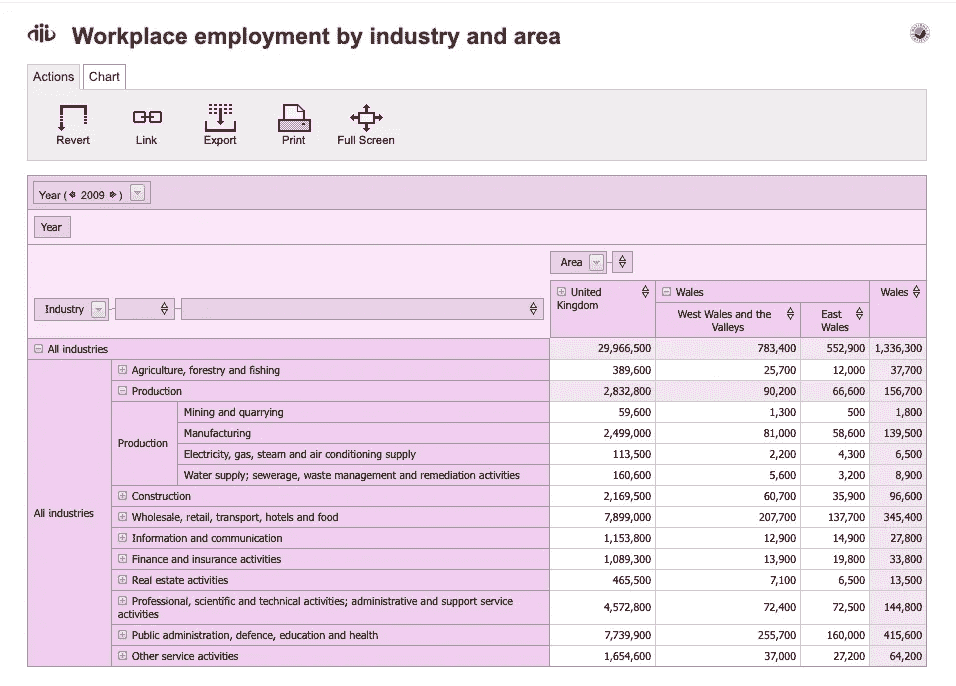
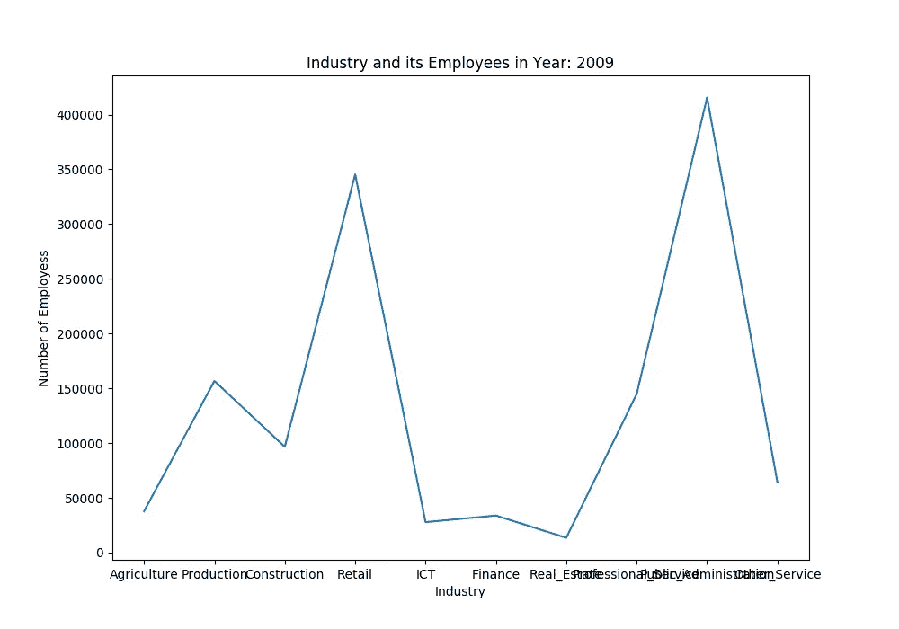
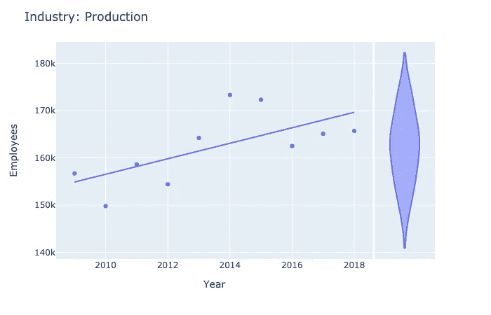
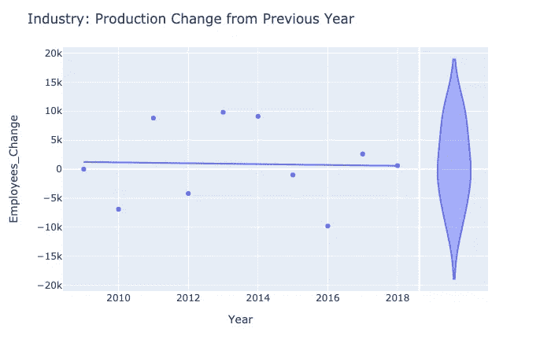
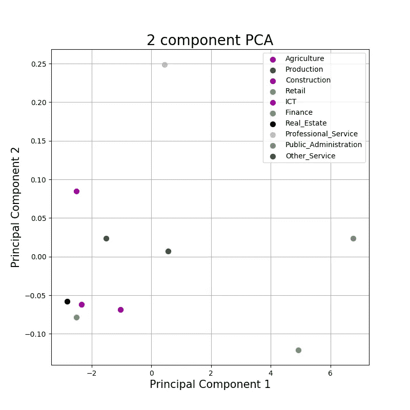
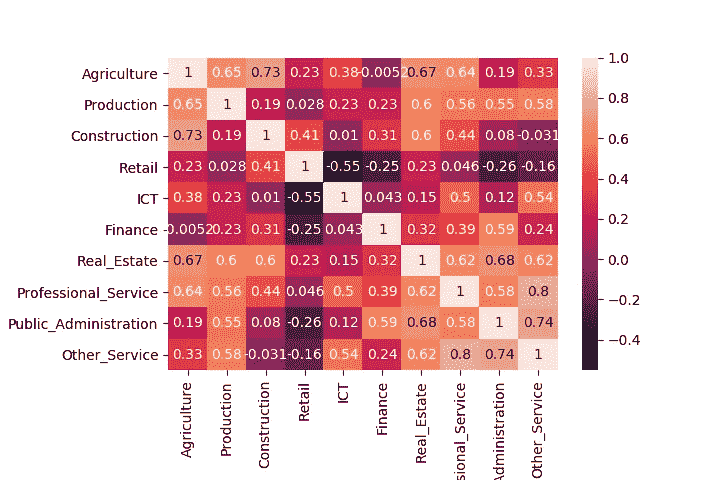
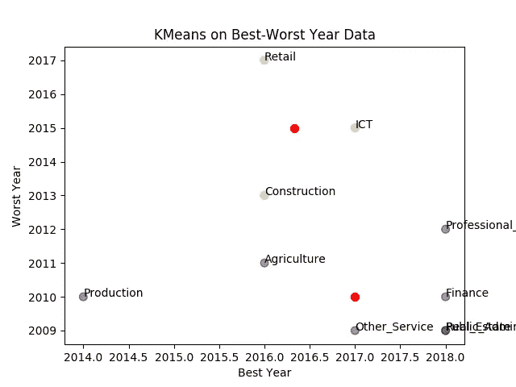
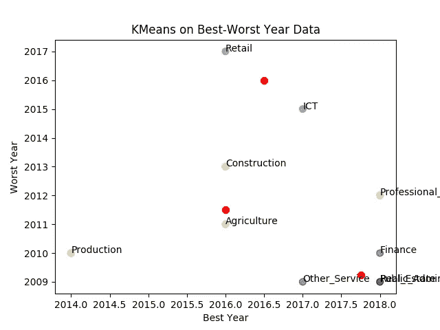
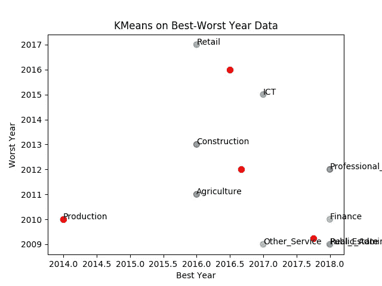

# 对执行基础数据分析的深入了解

> 原文：<https://towardsdatascience.com/an-insight-into-performing-fundamental-data-analysis-9c67c62e0766?source=collection_archive---------61----------------------->

## 通过威尔士就业形势了解基本数据分析

威尔士是一个美丽的国家，是英国的一部分。你可以在 https://en.wikipedia.org/wiki/Wales 了解更多。

可在[https://stats Wales . gov . Wales/Catalogue/Business-Economy-and-Labour-Market/People-and-Work/Employment/Jobs/Whole-Labour/Work place Employment-by-industry-area](https://statswales.gov.wales/Catalogue/Business-Economy-and-Labour-Market/People-and-Work/Employment/Jobs/Whole-Workforce/workplaceemployment-by-industry-area)查阅按行业分列的威尔士工作场所就业情况。这就是我们将从中抓取数据集的地方。为了理解数据分析的基本原理，让我们考虑 10 年的就业数据，即 2009 年至 2018 年期间。

收集了 10 个行业的数据。这些行业是 ***农业、生产、建筑、零售、信息和通信技术、金融、房地产、专业服务、公共管理*** ，所有其他部门和服务都归入 ***其他 _ 服务*** 。

我们将使用 Python 来完成任务和以下包:

1.  熊猫
2.  Matplotlib
3.  Sklearn
4.  海生的
5.  Plotly



图 1:就业数据在网站上看起来是这样的(图片:截图[https://stats Wales . gov . Wales/Catalogue/Business-Economy-and-Labour-Market/People-and-Work/Employment/Jobs/Whole-Work force/Work place 就业-行业-领域](https://statswales.gov.wales/Catalogue/Business-Economy-and-Labour-Market/People-and-Work/Employment/Jobs/Whole-Workforce/workplaceemployment-by-industry-area)

***第一步***

第一步是下载数据集。打开[网页](https://statswales.gov.wales/Catalogue/Business-Economy-and-Labour-Market/People-and-Work/Employment/Jobs/Whole-Workforce/workplaceemployment-by-industry-area)，点击左上方下拉框中的 2009 年，点击导出为 CSV 文件。在 2018 年之前的所有年份重复同样的操作。这样，我们将在同一个文件夹中存储 10 个 CSV 文件。

***第二步***

下一步是用 python 创建一个数据框，我们可以用它做进一步的工作。

```
*def data_extraction():
 list_values=[]
 for year in range(start_year,end_year):
  file_name_part1="export_"
  file_name_part2=year
  file_name_part2=str(file_name_part2)
  file_name=file_name_part1+file_name_part2+".csv"
  with open(file_name) as csv_file:
   csv_reader = csv.reader(csv_file, delimiter=',')
   line_count = 0
   for row in csv_reader:
    if(line_count<=2):
     line_count=line_count+1
    elif(line_count<=12):
     list_values.append(row[5])
     line_count=line_count+1
   print("Extracted the data for year: "+file_name_part2)
   flag=0
   for check_null in list_values:
    if(check_null==""):
     flag=1
   if(flag==0):
    print("No Null Value Found for the year: "+str(year))
   else:
    print("!!!NULL FOUND!!!")
   all_years[file_name_part2]=list_values
   list_values=[]*
```

函数 *data_extraction()* 将是我们要编写的第一个函数，它将从每个 CSV 文件中提取所需的数据，并将其存储在一个 list "***list _ values***"中，然后将其存储在一个 dictionary "***all _ years***"中。这是我们将从中创建数据框架的字典。该函数还检查数据中的任何空值。在运行代码时，我们可以发现没有空值，因此此时我们不必担心处理空值。(*附言那是自己的话题*)

```
*def create_dataframe():
 df=pd.DataFrame(all_years,index=['Agriculture','Production','Construction','Retail','ICT','Finance','Real_Estate','Professional_Service','Public_Administration','Other_Service'])
 return df*
```

函数 *create_dataframe()* 应使用字典**“all _ years”**并创建数据帧**“df”**。

***第三步***

现在让我们考虑一个特定的年份，比如说 2009 年，然后通过绘制简单的折线图来看看每个行业的雇员人数。然后，我们将对其进行循环，以获得 2009 年至 2018 年期间每年的类似图表。

```
*def data_analysis_1(df):
 for year in range(start_year,end_year): #start year is 2009 and end year is 2019
  plt.figure(figsize=(10,7))
  df.reset_index()
  plt.plot(df[str(year)])
  plt.xlabel('Industry',fontsize=10)
  plt.ylabel('Number of Employess')
  plt.title("Industry and its Employees in Year: "+str(year))
  plt.show()*
```



图 2:2009 年的地图(图片由作者提供)

这种图表的优点是，我们可以直观地识别哪个行业在就业人数方面表现最好和最差。

例如，当我们查看 2009 年的图表时(检查"*图 2* ")，一个非常容易的推断是"公共管理"行业在 2009 年雇用了最多的人，而"房地产"在 2009 年雇用了最少的人。

另一个推论是，“信息和通信技术、金融和房地产”的雇员人数接近相等，“公共行政和零售部门”的雇员人数接近相等。

***第四步***

现在，让我们来看看在 2009 年至 2018 年期间，哪些行业的总体增长率 最高和最低 ***。***

```
*def data_analysis_3(df):
 indsutry_list=['Agriculture','Production','Construction','Retail','ICT','Finance','Real_Estate','Professional_Service','Public_Administration','Other_Service']
 for industry_name in indsutry_list:
  ind=df.loc[str(industry_name)]
  year_2009 = ind[0]
  year_2018 = ind[9]
  percentage = ((year_2018 - year_2009) / year_2009)*100
  print("Percentage Overall Growth of "+industry_name+" is: "+str(percentage))*
```

这个函数的输出告诉我们，就就业人数而言，房地产部门的总体增长是惊人的 86.67%。另一方面，总体增长最低的是零售业，就就业人数而言，10 年间仅增长 0.6%。

到目前为止，我们已经了解了如何提取数据、创建数据框、查找是否有空值、绘制几个折线图以查找每年表现最佳和最差的行业，以及我们发现哪些行业在 2009 年至 2018 年期间的总体增长率最高和最低。

现在，我们将向前迈进一步，尝试对威尔士的就业形势有更深入的了解。

***第五步***

我们现在将使用[*【Plotly】*](https://plotly.com/)创建动态散点图，以显示一段时间内劳动力数量的变化。让我们看看实际的情节来更好地理解这一点。

```
*def data_visualise_plotly(df):
 indsutry_list=['Agriculture','Production','Construction','Retail','ICT','Finance','Real_Estate','Professional_Service','Public_Administration','Other_Service']
 #Function to plot using plotly for analysing employee change in each sector over the time period
 for industry_name in indsutry_list:
  agriculture=df.loc[industry_name]
  year_list=[]
  value_list=[]
  for year in range(start_year,end_year):
   year_list.append(year)
   value_list.append(agriculture[str(year)])
  print(year_list)
  print(value_list)
  new_df=pd.DataFrame(list(zip(year_list,value_list)),columns=["Year","Employees"])
  print(new_df)
  fig=px.scatter(new_df, x="Year", y="Employees", marginal_y="violin", trendline="ols")
  title_for_plot = "Industry: "+industry_name
  fig.update_layout(title=title_for_plot)
  fig.show()
  value_change_list=[]
  prev=0.0
  current=0.0
  for v in value_list:
   current=v
   value_change_list.append(current-prev)
   prev=current
  value_change_list[0]=0.0
  print(value_change_list)
  new_df=pd.DataFrame(list(zip(year_list,value_change_list)),columns=["Year","Employees_Change"])
  print(new_df)
  fig=px.scatter(new_df, x="Year", y="Employees_Change", marginal_y="violin", trendline="ols")
  title_for_plot = "Industry: "+industry_name+" Change from Previous Year"
  fig.update_layout(title=title_for_plot)
  fig.show()*
```

上述函数产生所需的图。这些图将在带有本地 IP 的默认浏览器中打开。



图 3:左边的图是“生产”行业每年的就业人数。右边的图表显示了与前一年相比，每年的数字变化。(图片由作者提供)

在图 3 的第一个图中，我们绘制了*【生产】*行业每年的就业人数。在第二张图中，我们看到了这些数字相对于各自前一年数字的变化。让我们更好地理解这一点。

参见图 3 的第二个图。2009 年的值始终为 0，因为它是考虑时间范围的开始。从那以后，当前 x 轴值的 y 轴上的每个值都表示相对于其先前 x 轴的 y 轴值的数字变化。

我们可以注意到一条穿过图表的线。这条线就是 ***OLS(普通最小二乘法)回归线*** 。你可以在这里了解更多关于普通最小二乘[的知识。这基本上是一条线性回归线，对我们了解数据趋势非常有帮助。例如，在图 3 的第一个图中，回归线显示出增长的趋势，这意味着 2019 年、2020 年等更有可能..在 2009-2018 年将有更多的就业机会。](https://en.wikipedia.org/wiki/Ordinary_least_squares)

但这是一个十亿美元的问题。如果第一个图显示增长趋势，那么为什么图 3 的第二个图显示中性趋势(水平直线)(即变化保持不变)。

啊啊啊……..耐人寻味吧。

图 3 的第二个图类似于第一个图的衍生物。中性趋势表明，在 2009 年至 2018 年期间，这一变化平均保持不变。为了得到这个十亿美元问题的答案，考虑一个每年有+2000 名员工变动的行业“X”。即每年就业人数增加 2000 人。这意味着图 3 的第一个图必须显示增加的趋势。但是由于变化在我们想象的场景中保持不变，第二个图将有一条中性趋势线。即中性趋势线表示变化是恒定的。

假设，行业“Y”在 2009-2010 年间的变化为+2000，在 2010-2011 年间的变化为+3000，在 2011-2012 年间的变化为+4000，依此类推..那么第二个图中的趋势线将是线性增长趋势。

在图 3 中，每个图的右侧还有 violin 图。这些图给了我们最大-最小值，也显示了(用一个凸起)在哪个范围内找到了最大数量的数据点。凸起区域表示更多数量的数据点位于该区域。

***第六步***

该进行主成分分析了。第一个问题是为什么？让我们把每一年看作一个维度。这意味着我们的数据现在是“10 维”的。但是你真的认为我们可以想象和理解一个 10 维的图形吗？普通人能够想象和理解的最大维度是“三维”。为了简单起见，我们使用主成分分析将我们的 10 维数据集减少到 2 或 3 维数据集，这样我们就很容易可视化和理解数据。这就是统计中的降维。

```
*def pca(df):
 print(df)
 indsutry_list=['Agriculture','Production','Construction','Retail','ICT','Finance','Real_Estate','Professional_Service','Public_Administration','Other_Service']
 df['Industry']=indsutry_list
 print(df)
 features_for_pca=['2009','2010','2011','2012','2013','2014','2015','2016','2017','2018']
 x = df.loc[:,features_for_pca].values
 y = df.loc[:,['Industry']].values
 x = StandardScaler().fit_transform(x)
 print("Scaling of Values done")
 print(x)
 pca = PCA(n_components=2)
 principalComponents = pca.fit_transform(x)
 principalDf = pd.DataFrame(data = principalComponents, columns = ['principal component 1', 'principal component 2'],index=indsutry_list)
 print("The Principal Components are as follows")
 #print(principalDf)
 finalDf = pd.concat([principalDf, df[['Industry']]], axis = 1)
 print(finalDf)
 print("Trying a 2D Plot")
 fig = plt.figure(figsize = (8,8))
 ax = fig.add_subplot(1,1,1) 
 ax.set_xlabel('Principal Component 1', fontsize = 15)
 ax.set_ylabel('Principal Component 2', fontsize = 15)
 ax.set_title('2 component PCA', fontsize = 20)
 indsutry_list = ['Agriculture','Production','Construction','Retail','ICT','Finance','Real_Estate','Professional_Service','Public_Administration','Other_Service']
 colors = ['r','g','b','c','m','y','k','0.75','0.5','0.3']
 for industry,color in zip(indsutry_list,colors):
  indicesToKeep = finalDf['Industry'] == industry
  ax.scatter(finalDf.loc[indicesToKeep, 'principal component 1']
               , finalDf.loc[indicesToKeep, 'principal component 2']
               , c = color
               , s = 50)
 ax.legend(indsutry_list)
 ax.grid()
 plt.show()*
```

通过这段代码，我们将 10 维数据集缩减为 2 维数据集。



图 4:双组分五氯苯甲醚(图片由作者提供)

当我们绘制新创建的二维数据集时(图 4)，我们可以发现有几个行业自然地聚集在一起。例如，一个非常明显的群集是图左下方的红色、黄色、蓝色和黑色点，分别对应于农业、金融、建筑和房地产行业。

聚类表明，在 2009 年至 2018 年期间，它们之间的相关性更强。这意味着，一个集群内各行业就业人数的变化趋势几乎是相似的。我们可以自然地观察到，四个集群正在出现，有趣的是，专业服务行业是集群中唯一的行业。

> **但是它们真的相关吗？**

到目前为止，我们使用 Plotly 创建动态图，并使用主成分分析技术来减少数据集中的维数。我们最后问了一个问题"*, PCA 图中发现的集群内的行业是否真的相关？*”。让我们回到这个问题上来。

***第七步***

我们现在要做的是找出 2009 年至 2018 年期间各行业之间的相关性。任何两个实体之间的相关性可以在-1 和 1 之间变化，其中-1 是可能的最小值，表示行业高度“不相关/负相关”，最大值+1 表示行业高度“相关”。它可以取-1 到+1 之间的任何值。好吧，在我们的语境中，两个行业*相关/负相关*到底意味着什么？让我们不要忘记，我们正在处理这里的就业数字。这意味着如果两个行业高度相关，那么就业人数的变化趋势是相似的。也就是说，为了理解这一点，让我们再次假设两个行业 X 和 Y 的假想场景，并假设它们的相关值为+1。这意味着如果 X 中的雇员数量增加了 M 个百分点，那么 Y 中的雇员数量也很有可能增加 M 个百分点(理论上是 100%)。

既然我们已经理解了相关性的真正含义，那么让我们来看看数据集中每一对行业之间的相关性。

```
*def correlation_complete(df):
 print(df)
 print(df.transpose())
 corrMatrix = df.transpose().corr()
 print(corrMatrix)
 sn.heatmap(corrMatrix,annot=True)
 plt.show()*
```

这几行代码给了我们所谓的相关矩阵的热图。



图 5:关联热图(图片由作者提供)

我们可以从图 5 中推断出相关性*(除了值“1”，因为与自身的相关性，永远等于 1)* 的最大值是 0.8。这意味着专业服务和其他服务 80%相关。也就是说，专业服务部门就业人数的 M %的变化可能(80%的可能性)导致其他服务类别中所有子部门的 M %的变化。

这里有一个问题，如果您还记得我们在文章的前一部分中说过，在 PCA 图中有 4 个自然发生的聚类，在其中一个聚类中，专业服务是唯一的成员。这意味着，根据我们在 PCA 图中所做的分析，专业服务和其他服务是不相关的(换句话说，它们不属于同一个集群)。但是在相关矩阵中，我们发现它们是 80%相关的，并且在任意两个行业之间具有最高的相关值。讽刺？我们哪里出错了？**暂停阅读这篇文章，思考几分钟，看看我们的分析可能出了什么问题。**

得到答案了吗？没问题，我是来帮你的。在主成分分析中，我们进行了降维。主成分 1 和 2 是 10 个维度的代表。但是这两个主要组成部分对我们来说并不具有同等的价值。为了理解这一点，考虑一个公司 X，其中有两个股东 A 和 B(这两个股东是主成分 1 和 2)。假设 A 持有 X 公司 75%的股份，而 B 只持有 25%的股份。现在告诉我，如果 A 必须在公司做出决定，B 的意见真的重要吗？没有权利。a 有完全的权力为公司做决定。同样，我们需要找出两个主成分 1 和 2 的价值是多少。

```
*print(pca.explained_variance_ratio_)*
```

通过这一行代码，我们可以得到主成分的变化。瞧啊。输出是

```
[0.99808273 0.00102919]
```

看见了吗？这表明第一主成分 PC1 占变异的 99.8%，而第二主成分 PC2 仅占~0.1%。如果我们将主成分的数量增加到 3(即，如果我们想要我们的数据集中的三维)，第三个主成分，PC3 将具有比 PC2 更小的值。

现在事情似乎已经水落石出了。我们可以看到，PC1 提供了 99.8%的行业信息，而 PC2 仅提供了 0.1%的信息。我们实际需要绘制的只是 PC1，而不是 PC2。

> 向上滚动到 PCA 图，想象折叠 y 轴。也就是说，假设所有东西的“y 值”都只有 0。(换句话说，将所有点投影到 x 轴上)。现在将只出现两个集群，一个在右边有两个点，一个在左边有所有其他的点。这告诉我们，我们现在需要从 PCA 图向前迈进，因为它们没有给我们提供太多关于行业之间关系的信息。

***第八步***

我们现在来看看 K-Means 聚类技术，看看它是否能提供比简单 PCA 图更好的结果。

但是有个问题。我们无法处理 10 个维度。但是主成分分析的降维技术在这个基本分析中并不那么有效。还有其他几种降维技术可用，但为了简单起见，我们要做的是找出每个行业表现最好和最差的年份，并创建一个类似这样的数据框架。

```
 best  worst0  2016   2011
1  2014   2010
2  2016   2013
3  2016   2017
4  2017   2015
5  2018   2010
6  2018   2009
7  2018   2012
8  2018   2009
9  2017   2009
```

这样，我就把它变成了一个二维数据集。假设 k 值为 2。即要求簇的数量为 2。

```
*def best_worst_df(df):
 indsutry_list=['Agriculture','Production','Construction','Retail','ICT','Finance','Real_Estate','Professional_Service','Public_Administration','Other_Service']
 for industry_name in indsutry_list:
  empl=df.loc[str(industry_name)]
  print(type(empl))
  test = list(empl)
  #print(test)
  empl_max_position = test.index(max(test))
  empl_min_position = test.index(min(test))
  print("Best Year for "+str(industry_name)+" is "+str(2009+empl_max_position))
  best_year.append(2009+empl_max_position)
  print("Worst Year for "+str(industry_name)+" is "+str(2009+empl_min_position))
  worst_year.append(2009+empl_min_position)
 Data = { 'best':best_year, 'worst':worst_year }
 kmeans_df = pd.DataFrame(Data,columns=['best','worst'])
 print(kmeans_df)
 #Creating the Kmeans graph
 kmeans =* ***KMeans(n_clusters=2)****.fit(kmeans_df)
 centroids = kmeans.cluster_centers_
 print(centroids)
 plt.scatter(kmeans_df['best'], kmeans_df['worst'], c= kmeans.labels_.astype(float), s=50, alpha=0.5)
 plt.scatter(centroids[:, 0], centroids[:, 1], c='red', s=50)
 ind = 0
 for i in indsutry_list:
  plt.text(best_year[ind],worst_year[ind],str(i))
  ind = ind + 1
 plt.xlabel('Best Year')
 plt.ylabel('Worst Year')
 plt.title('KMeans on Best-Worst Year Data')
 plt.show() #KMeans 2 and 3 clusters*
```

这给了我们以下情节。



图 6:双均值聚类技术(图片由作者提供)

在图 6 中，我们可以看到我们的问题在一定程度上得到了解决。专业服务和其他服务现在位于一个集群中(紫色集群)。但是我们不会就此停止，而是将集群的数量增加到 3 个，然后再增加到 4 个。



图 7: 3 均值聚类(图片由作者提供)



图 8: 4 均值聚类(图片由作者提供)

我们可以看到，4-均值似乎有点过拟合数据，2-均值似乎有点欠拟合数据。3-Means 似乎是最优的。也就是说，这些行业可以分为 3 个集群。

是的，我们已经接近了解威尔士就业形势的基本数据分析这篇文章的结尾。最后，我们必须明白我们为什么要做这一切？这种数据分析的目的是什么？

任何数据分析的主要目的都是情报。它可以是商业智能或环境智能(来自环境数据)或任何其他智能。这有助于决策者做出更好的决策。让我们通过一个简单的场景来理解。想象一下这样一种情况，在威尔士，建筑业突然大量裁员。现在，由于数字很大，政府开始注意到这一点，并开始在这个严重的问题上采取行动。但是，政府现在也掌握了额外的信息，也就是说，在我们的数据分析的帮助下，他们现在知道，建筑行业的就业人数趋势与农业部门有 73%的关联。因此，政府现在可以对建筑行业的裁员采取行动，并采取预防措施，以防止农业部门发生任何此类不幸事件。这种预防性措施可以通过防止任何严重的经济影响，对一个国家的经济产生巨大影响。这只是理解数据力量的一个简单场景。

到目前为止，我们所做的分析只是沧海一粟。数据中隐藏着如此多的信息，如果使用得当，它们是这个时代最强大的资产之一。

***感谢您的宝贵时间！如果你喜欢这个故事，一定要和你的朋友分享。***

***你可以关注我的***[***LinkedIn***](https://www.linkedin.com/in/arunprasad98/)***。再次感谢您！***