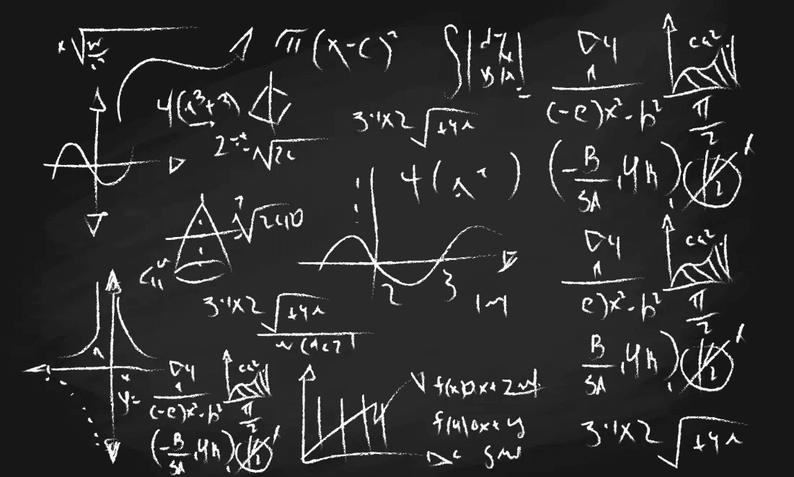
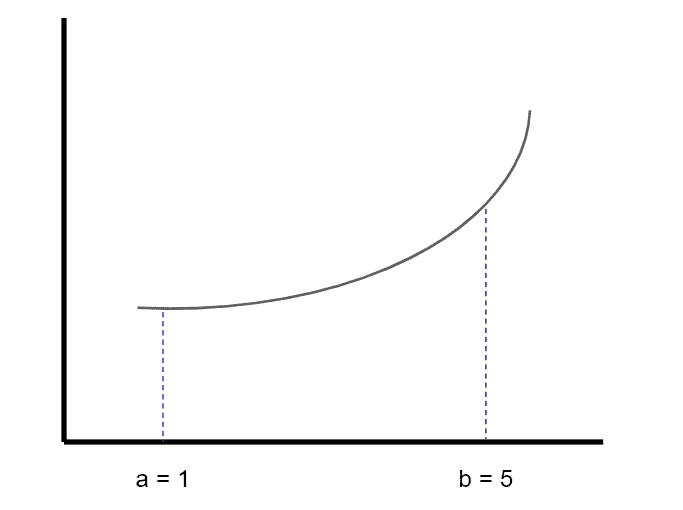
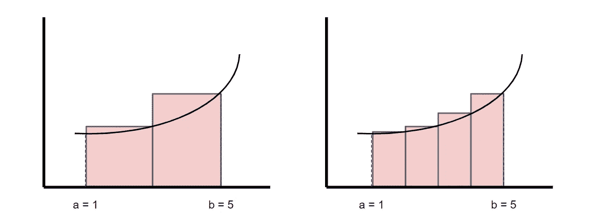
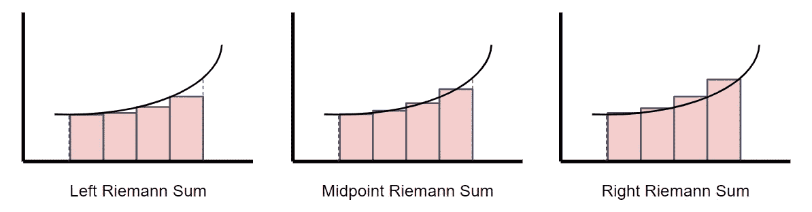
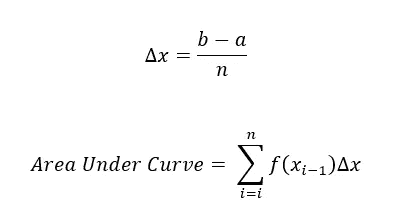
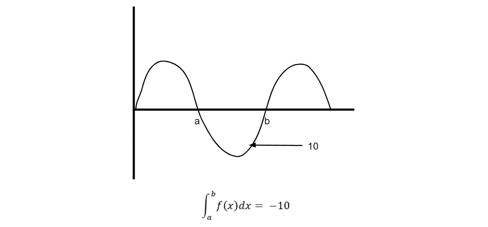
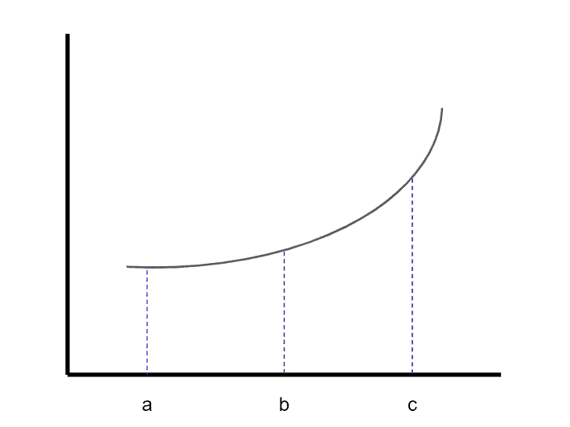
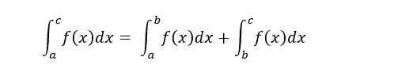
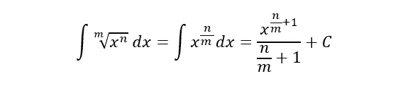
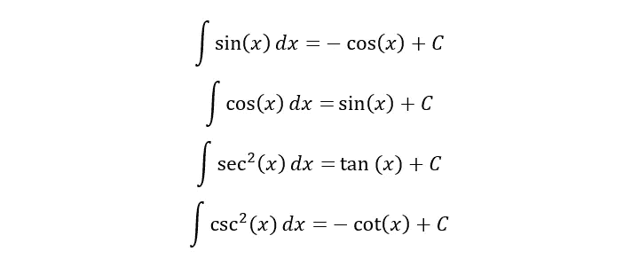

# 积分速成班

> 原文：<https://towardsdatascience.com/an-integrals-crash-course-for-data-science-cf6e6dd7c046?source=collection_archive---------11----------------------->

## 理解概率分布的基本构件

由 freepik 创建的背景向量—[www.freepik.com](http://www.freepik.com)

# 目录

1.  为什么你应该知道积分
2.  用黎曼和逼近曲线下的面积
3.  定积分作为黎曼和的极限
4.  微积分基本定理
5.  定积分的性质

# 为什么你应该知道积分

“数据科学”是一个非常宽泛的术语。它包括数据可视化、数据分析、数据工程、数据建模等等。在你更关注数据可视化和数据分析的情况下，积分可能是不必要的。

然而，对于那些想进入预测建模和假设测试的人来说，积分是成为数据科学家的基础。**如果你打算更详细地学习统计和概率分布，了解积分的基础知识将会非常有用。**

在这篇文章结束时，你将理解积分的基本概念，积分的基本性质，以及知道一些有用的反导数。

# 用黎曼和逼近曲线下的面积

想象一下，我们想要找到两点 a 和 b 之间的曲线下的面积。我们可以做的一个方法是**使用矩形近似**曲线下的面积。

注意，我们用越多的矩形来近似曲线下的面积，近似就越精确。如果我们取右边四个矩形的面积，它将比左边两个矩形更接近曲线下的面积。

有 4 种主要方法可以使用黎曼和，但我们将专注于左黎曼和、右黎曼和以及中点黎曼和。这三者之间的区别在于，它们只是确定每个矩形的高度(y 值)。

因为中点黎曼和是最精确的，所以它比左或右黎曼和更受青睐。你需要知道两个等式:

Delta x 告诉我们每个矩形的宽度应该是多少。然后，我们使用下一个等式来合计每个矩形的面积。简单！

# 定积分作为黎曼和的极限

正如我之前提到的，注意当你用更多的矩形来逼近曲线下的区域时，面积的逼近会变得更好。理论上，如果你使用无限数量的矩形，你可以找到曲线下的精确面积。当 n(矩形的数量)接近无穷大时，我们可以把它写成一个极限。

这个极限等价于定积分的方程，其写法如下:

既然你已经理解了定积分的含义，我们就来看看积分的基本原理。别担心，它们非常简单易懂，所以不要害怕。首先，我们将看看微积分的两个基本定理(这是积分有用的地方)，然后我们将看看积分的几个性质。

# 微积分基本定理

## 微积分第一基本定理

这基本上告诉我们，一旦找到方程的积分，如何计算曲线下的面积。

## 微积分第二基本定理

这个定理本质上意味着积分是反导数的，也就是说它与求导是相反的。它告诉我们积分和导数之间有联系。

# 定积分的性质

## 负定积分

曲线上方到 x 轴的面积为负。例如，如果你想得到上面函数在点 a 和 b 之间的积分，那么面积将等于**负**十而不是十。

## 单点上的定积分

单点 c 的积分等于零。这是有道理的，因为如果你仔细想想，一条线的面积是零！

## 函数的比例形式的定积分

常数乘以函数的积分等于常数乘以函数的积分。

## 交换边界的定积分

交换边界(a 和 b)的积分等于负积分。

## 函数和的定积分

f(x)加 g(x)的积分等于 f(x)加 g(x)的积分。

## 相邻区间上的定积分

a 点到 c 点的定积分等于 a 点到 b 点的积分和 b 点到 c 点的积分之和。

# 常见函数的积分

与您了解到 x 的导数是 2x，sin(x)的导数是 cos(x)类似，下面是在计算概率分布曲线下的面积时经常用到的常用函数的积分。

## 多项式的不定积分(逆幂法则)

以上是求多项式积分的概括。你可以通过事后求积分的导数来确认这一点！

## 根的不定积分

与上一点类似，上面的等式是根式积分的推广。

## 指数函数的不定积分

## 触发函数的不定积分

# 感谢阅读！

通过阅读，你应该知道积分背后的基本概念，以及基本积分需要的主要规则。同样，这对于那些想更好地理解概率分布的人来说非常有用。

## 特伦斯·申

*创始人*[*ShinTwin*](https://shintwin.com/)*|我们来连线一下*[*LinkedIn*](https://www.linkedin.com/in/terenceshin/)*|项目组合这里是***。**