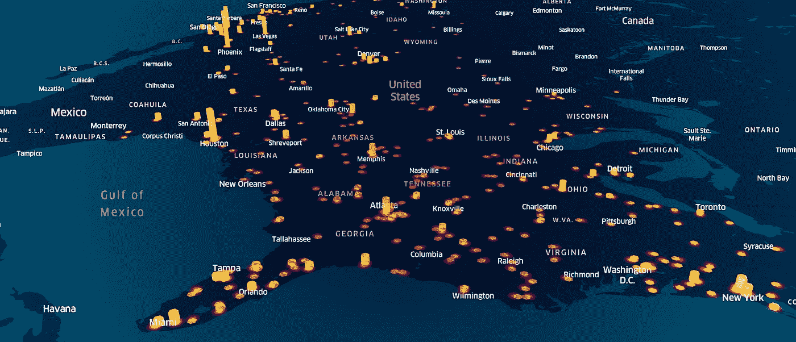
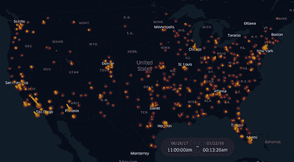
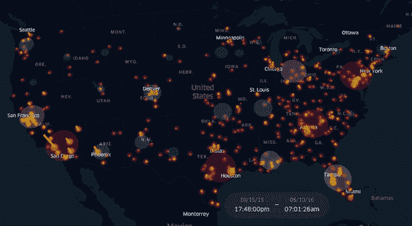
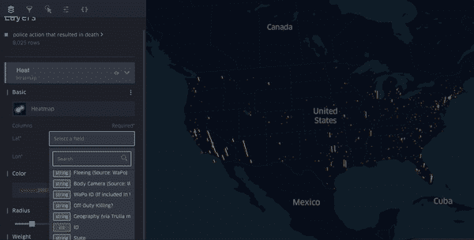

# 如何使用 Python 和 Kepler.gl 创建 3D 时间序列地图

> 原文：<https://towardsdatascience.com/an-interactive-3d-map-of-police-action-s-that-have-resulted-in-death-b9d7fbf81822?source=collection_archive---------31----------------------->



## 使用 Kepler.gl 可视化时序数据

随着抗议活动席卷美国，我想更好地了解警察和受害者之间的互动导致死亡的频率。这提供了一个很好的机会来测试优步的开普勒. gl 工具箱，并创建一个导致死亡的警察互动的互动 3D 地图。

在这篇文章中，我将谈论[地图](http://erikyan.com/police_interactions_resulting_in_death.html)，它做什么，以及我们如何与数据互动。我还将讨论创建过程以及如何轻松地制作交互式地理空间可视化(对于那些对这个项目的技术方面感兴趣的人)。

## **关于地图**

当你打开[地图](http://erikyan.com/police_interactions_resulting_in_death.html)时，你会注意到一个带有播放/暂停按钮的时间序列滑块。可以点击播放按钮，将数据制作成动画，看看死亡人数是如何随时间变化的(范围从 2013 年 1 月到 2019 年 12 月)。



时间序列功能正在发挥作用。(图片由作者提供)

如果您单击>按钮(在页面的左上角)，您可以与数据交互以更改您在地图上看到的内容。例如，您可以:隐藏层，添加新层，根据变量(如种族、性别等)过滤数据。我添加了一个隐藏层，它基于地理空间半径可视化聚合数据。当图层可见时，您将看到计算的聚类:



启用聚类映射层的时间序列。(图片由作者提供)

我不会深入谈论你在地图界面内可以做的一切。在这里您可以随意查看地图的实时版本[并体验地图的功能/探索数据。](http://erikyan.com/police_interactions_resulting_in_death.html)

## 地图是如何制作的

让我们浏览一下创建此地图的过程。为此，我们利用[开放访问数据集](http://mappingpoliceviolence.org)和 [Kepler.gl](https://kepler.gl/) ，优步的开源地理空间分析工具。优步最近发布了一篇关于 Kepler.gl 的伟大文章，它是使用 React & Redux、Deck.gl 和 WebGL 构建的。

如果你使用过 Deck.gl，那么使用 Kepler.gl 就更容易了。Deck.gl 已经可以轻松创建基于 WebGL 的大型数据集可视化。Kepler.gl 提供了一个屏幕界面，您可以在其中快速配置数据可视化，从而进一步简化了这一过程。可以保存地图配置进行存档或直接编辑(如果您想要手动更改配置脚本)。

*你的数据集需要包括三个变量:*

1.  “日期时间”变量(用于启用时间序列功能)
2.  纬度变量(来自每个县的面形心)
3.  经度变量(来自每个县的多边形质心)

如果您已经有了一个日期变量，您将希望修改该变量，使其至少包含小时和分钟(即，将日期转换为日期时间格式)。目前，Kepler.gl 只能处理日期时间戳，而不仅仅是日期([见 Kepler.gl Github 第 78 期](https://github.com/keplergl/kepler.gl/issues/78))。

实现这一点的快速方法(如果日期列的格式为 mm/dd/yy):

```
kepler_mvp_df[‘datetime’] = kepler_mvp_df[‘datetime’].astype(str) + ‘ 0:00’
```

我们希望包括开普勒时间序列地图的经度和纬度信息，因为我们将使用每个面的质心作为每个不同区域/地区的中心经度和纬度，而不是为每个时间戳分配 geojson 形状。

我使用的警察交互数据集(参见数据集来源/有效性部分)包括街道地址、城市、州、邮政编码和郡信息。我们将按州县绘制数据，因为我们可以使用[国家气象局的 GIS](https://www.weather.gov/gis/Counties) 形状文件，使用每个县各自地理空间形状的质心提取每个县的中心经度和纬度。

我推荐使用 [geopandas](https://geopandas.org/) 来提取 shapefile 数据:

```
shapefile_data = gpd.read_file("c_03mr20.shp")
print(shapefile_data)shapfile_raw = pd.DataFrame()
shapfile_raw = shapfile_raw.append(shapefile_data)shapfile_raw
```

一旦提取了经度和纬度，我们只需使用州和县变量(这两个数据集中应该都有)将坐标字典与数据集合并。在这种情况下，我们将使用州缩写和县名来合并数据:

```
kepler_mvp_df = pd.merge(MVP_raw,merged_dict_df, on=[‘STATE’,’County’])
```

现在，我们准备将数据加载到 Kepler.gl 中，并开始创建我们的可视化！

## 为 Jupyter 笔记本设置 Kepler.gl:

使用 Kepler.gl 的方法有很多，对于这张地图，我使用了 Kepler.gl Jupyter 小部件。这种方法很有用，因为 Kepler.gl 加载在 Jupyter Notebook 的一个单元格中，允许您操作数据并将其直接加载到 Kepler 中，而不必在环境之间切换或传输数据集。

如果你没有 Jupyter 笔记本，我强烈推荐这个[教程](https://jupyter.readthedocs.io/en/latest/install.html)。安装开普勒最简单的方法是使用 pip:

```
pip install keplergl
```

我建议使用 pandas 将您的数据推送到数据框架中。在这种情况下，我们的数据集是在 Jupyter Notebook 中准备的，因此我们只需将数据集直接导入 Kepler Jupyter 小部件:

```
from keplergl import KeplerGlkepler_map = KeplerGl(height = 800, data={‘data_name_here’: dataset_df})kepler_map
```

在上面的代码片段中，我们正在导入开普勒小部件，指定窗口高度，并定义/导入数据集到小部件中。

一旦数据加载完毕，你就可以使用 Kepler.gl 内置界面根据自己的喜好配置地图视觉效果。



(图片由作者提供)

在这张地图中，一张热量图沿着 x 轴和 z 轴叠加，随着死亡密度的增加，热量密度从暗红色到黄色不等。地图的 3D 渲染允许我们利用 y 轴，使用黄线来显示热点图密度颜色的强度(看到热点中心的黄点并不能告诉您它相对于其他黄色热点的强度，因此六边形线可以帮助我们通过利用 y 轴更好地可视化热点密度)。

您的配置脚本将如下所示:

```
new_config = {'version': 'v1',
 'config': {'visState': {'filters': [{'dataId': ['police action that resulted in death'],
     'id': 'o7g4tr5v',
     'name': ['datetime'],
     'type': 'timeRange',
     'value': [1357006005000, 1374938411000],
     'enlarged': True,
     'plotType': 'histogram',
     'yAxis': None},
    {'dataId': ['police action that resulted in death'],
     'id': 'p34jx073r',
     'name': ["Victim's race"],
     'type': 'multiSelect',
     'value': [],
     'enlarged': False,
     'plotType': 'histogram',
     'yAxis': None}],
   'layers': [{'id': 'e136xu9',
     'type': 'heatmap',
     'config': {'dataId': 'police action that resulted in death',
      'label': 'Heat',
      'color': [231, 159, 213],
      'columns': {'lat': 'LAT', 'lng': 'LON'},
      'isVisible': True,
      'visConfig': {'opacity': 0.5,
       'colorRange': {'name': 'Global Warming',
        'type': 'sequential',
        'category': 'Uber',
        'colors': ['#5A1846',
         '#900C3F',
         '#C70039',
         '#E3611C',
         '#F1920E',
         '#FFC300']},
       'radius': 40},
      'hidden': False,
      'textLabel': [{'field': None,
        'color': [255, 255, 255],
        'size': 18,
        'offset': [0, 0],
        'anchor': 'start',
        'alignment': 'center'}]},
     'visualChannels': {'weightField': None, 'weightScale': 'linear'}},
    {'id': 'm9ia9z',
     'type': 'hexagon',
     'config': {'dataId': 'police action that resulted in death',
      'label': 'Hex',
      'color': [221, 178, 124],
      'columns': {'lat': 'LAT', 'lng': 'LON'},
      'isVisible': True,
      'visConfig': {'opacity': 0.4,
       'worldUnitSize': 8,
       'resolution': 8,
       'colorRange': {'name': 'Global Warming',
        'type': 'sequential',
        'category': 'Uber',
        'colors': ['#5A1846',
         '#900C3F',
         '#C70039',
         '#E3611C',
         '#F1920E',
         '#FFC300']},
       'coverage': 1,
       'sizeRange': [0, 500],
       'percentile': [0, 100],
       'elevationPercentile': [0, 100],
       'elevationScale': 40,
       'colorAggregation': 'count',
       'sizeAggregation': 'count',
       'enable3d': True},
      'hidden': False,
      'textLabel': [{'field': None,
        'color': [255, 255, 255],
        'size': 18,
        'offset': [0, 0],
        'anchor': 'start',
        'alignment': 'center'}]},
     'visualChannels': {'colorField': None,
      'colorScale': 'quantile',
      'sizeField': None,
      'sizeScale': 'linear'}},
    {'id': 'l2vlgiq',
     'type': 'cluster',
     'config': {'dataId': 'police action that resulted in death',
      'label': 'Cluster',
      'color': [23, 184, 190],
      'columns': {'lat': 'LAT', 'lng': 'LON'},
      'isVisible': True,
      'visConfig': {'opacity': 0.05,
       'clusterRadius': 110,
       'colorRange': {'name': 'Uber Viz Diverging 1.5',
        'type': 'diverging',
        'category': 'Uber',
        'colors': ['#00939C',
         '#5DBABF',
         '#BAE1E2',
         '#F8C0AA',
         '#DD7755',
         '#C22E00']},
       'radiusRange': [1, 40],
       'colorAggregation': 'count'},
      'hidden': False,
      'textLabel': [{'field': None,
        'color': [255, 255, 255],
        'size': 18,
        'offset': [0, 0],
        'anchor': 'start',
        'alignment': 'center'}]},
     'visualChannels': {'colorField': None, 'colorScale': 'quantize'}},
    {'id': 'ci0b6l',
     'type': 'point',
     'config': {'dataId': 'police action that resulted in death',
      'label': "Victim's Name",
      'color': [28, 27, 27],
      'columns': {'lat': 'LAT', 'lng': 'LON', 'altitude': None},
      'isVisible': False,
      'visConfig': {'radius': 0,
       'fixedRadius': False,
       'opacity': 0.8,
       'outline': False,
       'thickness': 0.5,
       'strokeColor': None,
       'colorRange': {'name': 'Global Warming',
        'type': 'sequential',
        'category': 'Uber',
        'colors': ['#5A1846',
         '#900C3F',
         '#C70039',
         '#E3611C',
         '#F1920E',
         '#FFC300']},
       'strokeColorRange': {'name': 'Global Warming',
        'type': 'sequential',
        'category': 'Uber',
        'colors': ['#5A1846',
         '#900C3F',
         '#C70039',
         '#E3611C',
         '#F1920E',
         '#FFC300']},
       'radiusRange': [0, 50],
       'filled': False},
      'hidden': False,
      'textLabel': [{'field': {'name': "Victim's name", 'type': 'string'},
        'color': [255, 255, 255],
        'size': 3,
        'offset': [0, 0],
        'anchor': 'start',
        'alignment': 'center'}]},
     'visualChannels': {'colorField': None,
      'colorScale': 'quantile',
      'strokeColorField': None,
      'strokeColorScale': 'quantile',
      'sizeField': None,
      'sizeScale': 'linear'}}],
   'interactionConfig': {'tooltip': {'fieldsToShow': {'police action that resulted in death': ["Victim's name",
       "Victim's age",
       "Victim's gender",
       "Victim's race",
       'URL of image of victim']},
     'enabled': True},
    'brush': {'size': 0.5, 'enabled': False},
    'geocoder': {'enabled': False},
    'coordinate': {'enabled': False}},
   'layerBlending': 'additive',
   'splitMaps': [],
   'animationConfig': {'currentTime': None, 'speed': 0.5}},
  'mapState': {'bearing': 12.35033335232777,
   'dragRotate': True,
   'latitude': 33.612636906131925,
   'longitude': -98.63889376921583,
   'pitch': 55.12552722162369,
   'zoom': 3.5734484899775754,
   'isSplit': False},
  'mapStyle': {'styleType': 'dark',
   'topLayerGroups': {},
   'visibleLayerGroups': {'label': True,
    'road': True,
    'border': True,
    'building': False,
    'water': True,
    'land': True,
    '3d building': False},
   'threeDBuildingColor': [9.665468314072013,
    17.18305478057247,
    31.1442867897876],
   'mapStyles': {}}}}
```

确保保存您的配置脚本以供将来参考(或者如果您想要手动更改您的配置脚本):

```
current_config = kepler_map.configcurrent_config
```

您也可以将地图导出为交互式 html 地图:

```
kepler_map.save_to_html(file_name=”kepler_map.html”)
```

请务必保留最终配置文件的副本。您可以使用配置文件在 Kepler Jupyter 小部件中重新加载地图视觉效果:

```
kepler_map = KeplerGl(height=800, data={‘data_name_here’: dataset_df}, config=current_config)kepler_map
```

或者，您也可以使用保存的配置文件快速重新创建交互式 html 地图:

```
kepler_map.save_to_html(data={‘data_name_here’: dataset_df}, config=config, file_name=”kepler_map.html”)
```

就是这样！创建一个交互式的 3D 地图没有比这更简单的了。

## 数据集来源/有效性:

我使用的数据集来自 mappingpoliceviolence.org，由萨缪尔·辛扬威和德雷·麦克森创建。我不能证明数据集的准确性或有效性，但数据集确实包含关于集合中列出的每个单独数据点的深层细节(如人口统计信息、地理信息和相关链接)。