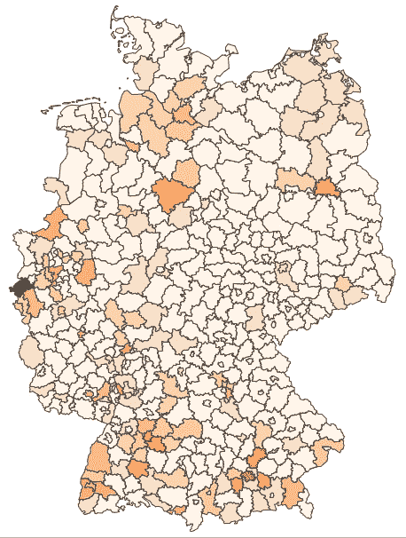
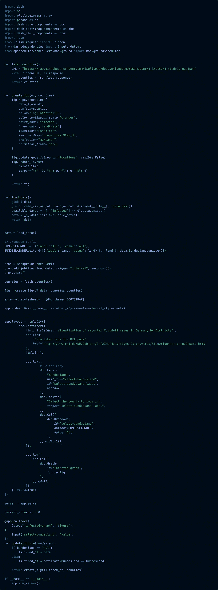
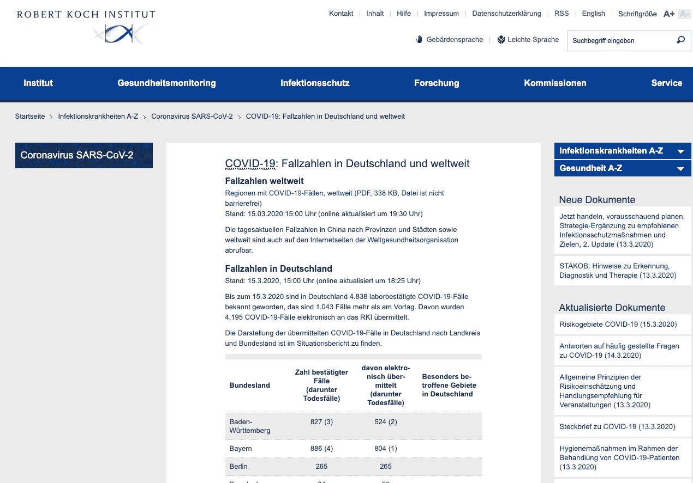
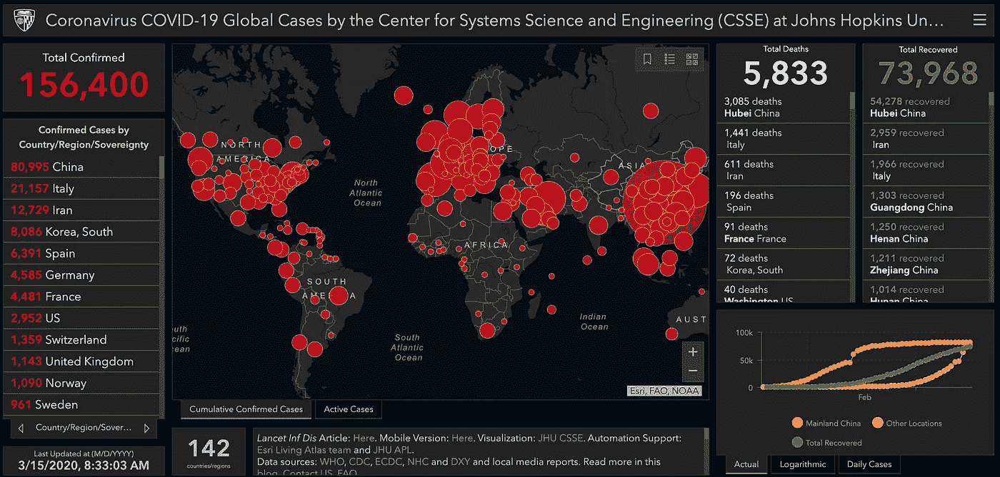
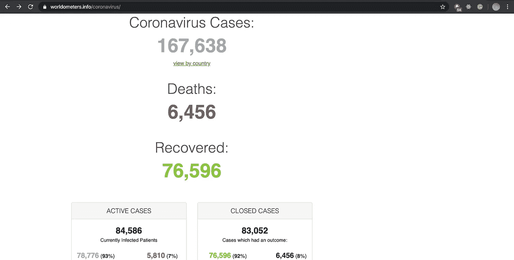

# 德国新冠肺炎发展的交互式可视化

> 原文：<https://towardsdatascience.com/an-interactive-visualization-of-the-covid-19-development-in-germany-2b87e50a5b3e?source=collection_archive---------12----------------------->

## 到目前为止，我还没有在德国的地区层面上找到一个很好的新冠肺炎发展的可视化，所以我决定建立一个。

2020 年 3 月 10 日至 3 月 15 日德国报告的新冠肺炎病例

## TL；博士:这里有一个 [**app**](https://corona.fabianbosler.de/) 的链接

**更新(25.03.2020):** 乍一看，我真的很惊讶德国和意大利是如此不同，于是我更深入地探讨了这个话题。如果你很好奇，可以看看。

 [## 为什么德国和意大利的新冠肺炎统计数据如此不同？

### 与义大利相比，德国似乎是一个新冠肺炎异常现象，感染率高，但死亡率低，分别为 0.4%和 9.5%…

towardsdatascience.com](/why-are-covid-19-statistics-so-different-for-germany-and-italy-ee5bf376f461) 

**原文:** 前几天去杂货店买东西，看到空空的货架。人们似乎紧张不安，比平时更加疏远。这让我感到略微不安，所以当我回到家，我决定稍微深入挖掘一下科罗纳周围的这种歇斯底里。

对我来说，第一步永远是获取数据。不幸的是，对于新冠肺炎来说，德国在地区一级的数据很少。总的来说，我觉得在进行测试的数量、报告的病例数量(在精确的地理位置级别)、进行测试的确切时间以及病例的其他属性(例如，性别、年龄和潜在的先决条件)方面，没有太多可用的数据。

此[可视化](https://corona.fabianbosler.de/)的预期用途是了解一段时间内地区层面的发展情况，并能够快速识别哪些县受到的影响过大或过小。我发现看到哪些地区受到了严重影响，以及与我居住的地区(慕尼黑)和我工作的地区(科隆)相比，这是非常有见地的。

为了获得德国地区层面的信息，我从罗伯特·科赫研究所(RKI)的每日报告中提取了数据:

*   [3 月 14 日](https://www.rki.de/DE/Content/InfAZ/N/Neuartiges_Coronavirus/Situationsberichte/2020-03-14-de.pdf?__blob=publicationFile)
*   3 月 13 日
*   [3 月 12 日](https://www.rki.de/DE/Content/InfAZ/N/Neuartiges_Coronavirus/Situationsberichte/2020-03-12-de.pdf?__blob=publicationFile)

我最初是手工合成数据的。我简单地想过训练一个光学字符识别模型，从报告中的地图中提取标签。然而，我决定反对，因为这将需要几天时间。

**更新(18 . 03 . 2020):** RKI 已经发布了一个[仪表板](https://experience.arcgis.com/experience/478220a4c454480e823b17327b2bf1d4/page/page_1/)，我每天早上都刮它来更新德国整个州的病例进展。

# 交互式可视化:

从 RKI 报告中搜集数据后，我开始使用 Plotly 构建一个 [Dash-app](https://plot.ly/dash/) 。您可以在此了解更多关于 Plotly 的信息:

 [## 了解如何使用 Python 创建漂亮而有洞察力的图表——快速、漂亮和…

### 数据显示，金钱可以买到幸福。用 Python 可视化的综合代码指南，解释了…

towardsdatascience.com](/plotting-with-python-c2561b8c0f1f) 

然后，我通过无服务器部署应用程序(利用 AWS-Lambda 和 AWS API Gateway)。这将在无人使用时最大限度地降低成本，并允许在传入流量意外激增时灵活扩展。

然而，这也伴随着所谓的冷启动问题。这意味着当应用程序休眠一段时间后，可能需要 20 秒才能启动。

在下面找到实际应用程序的代码。

代码[在这里](https://gist.github.com/FBosler/0c3e89ba8a4a5cc6d3765f257b669cd2)

# 后续步骤:

展望未来，随着数据的可用，我希望提供更多的总体信息，特别是关于管理的测试、测试结果以及该地区的人口，以便更真实地了解受感染人数。

我还会尝试每天更新地区级别的每日数据。不幸的是，每天大约需要 45 分钟。

# 来源:

## 罗伯特·科赫学院

RKI 是德国联邦政府机构和研究机构，负责疾病控制和预防。RKI 从地区卫生部和国家部委获取信息，如 [11 IfSG](https://www.gesetze-im-internet.de/ifsg/__11.html) 所述。

我通常会检查这个[页面](https://www.rki.de/DE/Content/InfAZ/N/Neuartiges_Coronavirus/Fallzahlen.html)并从那里获取它。

## Gisanddata

[Gisanddata](https://gisanddata.maps.arcgis.com/apps/opsdashboard/index.html#/bda7594740fd40299423467b48e9ecf6) 是一个非常好的仪表盘。它甚至引发了一个“ [UX 案例研究](https://docs.google.com/document/d/1rlcMNXX5GnjoFhPXtdjonBoMW53dcGRVX7Vm7xovbMU/edit)”如果你对这类东西感兴趣，可以去看看。

## 世界计量仪

[Worldometers](https://www.worldometers.info/coronavirus/) 是另一个全球仪表盘，带有一些额外的图表，允许在国家层面进行细分。我觉得这个数据比 Gisanddata 更新一点。

