# 图论导论

> 原文：<https://towardsdatascience.com/an-intro-to-graph-theory-centrality-measurements-and-networkx-1c2e580adf37?source=collection_archive---------13----------------------->

## 如何制作、理解和计算图形的性质

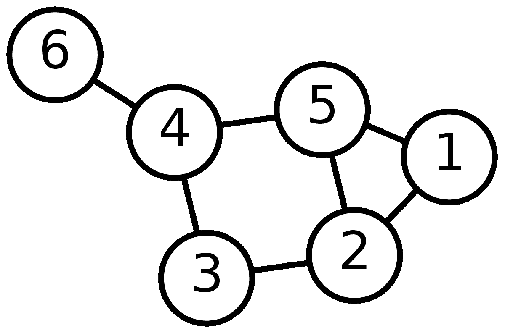

照片由[阿扎托斯](https://commons.wikimedia.org/wiki/User:AzaToth)拍摄

图论是对图形的研究，图形是用来模拟对象之间成对关系的数学结构。这些图由通常代表一个对象或一个人的节点(也称为点和顶点)和代表节点之间关系的边(也称为线或链接)组成。图在机器学习中有许多用途，所以这篇博客文章将研究如何制作图，关于图的一些关键测量和如何计算它们，以及如何使用 Python 的 NetworkX 包执行这些计算。

## 创建图表

用 NetworkX 包创建一个图形并不太难，只需确保它和 matplotlib 一起导入，以便您可以绘制它。

```
import networkx as nx
import matplotlib.pyplot as pltG = nx.Graph()
G.add_node('A')
nx.draw(G, with_labels=True)
plt.show()
```


单个节点的图

就像这样，你就有了一张图表！我们可以通过添加更多的节点和边来使这些图形变得更加复杂。

```
G = nx.Graph()
G.add_edge('A','B')
nx.draw(G, with_labels=True)
plt.show()
```

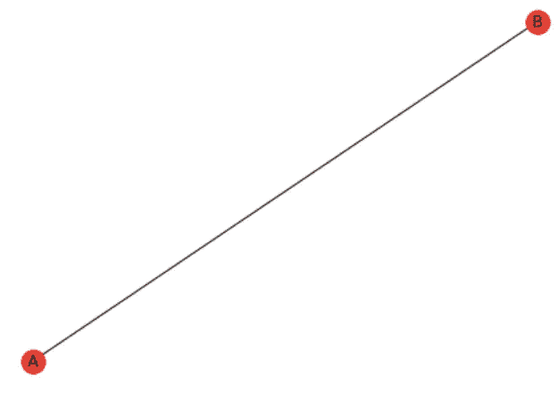

用无向边表示两个节点 A 和 B 的图。

添加边允许我们检查节点之间的关系。可以在[这里](https://networkx.github.io/documentation/stable/index.html)找到 NetworkX 包的完整概述。这里创建的边是一条无向边，这意味着节点 *A* 和 *B* 之间的关系是相等的。如果我们想做一个有方向的边呢？我们可以用有向图函数来实现。

```
G = nx.DiGraph()
G.add_edge('A','B')
nx.draw(G, with_labels=True)
plt.show() 
```

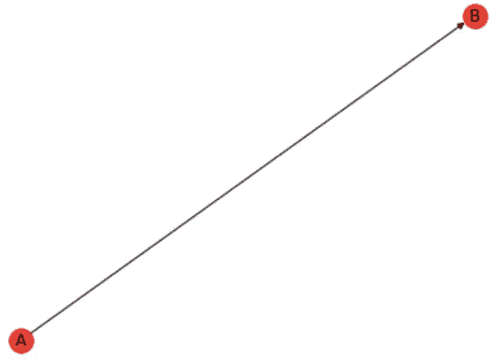

表示两个节点 A 和 B 的图，这两个节点有一条从 A 到 B 的有向边。

结果看起来像上面的图，除了现在边上有一个箭头，它向我们显示了边指向的方向。有向边可以代表现实世界中的许多事情，如社交媒体影响或传染病的传播。

虽然漂亮的图片看起来很有趣，但很难从中获得洞察力，特别是如果它们有大量的节点和边。幸运的是，我们可以对图表进行测量，这可以给我们提供有价值的信息。让我们画一个更复杂的图，这样我们可以更好地理解这些测量。

```
G = nx.Graph()
G.add_edge('A','B')
G.add_edge('A','C')
G.add_edge('A','D')
G.add_edge('B','C')
G.add_edge('B','E')
G.add_edge('B','F')
G.add_edge('C','E')
G.add_edge('C','D')
G.add_edge('C','F')
G.add_edge('E','F')
G.add_edge('D','G')
G.add_edge('F','G')
G.add_edge('G','H')
G.add_edge('G','I')
G.add_edge('H','J')
G.add_edge('H','K')
G.add_edge('H','L')
G.add_edge('J','M')
G.add_edge('J','N')
G.add_edge('J','O')
G.add_edge('J','K')
G.add_edge('J','L')
G.add_edge('M','N')
G.add_edge('M','L')
G.add_edge('N','O')
G.add_edge('O','P')
G.add_edge('P','Q')
nx.draw(G, with_labels=True)
plt.show()
```

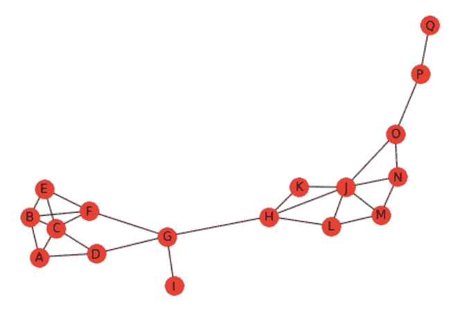

所创建图形的绘图

## 中心性测量

中心性测量给我们提供了关于图中节点重要性的信息。取决于节点的位置、它有多少个连接以及它连接到什么其他节点，它们可以对图有很大的影响。这里将看看一些更受欢迎的中心性测量和他们是如何计算的。

[度中心性](https://en.wikipedia.org/wiki/Degree_%28graph_theory%29)测量连接到一个节点的边的数量。它用于确定哪些节点连接最紧密。在有向图中，度中心性分为传入边的入度和传出边的出度。要计算一个节点的归一化度中心性，只需将连接到该节点的边数相加，然后除以节点总数减 1。在数学上，如果我们想找到节点 *x，*的度中心性，我们可以使用以下等式

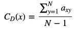

度中心性方程

其中 *N* 是图上节点的数量，而 *a* 具有 0 或 1 的值，这取决于节点 *x* 和 *y* 是否共享一条边。我们可以使用下面的代码来查找每个节点的度中心性度量。

```
for node in G.nodes():
    print(node, nx.degree_centrality(G)[node])
```

这给了我们结果

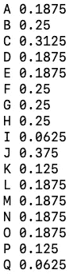

这表明节点 *J* 具有最大的度中心性。这很容易从视觉上验证，因为 *J* 的大多数边都与 6 连接。

[接近中心性](https://en.wikipedia.org/wiki/Closeness_centrality)测量从一个节点到任何其他节点的平均距离。一个节点越中心，它离所有其他节点就越近。节点的紧密度通常是指其归一化形式，由以下等式给出。


接近中心性方程

其中 *N* 是图上的节点数， *d(y，x)* 是顶点 *x* 和 *y* 之间的距离。在图论中，距离是最短路径中的边数。在大图中， *-1* 变得很小，所以通常会被丢弃。使用代码

```
for node in G.nodes():
    print(node, nx.closeness_centrality(G, node))
```

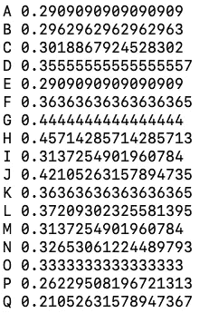

我们将节点 *H* 视为最高的接近中心性，这意味着它比所有其他节点更接近大多数节点。

[中间中心性](https://en.wikipedia.org/wiki/Betweenness_centrality):测量节点所在的最短路径的数量。这种中心性通常用于确定图中的信息流。数字越大，通过它的信息就越多。中间中心性可以用下面的等式来计算

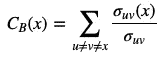

中间中心性

其中分母是顶点 *u* 和 *v* 之间的最短路径数，分子是顶点 *u* 和 *v* 之间经过顶点 *x* 的最短路径数。典型地，该测量被重新调整，并且通常通过将该值除以不包括 *x* 的对的数量来完成，留给我们 0 和 1 之间的最终值。对于有向图，值除以 *(N-1)(N-2)* ，对于无向图，值除以 *(N-1)(N-2)/2* 。用代码

```
for node in G.nodes(): 
    print(node, nx.betweenness_centrality(G)[node])
```

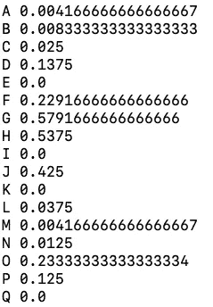

我们看到节点 *G* 在我们的图中具有最高的中间中心度，这意味着它位于最短的路径上。

[特征向量中心性](https://en.wikipedia.org/wiki/Eigenvector_centrality):测量节点在网络中的相对影响力，或者一个节点与其他高度连接的节点的连接程度。这是对“重要的不是你知道什么，而是你认识谁”这句话的数学度量。

计算特征向量的中心性比计算其他中心性稍微复杂一点(或者复杂很多)。数学上，特征向量的中心性是通过以下等式计算的

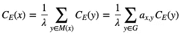

其中𝜆是计算的最大特征值， *M(x)* 是顶点 *x* 的一组邻居， *y* 是相邻顶点， *G* 是被求值的图。 *a* 根据 *x* 和 *y* 是否为邻居，取值为 0 或 1。这个表达式是特征向量方程的一个解

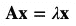

在这种情况下， **A** 是[邻接矩阵](https://en.wikipedia.org/wiki/Adjacency_matrix)，它本质上以矩阵形式计算节点之间的连接数量，𝜆是上面提到的特征值，而 **x** 是我们正在求解的特征向量。

当处理大型矩阵时，为了避免寻找大次数多项式的特征值解，通过迭代过程找到特征向量。这更清楚地解释了这个过程，让我们看一个简单的例子。让我们从下面的简单图表开始。

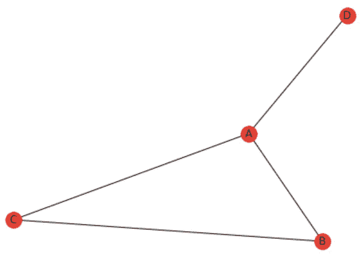

这里我们有 4 个节点 *A* 、 *B* 、 *C* 和 *D* ，它们之间有边( *A* 、 *B* )、( *A* 、 *C* )、( *A* 、 *D* )和( *B* )邻接矩阵看起来像

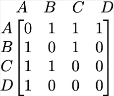

其中元素在行和列方向上排列为 *A* 、 *B* 、 *C* 和 *D* 。矩阵中的数字表示有多少条边连接每个节点。例如，左上角的数字是 0，因为有 0 条边将 *A* 连接到 *A* 。因为我们的图是没有方向的，所以我们的矩阵是对称的。

从这里开始，我们将这个矩阵乘以我们的初始向量，它只是一个 1 的向量。这给了我们结果

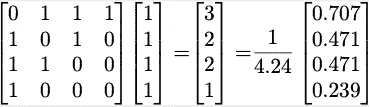

从这里开始，我们用归一化的向量代替初始向量，把它插回到方程中。重复这个过程给了我们

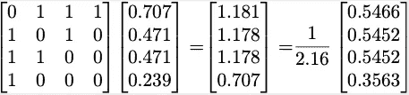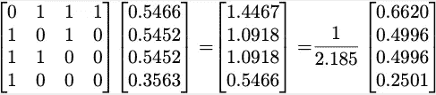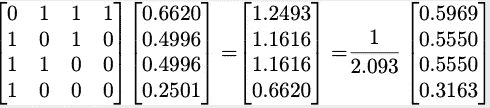

这个过程一直持续到特征向量收敛到稳定解。在这个例子中，最终的解决方案是

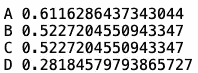

既然我们了解了这个过程是如何发生的，我们就可以计算原始图的特征值中心性了。我们可以用代码做到这一点

```
for node in G.nodes(): 
    print(node, nx.eigenvector_centrality(G, max_iter=1000)[node])
```

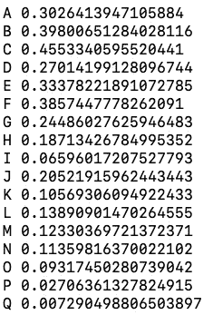

这表明节点 *C* 具有最大的特征向量中心性。有趣的是注意到所有四个中心性测量的最大值是在不同的节点上。

关于图和中心性度量还有很多要学的，我希望这篇文章能让你开始你的图之旅。

## 推荐读物

[](https://en.wikipedia.org/wiki/Graph_theory) [## 图论

### 在数学中，图论是对数学结构的研究，这些数学结构用于模拟成对关系…

en.wikipedia.org](https://en.wikipedia.org/wiki/Graph_theory)