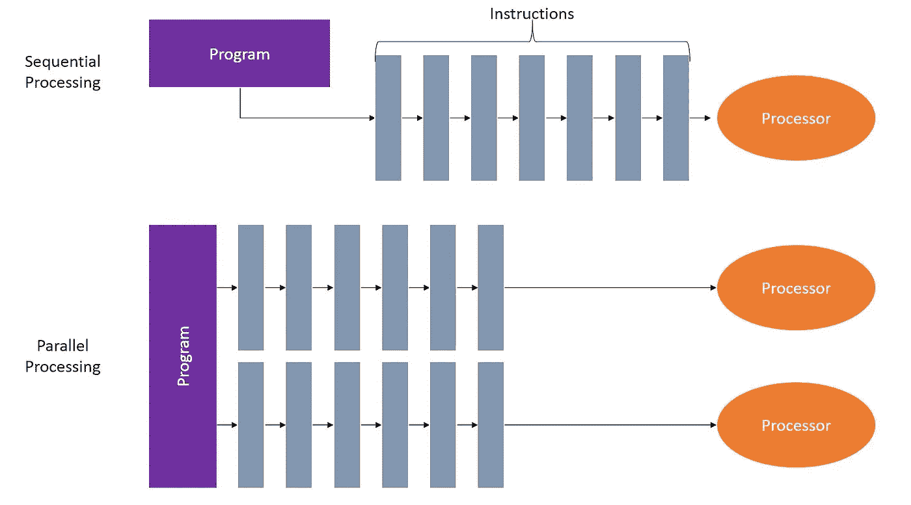

# Ray 并行计算简介

> 原文：<https://towardsdatascience.com/an-intro-to-parallel-computing-with-ray-d8503629485?source=collection_archive---------27----------------------->

## 学习强化学习库的基础知识


深度强化学习入门并不容易。

从不同的术语与监督学习或优化，到开发模拟，当然，还有可供选择的算法的字母汤以及需要摆弄的超参数的希腊字母汤，都有许多挑战。

此外，RL 往往极度渴求数据，需要数千甚至数百万次模拟来学习一个好的政策。即使您不介意直接阅读论文并自己实现算法，您也会发现优化算法和利用并行化对获得结果非常重要。

这就是[射线](https://ray.readthedocs.io/en/latest/index.html)的用武之地。Ray 自 2017 年以来一直存在，由[加州大学伯克利分校的 RISE 实验室](https://rise.cs.berkeley.edu/)开发，旨在为从业者和研究人员带来可扩展、可并行的强化学习，而无需自己实现模型。

在我们进入 RL 部分之前，让我们花一些时间了解一下 Ray 的基础知识，并展示我们如何使用它通过并行计算来加速我们的计算。

# TL；速度三角形定位法(dead reckoning)

我们介绍了 Ray，并展示了如何并行化几个不同的函数来提高函数库的性能。

# 射线的首次并行化

在我们进入全面的 RL 模型之前，我想看一些更简单的并行化示例，并解释该技术的一些好处。

通常，你用 Python 写的程序是串行完成的，即一步接一步。在许多应用程序中，这很好。然而，鉴于现代机器——无论是您的笔记本电脑还是 AWS 服务器——都有多个 CPU，您可以通过分解问题来利用这一点，这样它们就可以同时并行运行，从而获得巨大的速度提升！



这是许多机器学习算法的情况，尤其是强化学习，其中采用蒙特卡罗模拟来生成训练数据。这些模拟可以并行运行，并将轨迹发送回神经网络进行更新。这非常有用，可以大大加快你的训练速度。

# 并行化定时器

首先，我们需要使用`pip install ray`安装 Ray。需要注意的一点是，在撰写本文时，Ray 只能在 Linux 和 MacOs 机器上运行，并且只兼容 Python 3.5-3.7 ( [查看文档获取更新](https://ray.readthedocs.io/en/latest/installation.html))。如果你的机器不满足这些要求，那么你可以跳转到 [Google Colab](https://colab.research.google.com/drive/1QKD-vGI-pWTkO-C3TebKor8gsk14Gse2) 免费访问一个笔记本，在那里你可以运行这些代码。

让我们展示一个通过并行化实现加速的例子，从一个顺序程序开始，计时，然后转移到 Ray。在第一个例子中，我们将采用一个标准的计时示例来展示基本原理。

```
import time
import numpy as np
import ray
```

我们将定义一个定时器函数，它接受一个参数`x`，等待 1 秒，然后返回`x`。这是完全无用的，但将说明我们拥有的顺序与并行能力。

```
def timer(x):
    time.sleep(1)
    return x
```

现在，计时:

```
t0 = time.time()
values = [timer(x) for x in range(4)]
print('Time Elapsed:\t{:.4f}'.format(time.time() - t0))
print(values)Time Elapsed:	4.0043
[0, 1, 2, 3]
```

这个序列模型是我们的基线，它返回的正是我们所期望的。

在我们并行化之前，我们需要用`ray.init()`初始化 Ray，在这里我们可以设置 CPU 的数量。如果您不知道有什么可用的，只需运行以下命令:

```
ray.init()
ray.available_resources()['CPU']8.0
```

正如你在上面看到的，我的机器有 8 个 CPU，我可以用来并行处理我的进程。如果我在调用`ray.init`时没有传递一个特定的值，它将使用全部 8。我将用仅有的 4 个 CPU 重新初始化`ray`,这样每个 CPU 将独立处理一个对我们定时器函数的调用。注意，如果你像 Jupyter 一样从和 IDE 重新初始化 ray，你必须传递`ignore_reinit_error=True`参数，否则你会得到一个错误，或者你需要重启你的内核。

`ray.init(num_cpus=4, ignore_reinit_error=True)`

为了用 Ray 并行化我们的函数，我们只需要用`remote`来修饰它。

```
[@ray](http://twitter.com/ray).remote
def timer_ray(x):
    time.sleep(1)
    return x
```

运行与上面完全相同的代码，我们有:

```
t0 = time.time()
values = [timer_ray.remote(x) for x in range(4)]
print('Time Elapsed:\t{:.4f}'.format(time.time() - t0))
print(values)Time Elapsed:	0.0025
[ObjectID(7dec8564195ad979ffffffff010000c801000000), 
ObjectID(0bead116322a6c2bffffffff010000c801000000), 
ObjectID(b944ee5bb38dd1a5ffffffff010000c801000000), 
ObjectID(2a124e2070438a75ffffffff010000c801000000)]
```

希望上面的内容对你来说很奇怪。首先，经过的时间不是预期的 1 秒，其次，结果看起来像一堆胡言乱语。Ray 在这里所做的是测量创建要运行的对象 ID 所需的时间，而不是运行代码本身所需的时间。这就是我们在打印`values`列表时看到的:指向这些任务的对象 ID 列表。为了让 Ray 实际评估这些函数，我们需要调用`ray.get()`。

```
ray.get(values)[0, 1, 2, 3]
```

因此，为了获得所有这些的计时和预期结果，我们将把我们的列表包装在`ray.get()`函数中，然后再试一次。

```
t0 = time.time()
values = ray.get([timer_ray.remote(x) for x in range(4)])
print('Time Elapsed:\t{:.4f}'.format(time.time() - t0))
print(values)Time Elapsed:	1.0106
[0, 1, 2, 3]
```

现在我们得到了预期的输出！

让我们来看一个更有用的例子，展示我们如何在实际计算中利用这一点。

# 平行移动平均线

有许多财务测量和策略需要计算移动平均线。有时你需要一个简单的 90 天移动平均线，有时需要 10 天或其他值。如果你只需要处理几个时间序列，这并不坏。但是，通常情况下，您可能需要定期计算数千种不同证券的简单移动平均线。如果是这种情况，我们可以利用并行化并获得巨大的收益。

让我们从生成 1000 个不同的随机时间序列开始，来展示这是如何工作的。

```
data = np.random.normal(size=(1000, 1000))
```

从这里开始，我们将实现一个连续的简单移动平均计算，返回 10 天的移动平均。如果可用的数据太少(例如前 9 个数据点),它只会给出这些天的移动平均值。

下面的函数将给出我们想要的结果。

```
def calc_moving_average(data, window=10):
    ma_data = np.zeros(data.shape)
    for i, row in enumerate(data):
        ma_data[i] = np.array(
            [np.mean(row[j-window:j+1]) 
             if j > window else np.mean(row[:j+1]) 
             for j, _ in enumerate(row)])        
    return ma_data
```

我们的`calc_moving_average`函数获取每个单独的时间序列(在我们的数据中用一行表示)，然后返回每一步的移动平均值。如果你画出这个，它会显示一个平滑的值。

我们将像上面的例子一样计时。

```
t0 = time.time()
ma_data = calc_moving_average(data)
seq_time = time.time() - t0
print('Time Elapsed:\t{:.4f}'.format(seq_time))Time Elapsed:	7.9067
```

计算这一过程花费了将近 8 秒钟。让我们看看是否可以通过在函数上使用我们的`@ray.remote`装饰器来做得更好。

```
[@ray](http://twitter.com/ray).remote
def calc_moving_average_ray(data, window=10):
    ma_data = np.zeros(data.shape)
    for i, row in enumerate(data):
        ma_data[i] = np.array(
            [np.mean(row[j-window:j+1]) 
             if j > window else np.mean(row[:j+1]) 
             for j, _ in enumerate(row)])        
    return ma_datat0 = time.time()
ma_data = ray.get(calc_moving_average_ray.remote(data))
par_time = time.time() - t0
print('Time Elapsed:\t{:.4f}'.format(par_time))
print('Speed up:\t{:.1f}X'.format(seq_time / par_time))
print("Results match:\t{}".format(np.allclose(ma_data, ma_data_ray)))Time Elapsed:	7.6218
Speed up:	1.0X
Results match:	True
```

与基线相比，我们的实现没有那么好:我们节省了大约 0.3 秒，并不是我们所期望的提升。这是因为我们没有将移动平均计算分解成容易并行的步骤。我们只是告诉计算机并行化整个算法，而不是最有意义的部分。

我们可以如下图所示对此稍作调整，看看加速后是什么样子。

```
[@ray](http://twitter.com/ray).remote
def calc_moving_average_ray(row, window=10):
    return np.array([np.mean(row[j-window:j+1]) 
             if j > window else np.mean(row[:j+1]) 
             for j, _ in enumerate(row)])t0 = time.time()
ma_data_ray = np.array(ray.get(
    [calc_moving_average_ray.remote(row) 
    for row in data]
    ))
par_time = time.time() - t0
print('Time Elapsed:\t{:.4f}'.format(par_time))
print('Speed up:\t{:.1f}X'.format(seq_time/par_time))
print("Results match:\t{}".format(np.allclose(ma_data, ma_data_ray)))Time Elapsed:	2.2801
Speed up:	3.5X
Results match:	True
```

现在，我们获得了 3.5 倍的速度提升，这大约是我们现在在 4 个 CPU 上并行化我们的流程而不是在单个处理器上运行时的预期速度。我们所要改变的只是如何将数据输入到函数中。通过将每一行数据传递给函数，我们在一个更低、更有意义的层次上对该算法进行了并行化。

我们没有获得确切的 4.0 倍的速度提升，因为这种操作会产生一些开销。通常，需要移动的信息越多，我们产生的管理费用就越多。这意味着我们希望避免大量的小操作，因为在不同内核之间来回传递信息所花费的时间可能比我们通过并行化获得的时间要多。

# RL 的光线

Ray 在其基础上构建了另外两个库，`RLLIB`和`Tune`，这两个库对于实现强化学习算法来说都非常强大。它们利用了我们在这里讨论的并行化，我将在后续文章中介绍这些库和关键功能。