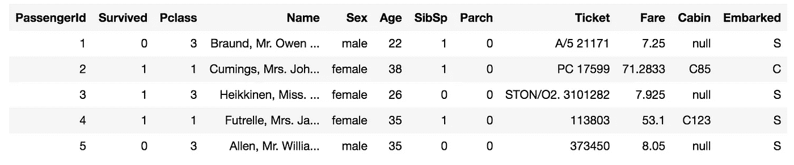
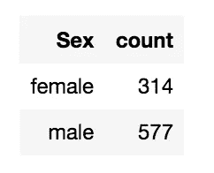
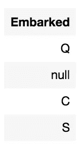
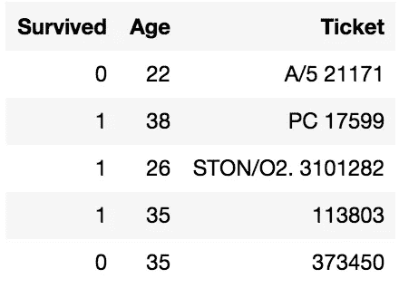
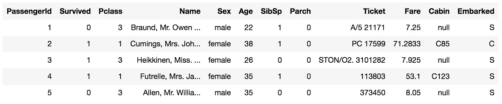
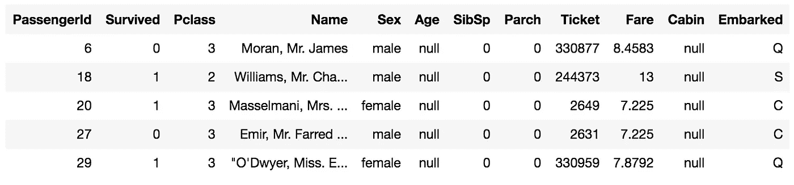
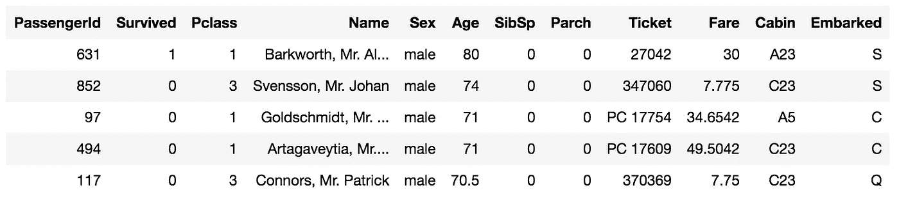
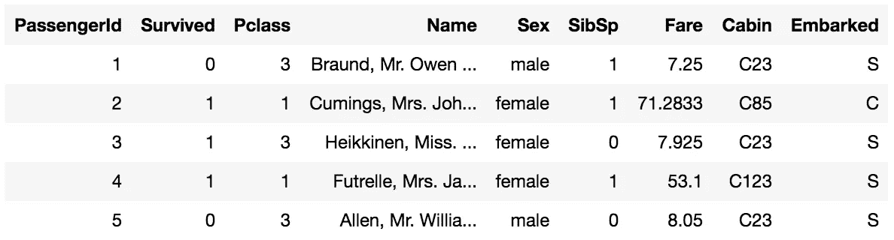

# Apache Pyspark 初学者指南

> 原文：<https://towardsdatascience.com/an-introduction-to-apache-pyspark-4454cc03bdfa?source=collection_archive---------31----------------------->

## 使用 Apache Pyspark 提高您的数据处理性能！


由 [Unsplash](https://unsplash.com?utm_source=medium&utm_medium=referral) 上的[克里斯托佛罗拉](https://unsplash.com/@krisroller?utm_source=medium&utm_medium=referral)拍摄的照片

# 阿帕奇火花

Apache Spark 是一个开源分析引擎和集群计算框架，可以提高您的数据处理性能。正如他们所说，Spark 是一个闪电般快速的统一分析引擎。Spark 完全是用 Scala 写的。

Spark 被有效地用于**大数据和机器学习**领域，用于分析目的。Spark 已被亚马逊、易贝和雅虎等多家公司采用。

## 火花的特征

*   Spark 是多语种的，这意味着你可以使用一种或多种编程语言来使用 Spark。Spark 为您提供了 Java、Python、R、SQL 和 Scala 的高级 API。用 Python 写的 Apache Spark 包叫做 **Pyspark** 。
*   Spark 支持多种**数据格式**，比如 Parquet、CSV(逗号分隔值)、JSON (JavaScript 对象表示法)、ORC(优化的行列)、文本文件和 RDBMS 表。
*   Spark 具有低延迟，因为它的**内存计算。** Spark 旨在处理海量数据，因此可扩展性是 Spark 的固有特性。
*   Spark 可以与 Hadoop 无缝集成，并且能够在 Hadoop 集群上运行。

## Spark 如何工作

*   Spark 采用**主从架构**。主节点将任务分配给集群中的从节点，从节点将执行这些任务。
*   必须创建一个 **Spark 会话**来利用 Spark 提供的所有功能。在驱动程序内部创建一个 Spark 会话。驱动程序驻留在主节点中。

```
**# Example of creating a Spark Session in Pyspark** spark = SparkSession.\
builder.master("local").\
appName("AppName").getOrCreate()
```

*   当您使用 Spark 会话读取数据帧时，数据帧将被分区并跨集群节点存储，以便可以并行操作。数据帧的分区统称为 **RDD(弹性分布式数据集)**。rdd 是容错的 T21，这意味着它对故障具有弹性。
*   当通过 Spark 会话调用一个动作时，Spark 创建转换的 **DAG(有向无环图)**(将应用于数据分区)并通过将任务分配给从节点中的执行器来实现它们。在调用操作之前，转换永远不会实现。只有当一个动作被调用时才实现转换的趋势被称为**懒惰评估**。
*   当一个动作被调用时，在主节点上运行的驱动程序将 Spark 作业分配给从节点。**星火任务**被分解成**阶段**，这些阶段又被进一步分解成**任务**。
*   从节点包含许多**执行器**，它们接收任务并在数据**的分区上并行执行它们。**执行器是缓存数据用于内存计算的执行器。

# **火花转换**

火花转换在 RDD 上执行一些操作并产生新的 RDD。各种火花变换包括*贴图*、*平面贴图、过滤、分组、减少和连接。*

*火花转换进一步分为两种类型*

*   狭义变换
*   广泛的变革

## 狭义变换

当操作**不需要洗牌时，火花变换被称为窄变换。**窄转换不需要在集群中的节点之间混洗数据分区。

窄变换的例子有*贴图、平面贴图、过滤器、样本、*等*。*

## 广泛的变革

当操作**需要洗牌**时，火花变换被称为宽变换。混洗是一种涉及在群集的节点上混洗数据分区以执行操作的操作。

广泛转换的例子有 *groupBy、reduceBy、join、*等。

*   *groupBy* 是一种转换，其中列的值被分组以形成一组唯一的值。在分布式环境中执行此操作的成本很高，因为所有要分组的值都必须从驻留在集群节点中的各种数据分区中收集。

# Spark 中的操作

动作是触发 Spark 作业的操作。Spark 不会立即执行转换。它需要一个动作来触发 Spark 转换的实现。

火花动作的例子有*收集*、*计数、取第一个、保存文本文件等。*

*   *收集*是一个动作，它收集驻留在集群节点上的所有数据分区，并将它们存储在驻留在主节点上的驱动程序中。

# 火花工作

当一个动作被调用时，Spark 作业被触发。星火工作又分为**阶段和任务。**

## 阶段

涉及宽转换的 Spark 作业被分组为一个阶段，涉及窄转换的作业被分组为另一个阶段。

```
**# A Spark Job**
df.filter(col('A')).groupBy('A')
```

上面的整个代码被认为是一个 Spark 作业，在这个*过滤器中*是一个单独的阶段，而 *groupBy* 是一个单独的阶段，因为*过滤器*是一个窄变换，而 *groupBy* 是一个宽变换。

```
**# Stage A
df.filter(col('A'))**.groupBy('A')**# Stage B**
df.filter(col('A')).**groupBy('A')**
```

## 任务

Spark 作业的各个阶段被进一步划分为任务。任务是应用于集群节点中每个分区的操作。

# 使用 Pyspark 进行数据准备

## 安装 Pyspark

Pyspark 可以通过执行以下命令来安装

```
pip install pyspark
```

## 导入所需的库

```
import math
import numpy as np 
import pandas as pd  
import pyspark
from pyspark.sql import SparkSession
from pyspark.sql.functions import isnan, when, count, col, isnull, asc, desc, mean**'''Create a spark session'''**
spark = SparkSession.\
builder.\
master("local").appName("DataWrangling").getOrCreate()
**'''Set this configuration to get output similar to pandas'''**
spark.conf.set('spark.sql.repl.eagerEval.enabled', True)
```



输出

```
**'''Find the count of a dataframe'''**
df.count() **"""OUTPUT:**891"""
```

## 列中值的计数

```
df.groupBy('Sex').count()
```



输出

## 在数据帧中查找列的不同值

```
df.select('Embarked').distinct()
```



输出

## 在数据框架中选择一组特定的列

```
df.select('Survived', 'Age', 'Ticket').limit(5)
```



输出

## 查找缺失值的计数

```
df.select([count(when(isnull(column), column)).alias(column) \
**for** column **in** df.columns])
```

## 过滤空值和非空值

```
**'''Find the null values of 'Age' '''**
df.filter(col('Age').isNotNull()).limit(5)**'''Another way to find not null values of 'Age' '''**
df.filter("Age is not NULL").limit(5)
```



输出

```
**'''Find the null values of 'Age' '''**
df.filter(col('Age').isNull()).limit(5)**'''Another way to find null values of 'Age' '''**
df.filter("Age is NULL").limit(5)
```



输出

## 排序列

```
**'''Sort "Parch" column in ascending order and "Age" in descending order'''**
df.sort(asc('Parch'),desc('Age')).limit(5)
```



输出

## 删除列

```
**'''Drop multiple columns'''**
df.drop('Age', 'Parch','Ticket').limit(5)
```



输出

## 分组依据和聚合

```
**'''Finding the mean age of male and female'''**
df.groupBy('Sex').agg(mean('Age'))
```

# **总结**

*   Spark 是一个用于分析目的的快速集群计算框架。
*   SparkSession 是 Spark 中所有功能的入口点，负责创建和调度 Spark 作业。
*   执行器在 RDD 可用的所有数据分区上实现转换。

**在我的 Kaggle 笔记本里找到这篇帖子:**[https://www . ka ggle . com/srivignesh/an-introduction-to-py spark-Apache-spark-in-python](https://www.kaggle.com/srivignesh/an-introduction-to-pyspark-apache-spark-in-python)

*联系我上*[*LinkedIn*](https://www.linkedin.com/in/srivignesh-rajan-123569151/)*，*[*Twitter*](https://twitter.com/RajanSrivignesh)*！*

快乐学习！

## **谢谢！**