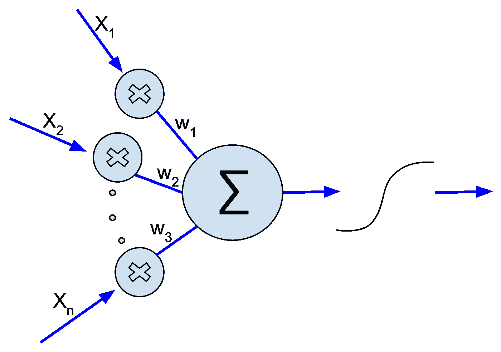
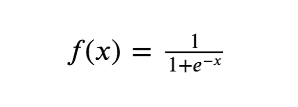
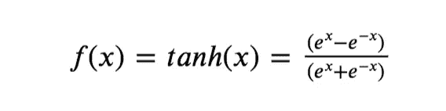
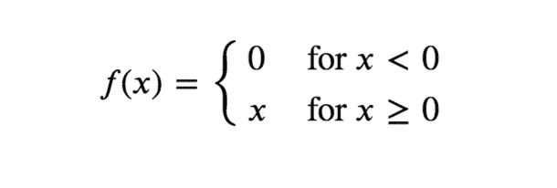
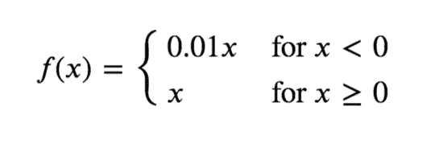
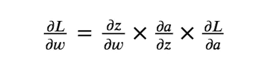
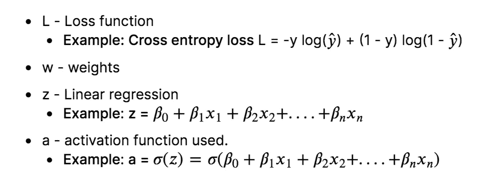

# 人工神经网络导论

> 原文：<https://towardsdatascience.com/an-introduction-to-artificial-neural-networks-5d2e108ff2c3?source=collection_archive---------10----------------------->

## 用人工神经网络提升你的模型性能。Tensorflow 中的一个演练！

莫里茨·金德勒在 [Unsplash](https://unsplash.com?utm_source=medium&utm_medium=referral) 上拍摄的照片

# 人工神经网络

人工神经网络(ANN)是一种深度学习算法，它是从人类大脑的**生物神经网络的思想中产生和进化而来的。模拟人脑工作的尝试最终导致了人工神经网络的出现。人工神经网络的工作方式非常类似于生物神经网络，但并不完全类似于它的工作方式。**

ANN 算法只接受数字和结构化数据作为输入。为了接受非结构化和非数字数据格式，如图像、文本和语音，分别使用**卷积神经网络(CNN)**和**递归神经网络(RNN)** 。在这篇文章中，我们只关注人工神经网络。

# 生物神经元 vs 人工神经元

## 生物神经元的结构及其功能

*   **树突**接收输入信号。
*   **Soma** (细胞体)负责处理输入，携带生化信息。
*   **轴突**为管状结构，负责信号的传递。
*   **突触**存在于轴突末端，负责连接其他神经元。

## 人工神经元的结构及其功能

*   一个单层的神经网络被称为**感知器**。一个多层感知器被称为**人工神经网络。**
*   神经网络可以拥有任意数量的层。每层可以有一个或多个神经元或单元。每一个神经元都是相互连接的。每层也可以有不同的**激活功能**。
*   人工神经网络包括两个阶段**正向传播和反向传播。**正向传播包括乘以权重、添加偏差、对输入应用激活函数并将其向前传播。
*   反向传播步骤是最重要的步骤，通常涉及通过在神经网络层的反向传播来寻找模型的最佳参数。反向传播需要**优化函数**找到模型的最佳权重。
*   通过相应地改变输出层的激活函数，人工神经网络可以应用于**回归和分类任务**。(二分类用 Sigmoid 激活函数，多类分类用 Softmax 激活函数，回归用线性激活函数)。

感知器。[图片来源](https://commons.wikimedia.org/wiki/File:Artificial_Neuron.svg)

# 为什么是神经网络？

*   当数据量增加时，传统的机器学习算法往往表现在相同的水平上，但当数据量巨大时，人工神经网络优于传统的机器学习算法，如下图所示。
*   **特征学习**。人工神经网络试图以逐层递增的方式进行分级学习。由于这个原因，没有必要明确地执行特征工程。
*   神经网络可以处理图像、文本和语音等非结构化数据。当数据包含非结构化数据时，使用诸如 CNN(卷积神经网络)和 RNN(递归神经网络)的神经网络算法。

# 安是如何工作的

人工神经网络的工作可以分为两个阶段，

*   正向传播
*   反向传播

## 正向传播

*   前向传播包括将特征值与权重相乘，添加偏差，然后对神经网络中的每个神经元应用激活函数。
*   将特征值乘以权重，并给每个神经元加上偏差，基本上就是应用**线性回归**。如果我们对它应用 Sigmoid 函数，那么每个神经元基本上都在执行一个**逻辑回归。**

## 激活功能

*   激活功能的目的是将**非线性**引入数据。引入非线性有助于识别复杂的潜在模式。它还用于将值缩放到特定的区间。例如，sigmoid 激活函数在 0 和 1 之间缩放该值。

## 逻辑函数或 Sigmoid 函数

*   Logistic/ Sigmoid 函数在 0 和 1 之间调整数值。
*   它用于二进制分类的输出层。
*   这可能会在反向传播过程中导致**消失梯度**问题，并减慢训练时间。

Sigmoid 函数

## Tanh 函数

*   Tanh 是**双曲正切**的简称。双曲正切函数在-1 和 1 之间调整数值。

双曲正切函数

## ReLU 函数

*   **ReLU(整流线性单元)**当 x >为 0 时输出相同的数字，当 x <为 0 时输出 0。
*   它防止了**消失梯度**问题，但是在反向传播期间引入了**爆炸**梯度问题**。爆炸梯度问题可以通过覆盖梯度来防止。**

ReLU 函数

## 泄漏 ReLU 函数

*   Leaky ReLU 非常类似于 ReLU，但是当 x <0 it returns (0.01 * x) instead of 0.
*   If the data is normalized using Z-Score it may contain negative values and ReLU would fail to consider it but leaky ReLU overcomes this problem.

Leaky ReLU function

## Backpropagation

*   Backpropagation is done to find the **为模型的参数**的最优值时，通过相对于**参数**对损失函数的**梯度进行部分微分来迭代更新参数。**
*   应用优化函数来执行反向传播。优化函数的目标是找到参数的最佳值。

可用的优化功能有:

*   梯度下降
*   Adam 优化器
*   动量梯度下降
*   均方根支柱(均方根支柱)

微积分的**链式法则**在反向传播中起着重要的作用。下面的公式表示损失(L)相对于权重/参数(w)的部分微分。

重量‘w’的微小变化会影响值‘z’的变化(∂𝑧/∂𝑤).值‘z’的微小变化会影响激活‘a’的变化(∂a/∂z).激活‘a’的微小变化会影响损失函数‘l’的变化(∂L/∂a).

链式法则

链式规则中值的描述

# **术语:**

## 韵律学

*   指标用于衡量模型的性能。
*   度量函数类似于成本函数，只是在训练模型时不使用评估度量的结果。请注意，您可以使用任何成本函数作为度量。
*   我们使用均方对数误差作为度量和成本函数。

均方对数误差(MSLE)和均方根对数误差(RMSLE)

## 世

*   训练数据的一次传递称为一个时期。训练数据以小批的形式被馈送到模型，并且当训练数据的所有小批被馈送到构成时期的模型时。

## 超参数

超参数是不是由模型产生的**可调参数**，这意味着用户必须为这些参数提供一个值。我们提供的超参数值会影响训练过程，因此超参数优化可以提供帮助。

在这个 ANN 模型中使用的超参数是，

*   层数
*   一层中单元/神经元的数量
*   激活功能
*   权重的初始化
*   损失函数
*   公制的
*   【计算机】优化程序
*   时代数

# Tensorflow 中的神经网络编码

## 加载预处理的数据

你输入给人工神经网络的数据必须经过彻底的预处理，以产生可靠的结果。训练数据已经过预处理。所涉及的预处理步骤是，

*   老鼠归罪
*   对数变换
*   平方根变换
*   顺序编码
*   目标编码
*   z 分数标准化

有关上述步骤的详细实施，请参考我的数据预处理笔记本

[笔记本链接](https://www.kaggle.com/srivignesh/data-preprocessing-for-house-price-prediction)

## 神经架构

*   我们将要使用的人工神经网络模型由七层组成，包括一个输入层、一个输出层和五个隐藏层。
*   第一层(输入层)由 128 个具有 ReLU 激活功能的单元/神经元组成。
*   第二、第三和第四层由 256 个具有 ReLU 激活功能的隐藏单元/神经元组成。
*   第五层和第六层由 384 个具有 ReLU 激活功能的隐藏单元组成。
*   最后一层(输出层)由一个单个神经元组成，该神经元输出形状为(1，N)的数组，其中 N 是特征的数量。

**在我的 Kaggle 笔记本里找到这个帖子:**[https://www . ka ggle . com/srivignesh/introduction-to-ann-in-tensor flow](https://www.kaggle.com/srivignesh/introduction-to-ann-in-tensorflow)

**参考文献:**

[1]吴恩达，[深度学习专业化](https://www.coursera.org/specializations/deep-learning)。

*联系我上*[*LinkedIn*](https://www.linkedin.com/in/srivignesh-rajan-123569151/)*，*[*Twitter*](https://twitter.com/RajanSrivignesh)*！*

**快乐深度学习！**

## 谢谢你！