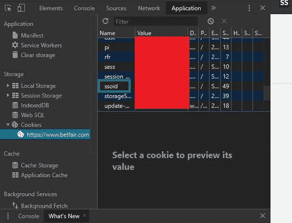
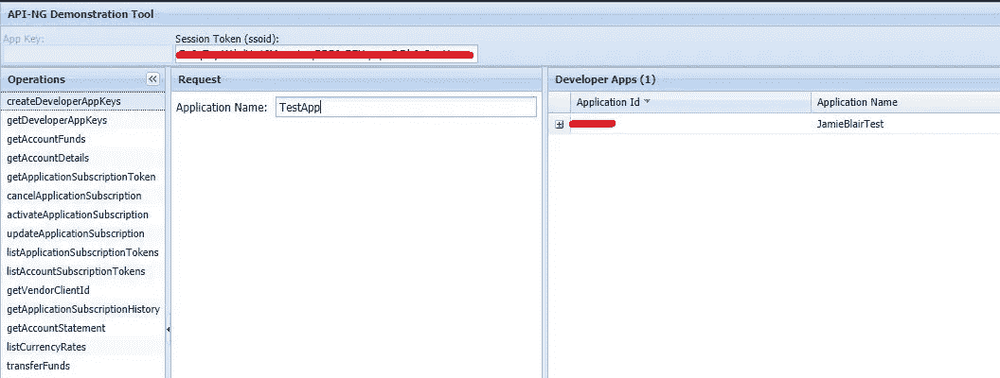
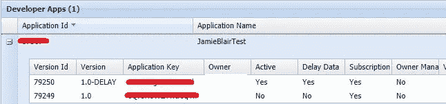
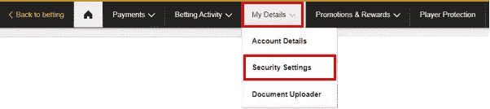
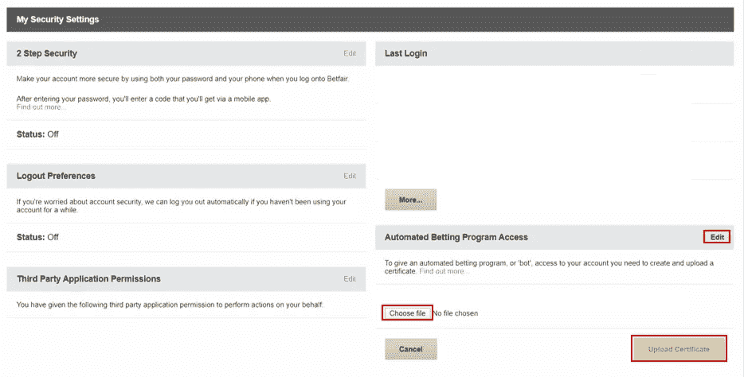

# Betfair API 简介及其使用方法

> 原文：<https://towardsdatascience.com/an-introduction-to-betfair-api-and-how-to-use-it-e3cdbd79c94b?source=collection_archive---------8----------------------->

## 深入了解不断变化的在线赌博世界

来自 lbbonline.com 的必发标志

# 介绍

网上赌博的世界是一个不断变化的野兽，很少有人能在业务之外瞥见他们不断变化的世界。Betfair 是为数不多的允许所有人访问其 API 的在线博彩公司之一。这是因为必发交易所的工作原理与华尔街的股票市场相似，数百万用户支持并下注，希望赚些钱。一些人能够在交易所谋生，但并不是每个人都这样，因为许多人都在使用机器人通过使用 API 来下注。

当我第一次想开始使用 API 时，主要是为了跟踪特定市场的赔率如何随时间变化，并在未来分析这些变化，看看是什么导致了价格的变化。当通读 Betfair API 文档时，并没有关于如何访问它的明确说明，而且文档自上传以来并没有真正更新过。所以下面我创建了一个关于如何访问 Betfair API 和如何使用它的基本指南。完整的笔记本可以从我的 [GitHub](https://github.com/JamieBlair1996/Betfair-API) 访问。此外，在开始之前，确保您能够 ***访问/放置***Betfair 的赌注。我也开始尝试访问谷歌联合实验室的 API，但被拒绝访问，因为服务器设在美国，一个不能访问必发的国家。

# 获得对 API 密钥的访问权限

要开始，你需要有一个必发帐户，以获得访问 API 的关键。要访问您的 API 密钥，您首先需要拥有您的 SSOID，并使用[API 演示工具](https://docs.developer.betfair.com/visualisers/api-ng-account-operations/)。当您登录到必发右击并选择检查元素。在 Chrome 上，你会看到应用程序标签和 Cookies。它应该看起来像这样。

当您将 SSOID 粘贴到 APING 演示工具中并添加应用程序名称后，按页面底部的 execute。

然后，您应该会看到一个应用程序，如下所示:

注意有两个键。对于这个应用程序，我们使用延迟键，因为这是免费的，而另一个没有延迟，价格为 200 英镑。如果你想使用它，只要确保你有你的必发帐户的金额，因为它将从那里扣除。如果您已经创建了一个应用程序，那么选择 getDeveloperAppKeys 按钮并按底部的 execute，这应该会显示这些键。

# 是时候获取证书和密钥了

现在你可以访问你的 API 密匙了，你需要下载 XCA。从这里开始，遵循创建它们的指南会更有益这是我发现的唯一一篇特别有用的文档。在继续之前，请确保再次检查所有信息和设置是否正确，因为这些信息和设置不能更改，如果它们是错误的，则必须重新创建。当您从 XCA 导出证书和密钥后，就该将证书上传到您的必发帐户了。这是通过进入你的“我的必发帐户”，然后“我的详细信息”下拉菜单，并选择“安全设置”。

在此页面上，单击“自动投注程序访问”菜单旁边的“编辑”。上传。crt 文件，您应该准备好开始编程了。

在整个例子中，我的键都有扩展名。这是因为我把它从。pem，只要它是您代码中正确的扩展名，这两种方法都有效。

# 步骤 1:加载库

首先，导入使用的库

# 步骤 2:获取 SSOID

首先，我使用 POST 登录并访问 SSOID。您在开始时找到的 SSOID 只是为了获得对 API 的访问权，一旦您有了您的密钥，您就可以随时以这种方式登录。我设置用户名，密码和应用程序密钥的方式是不必要的，但它会证明以后更省时。在这种情况下，为了方便起见，我将我的证书和密钥保存在与笔记本相同的地方，但是您可以将它们保存在其他地方并使用绝对地址。

# 步骤 3:查询 API 以获取特定的市场

在这里，我们设置将发布到的 URL、请求和标题。这个特殊的请求将提供 Betfair 所有可用运动的列表。下面的 URL 设置一次，并且是所有请求发送到的相同 URL。event_req 是发送到 URL 的请求。这必须设置如下赌注可以改变时，在这种格式。使用[这里的](https://docs.developer.betfair.com/display/1smk3cen4v3lu3yomq5qye0ni/Betting+API)可以改变方法。req 检索 HTML 响应，然后转换成 json，让我们可以读取它。

json 响应由字典和列表组成，或者更准确地说，由包含字典列表的字典组成。结果显示市场名称、市场 ID(稍后在过滤即将到来的比赛时使用)和市场计数(可下注的市场数量)。这将提供包括正在播放和即将播放的市场的数量，这可以设置为仅显示即将播放或正在播放，稍后将会提到。下面是上面代码的输出。请注意,“id”没有遵循通常的索引方式，而是从 1 开始，许多事件甚至没有遵循该约定。

下面是如何查看事件名称的示例。注意前面提到的字典和包含字典的字典列表。如果在任何时候你不确定使用什么样的字典键。像这样的键()

接下来，我们将继续寻找如何为当前正在进行的特定活动找到可用的市场。通过使用 listMarketTypes 方法，请求请求所有市场，通过添加过滤器，可以对其进行微调，以查看特定于某个事件的市场。使用的第一个过滤器只查找特定 id 的事件，在本例中，它是使用 id 1 的足球。另一个过滤器是它是否是 inplay，如果省略它，它将提供 inplay 和 not inplay 市场，这样它可以有效地在 inplay 和 not 之间切换。

通过使用 listMarketCatalogue 方法，上述市场类型可用于找出哪些球队正在所选市场进行比赛。坚持将足球作为事件，并添加了过滤器 marketTypeCodes。在本例中，使用了 MATCH_ODDS，并显示了该市场的比赛项目。另一个补充是设置时间范围。这是在将它添加到请求之前设置的，因为用单个名称添加到请求比用一大行更容易。响应被排序以显示第一个要开始的夹具，并且将只有 1 个结果。请注意，最大结果将只接受最大值 1000。为了看比赛中的球队，增加了市场预测。

从现在开始，我们将关注赛马。让我们为我们的 API 请求添加更多的细节。您可以看到，我已经从请求中提取了一些变量，这是为了在需要进行更改时更加方便。变量与上面的示例相同，只是增加了元数据和 inplay。

此请求的结果将在接下来的 24 小时内给出英国和爱尔兰的所有比赛。当检查每个比赛时，它显示与比赛相关的所有信息，重要的是 marketId，这在以后会很有用。它还列出了跑步者和与他们相关的所有元数据，包括马的形态，这也很重要，还有它的 selectionId。为了进一步研究这个输出，它和以前一样。

# 步骤 4:查询 API 以获得最新的赔率

一个 API 请求可以用来获得你所选择的市场中某个特定团队/个人/马匹的赔率。为此将使用上面的马。为了获得这匹马的赔率，API URL 的设置与前面的 URL 相同，只是将请求 listRunnerBook。使用的操作可以在这里找到[。注意:在该市场中，每个请求只能传入一个 marketId 和一个 selectionId。如果传入的 selectionId 不是有效的/不属于该市场，则调用仍然有效，但只返回市场数据。](https://docs.developer.betfair.com/display/1smk3cen4v3lu3yomq5qye0ni/listRunnerBook)

要获得必要的 id，您可以查看输出并手动输入，也可以将它们设置为变量。

如果传递了无效的 selectionId，则这是输出。没有显示赔率，因为没有具体的赔率。

如果传递了有效的 selectionId，这就是输出。可以看出，现在有了与所使用的 selectionId 相关的信息。它显示了它在必发交易所最后交易的价格，以及它可以支持的价格和它可以反对的价格。我将不会进入什么是一个 lay bet，对于这个例子，将只看第一个价格可支持。

# 第五步:把所有的加在一起，再加一点数学

现在，基础知识已经涵盖了如何在 24 小时内进行比赛，参加比赛的马匹以及特定马匹的赔率。为什么不把它们合并成一个函数，再增加几个功能呢？

将创建的函数将计算每场比赛中每匹马的平均状态。然后，它将确定哪匹马具有最好的平均形式，并将它添加到数据帧中，与所选马、比赛和马的名字的赔率一起。

马的形态是由它在最近 6 场比赛中的位置组成的。然而，并不是每匹马都可以排名，有一些不同的代码在赛马中使用，不能添加到马的平均水平。为了解决这个问题，你可以用任何你认为合理的值来衡量这些代码，我在下面已经这样做了。现在，一些代码将很少出现，但这并不意味着他们不会，这就是为什么我已经添加了他们，否则它会崩溃。这个函数也是唯一需要运行的东西，这就是为什么我添加了关于获取 SSOID 的第一部分。

该函数的第一部分是将在函数中使用的变量和列表的声明，以及 pandas 数据帧的创建。之后和之前一样，当得到 SSOID，然后得到比赛和跑步者。正是在这一点上，形式是平均的，正如可以看到的，这是一个有点乱，需要一些清理，但目前它按照要求运作。

可以看出，平均数被添加到列表中。然后遍历这个列表，并对照开始时设置为 100 的最低平均值进行检查。如果当前列表位置的平均值小于最低平均值，那么新的平均值被设置为新的最低平均值，马的名称和 selectionId 被附加到列表中。一旦列表被遍历，具有最佳平均值的马的赔率通过使用上面显示的方法被收集。然后将这些值添加到数据帧中。使用 horsename[-1]和 selectionID[-1]的原因是因为需要列表中的最后一项。

该函数的输出

# 结论

现在你知道了。通过有点混乱的必发 API 的基本指南。现在，有更多的方法来使用必发 API，我只是触及了其中的一些可能性。form 函数只是在选择一匹马下注时要遵循的一个指导原则，因为还有许多其他变量没有考虑到，如马的体重、骑师、驯马师、赛道条件或天气。就像任何与预测比赛或比赛结果有关的事情一样，要有所保留，并结合你在决定下赌注时通常会查看的任何其他信息来使用它。

***注来自《走向数据科学》的编辑:*** *虽然我们允许独立作者根据我们的* [*规则和指导方针*](/questions-96667b06af5) *发表文章，但我们不认可每个作者的贡献。你不应该在没有寻求专业建议的情况下依赖一个作者的作品。详见我们的* [*读者术语*](/readers-terms-b5d780a700a4) *。*