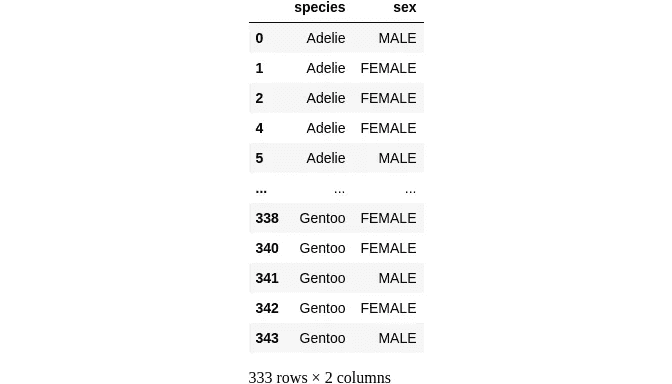
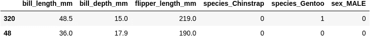
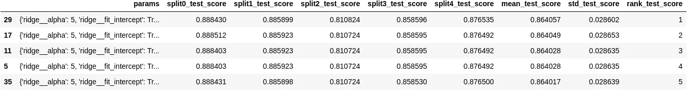
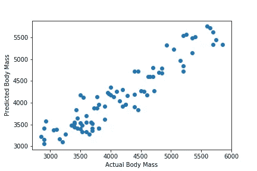

# Scikit-learn 中构建管道和使用网格搜索的介绍

> 原文：<https://towardsdatascience.com/an-introduction-to-building-pipelines-and-using-grid-searches-in-scikit-learn-92ea72f9b5b7?source=collection_archive---------19----------------------->


图片鸣谢:https://unsplash.com/photos/adJNLL2CLM4 阿林-安德森

构建最基本的机器学习模型也需要几个步骤。必须选择特征，需要标准化数据，必须确定要使用的估计器的类型，然后使其适合训练数据。一旦我们有了一个工作模型，下一步就是寻找和优化参数。

模型涉及两类参数:
i) **模型参数**:模型内部的配置变量，可以从数据中估计出来；以及，
ii) **模型超参数**:模型外部的配置变量，无法从数据中估计。[【1】](https://machinelearningmastery.com/difference-between-a-parameter-and-a-hyperparameter/)
在整个建模过程中，有许多步骤需要提供超参数。这些参数必须由外部提供，调整它们是开发模型的一个重要部分。这通常被称为超参数调整，涉及数据科学家优化这些参数以提高性能。

建立模型是一个迭代的过程。正如人们可以想象的那样，这个过程很容易变得乏味、笨拙和容易出错。幸运的是，Scikit-learn 有一套很好的工具来解决这个问题:pipeline 和 gridsearch。本文的目标是演示这些工具的用法。在我们继续之前，重要的是要提到本文的其余部分不是回归分析的练习。这里的分析工作只是展示 Scikit-learn 工具的一个工具。说完了，让我们开始吧。

像往常一样，我们从导入必要的库开始。在我们的模型中，我们将构建一个管道，为此我们需要 Scikit-learn 中的`sklearn.pipeline`模块中的`make_pipeline`方法。`GridSearchCV`，我们将使用的另一个方法，来自同一个 Scikit-learn 库的`model_selection`模块。我们将使用 Seaborn 附带的企鹅数据集。

```
#import libraries
import numpy as np
import pandas as pd
import seaborn as sns;
import matplotlib.pyplot as plt
from sklearn.preprocessing import StandardScaler
from sklearn.pipeline import make_pipeline
from sklearn.feature_selection import SelectKBest, f_regression
from sklearn.model_selection import train_test_split,GridSearchCV
from sklearn.linear_model import Ridge, Lasso#loading dataset
penguins=sns.load_dataset('penguins')#looking at a snapshot of newly loaded data
penguins.info()<class 'pandas.core.frame.DataFrame'>
RangeIndex: 344 entries, 0 to 343
Data columns (total 7 columns):
 #   Column             Non-Null Count  Dtype  
---  ------             --------------  -----  
 0   species            344 non-null    object 
 1   island             344 non-null    object 
 2   bill_length_mm     342 non-null    float64
 3   bill_depth_mm      342 non-null    float64
 4   flipper_length_mm  342 non-null    float64
 5   body_mass_g        342 non-null    float64
 6   sex                333 non-null    object 
dtypes: float64(4), object(3)
memory usage: 18.9+ KB
```

为了说明构建管道的过程，我将使用回归来估计身体质量，这是一个连续的数字变量。让我们选择 3 列数字数据(`bill length`、`bill depth`、`flipper length`)和 2 列分类数据(`sex`、`species`)作为特征。`sex`列有一些值为空的行，我们将删除它们。

```
#dropping rows with NA or NaN values
penguins.dropna(inplace=True)
```

让我们创建一个特征矩阵( **X** )和一个带有目标变量的向量( **y** )。由于`sex`是一个分类变量，我们还需要在将矩阵分成训练集和测试集之前对它们进行虚拟化。

```
#creating a feature matrix X
X=penguins.drop(['island','body_mass_g'],axis=1)#Quick look at columns with categorical variable
X[['species','sex']]
```



```
#Let's pass 'species' column to OneHotEncoder
X=pd.get_dummies(data=X,columns=['species','sex'],drop_first=True)y=penguins['body_mass_g']#Split data into training and test sets
X_train,X_test,y_train,y_test=train_test_split(X,y)#taking a quick look at the newly created training set
X_train.head(2)
```



我们终于准备好建立一个管道，并建立一个模型。Scikit-learn 中的`pipeline`模块有一个`make-pipeline`方法。第一步是实例化该方法。为此，我们按顺序向它传递我们希望输入数据经历的步骤。实例化的管道就像任何其他 Scikit-learn 估计器一样工作。下面的代码是构建新管道的示例。我们用一个不太有创意的名字命名新创建的管道:pipe。

```
#Setting up a pipeline
pipe=make_pipeline(StandardScaler(),SelectKBest(f_regression),Ridge())
```

指定为`make_pipeline`的参数的方法，从左到右依次是:
I)`StandardScaler()`->`train_test_split`之前的数据我们还没有标准化。因此，在对传入的数据执行任何其他转换之前，需要对其进行标准化。
ii) `SelectKBest()` - >这个方法来自 Scikit-learn 的`feature_selection`模块。它根据指定的评分函数(在本例中为`f_regression)`)选择最佳特征。特征的数量由参数`k`的值指定。即使在选定的特性中，我们也希望改变提供给模型的最终特性集，并找到性能最佳的特性。我们可以用`GridSearchCV`方法做到这一点，我很快就会回来。
iii) `Ridge()` - >这是一个执行实际回归的估计器。该方法的名称是指 Tikhonov 正则化，通常称为岭回归，用于减少多重共线性的影响。像前面讨论的参数 k 一样，我们想要测试岭回归的各种参数的几个不同值。我们这样做是网格搜索的一部分，这将在下面讨论。

我们的管道现在可以安装了。正如我前面提到的，实例化管道的行为就像任何其他估计器一样。它可以接受作为管道一部分的每个方法的参数。获取管道可以接受的参数列表的快速方法如下所示:

```
#Looking up parameters that can be passed to the pipeline
pipe.get_params().keys()Output:
dict_keys(['memory', 'steps', 'verbose', 'standardscaler', 'selectkbest', 'ridge', 'standardscaler__copy', 'standardscaler__with_mean', 'standardscaler__with_std', 'selectkbest__k', 'selectkbest__score_func', 'ridge__alpha', 'ridge__copy_X', 'ridge__fit_intercept', 'ridge__max_iter', 'ridge__normalize', 'ridge__random_state', 'ridge__solver', 'ridge__tol'])
```

网格搜索使我们能够搜索上面列出的每个参数的指定值。我们通过向`GridSearchCV`传递一个字典来实现这一点，该字典将参数名作为键，并将值列表作为这些参数的参数。在这个例子中，我调用这个字典`params`并将其传递给`GridSearchCV`。一旦安装好，`GridSearchCV`实例`gs`，就像任何其他估计器一样工作。

作为旁注，我想强调一个可选但非常有用的参数:n_jobs。它告诉 sci kit-了解并行运行多少个作业。将其设置为-1 相当于指示 Scikit-learn 使用所有可用的处理器。现在，大多数 CPU 都有不止一个内核。如果您有一个四核处理器，使用所有 4 核而不是 1 核可以使处理速度明显加快。

```
#putting together a parameter grid to search over using grid search
params={
    'selectkbest__k':[1,2,3,4,5,6],
    'ridge__fit_intercept':[True,False],
    'ridge__alpha':[5,10],
    'ridge__solver':[ 'svd', 'cholesky', 'lsqr', 'sparse_cg', 'sag',
'saga']
}#setting up the grid search
gs=GridSearchCV(pipe,params,n_jobs=-1,cv=5)#fitting gs to training data
gs.fit(X_train, y_train)
```

GridSearchCV 不是搜索所选参数的所有排列，而是对训练数据进行交叉验证。默认值是 5 倍，但是我们可以使用参数`cv`指定任何其他数值。属性`cv_results_`包括每次交叉验证运行的详细结果，并提供大量数据，可用于确定新开发模型的拟合和稳健性。性能最佳的参数排列的细节由`best_params_`属性提供。

```
#building a dataframe from cross-validation data
df_cv_scores=pd.DataFrame(gs.cv_results_).sort_values(by='rank_test_score')#selecting specific columns to create a view
df_cv_scores[['params','split0_test_score', 'split1_test_score', 'split2_test_score',\
       'split3_test_score', 'split4_test_score', 'mean_test_score',\
       'std_test_score', 'rank_test_score']].head()
```



```
#checking the selected permutation of parameters
gs.best_params_Output:
{'ridge__alpha': 5,
 'ridge__fit_intercept': True,
 'ridge__solver': 'sag',
 'selectkbest__k': 6}
```

最后，我们可以通过将其特征矩阵传递给`gs`来预测测试集的目标值。预测值可以与实际目标值进行比较，以可视化和传达模型的性能。

```
#checking how well the model does on the holdout-set
gs.score(X_test,y_test)Output:
0.8707008994531131#plotting predicted body weights vs actual body weights of penguins
y_preds=gs.predict(X_test)
plt.scatter(y_test,y_preds);
```



企鹅的预测体重与实际体重(克)

这是一个非常简单的模型。但是，即使在这种简单程度上，管道和网格搜索的有效性也是显而易见的。也许，不太明显的是，在建立管道并将其放入网格搜索时，批判性思维的价值。这方面的一个例子是特征选择。假设我们要在一个分类问题中选择 k 个特征。在网格搜索之外，我们可以随机选择 k 个特征，而不需要考虑过程。然而，在网格搜索中进行特征选择迫使人们考虑可用的方法/算法、它们适用的问题以及它们的优点和缺点。因此，可以说，使用管道和网格搜索可以使一个人成为更好的数据科学家。这些技术的一个注意事项是，要构建的模型数量随着每个额外参数值的增加而成倍增加。因此，与其在大量可能的参数值中进行网格搜索，不如每次在每个参数的少量值中进行搜索，然后改变范围，重新进行网格搜索。一旦进入期望的范围，我们就可以放大以找到最佳值。如果使用得当，在处理未知的复杂系统时，它们是真正的“救命稻草”。如果你还没有用过它们，我强烈推荐它们。