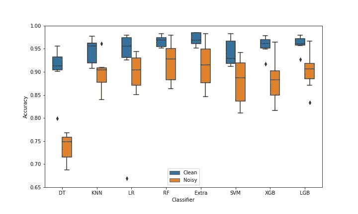
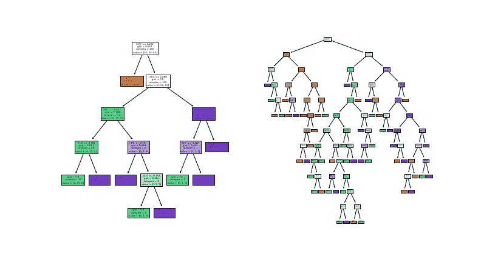
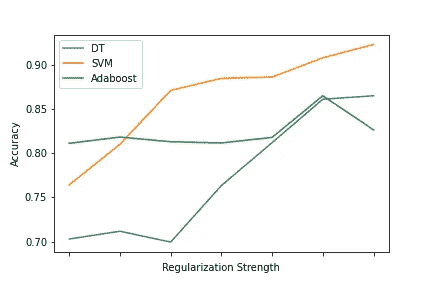

# 使用错误标记数据的分类介绍

> 原文：<https://towardsdatascience.com/an-introduction-to-classification-using-mislabeled-data-581a6c09f9f5?source=collection_archive---------21----------------------->

任何分类器的性能，或者任何机器学习任务的性能，关键取决于可用数据的质量。数据质量又取决于几个因素，例如测量的准确性(即噪声)、重要信息的存在、冗余信息的缺乏、收集的样本有多少实际代表总体等。在本文中，我们将重点关注噪声，特别是标签噪声——一个样本可能只有一个标签(或类别),而数据集中样本的一个*子集*被错误标记。我们将看看当存在标签噪声时，分类性能会发生什么，它究竟如何阻碍分类器的学习过程，以及我们可以做些什么。

在这篇文章中，我们将局限于“矩阵形式”的数据集。虽然这里提出的许多观点无疑将适用于深度学习，但有足够多的实际差异需要单独发布。所有实验和图形的 Python 代码都可以在这个[链接](https://github.com/Shihab-Shahriar/Intro-label-noise)中找到。

# 为什么你应该关心

有两个重要原因:


图 1:30%标签噪声对 LinearSVC 的影响

**1。标签噪声会显著损害性能:**数据集中的噪声主要有两种:特征噪声和标签噪声；一些研究论文指出，标签噪声通常比特征噪声更有害。图 1 说明了(人工引入的)30%标签噪声对简单的线性可分二元分类数据集的 LinearSVC 分类边界的影响。我们稍后会更深入地讨论影响，所以让我们继续讨论第二点。

**2。标签噪声非常普遍:**标签噪声可以通过多种方式潜入您的数据集。一个可能的来源是自动标记。这种方法通常使用元信息(即不直接存在于特征向量中的信息)来生成标签，例如使用 hashtags 来标记图像，或者使用提交日志来检测软件库中的缺陷模块等。与领域专家的标记相比，这既节省了时间又节省了金钱，尤其是在处理大型数据集时，但却牺牲了质量。在软件工程领域，人们发现检测引入提交的错误的领先自动标记算法之一(SZZ)具有相当高的噪声率[2]，这给多年来依靠 SZZ 产生缺陷分类数据集的研究打上了一个大大的问号。

事实上，这种质量和成本之间的权衡经常出现。举一个与当前特别相关的例子，假设我们想要使用人口统计特征创建一个新冠肺炎预测数据集。为了收集标签，即某人是否真的患有新冠肺炎，迄今为止我们基本上有两种选择——我们可以使用缓慢、昂贵和准确的 RT-聚合酶链式反应测试，或者我们可以使用快速、便宜但容易出错的快速检测试剂盒。

但是人类标签员，甚至专家也不是不会犯错的。在医学领域，有 10 年经验的放射科医生在对磁共振成像进行分类时犯错误的几率为 16.1%[1]。Amazon Mechanical Turk 已经成为一个非常受欢迎的数据标记媒体，但是众所周知，它包含非法机器人(有时是懒惰的人)随机标记东西。事实上，很难想象一个足够大的数据集*不包含至少某种程度的标签噪声。可以毫不夸张地说，对于任何处理真实数据集的数据科学家来说，至少对标签噪声有一个基本的了解是非常重要的。*

# 分类器如何响应标签噪声

数据集标签中的噪声会损害任何分类器的性能，这是意料之中的——有趣的问题是会损害多少。事实证明，答案在很大程度上取决于用来挖掘数据集的分类器。为了证明这一点，我们将进行一个小实验。我们将使用七个数据集来减轻任何特定于数据集的偏见——虹膜、乳腺癌、元音、片段、数字、葡萄酒和垃圾词。5 重交叉验证重复 3 次，以计算单个分类器-数据集对的准确度。在交叉验证的每次迭代中，我们破坏(即随机翻转)20%的训练数据标签。注意，只有训练数据集被噪声破坏，原始的即干净的标签被用于评估。



图 2:用原始(即干净的)和有噪声的标签训练的分类器的性能比较。

如图 2 所示，所有分类器的性能都会变差，这是意料之中的。但是分类器之间有相当大的差异。决策树(DT)似乎极易受到噪声的影响。这里检查的所有 4 个集成:随机森林(RF)、额外树(Extra)、XGBoost (XGB)和 LightGBM (LGB)，在原始数据上具有大致相似的性能。但是由于噪声，XGBoost 的性能受到了相对较大的影响，另一方面，RF 似乎相对稳健。

# 标签噪声究竟如何损害性能


图 3:与图 1 相同，但有 4000 个样本

一个显而易见的答案是，低质量的数据导致低质量的模型。但是定义质量并不像看起来那么简单。我们可能会说，噪声水平越高的数据集质量越低，直觉上这是有道理的。但是还记得图 1 吗？这是同样的一个，但是现在有 4000 个样本，而不是 400 个。在这两种情况下，数据集包含 30%的标签噪声，因此应该具有相似的质量。然而在这种情况下，用噪声数据学习的决策边界与用干净数据学习的难以区分。这并不是说直觉是错误的(事实并非如此)，而是要强调，在解释性能损失时，除了简单的噪声水平之外，还有其他因素(例如数据集大小)。

此外，仅仅以数据为中心的观点并不能解释不同分类器对噪声响应的巨大差异。所以接下来我们要从量词的角度来分析。在下图中，我们选择了所有分类器中最脆弱的一个——决策树，用 Iris 数据集的干净标签和有噪声标签对其进行训练，并绘制了下面的结果树的结构。



图 4:左，用干净标签训练的 DT。对，DT 用嘈杂的标签训练出来的。

我们在这里只应用了 20%的噪声。但是，即使是这种小噪音也足以将一个相对较小的决策树(左)变成一个巨大的混乱(右)。诚然，这是一个人为的极端例子，但它揭示了一个或多或少适用于所有分类器的重要观点:标签噪声增加了模型的复杂性，使分类器过度适应噪声。

图 Adaboost 中干净样品和贴错标签样品之间的重量分布

另一个证明噪声影响的好算法是 Adaboost，它是 XGBoost 和 LightGBM 等当前先进算法的前身。在 21 世纪初，它是最先进的，但它也非常容易受到标签噪声的影响。Adaboost 首先为每个实例分配相等的权重。在每次迭代中，它增加被错误分类的实例的权重，并减少其他实例的权重。通过这种方式，它逐渐将更多的注意力集中在更难的实例上。但是正如您可能已经想到的那样，贴错标签的实例通常比干净的实例更难分类。因此，Adaboost 最终会给错误标记的样本分配更高的权重，也就是说，它会努力正确分类它应该忽略的实例。图 5 中的动画捕捉了 Adaboost 在具有 20%噪声的乳腺癌数据集上分配给噪声样本和干净样本的权重分布。仅仅经过 20 次迭代，有噪声的实例的权重就比干净的实例多了一倍，尽管其数量是干净的实例的 4 倍。

为了使这个讨论完整，让我们来看看一些相反的分类器:对噪声比其他分类器更鲁棒的分类器。如果您仔细观察图 2，您可能会发现一个非常显著的事实:这里最健壮的两个分类器(随机森林和额外树)只不过是最脆弱算法的简单集合:决策树。为了解释这一点，让我们从这些森林*没有*做的事情开始——它们没有额外强调像 Adaboost(或 SVM)这样的嘈杂实例，所有实例在 bootstrap 聚合(或打包)[3]期间都被平等对待，这是随机森林的一个重要组成部分。

一堆糟糕的决策树(DT)如何结合在一起形成如此强大的随机森林的解释在于一个叫做分类误差的[偏差-方差分解](https://en.wikipedia.org/wiki/Bias%E2%80%93variance_tradeoff)的概念。想象一下，在二进制分类数据集上，许多 DTs 中的每一个都有 60%的准确率。假设它们的预测之间没有关联，给定一个新的实例，我们可以期望(大约)60%的 DTs 对其做出正确的预测。因此，如果我们通过多数投票汇总他们的结果，对于任何新的实例，多数(即 60%)将做出正确的预测，给我们一个完美的 100%的准确性！当然，零相关假设在实践中是不可能实现的，所以我们不能达到 100，但是希望你能明白。

# 处理标签噪音

在我们开始谈论减轻噪音的影响之前，请记住著名的没有免费的午餐定理。下面讨论的方法没有一个是万灵药——它们有时有效，有时无效。有时当它们工作时，与增加的计算成本相比，改进可能是微不足道的。因此，请始终记住，将您的 ML 管道与没有任何这些噪声处理机制的简单基线进行比较。



图 6:在被 25%标签噪声破坏的乳腺癌数据集上不同正则化强度下的分类性能。

也就是说，从广义上讲，我们可以从两个角度解决标签噪声问题:通过使用噪声鲁棒性算法，或者通过清理我们的数据。在第一种方法中，我们可以简单地选择本质上更健壮的算法，例如，基于 bagging 的集成胜过 boosting。也有许多算法和损失函数专门设计为抗噪声，例如非精神 SVM [4][5]。或者，利用标签噪声导致过度拟合的事实，我们可以*通常*通过引入更强的正则化来使脆弱的算法更加健壮，如图 6 所示。

对于清理数据，我们可以使用之前陈述的观察，即错误标记的实例更难正确分类。事实上，许多 ML 论文依靠这种观察来设计新的数据清理程序[6]。基本步骤是:使用训练数据的子集训练一堆分类器，使用它们预测其余数据的标签，然后未能正确预测样本给定标签的分类器的百分比就是样本被错误标记的概率。尽管已经分享了完整代码的链接，但使用决策树集合的示例实现非常简单，我忍不住在这里展示它:

```
def detect_noisy_samples(X,y,thres=.5): #Returns noisy indexes
    rf = RandomForestClassifier(oob_score=True).fit(X,y)
    noise_prob = 1 - rf.oob_decision_function_[range(len(y)),y]
    return noise_prob>thres
```

在具有 25%标签噪声的 Spambase 数据集上，该方法检测到 85%的错误标签实例，而只有 13%的干净实例被检测为有噪声。对于乳腺癌，这些数字分别为 90%和 10%。

但是这种只训练多分类器来预处理数据集的方法对于大数据集可能是不切实际的。另一个密切相关但更有效的启发是:1)找到样本的 K 个最近邻居，2)计算具有相似标签的邻居的百分比，3)将其用作标签可靠性的代理。正如所料，它的性能可能不太令人印象深刻-它检测到垃圾邮件数据库中 2/3 的有噪声的实例，而 10%的干净实例被标记为有噪声。但是同样，一个基本的实现非常简单。

```
def detect_noisy_samples(X,y,thres=.5): #Returns noisy indexes
    knn = KNeighborsClassifier().fit(X,y)
    noise_prob = 1 - knn.predict_proba(X)[range(len(X)),y]
    return np.argwhere(noise_prob>thres).reshape(-1)
```

值得强调的是，清理数据并不意味着简单地扔掉疑似贴错标签的样本。上述两种试探法都返回(样本)被错误标记的连续概率。我们可以使用该概率的倒数作为一种可靠性或置信度得分，并使用成本敏感学习来利用该信息。通过这种方式，我们可以保留所有数据点，这在噪声水平较高或数据集较小时尤为重要。此外，这比过滤更普遍——过滤是成本敏感方法的一个特例，成本可能只有 0 和 1。

# 结论

谢谢你坚持到现在！希望这篇文章有用。但是请记住，这只是一个介绍，因此遗漏了许多有趣和重要的问题。

例如，我们在这里还没有真正谈到“噪声模型”。我们只关注误贴标签样本的总百分比，假设误贴标签实例的错误标签可能以相同的概率来自任何其他标签。这不是不现实的，这种所谓的均匀噪声模型可能会出现，例如当亚马逊机器人随机分配标签时。但是我们从常识中知道，一个严肃的人类注释者更容易混淆 9 和 7，而不是 9 和 8，或者积极和中性情绪，而不是积极和消极情绪——并且均匀噪声模型不能很好地捕捉标签之间的这种不均匀交互。

另一个有趣的问题是，当我们还没有收集标签时，我们应该如何行动:我们收集了大量低质量的数据吗？还是我们收集了少量高质量的数据？

无论如何，我希望这个介绍是一个良好的开端。我计划在不久的将来的一系列文章中解决这些被遗漏的问题和其他几个问题，请继续关注。

# 参考

[1][https://escholarship.org/uc/item/9zt9g3wt](https://escholarship.org/uc/item/9zt9g3wt)

[2]https://ieeexplore.ieee.org/document/8765743

[3]g·伊夫。"装袋可以平衡影响力."*机器学习，* (2004)

[4][http://papers . nips . cc/paper/5941-使用对称标签学习](http://papers.nips.cc/paper/5941-learning-with-symmetric-label)

[http://papers.nips.cc/paper/5073-learning-with-noisy-labels](http://papers.nips.cc/paper/5073-learning-with-noisy-labels)

[https://ieeexplore.ieee.org/abstract/document/6685834](https://ieeexplore.ieee.org/abstract/document/6685834)