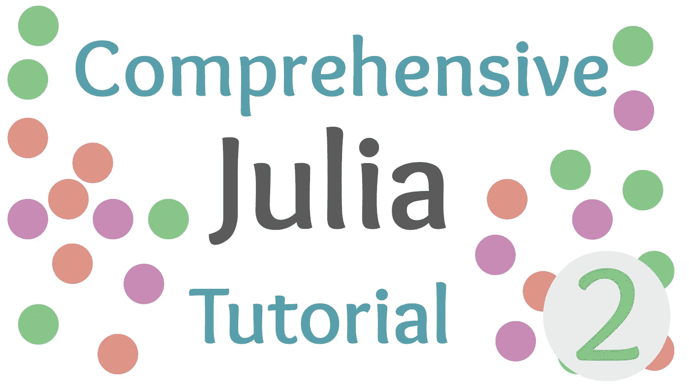

# 朱莉娅中的条件和方法介绍

> 原文：<https://towardsdatascience.com/an-introduction-to-conditions-and-methods-in-julia-a94de842b9f9?source=collection_archive---------46----------------------->

## 朱莉娅综合教程

## Julia 编程语言中条件句的制作方法和使用介绍



(图片由作者提供)

> 本文视频

# 介绍

在上一期全面的 Julia 教程中，我们看了一下安装 Julia，Julia 的包管理器(Pkg)，我们也简单看了一下 Julia 语言内部的类型。如果您还没有看过该教程，您可以在这里查看:

[](/an-introduction-to-the-julia-and-pkg-repls-7f61f5ff75ff) [## 茱莉亚和 PKG 回复的介绍

### 熟悉茱莉亚的魔法世界进行科学编程！

towardsdatascience.com](/an-introduction-to-the-julia-and-pkg-repls-7f61f5ff75ff) 

今天，我们将看看如何实际编写函数来处理我们的类型，以及如何在 Julia 语言中使用条件的概述。除此之外，我们将更深入地了解类型的世界，看看我们可以使用的更多类型。以下是今日笔记本和 Github repo 的链接:

[](https://github.com/emmettgb/JuliaLessons) [## emmettgb/JuliaLessons

### 此时您不能执行该操作。您已使用另一个标签页或窗口登录。您已在另一个选项卡中注销，或者…

github.com](https://github.com/emmettgb/JuliaLessons) [](https://github.com/emmettgb/JuliaLessons/tree/master/2) [## emmettgb/JuliaLessons

### 此时您不能执行该操作。您已使用另一个标签页或窗口登录。您已在另一个选项卡中注销，或者…

github.com](https://github.com/emmettgb/JuliaLessons/tree/master/2) 

# 功能

在 Julia 中，大多数函数也是方法。这是因为本质上我们调用的每个函数都可能需要被提供参数。这当然是 Julia 持有的函数式编程范例的一个品质，但是有一些方法可以绕过它，我们将会谈到，所以对这个声明要有所保留。在 Julia 中，我们可以使用关键字“function”创建一个函数。

```
function foo(parameter)
    code_here
end
```

我们还将使用“结束”关键字来结束它。函数带有参数，这些参数是我们将来使用函数时提供的。它们也是我们在代码中可能会用到的变量。

# 条件式

与大多数其他语言一样，Julia 中的条件运算符需要返回布尔类型的运算符，而不是数字或赋值。例如，“等于”的布尔运算符是==。如果我们对 5 和 5 使用这个操作符，我们不会将 5 设置为等于 5，而是返回两者是否相等。

```
5 == 5true
```

在 Julia 中，您可以运行三种不同类型的条件:

*   If —如果这是真的，则执行以下代码。
*   Elseif —如果不满足之前的任何条件，并且这是真的，则执行以下代码。
*   Else 如果该语句中的条件都不为真，则执行以下代码。

当然，当需要另一个 if 时，您不希望使用 elseif 之类的语句，因为如果满足前面的条件，在该检查中运行的代码将被忽略。

# 关于类型的更多信息

类型是 Julia 语言中非常重要的一部分:它们对语言的工作方式极其重要。方法本身被认为是类型，以及我们到目前为止看到的所有默认数据类型。Julia 中的许多数据类型都有自己的分隔符或表达式来标识它们的类型。字符串就是这样的一个例子，它使用引号来标记它们的开始和结束。

另一个例子是在字符中，字符使用撇号来标记它们的开始和结束。此外，符号和数组也有它们自己的标识符，这使得语言可以相对直接地分析我们在每个场景中试图创建什么类型。

```
String => "Hello"
Char => 'h'
Symbol => :Symb
Array => [5, 10, 15]
```

# 结论

虽然看起来我们现在处于 Julia 语言的基础阶段，但我相信那些跟上这些教程的人很快就会成为 Julian masters！对于科学和软件工程应用程序来说，Julia 都是一种很棒的语言，我认为它将是您的宝库中的一个巨大的补充！最重要的是，它对初学者相当友好，容易学习，所以我认为即使是相对快速的教学，它也很容易掌握。也就是说，我很感谢你的反馈，告诉我是不是速度太快了，细节太多了，还是我走得太慢了！感谢您的阅读！