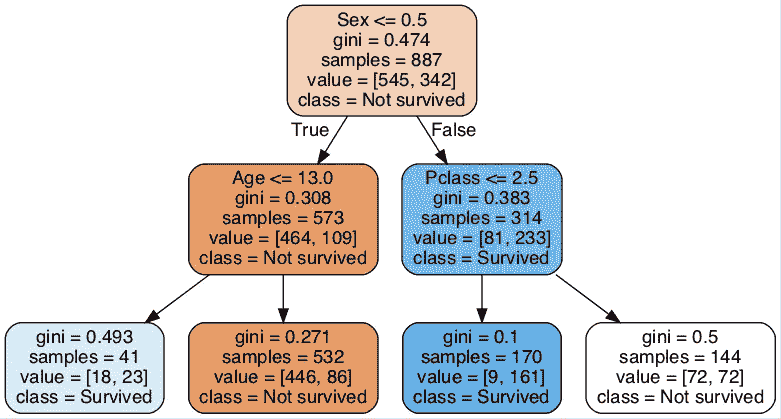
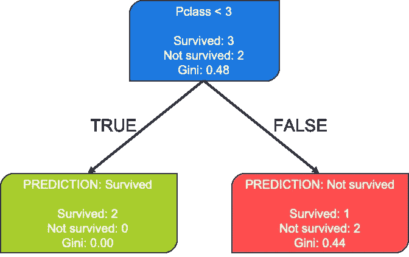
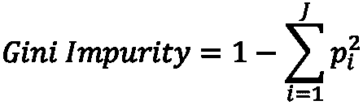
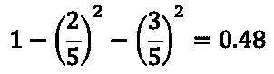
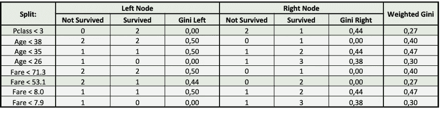
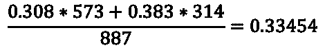

# Python 和 scikit 决策树简介-学习

> 原文：<https://towardsdatascience.com/an-introduction-to-decision-trees-with-python-and-scikit-learn-1a5ba6fc204f?source=collection_archive---------7----------------------->

## 这是一个完整的指南，帮助你对决策树有一个直观的理解和数学上的理解，从而用 scikit 实现你的第一个模型



最大深度为 2、准确率为 79.1%的简单决策树

决策树是一组强大的监督机器学习模型，可用于分类和回归。随着 *XGBoost* 库的兴起，决策树已经成为在竞争中提供最佳结果的一些机器学习模型。

这种模型存在于许多不同变体中；*随机森林，极度随机树，自适应增强，梯度增强*等等。然而，在本文中，我们将只探索非常标准的决策树的基础。

# 决策树的主要思想

让我们从决策树背后非常基本的思想开始，即根据一些特征分割我们的数据，以获得尽可能好的数据分组。那么这到底意味着什么呢？让我们考虑以下数据集:

```
 **Pclass      Age      Fare      Survived**
0          3       22       7,2             0
1          1       38      71,3             1
2          3       26       7,9             1
3          1       35      53,1             1
4          3       35       8,0             0
```

这是来自经典的*泰坦尼克号数据集*的数据，你可以根据诸如阶级、年龄、费用等特征来预测这个人是否幸存。对于我们拥有的小样本数据，我们可以看到 60% (3/5)的乘客幸存，40% (2/5)的乘客没有幸存。我们基本上想做的是，看看我们是否能在任何特征上分割这些数据，这样我们就能更好地预测结果。让我们看一看。



只有 5 个数据观察的基本决策树

好的，看起来，只要知道乘客的等级，我们就可以区分他们是一等舱还是三等舱，现在做一个预测，我们只得到一个错误(在右边，我们预测一个乘客没有生还，但那个乘客实际上幸存了)。这意味着我们现在只需进行一次分割就有 80%的准确率(比我们猜测所有人都幸存下来的 60%要好)。这显然是一个非常简单的解释，然而，这确实是决策树的主要思想:将组分成更多的*【纯】*子组(即，使得它们包含一个组的大多数)。然而，您可能会想:我们如何决定拆分哪个特性呢？我们如何决定在这个特性的什么地方进行分割？我们如何决定分几次？可能还有很多其他问题。让我们试着挖掘更多的细节。

# **如何衡量分割是否良好**

我们确实可以像上面看到的那样根据特征分割观察结果，但是我们如何真正决定一个分割是否产生了比初始数据更“纯”的两组数据。要理解如何衡量这一点，我们必须了解基尼系数*。基尼系数在数学上被描述为:*



基尼系数的数学符号

然而，如果你，像我一样，并不真正喜欢数学符号，它真正的意思是，你把每组观察值的平方除以总观察值。在这种情况下，我们有两组(幸存和未幸存)，所以我们只需做两次，然后从一个中减去所有内容。此示例计算决策树初始节点的基尼系数:



那么这种基尼杂质实际上是如何起作用的，我们为什么要使用它呢？首先，重要的是要知道，这不是唯一的措施，但它的使用相当广泛。基尼系数有一个很好的特点，当分割变得非常不相等时(例如，仅包含“*幸存”*观察值)，基尼系数接近 0，当两组包含完全相同数量的“*幸存*和“*未幸存*观察值时，基尼系数为 0.50。因此，我们的想法是，在新的分裂中，我们希望降低两个节点的基尼系数。尝试回到上面的基本决策树的表示，并看到两个新节点的基尼系数实际上更低(尝试看看您是否可以自己计算两个节点的基尼系数)。还要注意，左分裂的基尼系数是 0.00，因为我们在这一侧只有一个类(幸存)，因此我们不能使这一侧更加'*纯粹'。*对于左侧，它只是从 0.48 到 0.44 变得稍微更纯。

# 理解决策树算法

既然我们已经知道了一个分裂的好坏分类，让我们深入研究一下分裂树的算法实际上是如何工作的。毫不奇怪，该算法实际上正如我们所预期的那样工作，即遍历数据中每个单一特征的每个可能的分割，计算每种情况下的基尼系数，然后根据找到的最低加权基尼系数进行分割。然后，根据数据被分割成的每组数据重复这些步骤，当不再有能够减少*基尼系数杂质*的分割时，停止这些步骤。这个算法叫做 CART，是 sklearn 已经实现的，

这实际上相当简单，但手动操作起来相当困难，因为潜在的拆分数量太大，手动操作会花费太多时间。如果我们回到之前缩短的数据集，这实际上意味着我们必须在 *Pclass* 上模拟一个拆分(尽管这很容易，因为只有一个潜在的拆分)，然后在*年龄上模拟一个拆分(因为 35 年发生了两次，所以总共有 3 个潜在的拆分)，*最后我们必须模拟票价的拆分(然后有 4 个不同的潜在拆分，因为所有的值都是唯一的—记住，我们没有 5 个拆分，因为我们需要在每个组中至少放置 1 个观察值)。

```
 **Pclass      Age      Fare      Survived**
0          3       22       7,2             0
1          1       38      71,3             1
2          3       26       7,9             1
3          1       35      53,1             1
4          3       35       8,0             0
```

对于我们模拟的每一个分裂，我们显然必须计算两边的基尼系数。值得注意的是，我们根据两个*基尼系数的*加权平均值*来评估后分割。*假设我们有 500 个观察值，很可能我们会以某种方式进行拆分，在一组中只有 1 个观察值，而在另一组中有 499 个观察值。在只有一个观察值的组中，我们的基尼系数为 0.00(请记住，这是当所有数据都被正确分类时的数据)，另一方面，根据数据的分布，我们的基尼系数可能接近 0.50。如果我们只取正态平均值，那么基尼系数的平均值为 0.25，而加权平均值为(0.00 * 1 + 0.50 * 499) / 500 = 0.499。至少对我来说，我们取一个加权平均值似乎更合理，而不是给一个分裂以相同的权重，我们只忽略一个观察值。

我们实际上可以将所有分割的模拟放入一个表中，因为数据量并不是很大。我们看到两个最好的分割将是 *Pclass < 3* 和 *Fare < 53.1 —* 这确实是我们在上面的图像*中看到的。*



寻找决策树的最佳分割

关于决策树，值得注意的一点是，即使我们进行了最优分割，我们也不一定知道这是否会导致后续节点的最优分割。因此，当我们决定在 *Pclass* 上进行拆分时，这是局部最优的拆分，我们不知道这种拆分是否会导致树中进一步的最优拆分。由于这个原因，决策树算法通常被称为'*贪婪'*算法，因为我们不计算全局最优分裂。如果我们必须这样做，算法会慢得多(对于相当大的数据集，甚至可能无法执行)。

# 用 Python 实现算法

CART 算法实际上可以很容易地用 Python 实现，我在下面的 GitHub Gist 中提供了这一点。代码没有以任何方式优化，只是为了与泰坦尼克号数据集一起工作。如果可以在其他数据集上运行，您可以尝试对 se 进行一些调整。此外，它只是计算最佳的第一次分裂。我特意决定这样做，因为更多的代码函数只会使它变得更大，我只是想传达一个单独的拆分是如何进行的，因为这实际上是进行下一个拆分的相同过程。

```
**Out [1]:**Best split-feature     : Sex
Value to split on      : 0.0
Weighted gini impurity : 0.33454
```

让我们试着回到用 sklearn DecisionTreeClassifier 训练的决策树的第一张图片，我没有提到它。


最大深度为 2、准确率为 79.1%的简单决策树

我们看到，该决策树的加权*基尼系数*正好是 0.33454，我们可以通过以下方式计算:



希望这篇文章对你更深入的了解决策树，理解算法的工作原理有所帮助。请随意留下您的评论或问题。我目前还在撰写一篇关于兰登森林的文章，一旦准备好，我会马上链接到这里。