# 深度前馈神经网络导论

> 原文：<https://towardsdatascience.com/an-introduction-to-deep-feedforward-neural-networks-1af281e306cd?source=collection_archive---------12----------------------->

## 前馈神经网络的数学基础

前馈神经网络是最简单的人工神经网络，在机器学习中有很多应用。这是有史以来创建的第一种类型的神经网络，对这种网络的深刻理解可以帮助您理解更复杂的架构，如卷积或递归神经网络。这篇文章的灵感来自 Coursera 上吴恩达的[深度学习专业化课程](https://www.coursera.org/specializations/deep-learning?utm_source=gg&utm_medium=sem&utm_content=17-DeepLearning-ROW&campaignid=6465471773&adgroupid=77415260637&device=c&keyword=coursera%20deep%20learning%20ai&matchtype=b&network=g&devicemodel=&adpostion=&creativeid=379493133115&hide_mobile_promo&gclid=CjwKCAjw4pT1BRBUEiwAm5QuRwgTOsOYZ5KBSCJ2uUPnH0uM5tieL87a4aVcmxP_SAtDaaMX2_9prBoCmjEQAvD_BwE)，我使用了类似的符号来描述神经网络架构和相关的数学方程。本课程是开始学习神经网络的一个非常好的在线资源，但是因为它是为广泛的受众创建的，所以省略了一些数学细节。在本文中，我将试图推导出描述前馈神经网络的所有数学方程。

**批注**

目前 Medium 只支持数字的上标，不支持下标。所以要写变量的名字，我使用这个符号:^后面的每个字符都是上标字符，而 _(和^之前，如果有的话)后面的每个字符都是下标字符。例如

在这个符号中被写成*【w_ij^[l】*。

**神经元模型**

神经元是我们大脑的基本单位。据估计，大脑大约有 1000 亿个神经元，这个庞大的生物网络使我们能够思考和感知我们周围的世界。基本上，一个神经元所做的是从其他神经元接收信息，处理这些信息，并将结果发送给其他神经元。这个过程如图 1 所示。单个神经元有一些输入，通过*树突接收。*这些输入在*细胞体*中汇总在一起，并转化为信号，通过*轴突*发送给其他神经元。轴突通过*突触*与其他神经元的树突相连。突触可以充当一个权重，并根据该连接的使用频率使通过它的信号变强或变弱。

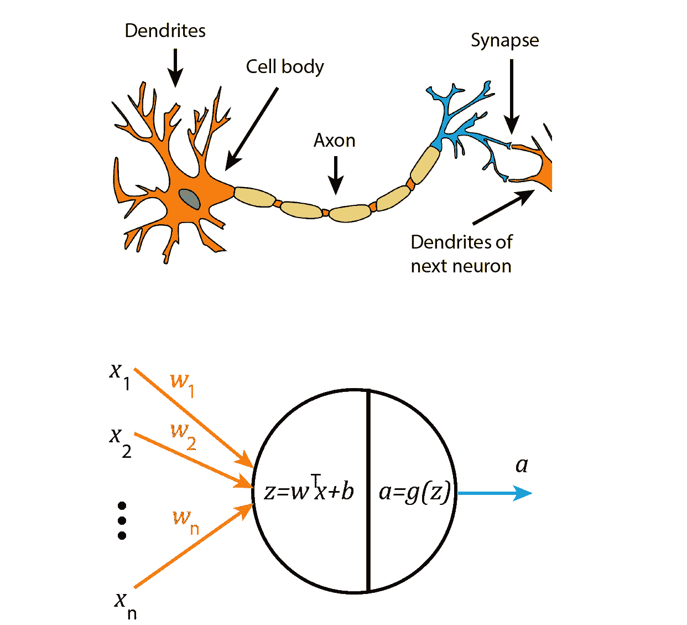

图 1

这种对神经元的生物学理解可以转化为如图 1 所示的数学模型。人工神经元取一个向量*的输入特征**x1，x2，.。。，x_n* ，并且它们中的每一个都乘以一个特定的权重， *w_1，w_2，.。。加权输入被加在一起，一个被称为 *bias* ( *b* )的常数值被加到它们上，以产生神经元的*净输入**

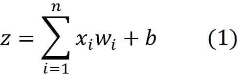

然后，网络输入通过*激活函数* *g* 产生输出 *a=g(z)* ，然后将该输出传输到其他神经元

激活函数由设计者选择，但 *w_i* 和 *b* 在神经网络的训练过程中通过某种学习规则进行调整。

**激活功能**

在神经网络中可以使用不同的激活函数，下面将讨论其中一些更常用的函数。

*1-二进制阶跃函数*

二元阶跃函数是基于阈值的激活函数。如果函数的输入(z)小于或等于零，则神经元的输出为零，如果大于零，则输出为 1

图 1

阶跃函数在点 *z* =0 处不可微，其导数在所有其他点处为零。图 1 显示了阶跃函数及其导数的曲线图。

*2-线性函数*

线性激活函数的输出等于其输入乘以常数 *c*

该功能如图 2(左)所示。它的导数等于 *c*

对于 *g* 使用撇号表示相对于这里的自变量 *z* 的区别。图 2(右)显示了 *g(z)* 的导数图

图 2

*3-s 形函数*

它是一个非线性激活函数，在 0 到 1 的范围内给出连续输出。它被定义为

Sigmoid 具有类似于阶跃函数的特性，但是，它是连续的，可以防止阶跃函数中存在的输出值跳变。图 3(左)显示了乙状结肠的曲线。

图 3

Sigmoid 是一个可微函数，因为我们稍后需要它的导数，所以我们可以在这里导出它

图 3(右)显示了 sigmoid 的导数图。

*3-双曲正切函数*

它是一个非线性激活函数，类似于 sigmoid，但在-1 到 1 的范围内提供连续输出。它被定义为

图 4

它的导数是

图 4 显示了该函数及其导数的曲线图。

*4-整流线性单元(ReLU)功能*

ReLU 是深度神经网络中非常流行的激活函数。它被定义为

虽然看起来像线性函数，但 ReLU 确实是非线性函数。图 5(左)显示了该函数的曲线图。

图 5

它的导数是

该函数在 *z=0* 处有一个断点，在该点不定义其导数。但是我们可以假设当 *z* 等于 0 时，导数或者是 1 或者是 0。如图 5(右)所示。

*5-漏热路功能*

ReLU 还有另一个版本，称为泄漏 ReLU，其定义为

其中 *c* 是一个小常数(比如 0.001)。

这里当 *z* 为负时，函数不为零。相反，它有一个等于 *c* 的小斜率，这使得它的导数大于零。它的导数是

图 6 显示了该函数及其导数的曲线图。

神经网络通常用向量和矩阵来描述，这种矩阵表达式将贯穿本文。为了确保读者理解向量和矩阵运算，在开始对前馈神经网络建模之前，我将在下一节回顾矩阵代数。

## **线性代数**

**加法和乘法**

矩阵是数字或变量的矩形阵列。在本文中，我们使用大写粗体字母来表示矩阵。我们用*[****A****]_ ij*或 *a_ij* 来表示矩阵 ***A*** 在行 *i* 列 *j* 的元素。例如

和

向量是只有一行或一列的矩阵。向量的元素通常用一个下标来标识。按照惯例，我们使用小写粗体字母表示列向量。例如， **x** 是一个列向量

我们用*[****x****_ I*或 *x_i* 来表示向量 ***x*** 的第 *i* 个元素。

如果向量有相同数量的元素，我们可以通过相加它们相应的元素来相加。所以如果 ***a*** 和 ***b*** 都有 *n* 元素，***c***=***a***+***b***也是一个有 *n* 元素的向量并且是

类似地，如果两个矩阵具有相同的形状，我们可以将它们相加。如果 ***A*** 和 ***B*** 都是 *m* × *n* 矩阵，那么***C***=***A***+***B***是一个 *m* × *n* 矩阵定义为

在线性代数中，没有定义矩阵和向量的相加，然而，在深度学习中，允许矩阵和向量的相加。如果 ***A*** 是一个***m*×*n*矩阵并且 ***b*** 是一个具有 *m* 元素的列向量，那么***C***=***A***+***b***得出一个【A】**

****

**于是 ***b*** 被添加到 ***A*** 的每一列中。这种形式的添加通常被称为*广播*操作。**

**如果 **A** 是一个 *m* × *p* 矩阵，而 **B** 是一个 *p* × *n* 矩阵，那么矩阵乘积 **C** = **AB** (它是一个 *m* × *n* 矩阵)定义为**

**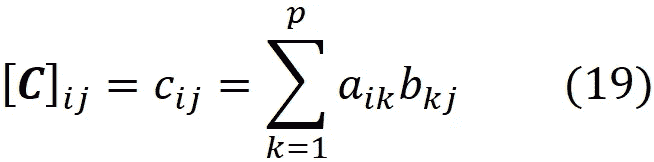**

****转置****

**一个 *m* × *n* 矩阵 ***A*** (用 ***A*** 上标 *T* 表示)的转置是一个 *n* × *m* 矩阵，它的列是由 ***A* 对应的行构成的例如等式中 ***A*** 的转置。14 是****

****

**行向量的转置变成具有相同数量元素的列向量，反之亦然。作为惯例，我们假设所有的向量都是列向量，所以我们显示一个行向量作为列向量的转置。例如，***x****^t*是列向量 ***x*** 在等式中的转置。15**

****

**实际上，转置矩阵的第 *i* 行第 *j* 列的元素等于原矩阵的第 *j* 行第 *i* 列的元素。因此**

****

**转置有一些重要的性质。一、**的转置*的转置*的转置**是**的转置*一*的转置****

****

**此外，产品的转座是逆序转座的产品**

****

**为了证明这一点，请记住矩阵乘法(等式。19).现在基于矩阵转置的定义(等式。20)，左边是**

****

**右边是**

****

**所以等式两边是相等的。**

****点积****

**如果我们有两个向量*和***

********

****这些向量的点积(或内积)定义为 ***u*** 乘以 ***v*** 的转置****

********

****基于这个定义，点积是可交换的****

********

****如果我们将一个列向量 ***u*** (有 *m* 个元素)乘以一个行向量***v****^t*(有 *n* 个元素)，结果就是一个 *m* × *n* 矩阵****

********

****这是矩阵乘法规则的特殊情况，假设*是只有一列的矩阵，而 ***v*** 是只有一行的矩阵(等式 1)。19).*****

****具有 *n* 个元素的向量*的长度(也称为 2 范数)定义为*****

**********

*****点积也可以用向量的长度来表示。如果两个向量 ***u*** 和 ***v*** 之间的角度是 *θ，*那么它们的点积也可以写成*****

********

****我们知道余弦的最大值在 *θ* =0⁰为 1，最小值在 *θ* =180⁰.为-1 所以如果我们固定 ***u*** 和 ***v*** 的长度，它们的点积的最大值出现在它们方向相同的时候( *θ* =0⁰)，它们的点积的最小值出现在它们方向相反的时候( *θ* =180⁰).)****

******分块矩阵******

****一个大矩阵可以分成子矩阵或块。块可以被视为矩阵的元素，因此分块矩阵成为矩阵的矩阵。例如，矩阵****

********

****也可以写成****

********

****在哪里****

********

****所以我们可以把 ***A*** 的每一列看成一个列向量，把*A 看成一个只有一行的矩阵。同样，我们可以把 ***写成*** 为*****

********

****在哪里****

********

****所以*可以认为是一个只有一列的矩阵。*的每一行现在是一个行向量，这些行向量中的每一个都是一个列向量的转置。将分块矩阵相乘时，可以像对待常规矩阵一样对待它们。例如，如果我们把矩阵 ***分割成一个*** 作为列向量******

********

****并将矩阵 ***B*** 作为行向量****

********

****然后将 ***A*** 乘以 ***B*** 得到****

****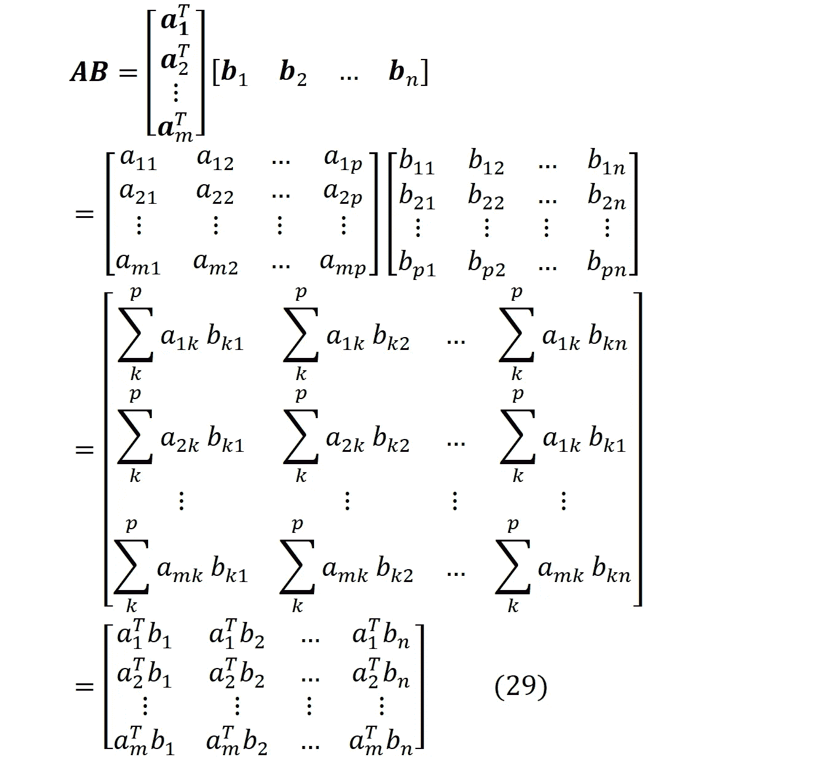****

****所以 ***AB*** 的每个元素都是 ***A*** 同一行的子矩阵(是行向量)与 ***B*** (是列向量)同一列的子矩阵的点积。作为特例，将分块矩阵*乘以列向量 ***c*** 给出*****

********

*******Ac*** 是一个被视为列向量的分块矩阵，这个向量的每个元素是列向量*与 ***A*** (这是一个行向量)的同一行子矩阵的点积。类似地，假设我们想要将矩阵 ***A*** 乘以分块矩阵 ***B*** ，该分块矩阵只有一行，并且其每个元素都是列向量。我们可以写作*****

********

******哈达玛产品******

****假设 ***a*** 和 ***b*** 是两个相同维数的向量****

********

****然后 ***a*** 和 ***b*** 的哈达玛乘积被定义为这些向量的元素级乘积****

********

****所以我们有****

********

****相同维数的两个矩阵 ***A*** 和***B***m*×*n*的哈达玛积是相同维数的矩阵，定义为*****

******

***所以它是它们的元素乘积***

******

*****矢量化函数*****

***函数可以接受一个向量或矩阵，并返回一个标量。例如，如果 ***x*** 是一个向量，而 *y* 是一个标量，那么我们可以这样定义一个函数***

******

***此外，也可以有一个函数，它接受一个矩阵，然后返回另一个矩阵。在本文中，我们称之为*向量化函数*。假设 ***A*** 是一个 *m* × *n* 矩阵， *f* 是一个取一个标量并返回另一个标量的函数(例如*f*:*R*->*R*)。在这里，符号*f*(***A***)表示 *f* 到 ***A*** 的基本应用***

******

***对于一个矢量，可以写出一个类似的方程。所以简单地看一个像*f(****x****)，*这样的函数，除非知道它是如何定义的，否则我们无法判断它是返回标量、向量还是矩阵。***

*****矩阵演算*****

***学习神经网络时，我们处理的是多变量函数，所以要熟悉多变量微积分。假设 *f: R^n- > R* 是一个多变量函数***

******

***所以 *f* 有一个 *n* 维输入，但它是一个*标量函数*，这意味着它的范围是一维的(它的输出是一个标量)。***

***多变量函数的*偏导数*是它对其中一个变量的导数，其他变量保持不变。事实上，f 相对于 x 的偏导数***

******

***当只有变量 *x_i* 在点 *x_1，x_2，…，x_i，…x_n* 增加时，测量 *f* 如何变化。***

***多变量函数的*全微分*是变量单独变化产生的偏微分之和***

******

***全微分测量当所有变量在点( *x_1，x_2，..，x_i，…x_n* )。***

***微积分中的*链式法则*用于计算一个函数的导数，这个函数是其他导数已知的函数的组合。假设 *x* 、 *y、*和 *z* 为标量变量， *f* 和 *g* 为[可微函数](https://en.wikipedia.org/wiki/Differentiable_function)。假设 *y = g(x)* 和 *z = f(y) = f(g(x))* 。然后根据我们掌握的链条***

******

***我们也可以把链式法则推广到向量。假设 ***x*** ，**y**为矢量， *z* 为标量。假设*y = g(****x****)**z = f(****y****)= f(g(****x****)*。现在我们有了***

******

*****渐变*****

***假设 *f* 是一个函数。 *f* 相对于矢量 ***x*** 的*倾斜度定义为****

******

***所以 *f* 的梯度是一个向量，梯度的每个元素 *i* 是 *f* 相对于 *x_i* 的偏导数***

******

***梯度推广了导数的概念， *f* 的梯度就像 *f* 相对于向量的导数。我们也可以求函数对矩阵的导数。假设 ***X*** 是一个 *m* × *n* 矩阵， *g* 是一个标量函数。 *g* 相对于矩阵 ***X*** 的梯度是一个矩阵，定义为***

******

***这意味着***

******

***此外，我们可以定义向量 ***y*** (具有 *n* 个元素)相对于另一个向量*(具有 *m* 个元素)的导数****

********

****这意味着****

********

******神经元模型******

****现在我们可以用矢量形式表示神经元模型方程。神经元的输入是矢量****

********

****神经元的权重可以用向量来表示****

****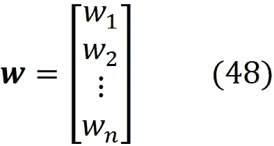****

*******x*** 和 ***w*** 的点积给出 *z*****

********

****神经元的*激活*输出为****

********

****其中 ***w*** 和 *b* 为神经元的可调参数。****

******监督学习******

****一个*训练集*被定义为****

********

****而每一对(***x****，*【y^(i】)*称为一个*训练实例*。这里我们用括号()内的数字作为上标来指代训练样本的编号，所以 *m* 就是训练集中训练样本的编号。***x****【^(i】*是一个称为*的特征向量*或训练示例 *i* 的*输入向量*。它是一个数字向量，这个向量的每个元素称为一个特征。每个***×个****【^(i】)*对应一个*标签 y^(i).*我们假设有一个未知函数*y = f(****x****)*将特征向量映射到标签上，所以*y^(i)=**f(****x****^(i)*。现在监督学习的目标就是利用上面的训练集来学习或者近似 *f* 。换句话说，我们希望使用训练集来用另一个函数 *fhat* 估计 *f* ，然后使用*****

********

****其中帽子符号表示估计值。我们希望 *fhat(x)* 不仅对于训练集中的输入向量(***x****【^(i】*)接近 *f(x)* ，而且对于训练集中不存在的新输入向量也是如此。****

****当标签为数值变量时，我们称学习问题为*回归*问题，当标签为分类变量时，该问题称为*分类*。在分类中，标签是一个范畴变量，可以用有限集*y^(i)*∑{ 1，2，.。。， *c* }，其中每个数字是一个类标签， *c* 是类的数量(类标签可以是任何东西，但是你总是可以像这样给它们分配一个数字)。如果 *c* = 2 且类别标签互斥(意味着每个输入只能属于其中一个类别)，我们称之为*二元分类*。一个例子是确定患者是否患有某种疾病的医学测试(图 7 顶部)。****

****如果 *c* > 2 和类标签互斥，则称为*多类*分类。例如，假设我们想要检测图像中的三种动物:一只狗、一只猫和一只熊猫。但是在每张图片中，我们只能有一种动物。所以标签是互斥的，这是一个多类*的*分类问题(图 7 中)。在多类问题中，每个训练示例都是一对****

****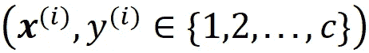****

****我们将使用一种叫做*一键编码*的方法将这些类编号转换成二进制值。我们将标量标签 *y* 转换成一个向量 ***y*** ，它有 *c* 个元素。当 *y* 等于 *k* 时，*的第 *k* 个元素为 1，其他元素为 0。事实上， ***y*** 的第 *i* 个元素是为示例的输入向量发出类 *i* 存在或不存在的信号。在每个标签向量中，只有一个元素可以等于 1，其他的应该为零。所以对于每一个***【x^】****(I)*我们都有一个标签向量***【y^】****(I)*与 *c* 元素*****

********

****现在我们的训练集可以定义为{***x****^(i)****y****^(i)*}。如果类别标签不是互斥的，我们称之为*多标签分类*。假设在前面提到的动物的图像分类中，每一种都可以独立存在于图像中。例如，我们可以在同一个图像中同时拥有一只狗和一只猫。因此，标签不再相互排斥，现在我们有一个多标签分类问题(图 7 底部)。****

****在多标签分类中，每个类被认为是一个单独的标签，每个 *y^{i}* 可以接受一组为该训练示例提供的类。我们可以使用*多热编码*将这些类号转换成二进制值。同样，我们将标量标签 *y* 转换成一个向量 **y** ，它有 *c* 元素。*的第 *i* 个元素表示类 *i* 的存在或不存在，因此当类存在时 *y_i* =1，当类不存在时 *y_i* =0。然而，在每个标签向量中，多个元素可以等于一个，因为类不再相互排斥。*****

********

****所以我们的训练集可以定义为****

****{***x****【^(i】)****y****^(i)*}****

********

****图 7****

******一层神经元******

****单个神经元是一个简单的计算单位，为了学习复杂的模式，我们通常需要大量的神经元一起工作。神经元*层*由一些并行工作的神经元组成。每一层中的神经元应该同时但独立地工作。我们可以将原始数据视为一个单独的层，并将其称为*输入层*(图 8)。****

********

****图 8****

****当我们计算神经网络的层数时，我们不包括输入层。所以输入层之后的下一层是层 1。我们使用方括号[]内的数字作为上标来表示层数。所以第一层的第二个神经元的输出或激活是****

********

****每层中神经元的数量由 *n.* 表示，因此第一层中神经元的数量为****

********

****并且第一层中最后一个神经元的激活将是****

********

****对于输入图层，假设图层编号为零，因此输入要素的数量为****

********

****第一层中神经元 *i* 的权重可以由向量表示****

********

****这里****

********

****代表进入第 1 层神经元 *i* 的输入特征 *j* 的权重(图 9)。****

********

****图 9****

****我们可以使用权重和输入向量来计算第一层的激活。我们可以用等式。49 和 50 来计算层 1 中神经元 *i* 的激活****

********

****其中 *b_i* 为第 1 层神经元 *i* 的偏置，*g^[1】*为第 1 层每个神经元的激活函数。激活函数接收一个标量输入(神经元的净输入)并返回另一个标量，即神经元激活。****

******前馈神经网络******

****现在我们可以考虑一个有几层的网络。网络的最后一层称为*输出层*，如果中间有任何层，我们称之为*隐藏层*(图 10)。****

****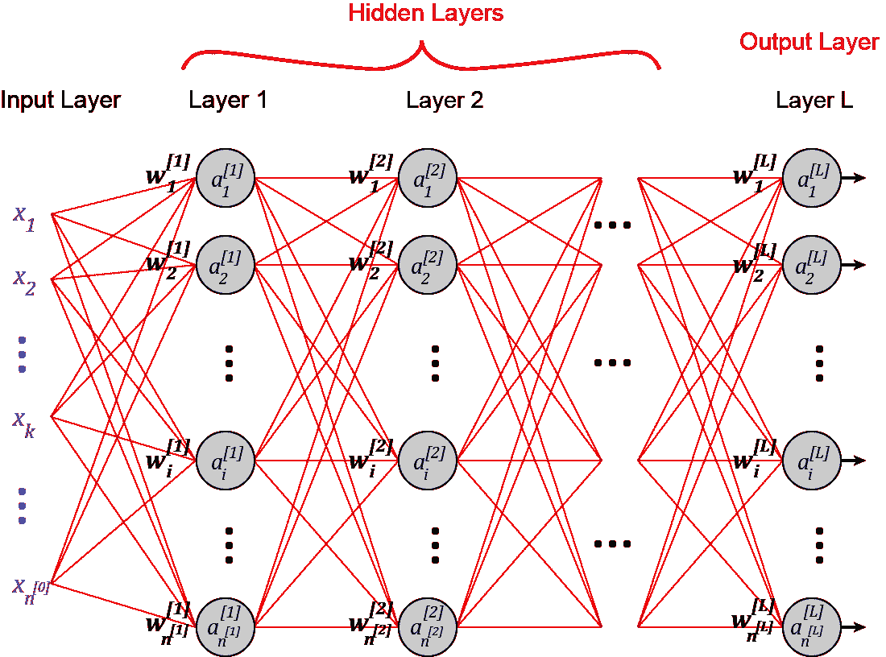****

****图 10****

****在前馈网络中，信息仅向前移动，从输入层通过隐藏层(如果存在)到达输出层。这个网络中没有循环或回路。前馈神经网络有时被含糊地称为*多层感知器*。层 *l* 中的神经元数量表示为****

********

****层 *l* 中神经元的净输入可以由向量表示****

********

****类似地，层 *l* 中神经元的激活可以由*激活向量*表示****

********

****并且层 *l* 中的神经元 *i* 的权重可以由向量表示****

********

****在哪里****

********

****代表输入 *j* (来自层 *l-1* 的神经元 *j* )进入层 *l* 的神经元 *i* 的权重(图 11)。****

****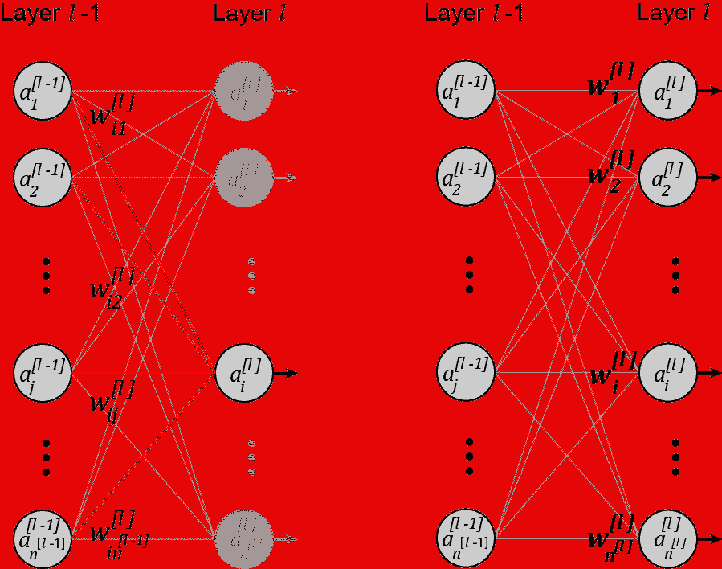****

****图 11****

****如图 11 所示，在层 *l* 中，所有输入都连接到该层的所有神经元。这样的层称为*致密层*或*全连通层*。****

****现在，我们可以使用层 *l* 中神经元的权重和输入向量来计算它的激活****

****************

****其中*b_i^[l】*为 *l* 层神经元 *i* 的偏差，*σ^[l】*为 *l* 层各神经元的激活函数。需要注意的是，每一层可以具有不同的激活函数，但是一层中的神经元通常具有相同的激活函数。为了有一个一致的符号，我们可以假设****

********

****所以当 *l=1* 时，等式。60 换算成 Eq。55 而且我们不需要单独写。现在情商。60 可用于网络的所有层。****

******对激活进行矢量化******

****我们可以将一个层的所有权重组合成该层的权重矩阵****

**********

*****该分块矩阵的第 *i* 个元素是一个行向量，该行向量是一个列向量的转置，该列向量给出了层 *l* 中神经元 *i* 的权重。如果我们展开这个矩阵，我们得到*****

********

****所以这个矩阵的( *i，j* )元素给出了从层 *l-1* 中的神经元 *j* 到层 *l* 中的神经元 *i* 的连接的权重。我们也可以有一个*偏置向量*****

********

****其中第 *i* 个元素为第 *l* 层神经元 *i* 的偏置。现在使用 Eqs。30 和 59，我们可以写****

****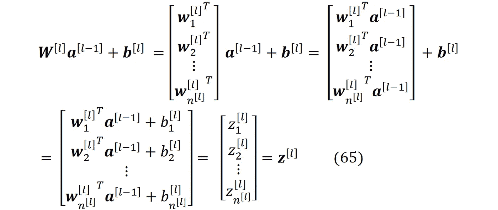****

****请注意，在 Eq 的第一行。65 我们将偏置向量添加到矩阵中，该矩阵是等式中定义的广播加法。18.****

****如果我们应用矢量化的激活函数(回想等式。37)在层 *l* 中，使用等式。我们得到 57 和 60****

********

****现在，通过重新排列前面的等式，我们终于得到了****

********

****情商。67 是前馈神经网络的*正向传播*方程。使用这个等式，我们可以使用前一层的激活来计算该层的激活。如果我们应用等式。65 和 67 到第一层( *l* =1)，那么前一层就是输入层(等式。61)，所以我们有****

****************

******输入向量的矢量化******

****现在假设我们有一个包含 m 个例子的训练集。所以我们有一组输入向量用于整个训练集****

********

****每个例子都有*【n^[0】*输入功能和以前一样****

********

****我们现在可以组合训练集中的所有输入向量，得到一个*输入矩阵*****

********

****这个分块矩阵的每个元素是一个列向量，并且等于训练集的第 *i* 个例子的输入向量，所以这个矩阵的每个元素是****

********

****这些例子中的每一个都可以用作神经网络的输入层。以预测每个训练示例的每层的激活。****

****************

****注意，上标[ *l* ]表示层数，括号中的上标( *j* )表示训练样本数。情商。73 也可以写成****

********

****因此，这些等式给出了用于训练示例号 *j* 的层 *l* 的净输入和激活向量。对于第一层，我们可以写(使用等式。68 和 69)****

********

****我们也可以写****

********

****在 Eq 的第一行。77 我们用了 Eq。31 来做乘法，在第三行，我们用了 Eq。75 简化一下。我们可以将*网*输入矩阵*定义为*****

********

****所以我们有****

********

****这里 **Z** ^[ *l* 的第 *i* 列是训练样本号 *i* 的 *l* 层的净输入。类似地，我们可以将*激活矩阵*定义为****

************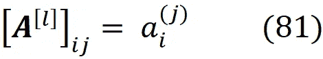****

****现在我们可以用 Eq 了。78(用 *l* =1)来重写等式。77 作为****

********

****如果我们将矢量化的激活函数应用于等式。78，使用等式。我们得到 76 和 80****

********

****通过结合等式。82 和 83(其中 *l* =1)，我们有****

********

****我们也可以使用等式。31、73、78 和 80 来写****

********

****通过结合等式。83 和 85 年，我们终于有了****

****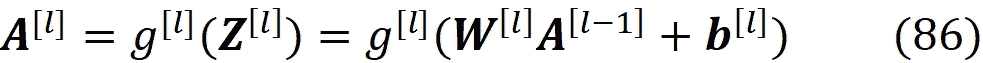****

****这个方程是整个训练集的矢量化前向传播方程。我们也可以假设****

********

****所以情商。86 转换成 Eq。84 当 *l=1* 时。****

******线性与非线性激活******

****在之前介绍的激活函数中，只有线性激活与净输入具有线性关系(这就是为什么我们称之为线性激活！).但是我们为什么需要非线性激活函数呢？假设 *l-1* 和 *l* 层的所有神经元都具有线性激活函数。对于层 *l-1* 我们可以使用等式。74 和线性激活函数的定义(等式 4)写****

********

****我们现在可以用这个等式写出层 *l* 的激活向量****

********

****这个等式表明我们可以用线性激活将层 *l-1* 和 *l* 合并成一个层。它需要***a****^[l-2】*并返回 ***a*** *^[l].*这个新图层的权重矩阵是***w****【^[l】****w****【^[l-1】*，其偏移向量是***w****【^[l】****b****^[l-1]+****b****现在假设网络的所有层都有线性激活。然后我们可以将它们合并成一个线性图层。因此，网络表现得像单层神经网络，这样的网络不是学习非线性数据的好选择。因此，非线性激活函数是多层神经网络的重要组成部分。*****

******输出层******

****记得***a****【^[l】*是神经网络最后一层的激活向量。然而，我们通常使用矢量 ***yhat*** 来激活输出层，因为它是网络的最终输出。因此，对于示例 *j，*我们有****

********

****对于一个回归问题，我们对每个训练样本都有一个实值标签，所以我们通常使用一个具有线性激活函数的单个神经元。如前所述，我们有三种类型的分类问题:二进制、多类和多标签。对于每种类型，我们对输出层使用不同的布局。假设我们有 *m* 个例子，每个例子都有*n^[0】*个特征。另外，假设我们有标签的 *c* 类。因此，每个训练示例都是一对****

********

****如果我们有一个二进制分类问题，那么 *c* =2，并且这些类是互斥的。在这种情况下，我们在输出层中使用具有 sigmoid 激活函数的单个神经元。我们通常对输出层使用 sigmoid 激活函数，因为它的输出在[0，1]的范围内，并且我们可以将其解释为其相应类别的概率。一个问题是，大多数激活函数给出的是连续输出，而不是二进制输出。因此，我们需要一种方法来将激活函数的原始输出解释为二进制输出。我们可以将阈值定义为 0.5。如果一个示例的输出值小于或等于 0.5，则意味着该示例属于类 1，如果大于 0.5，则意味着它属于类 2。这如图 12 所示。****

********

****图 12****

****如果我们有一个多标签问题，那么 *c* ≥2，并且这些类不是互斥的。我们使用多重热编码将*【y^(i】*转换成向量***y****【^(i】*，其中有 *c* 元素(等式。53).现在，我们的输出层应该有具有 sigmoid 激活的 *c* 神经元，每个神经元给出***y****【^(i】*的一个元素的值。事实上，每个神经元的激活都在表明输入是否属于某一类。所以***y****【^(i】*的元素个数等于最后一层*n^[l】*的神经元个数。我们仍然可以将 0.5 阈值应用于每个神经元，以将原始激活向量转换为多热点编码向量的二进制输出(图 13)。****

********

****图 13****

****如果我们有一个多类问题，那么*c>2，并且这些类是互斥的。这里我们使用一键编码将 *y^(i)* 转换成向量***y****【^(i)*，其中有 *c* 元素(等式。52).所以对于每一个***【x^】****【我】*我们都有一个标签向量**【我】*******

******

***现在我们的训练集可以定义为***

******

***现在我们的输出层应该有 *c* 神经元，所以 *n^[L]=c* 和*t57】每个神经元的激活都在表明输入是否属于某一类。然而，我们不能再使用具有乙状结肠激活的 *c* 神经元。当我们有一个独热编码向量时，元素的和总是等于 1(因为它们中只有一个可以是 1)。这也意味着这些元素不是相互独立的。当这些元素中的一个变成 1 时，其他的被迫为零。****

***然而，由输出层中具有 sigmoid 激活函数的 *c* 神经元产生的概率是独立的，并且不被约束为总和为 1。这是因为这些激活功能是独立工作的。我们想要的是输出向量的分类概率分布。所以它们应该被限制为和为一。为此，我们使用 *softmax 激活功能*。***

***softmax 激活函数总是添加到神经元的最后一年(图 14)，具有该激活函数的最后一层称为一个 *softmax 层*。它与前面提到的其他激活功能有很大的区别。它不能单独应用于每个神经元，而是结合所有神经元的净输入来计算它们的激活。***

***softmax 层如图 14 所示，看起来有点不同。这里每个圆圈显示最后一层的一个神经元，但是每个圆圈的输出是该神经元的净输入，而不是它的激活。这些网络输入然后进入矩形图中的 softmax 激活，softmax 的输出是单个神经元的激活。***

******

***图 14***

***softmax 层的输出(实际上是神经元的激活)是向量*，其具有与***【z】***(净输入向量)相同数量的元素，并被定义为****

****************

****因此，softmax 层通过将每个元素除以输入向量中所有元素的总和来标准化其输入。指数函数总是给出一个正的结果，即使 *z_i* 不为正， *a_i* 也会为正。因此，softmax 层的激活是一组总和为 1 的正数****

********

****它可以被认为是一个概率分布。****

****现在，通过将 softmax 函数应用于最后一层神经元的网络输入，我们得到了一个标准化的激活向量。最大值元素决定了输入向量属于哪个类。这样，我们可以将 softmax 的激活向量转换为二进制输出，这是一个独热编码向量。例如，如果 softmax 层的激活向量为[0.5±0.15 0.35]^t，它将被转换为二进制输出向量[1±0 0]^t.对于具有 *c* 类的多类问题，我们使用具有 *c* 神经元的 softmax 层作为输出层(图 15)。****

********

****图 15****

****为了理解 softmax 函数的来源，我们应该先定义一下 *hardmax* 函数。我们使用 hardmax(也称为 *argmax* )来确定向量中哪个元素的值最高。hardmax 取一个向量 ***z*** ，返回另一个向量 ***a*** 。如果 *z_i* 是 *z* 的最大元素，则 *a_i* =1 否则 *a_i* =0。举个例子****

********

****这里如果 ***z*** 有不止一个最大元素，那么 1 会在它们之间被除。所以如果它有 *p* 个最大元素，那么 *a_i=* 1 */p* 为全部。例如****

****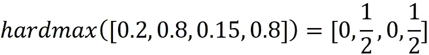****

****根据上述定义，hardmax 的输出元素被限制为总和为 1。Softmax 是 hardmax 函数的平滑近似。我们可以将 softmax 函数写成更一般的形式:****

********

****其中 *β* 为常数。现在我们来看看如果 *β* 趋于无穷大会发生什么。假设 ***z*** 有 *p* 个最大元素，它们的值等于 *z_max* 。如果*z _ I*是最大元素之一****

********

****其中在分母中，当 *β* 趋于无穷大时，只考虑指数最大的元素( *z_max* )。如果 *z_i* 不是最大元素之一，那么我们有****

********

****因此，事实上，当 *β* 趋于无穷大时，一般的 softmax 函数收敛于 hardmax，并且对于 *β* =1，它是 hardmax 的平滑近似。Hardmax 不是连续函数，所以不可微。正如我们稍后展示的，激活函数需要可微分才能与学习算法一起使用，因此使用可微分的 softmax 来代替。****

****我们还需要计算 softmax 的导数。这里的 *a_i* 是**z所有元素的函数。所以我们对 *a_i* 相对于 *z_j* (可以是 ***z*** 的任意元素)求导。现在如果 *i=j* ，所有带有*k*≦*j*的 *z_k* 都被认为是常数，它们相对于 *z_j* 的导数将为零******

****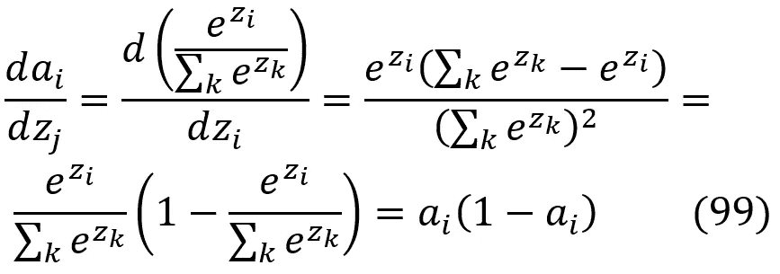****

****如果*I*≦*j*:****

********

****所以我们终于有了****

********

****Softmax 实际上是 sigmoid 函数的数学概括，可用于假设类别互斥的多类别分类。Sigmoid 等价于一个 2 元 Softmax 函数，其中我们只有两个互斥的类。姑且称之为*C1*和*C2*。既然我们有两个类，那么 softmax 层的输入向量( ***z*** )和激活向量( ***a*** )也应该有两个元素。现在我们可以写了****

************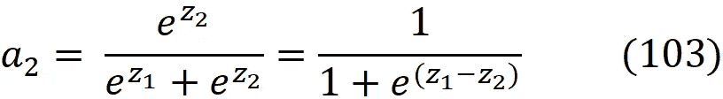****

****但是 softmax 的激活向量是归一化的，所以****

********

****通过结合等式。102，103 和 104，我们有****

********

****这里我们有一个两个未知数的方程，它是欠定的，有无穷多个解。因此我们可以修正它的一个未知数。我们假设 *z_2* =0，那么我们有****

********

****哪一个是 *z_1* 的 sigmoid 激活函数(记住等式。6).因此，Sigmoid 相当于一个 2 元素 softmax，其中第二个元素假定为零。****

******将标签矢量化并输出******

****我们可以定义*标签矩阵*****

********

****它组合了所有例子的标签向量。我们稍后将使用标签矩阵。当然，如果我们有一个二元分类问题或回归问题，输出标签是一个标量。为了有一个一致的符号，我们可以假设它是一个只有一行的矩阵****

********

****类似于标签矩阵，我们可以定义*输出矩阵*，它组合了所有示例的网络输出向量****

********

****对于二元分类或回归问题****

********

******成本函数******

****记住网络的输出是 ***yhat*** 。对于每一个例子***x****【^(i】)*输出或网络预测是***yhat****【^(i】***理想情况下我们要**^(i)***=*yhat****【^(i】*。***损耗(或误差)功能*是测量输出误差的功能。它告诉我们网络输出 ***yhat*** 离真实标签***y****【^(i】*有多远。*二次损失*函数定义为*********

************

******损失函数给出了一个具体例子的误差。然而，我们需要所有例子的平均误差，因为我们希望网络一起学习所有的例子。因此，我们将*二次* *成本函数*定义为所有示例的损失函数的平均值******

************

******它也被称为**【MSE】*成本函数。 *J* 还是一个函数***y****【^(i】****yhat****^(i)*。但是我们知道，网络输出***yhat****【^(i】***是网络参数本身的函数。所以成本函数实际上是这些参数的函数。这里， *w* 和 *b* (无指标)表示网络中所有神经元的权值和偏差的集合。请注意，损失函数和成本函数都是标量函数(它们返回一个标量)。如果我们在输出层只有一个神经元，那么等式。111 和 112 变成了*********

************

*******w* 和 *b* 是网络的可调参数，当我们训练神经网络时，目标是找到最小化成本函数 *J(w，b)* 的权重和偏差。当代价函数最小化时，我们期望训练集的分类误差最小。如果我们将一个函数乘以一个正乘数 *a* ，那么 *aJ(w，b)* 的最小值出现在与 *w，b* 相同的值处，与 *J(w，b)* 的最小值相同。所以等式中的乘数 *1/2* 。112 对成本函数的最小化没有影响，通常添加它是为了简化计算。MSE 成本函数是回归问题的默认成本函数。******

********交叉熵代价函数********

******二次成本函数不是我们可以用于神经网络的唯一函数。事实上对于一个分类问题，我们有一个更好的选择叫做*交叉熵*函数。当输出层的神经元的激活在[0，1]范围内时，可以使用它，并且可以被认为是概率。因此，在输出层，您应该有一个具有 sigmoid 激活函数(二进制分类)的单个神经元，或者多个具有 softmax 激活函数(多类分类)的神经元。******

******交叉熵可以使用*可能性*函数来定义。在概率论中，*伯努利分布*是一个[随机变量](https://en.wikipedia.org/wiki/Random_variable)的离散概率分布，它只能取两个可能值。我们可以将这些值标记为“成功”和“失败”，或者简单地标记为 1 和 0。一个例子是扔硬币，结果不是正面就是反面。现在假设这个随机变量以概率 *p* 取值 1，以概率 *q=1-p* 取值 0。这里 *p* 是伯努利分布的参数。如果我们称这个随机变量为 *T* 并使用 *t* 表示它可以取的值，那么 *T* 的概率函数可以写成如下******

************

******这里 *f(t|p)* 是在给定参数 *p* 的情况下，观察到 T 为 *T (T=t)* 的一个值的条件概率。我们也可以把上一个方程的条件组合成一个方程，写成******

************

******当这个概率函数被视为参数 *p* 的函数时，它被称为 [*似然*](https://en.wikipedia.org/wiki/Likelihood_function) 函数******

************

******情商。115 代表一个随机变量(或一个数据点)。如果我们有 *m* 个独立随机变量*T1 _ 2，…，T_m* 具有相同的伯努利分布(或者简称为 *m* 个数据点)，以及*T1*，*T2*，。。。， *t_k* 表示这些变量的可能值，那么同时观测到 *T_1=t_1，T_2=t_2，…，T_m=t_m* 的可能性就是每个数据点观测到 *T_i=t_i* 的可能性的乘积。数学上，我们的数据给参数 *p* 的可能性是******

************

******现在假设我们知道了 *t_i* 的值，但是 *p* 是一个未知变量。我们想要找到对于每个随机变量 *T_i* 来说，给出观察到特定值 *t_i* 的最高概率的 *p* 的值。一种方法是用特定的 *t_i* 的值找到使 *L(p)* 最大的 *p* 的值。在统计学中，这种方法被称为*。所以我们在寻找*******

**************

********Argmax* 是 Maxima 自变量的简称。函数的 argmax 是函数最大化所在的定义域的值。因此 *argmax_p* 给出了使 *L(p)* 最大化的 *p* 的值。为了使方程更简单，我们最大化 *L(p)的自然对数。*由于对数是单调函数，因此 *ln L(p)* 的最大值出现在与 *p* 相同的值处，与 *L(p)* 的最大值相同。*******

************

******我们称 *ln L(p)* 为*对数似然*。使用 Eq。116 我们可以写作******

************

******所以我们有******

************

******现在想象我们有一个具有 sigmoid 激活功能的单个神经元。我们在训练集中有 m 个例子。神经元的激活例如 *i* 是 *yhat^(i)* 而真正的标签是 *y^(i)* 。由于我们在最后一层只有一个神经元， *yhat^(i)* 是标量，不是矢量。这里 *yhat^(i)* 是一个可以通过改变网络参数来改变的变量。如前所述，我们定义了一个阈值来将激活转换为单个神经元的二进制输出(如果激活大于 0.5，则二进制输出为 1，否则为 0)。我们可以把 *yhat^(i)* 看成神经元的二进制输出得到 1 的概率。******

******我们也可以把神经元的二进制输出想象成一个随机变量，它具有伯努利分布，它的参数是 *yhat^(i)* 。现在我们希望将观察真实标签*y^(i】*的对数似然作为这个随机变量的值。所以在情商上。117、我们可以用 *yhat^(i)* 代替 *p* ，用 *y^(i)* 代替 *t_i* 。现在我们可以将这个神经元的对数似然函数写成(对于整个训练集)******

************

******还有一个问题。在 Eq 中。49.5，参数 *p* 对于所有数据点都是相同的，因为它们都遵循相同的伯努利分布。然而，这里的 *yhat^(i)* 对于每个 *i* 可能是不同的，因为它是输入矩阵的函数****x****^(i)*，***x****对于每个例子是不同的。对于所有数据点保持不变的是网络参数 *w* 和 *b* ，并且 *yhat^(i)* 也是它们的函数。所以当最大化 *ln(L(p)* 时，我们相对于 *w* 和 *b* 而不是 *p* 最大化它********

************

******然而，与其最大化 *ln L(yhat^(i))* ，我们可以最小化它的负面******

************

******得到同样的结果******

************

******如前所述，如果我们将一个函数乘以一个正乘数 *a* ，则 *aC(w，b)* 的最小值出现在 *w，b* 的相同值处，与 *C(w，b)的最小值相同。因此我们可以将等式右边的项相乘。119 与 *1/m* 并将其最小化*******

**********

*****现在我们可以认为-*ln l(yhat^(i)】*是一个应该被最小化的新代价函数，我们称之为*二元交叉熵*代价函数*****

**********

*****因此，最小化该成本函数将最小化网络在预测示例的真实标签时的误差。二元交叉熵是二元分类问题的默认代价函数。在这个等式中，我们可以假设成本函数是所有例子的损失函数的平均值*****

********************

*****这类似于我们在 Eq 中所做的。二次成本函数为 112。*****

*****如果我们有一个带有 *c* 类的多标签分类，我们的输出层应该有带有 sigmoid 激活的 *c* 神经元。每个神经元给出多热点编码标签向量***y****【^(i】*中一个元素的值。这些神经元独立工作，因此它们中的每一个都可以使用二元交叉熵代价函数。假设我们有 *c* 个独立随机变量{*T _ j；j=1..c* }具有伯努利分布。我们可以用随机向量来展示它们*****

**********

*****随机变量通常用大写字母表示，由于它也是向量，所以是大写黑体字母，所以请不要和矩阵混淆。每个随机变量的概率函数为*****

**********

*****其中 *p_i* 为每个随机变量的分布参数。这些参数可以用矢量来表示*****

**********

*****现在我们想知道同时观察这些随机变量中每一个特定值的概率函数。如果*t1 = t1*且*T2 = T2，…，T_c=t_c* ，则向量*****

**********

*****能代表他们的价值观。现在既然这些随机变量是独立的，那么观测的似然函数***T***=*T*给定***p*** 就是*****

**********

*****我们有 *m 个*数据点(这里每个数据点都是一个*c*-维点)，每个数据点都可以用 ***t*** ^(i).来表示此外，我们假设对于每个数据点，我们有一个单独的分布参数。因此， *m* 点的似然函数为*****

**********

*****对数似然会是*****

**********

*****同样，我们可以将神经元的二进制输出视为具有伯努利分布的随机变量，其参数为 *yhat^(i)* 。现在我们要计算最后一层神经元的观察标签向量***y****【^(i】*的对数似然。所以在情商上。127、我们可以把 *p_i^(j)* 换成*yhat_i^(j)**t_i^(j)*换成*y_i^(j)**c*换成*n^[l】*。现在，我们可以将最后一层和整个训练集的对数似然函数写成*****

**********

*****我们最小化*****

**********

*****关于 *w* 和 *b* 。因此成本函数(加上乘数 1/ *m* )将为*****

**********

*****它是这个损失函数的平均值*****

**********

*****所有的训练例子。*****

*****但是如果我们在输出层有一个以上的神经元的多类问题会发生什么呢？这里我们可以用 [*多项式分布*](https://en.wikipedia.org/wiki/Multinomial_distribution) 。假设我们有一个离散随机变量 *T* ，它可以从集合{1，2，...， *c* }中取 *c* 个不同的值，所以它就像一个 *c* 边的骰子。取值为 *i* 的概率为 *p_i* ，并且*****

**********

*****我们可以使用一个独热编码向量来显示这个随机向量的当前状态。所以我们有了向量 ***t*** 和 *c* 元素，当 *T=j* 时，*的第 *j* 个元素将等于 1，而其他元素为零******

************

******所以原来的随机变量 *T* 可以用一个随机向量 ***T*** 来表示，这个随机向量可以取 ***t*** 的不同值。既然 *T=j* 的概率是 *p_j* ，那么**TT**与 *t_j* =1 的概率是相同的。******

************

******由于除了第*j*th 之外的所有元素都应该为零，我们可以写******

************

******如果我们乘以 Eq。132 由等式。133 我们得到******

************

******因此，给定参数***p***T 对于随机向量*我们观察到的等效单热点编码向量的概率函数为*******

**************

*******情商。135 是多项式分布的一个特例。这里每个数据点是一个 *k* 维的点(t *_1* ， *t_2* ，..， *t_c* ，用向量 ***t*** 表示。所以实际上这个等式仍然是针对一个数据点的。如果我们有 *m* 数据点***t^****【1】****t^****【2】*，…***t^****【m】*，那可能性就会是*******

************

******所以对数似然变成了******

************

******现在我们必须最小化对数似然的负值******

************

******现在假设我们有一个 softmax 层，在最后一层有*n^[l】*神经元。我们的标签向量例如***x****【^(j】*是***y****【^(j】*其中有*元素。神经元 *i* 的最大激活度例如 *j* 是 *yhat_i^(j)* 而真正的标签是***y*****【y_i^(j】*的第*I*-第个元素。********

******再次我们可以把 *yhat_i^(j)* 想成神经元 *i* 的二进制输出得到 1 的概率(例如 *j* )。所以也可以把 softmax 层的二进制输出想成一个随机向量，它有一个多项式分布，它的参数是 *yhat_i^(j)* 。每个标签向量都是这个随机向量可以取的一个可能向量。现在我们要计算这个随机向量取向量***y****【^(i】*的值的对数似然。所以在情商上。138、我们可以把 *p_i^(j)* 换成*yhat_i^(j)**t_i^(j)*换成*y_i^(j)*c，加上 1/ *m* 作为乘数，相对于 *w* 和 *b* 最小化******

************

******所以我们可以把成本函数写成******

************

******这被称为*分类交叉熵代价函数*，它是多类分类问题的默认代价函数。同样，我们可以假设成本函数是所有示例的损失函数的平均值******

******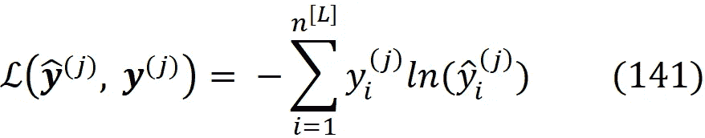******************

********梯度下降********

******到目前为止，我们了解到学习示例的真实标签等同于最小化关于网络可调参数的成本函数。*梯度下降*是一种优化算法，用于通过在当前点向函数梯度的负值方向迭代移动来最小化函数。假设我们有一个函数 *f(x_1，x_2，…，x_n)* ，我们想最小化它的所有变量。我们将矢量 ***x*** 定义为******

************

******所以{ *x1，x2，…，xn* }的每一组值都可以用 n 维空间中的一个点来表示，向量 ***x*** 就是指那个点。我们可以假设函数 *f* 是这个向量的函数******

************

******现在我们从一个用 ***x_initial*** 表示的初始点开始，从这个 n 维的点开始，我们要向最小化*f(****x****)*的点 ***x_min*** 迭代移动。所以我们从 ***x_initial*** 开始，在每一步，我们都使用前一个点找到一个新点******

******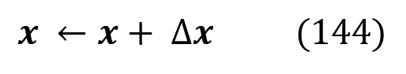******

******我们使用这个等式不断地用一个新的点替换我们当前的点，直到我们足够接近 ***x_min*** (在容差内)。δ***x***是还需要确定的东西，梯度下降法告诉我们如何选择。从微积分中，我们知道******

************

******其中 *dx_i* 表示 *x_i* 的微小变化。对于 *xi* 中相对较小的变化，我们可以这样写******

************

******使用梯度的定义(等式。41)和点积(等式。24)，我们将前面的等式写成******

************

******我们要向给出最大减少量的方向移动*δ*f .*现在，记住两个矢量的点积的最小值是矢量方向相反的时候。所以δ***x***应该在-δ*f*的方向，然而我们可以自由选择它的大小。所以我们可以写成*δ***x =****-α*δ*f*其中 *α* 是可以改变δ***x***大小的标量乘法器。所以我们可以写 Eq。144 作为********

************

*******α* 称为*学习率*，每次迭代都允许变化。我们也可以写 Eq。148 对于每个元素的 ***x*** 得到******

************

******现在我们可以回到我们的成本函数 *C(w，b)* 。这里 *J* 是网络中所有权重和偏差的函数。所以我们可以写作******

************

******对于 *i* 、 *j* 和 *l* 的所有可能值。现在，如果我们假设网络中有 *p* 个可调参数(所有层中的所有权重和偏差一起)，这些参数形成一个 *p* 维空间，我们可以使用等式。每人 149 英镑******

************************

******这些方程也可以写成矢量形式******

************************

******在 Eq 中。147*δ****x***的值要足够小，才能很好的逼近*δf****。*** 因此，学习率( *α* )应该不会太大。否则，我们最终可能会有一个甚至可以增加*f*(*δf>0)的大台阶。*此外，如果 *α* 过小，会使朝向最小点的步长过短，因此梯度下降算法的工作速度会非常慢。******

******反向传播******

******使用方程定义的梯度下降法。151 和 152，我们需要计算成本函数相对于 *w* 和 *c* 的偏导数或梯度，为此我们使用一个名为*反向传播*的算法。所以反向传播的主要目标是计算******

************

******在反向传播方法中，我们首先引入一个中间量******

************

******称为第 *l* 层中第 *i* 个神经元的误差。使用梯度的定义(等式。41)，前面的等式可以写成******

************

******以向量的形式。我们可以在一些等式(如方程 156)中编写没有自变量和训练样本索引的损失函数，但您应该注意，损失函数总是与单个样本相关。******

******误差向量和**【^[l】*具有相同数量的元素并使用等式。41 层 *l* 的误差向量也可以写成*******

******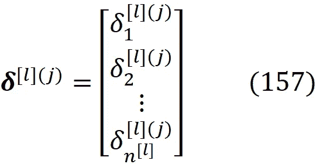******

******值得注意的是，误差向量是为单个训练示例 *j* 定义的。特定神经元的误差将神经元净输入的变化与损失函数的变化联系起来。如果我们把神经元的净输入从******

************

******到******

************

******神经元的输出变为******

************

******并且这种变化将通过下一层传播，直到它到达输出层并改变基于网络输出定义的损失函数。损失函数的变化可以近似为******

************

******换句话说，误差在某种程度上测量这个神经元在改变整个网络的损失函数中的效果。在反向传播方法中，我们首先计算误差，然后利用误差计算损失函数的偏导数。******

******我们从网络最后一层的误差定义开始，通过应用链式法则，我们可以用网络输出(最后一层的输出)的偏导数来表示误差项******

************

******如果我们没有 softmax 层，那么第 *k* 个神经元的输出只取决于它的净输入*z_i^[l】*而不是最后一层中其他神经元的净输入(等式)。74、75 和 90)，所以******

************

******结果，Eq。159 简化为******

************

******因为求和中的其他项为零。我们知道这一点******

************

******所以我们可以写 Eq。161 as******

************

******其中等式最后一行中的撇号表示相对于*【z_i^[l】*的求导。使用梯度向量的定义(等式)。41)和哈达玛乘积(等式 33)，我们可以把这个方程写成向量形式******

************

******情商。164 计算网络最后一层的误差向量。请注意，它仅在您没有 softmax 图层时有效。如果你有软最大层，然后方程。160 不再正确(在 softmax 层 *yhat_i^(j 中)*取决于该层中所有其他神经元的净输入)，并且您不能使用它来达到 Eq。164.当我们有了 softmax 层，那么我们需要以不同的方式导出 ***δ*** *^[L](j)* ，这将在本文后面讨论。******

******现在我们需要计算其他层的误差向量。这次我们从层 *l、*的误差定义开始，通过应用链式法则，我们将误差项写成相对于网络下一层(层 *l+1* )的净输入的偏导数******

************

******根据误差的定义，我们知道******

************

******所以我们可以写 Eq。165 作为******

************

******使用 Eq。75(对于神经元 *k* 在*层*l+1 我们有******

************

******一层中不同神经元的净输入不相互依赖。因此******

************

******现在通过对 Eq 求导。168 关于*z_i^[l】*并且知道权重和偏差不是*z_i^[l】*的函数，我们得到******

************

******通过替换等式。170°回到 Eq。167 我们获得******

************

******最后，我们可以用矩阵转置的定义(等式。20)和矩阵乘积(等式。19)和哈达玛乘积(等式 33)得到这个向量形式的方程******

************

******情商。172 根据下一层的误差矢量给出了层 *l* 的误差矢量。现在我们知道了如何计算误差向量，我们可以把它和损失函数的偏导数联系起来。请注意，我们通常写 Eq。172 作为******

************

******不写括号。然而，它应该总是从左到右进行评估，并且评估为******

************

******不正确。******

******从层 *l、*的误差开始，我们将误差项写成关于偏差的偏导数******

************

******来自 Eq。74(对于神经元来说)k 我们得到******

************

******所以每个神经元的偏差只取决于它自己的净输入，所以我们有******

************

******利用这个方程，我们可以简化方程。174 去拿******

************

******在 Eq 中。前一层的权重和输出不依赖于*z_k^[l】*，所以我们有******

************

******所以通过对 Eq 求导。175 关于 *z_k^[l，*我们得到******

************

******由于 *k* 是一个虚拟指标，我们可以用 *i* 来代替它******

************

******通过替换等式。180°回到 Eq。我们有 177 个******

******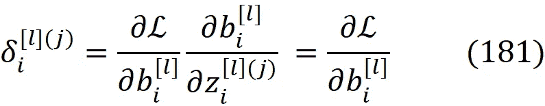******

******这相当于******

************

******因此损失函数相对于偏置向量的梯度等于每层的误差向量。最后，我们可以用对净输入的偏导数来表示损失函数对重量的偏导数******

************

******基于情商。74，我们知道每个神经元的净输入只是该神经元输入的权重的函数，所以******

************

******所以我们可以简化 Eq。183 对******

************

******通过区分情商。74 关于*w_ik^[l】*我们得到******

************

******现在我们可以用 Eq 来代替。186 入 Eq。185 有******

************

******为了用向量形式表达这个方程，我们应该注意向量的维数。Eq 的左手边。187 表示为******

************

******以矩阵形式。通过看情商。63、我们看到***w****【^[l】*有*【n^[l】*行和*列。基于情商。43(*∂j/∂****w****【)^[l】*也是同样大小的矩阵，所以 Eq 的右边。82 应该具有相同的尺寸。我们知道 ***一个****【^[l-1】*是一个带有*元素的列向量(Eq。57).此外，方程中定义的误差向量。157 是具有*n^[l】*元素的列向量。所以我们需要将误差向量乘以***a****【^[l-1】*的转置，得到一个有*【n^[l】*行和*列的矩阵(参考 Eq 26)。因此方程的矢量形式。187 是*********

**************

*******其给出了损失函数相对于权重矩阵的梯度。现在我们有了所有必要的方程，我们可以总结反向传播算法:*******

**************

*******这种算法被称为反向传播的原因是误差项是从网络的输出层开始反向计算的。现在我们可以看到每次损失的误差是如何计算的。二次损失函数(等式。111)例如 *j* 为:*******

************

******现在我们可以用 Eq 了。163 来计算最后一层的误差。首先，我们需要计算损失函数相对于输出向量的梯度。通过区分情商。189 关于 *yhat_i^(j)* 我们有******

************

******每个神经元的激活都独立于其他神经元的激活，所以******

************

******把这个等式代入等式。我们得到 190******

************

******最后，将这个方程代入方程。163 我们得到******

************

******该方程可以向量形式写成******

************

******当我们有二进制分类时，二进制交叉熵损失函数(等式。122)例如 *j* 为:******

************

******由于我们在最后一层只有一个神经元，所以最后一层的误差项和净输入将是标量，而不是向量。该损失函数相对于输出向量的梯度为******

************

******二元交叉熵损失通常与 sigmoid 激活函数一起使用。所以 *yhat^(j)* 是一个 sigmoid 激活，从等式。7 我们有******

************

******现在把这个等式代入等式。163 我们得到******

************

******如果我们有一个多标记分类，二元交叉熵损失函数(方程。130)例如 *j* 是:******

************

******该损失函数相对于输出向量的梯度(使用等式。191)是******

******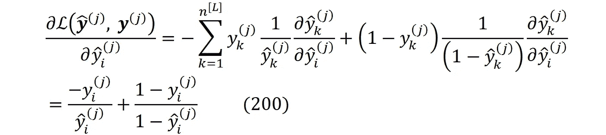******

******最后一层中的每个神经元都有一个 sigmoid 激活，因此使用等式。7 和 162 我们可以写******

************

******现在我们可以替换 eq。200 和 201 转换成等式。163 以获得误差向量******

************

******或者以矢量的形式******

************

******最后，我们将推导出分类交叉熵损失的误差。来自 Eq。141 我们得到******

************

******这种损失通常用于 softmax 层，如前所述，我们不能使用等式。164 美元。所以我们需要直接导出误差向量。误差项将为:******

************

******对于 softmax 激活，我们可以使用等式。101(通过将 *a* 替换为 *yhat* )得到******

************

******所以我们可以简化 Eq。205 要有******

************

******记住***y****【^(j】*是示例 *j* 的一键编码标签。所以它的元素只有一个是 1，其他的都是 0。因此我们有******

************

******现在把这个等式代入等式。我们得到了 207******

************

******或者以矢量的形式******

************

******当最后一层是 softmax 层时，该等式给出了分类交叉熵损失函数的误差项。******

******基于等式。164 和 173，我们可以看到反向传播算法使用激活函数的导数来计算误差项。所以激活函数需要可微。当然，我们仍然可以使用一个不可微的函数，并假设它是可微的。比如 ReLU 在 *z=0* 不可微，但是我们假设它的导数在这一点不是 0 就是 1。step 函数不能用于反向传播。和 ReLU 一样在 *z=0* 不可微，但这不是原因。它的导数在其他地方都是零，这使得误差项和成本函数的梯度始终为零。所以权重和偏差不会用梯度下降法更新。******

******在反向传播算法中，我们将误差项定义为损失函数相对于净输入的导数，然而，它也可以相对于激活来定义。因此，我们为层 *l* 和示例 *j* 中的神经元 *i* 定义了新的误差项******

************

******我们称之为*激活误差*，以区别于等式中定义的误差项。155(所以当我们说误差时，我们指的是这个等式)。特定神经元的激活误差将神经元激活的变化与损失函数的变化联系起来。首先，我们需要计算前一层的激活误差******

************

******使用 Eq。74 我们可以写作******

************

******把这个方程代入上一个方程，我们得到******

************

******请注意，权重矩阵的转置和误差向量相乘的结果是一个向量，因此它只有一个索引。所以我们有******

************

******现在我们也可以用激活误差来表示误差项。来自 Eq。我们有 172 个******

******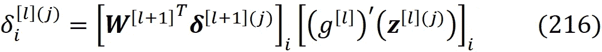******

******通过替换等式。214 进入这个方程，我们得到******

************

******它可以用向量形式写成******

************

******这个等式可以用于包括最后一层在内的所有层。实际上通过设置 *l* = *L* 和*yhat*=***a****【^[l】*，等式。214 变成了 Eq。164.因此，它不能用于 softmax 层。所以我们需要直接计算分类交叉熵损失函数(Eq。141)当我们以 softmax 输出层为例时******

************

******现在我们可以用 Eq 了。206 要有******

************

******因为 *y_k^(j)* 是一个独热编码向量，我们可以写******

************

******最后，将这个方程代入上一个方程，我们得到******

************

******当最后一层是 softmax 层时，该等式给出了分类交叉熵损失函数的激活误差项。不幸的是，它不容易转换成矢量形式。现在，我们可以使用激活错误重写反向传播算法。现在我们可以使用激活误差编写反向传播算法(在吴恩达的[深度学习专业化课程](https://www.coursera.org/specializations/deep-learning?utm_source=gg&utm_medium=sem&utm_content=17-DeepLearning-ROW&campaignid=6465471773&adgroupid=77415260637&device=c&keyword=coursera%20deep%20learning%20ai&matchtype=b&network=g&devicemodel=&adpostion=&creativeid=379493133115&hide_mobile_promo&gclid=CjwKCAjw4pT1BRBUEiwAm5QuRwgTOsOYZ5KBSCJ2uUPnH0uM5tieL87a4aVcmxP_SAtDaaMX2_9prBoCmjEQAvD_BwE)中，已经使用了这种反向传播的方法)。******

************

******反向传播算法给了我们损失函数的梯度，但是梯度下降法需要的是方程中成本函数的梯度。153 和 154。如果你参考 Eqs。111, 123.129 和 142，您将看到成本函数是所有训练示例的损失函数的平均值******

************

******所以我们可以写作******

************************

******因此，我们可以使用反向传播算法获得单个样本的梯度，然后对所有训练样本取平均值，从而得到梯度下降法的成本函数的梯度。该方法被称为*批次或普通梯度下降*，如下所示:******

************

******在每一次迭代中，我们计算所有例子的损失函数的梯度，然后取它们的平均值以得到成本函数的梯度。最后，我们使用它们更新权重和偏差。我们重复更新***【w】****【^[l】*和***b****【^[l】*，直到满足停止标准(例如，迭代期间权重和偏差值的变化低于某个阈值)。我们需要初始化权重和偏差，以便能够开始梯度下降。我们通常将权重初始化为小随机数，将偏差初始化为零或一个小的常数值。******

********消失和爆炸渐变********

******现在我们有了反向传播方程，我们可以计算网络中任何一层的误差项。假设我们想为层 *l* 计算它。我们首先计算输出层的误差项，然后向后移动并计算先前层的误差项，直到到达层 *l* 。来自 Eq。173 对于层 *L-1* 我们有******

************

******现在如果替换层 *L* 的误差项(等式。164 假设输出层不是 softmax 层)在前面的等式中，我们得到******

************

******现在我们可以用 Eq 了。173 再来计算***δ****【^[l-2】*从***δ****【^[l-1】*******

************

******并且我们可以继续这个过程，直到我们得到****【δ****【^[l-2】********

************

******我们可以用情商。171 来为误差向量的每个元素写出这个等式******

************

******基于该等式，误差向量的每个元素(该层中一个神经元的误差)与下一层中神经元的激活函数的导数的链式乘法成比例(如果我们有一个具有分类交叉熵损失函数的 softmax 层，则最后一层的误差项将不包括激活，然而，它对隐藏层没有帮助)。******

******现在，如果激活函数是一个 sigmoid 或一个 *tanh* ，*g’(z)*可以是一个非常小的数，当 *z* 非常小或非常大时(参见图 3 和图 4)。因此，这些小值的连锁乘法可能会导致一个极小的误差项，尤其是如果你有一个有这么多层的深层网络。因此，误差向量的一些或所有元素可能非常小。因为损失函数和成本函数的梯度与误差项成比例(参考等式)。182、188、224 和 225)，它们也会变得非常小，所以在等式。153 和 154，台阶的尺寸会很小。最终结果是梯度下降法和网络的学习过程变慢。这被称为*消失梯度问题*。******

******ReLU 和泄漏 ReLU 激活函数可以克服这个问题。ReLU 激活有两种操作模式。当净输入大于或等于零时，它是有效的，并给出线性响应。然而，它也应该是非线性激活函数，因此当净输入小于零时，它变得无效，并且响应为零(等式)。10).ReLU 的导数在活动时等于 1。因此，等式中 ReLU 激活函数的链式乘法的结果。230 简单来说就是 1，防止了消失梯度问题。******

******然而，我们可能在等式中有一个或多个不活动的 ReLU 激活函数。230.不活动的 ReLU 的导数等于 0，只有一个零就足以使整个链等于零。所以一些神经元的误差项将为零，并且它们的权重和偏差不会在梯度下降中更新。在泄漏 ReLU 激活功能中，当 *z* 小于零时，输出是一个小数字( *cz)* 而不是零(等式。12).所以如果只有少数神经元有负的 *z* ，整个链条不会变成零。当然，如果您在 Eq 230 的链中有许多带有 *z* < 0 的泄漏 ReLU 激活，您仍然会得到一个消失的误差项，然而，这是可以接受的，因为一个不活动神经元链应该给出一个可以忽略的误差项。******

******ReLU 和 leaky ReLU 激活可以克服深度神经网络的消失梯度问题，因此实际上，它们使深度学习成为可能。因此，使用 Relu 激活函数，神经网络通常可以比使用 *tanh* 或 sigmoid 激活函数更快地学习。泄漏 Relu 通常比 ReLU 激活函数工作得更好，尽管它在实践中并不常用。如前所述，在输出层，如果我们有分类问题或回归问题的线性激活，我们可以使用 sigmoid 或 softmax 激活函数。ReLU 通常是所有其他层的默认选择。******

******现在考虑情商。又是 230。在接下来的层中，我们也有神经元权重的链式乘法。根据权重的初始值，结果可能是非常大或非常小的误差项。当权重矩阵的链式乘法太小时，我们再次以消失梯度问题结束。当它非常大时，梯度和梯度下降中的步长会爆炸。结果是不稳定的网络，并且梯度下降步骤不能收敛到权重和偏差的最佳值，因为步骤现在太大并且错过了最佳点。这被称为*爆炸梯度问题*。我们可以使用像 *Xavier 和 He 初始化*这样的权重初始化技术来克服这个问题。******

******批量梯度下降需要处理所有的训练样本，以找到成本函数的梯度。当训练样本的数量非常大时，这是一个缺点。在这种情况下，批量梯度下降需要很长时间才能收敛，因此不适合巨大的数据集。另一个选择是*随机梯度下降*。在这个算法中，我们首先需要随机打乱整个训练集。因此，当我们使用它的索引( *i* )选择一个例子时，它将被随机选择。这里，我们在每次迭代中仅使用一个训练样本来计算成本函数的梯度，而不是对所有训练样本取损失函数的平均值。事实上，我们假设在该迭代中成本函数等于示例 *i* 的损失函数，因此成本函数的梯度等于损失函数的梯度******

************************

******由于随机梯度下降在每次迭代中使用一个训练示例，因此对于较大的数据集来说，它要快得多。然而，等式 231 和 232 中的假设不是非常准确，并且一个示例的损失函数可能不是整个训练集的成本函数的准确估计。******

************

******为了使这种估计更准确，我们可以使用*小批量梯度下降*，这是批量和随机梯度下降之间的折衷。在小批量梯度下降中，不是使用完整的训练集，在每次迭代中，我们使用一组 *s* 训练示例来计算成本函数的梯度。我们可以把这些 *s* 的例子看作是整个训练集的代表性样本。******

******首先，我们随机打乱训练集，然后将其分成更小的训练集，称为*小批量*。每个小批量都有 *s* 个样本，s 远小于训练样本总数 *m* (如果 *m* 不能被 *s* 整除，则最后一个小批量的规模会小于 *s* ，但我们假设 *m* 能被 *s* 整除)。所以我们会有小批量的。******

******记住等式中的输入矩阵。71，其组合所有训练示例的输入向量。假设我们首先打乱示例，并从 0 到 m 重新索引它们。现在输入矩阵是******

************

******现在，我们可以将该矩阵中示例的输入向量拆分如下******

************

******因此，我们可以将原始的 *n* × *m* 输入矩阵拆分成 m/s 个小批。每个小批量都有一个 *n* × *s* 矩阵，其中包含 *s* 示例的输入向量。我们用花括号{}中的数字作为上标来表示小批号。所以***x****^{t}*包含了第 *t* 个小批量的输入向量。我们也可以拆分标签矩阵 ***Y*** (Eq。107)同样。记住***y****【^(i】*的元素个数等于*【n^[l】*，所以 ***Y*** 是一个*【n^[l】*×*s*矩阵。***y****^{t}*有第 *t* 个小批量的标签向量。它是一个*n^[l】*×*s*矩阵，包含了 *s* 示例的标签。******

************

******所以一般来说第 *t* 个小批量可以用一对来表示******

************

******现在，我们假设每个小批量中的示例是整个训练集的代表性样本。因此，每个小批量 *t* 中的样本的损失函数的平均值是整个训练集的成本函数的精确近似值。所以对于第 *t* 个小批量，我们有******

************************

******其中平均值取自该小批量中的所有样品。******

************

******当循环的外部*完成从 1 到 *m/s* 的迭代时，我们完成了对训练数据集的遍历，这意味着训练集中的所有示例都已用于更新成本函数的梯度。这被称为一个*时期*、*、*，因此时期的数量是通过训练数据集的完整次数或者算法中的*重复直到*循环的迭代次数。当满足停止标准或达到一定数量的时期时，我们可以停止*重复直到*循环。我们随机打乱每个时期的训练集中的例子。*******

*****小批量梯度下降比批量梯度下降更快，在深度学习中非常流行。与随机梯度下降相比，它还导致更平滑的收敛，因为在每一步计算的梯度使用更多的训练样本。*****

*******反向传播方程的矢量化*******

*****请记住，在 Eq。86 我们将正向传播方程矢量化。我们还可以将反向传播方程矢量化，以得到完全矢量化的小批量梯度下降算法。还记得等式中定义的标签矩阵吗？107.这个矩阵的每个元素是*****

**********

*****类似地，等式中输出矩阵的每个元素。109 是*****

**********

*****现在我们可以将损失向量定义为*****

**********

*****使用 Eq。41 和误差向量 Eq 的定义。156 我们可以将误差矩阵写成*****

**********

*****我们还定义了另一个矩阵来矢量化激活误差，我们称之为激活误差矩阵*****

**********

*****对于输出层，我们有*****

**********

*****使用等式。35，37 和 163 我们可以写*****

**********

*****因此，我们有*****

**********

*****请注意 *(g^[L])'* 是一个矢量化函数，应用于***z****的所有元素。等式 242 相当于等式。所有的例子都是 163。自从情商。163 不能用于 softmax 层，等式。242 也是无效的。如果我们有 softmax 层，有分类交叉熵损失，我们可以使用等式。202 写******

************

******这类似于等式。203.我们也可以写(用 Eq。171)******

************

******这导致了******

************

******现在我们写出损失向量的向量导数******

************

******这意味着******

************

******我们知道这一点******

************

******所以从情商来说。我们有 247 个******

******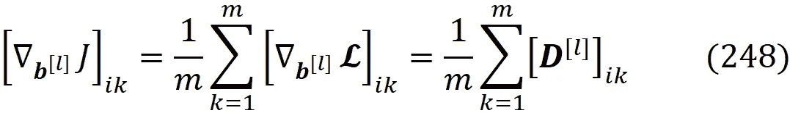******

******这意味着成本函数相对于偏置向量的梯度是误差矩阵的列之和除以 m******

************

******最后，我们需要计算成本函数相对于权重的梯度。使用 Eq。187 我们可以写作******

************

******我们知道这一点******

************

******现在，对于成本函数的梯度的每个元素，我们可以使用等式。250 和写******

************

******在最后一行，我们使用了矩阵乘法的定义(等式)。19).所以我们有******

************

******现在，我们有了所有矢量化的方程，可以编写在所有示例上矢量化的小批量梯度下降算法。请注意，由于上式中的矩阵是基于每个小批中的样本形成的，因此我们应该在它们上面加上上标 *{t}* ，并且为了对损失函数的梯度取平均值，我们应该使用小批大小 *s* 。******

************

******我们还可以使用激活误差方程编写矢量化小批量梯度下降算法。要做到这一点，我们只需要使用情商。214 和写******

************

******这意味着******

************

******现在我们可以用它来做反向传播******

******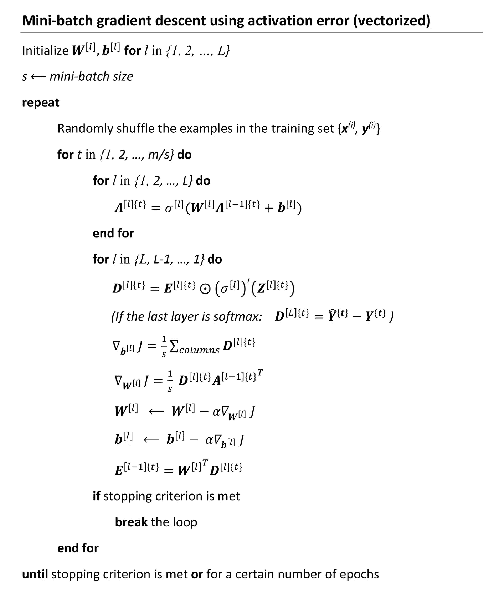******

******我希望你喜欢阅读这篇文章。在这篇相当长的文章中，我试图深入介绍前馈神经网络的核心数学。然而，还有许多重要的主题没有在这里讨论，比如神经网络初始化技术、正则化和优化方法。我希望我能在将来讨论它们。******