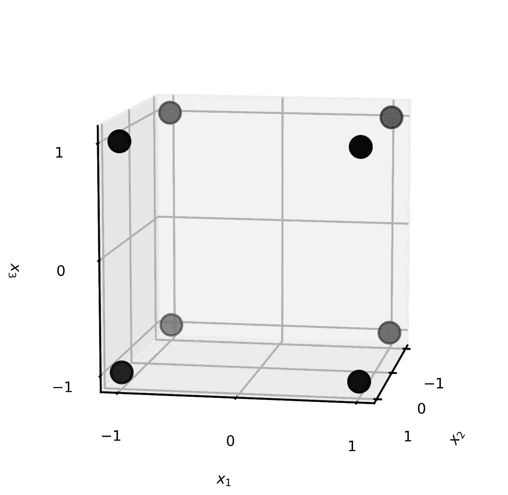
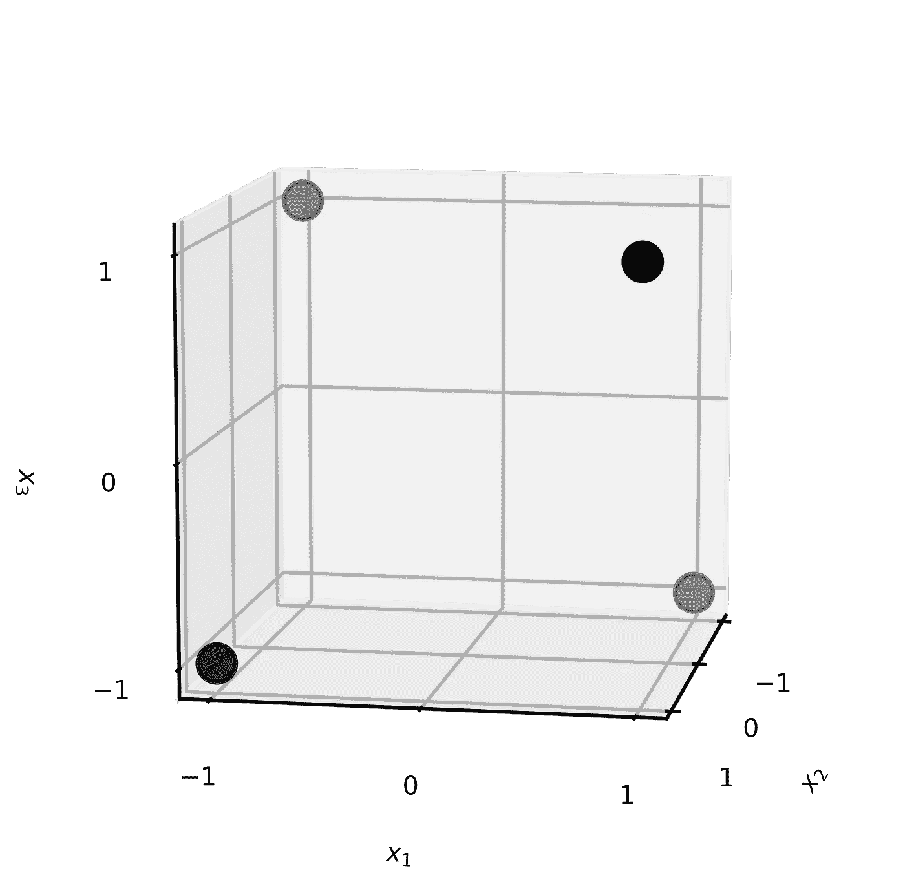
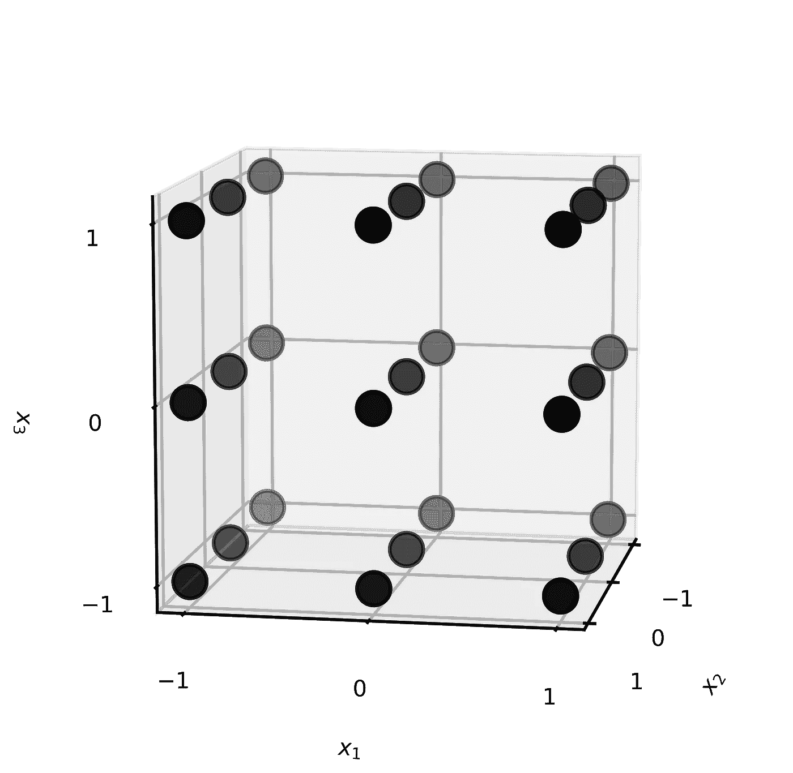
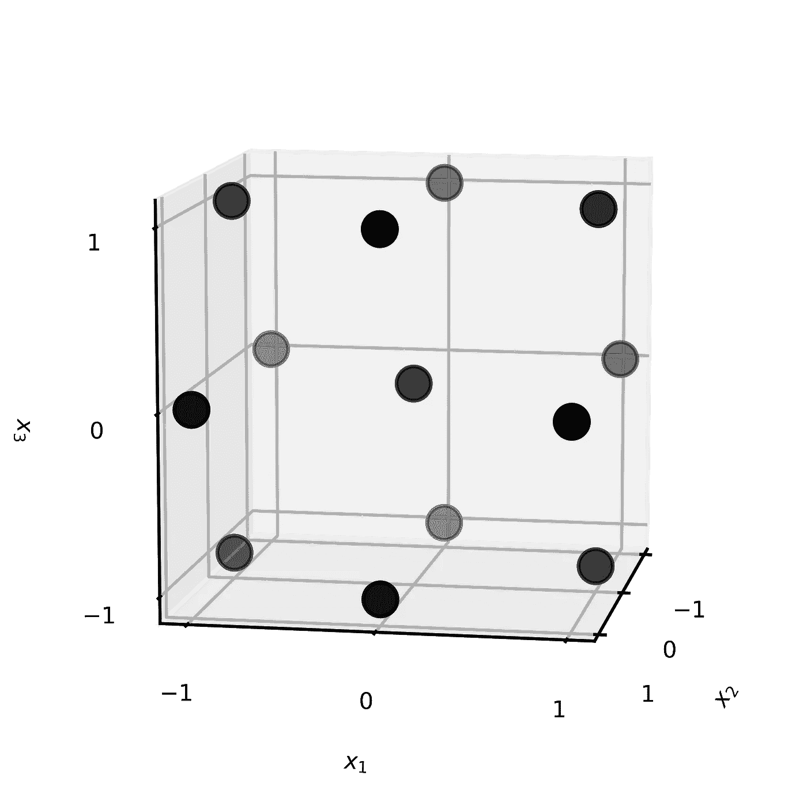
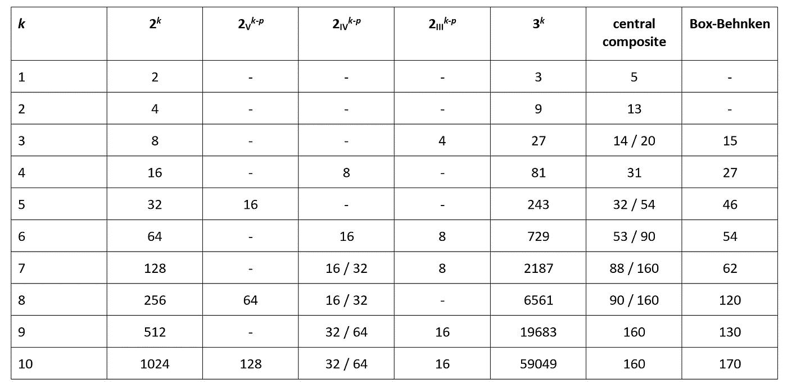

# 实验设计导论

> 原文：<https://towardsdatascience.com/an-introduction-to-design-of-experiments-3e86ea3ef7f6?source=collection_archive---------34----------------------->

## 生成有代表性的实验数据。


哈桑·帕夏在 [Unsplash](https://unsplash.com?utm_source=medium&utm_medium=referral) 上的照片

# 实验

研究真实世界的系统，例如为了优化的目的，是自然科学和工程中的一项常见任务。例如，一名研究工程师可能想要调查一组 [**因素**](https://en.wikipedia.org/wiki/Variable_(mathematics)) 对生产工厂中化学反应成功的影响；例如，相关的度量可以是选择性或产率，其可能受操作参数如温度、压力、制造过程的持续时间、原材料的纯度等的影响。

因此，工程师必须在实验室 [**实验**](https://en.wikipedia.org/wiki/Experiment) 中生成有代表性且可负担的数据，以提取所有这些知识。 [**实验设计的理论**](https://en.wikipedia.org/wiki/Design_of_experiments) 提出变量(特征、输入、因素)的最优配置，同时最小化执行实验的数量(即数据)。然而，限制可用数据的数量会减少模型中可以包含的参数数量，从而限制模型的复杂性。

在研究自变量对因变量的影响时，实验是必不可少的。早在二十世纪初，罗纳德·费雪就首次提出了实验设计方法，从那以后，它们在许多学科中得到了广泛的应用。直观的技术，如一次改变一个因素或反复试验，只会导致次优的结果，因为不一定能确定重要因素的个别影响和相互作用。因此，需要系统程序在实验室环境中生成数据，以推断出一个**线性模型**，包括主效应、`xi`和交互效应项，即`xi*xj`、`xi*xj*xk`等，而任何交互项中的因子数被称为其阶数。对于 *k* 因子，有`k`主效应、`(k,2)=k!/(2!*(k-2)!)` 双因子(即二阶交互作用)效应、`(k,3)`三因子效应、…、以及`1`*k*-因子效应——共`2**k-1`个效应；包括截距，这总计为`2**k`相关参数。

下一节讨论的所有实验设计都可以使用商业( [JMP](https://en.wikipedia.org/wiki/JMP_(statistical_software)) 、 [Minitab](https://de.wikipedia.org/wiki/Minitab) )或开源( [pyDOE](https://pythonhosted.org/pyDOE/) 、 [RcmdrPlugin)来构建。DoE](https://www.rdocumentation.org/packages/RcmdrPlugin.DoE/versions/0.12-3) 软件；甚至还有一个 web app ( [design-R](https://design-r.herokuapp.com) )。

# 全因子设计



**图 1:** 三个变量的全因子设计，每个变量有两个水平。(来源:作者)

一种被称为 [**全因子**](https://en.wikipedia.org/wiki/Factorial_experiment) 的基本实验设计，包括 *k* 变量在 *n* 水平的样本，产生`n**k`点，这仅对于少数变量和水平是可行的，否则实验的数量会变得太大。然而，在大多数应用中，级别的数量将被限制为两个，并且这些级别被编码为-1 和+1，对应于任何因子的从低到高“表达”的间隔；这被称为`2**k`全因子设计，它有足够的数据点来拟合所有参数，即截距、主效应和交互作用效应，直到阶 *k* 。此外，在某些情况下，例如，如果噪声很高，重复所有运行可能是合理的。设计以矩阵形式存储，其中每行对应一个实验，每列代表一个变量。在这样的矩阵中，变量配置是正交的，即两列的内积为零，这保证了可以提取输入对输出的单独贡献。

编码或缩放要素的结果可能与未缩放要素的结果有很大不同。使用缩放变量的一个原因是变量的相对重要性(即其参数的大小)变得明显，因为它将与输入变量对输出的平均影响成比例；如果一个变量在选择的区间内几乎不影响结果，这将在最终结果中可见。因此，研究人员应该仔细选择水平，不要把任何结果误解为独立，特别是因为短间隔容易被噪音模糊。

设计中包含的因素越多，模型中潜在的相互作用效应的等级就越高——尽管高于 2 或 3 级的相互作用是否真实还值得怀疑。削减这组潜在的相互作用减少了参数的数量，并大大增加了自由度的数量(即数据点数量和参数数量之间的差异)，在这种情况下，具有较少自由度的更有效的设计将是优选的。

# 部分因子设计



**图 2:** 三个变量的部分因子设计，每个变量有两个水平。(来源:作者)

在 [**部分因子**](https://en.wikipedia.org/wiki/Fractional_factorial_design) 设计中，缩写为`2**(k-p)`，使用完全设计的子集，其中变量之间的一些高阶交互作用是混叠的，即，与主效应或其他高阶交互作用混淆，因为它们包含“相同”的信息([](https://en.wikipedia.org/wiki/Collinearity)**， [**相关性**](https://en.wikipedia.org/wiki/Correlation_and_dependence) )。混叠的程度用一个设计的 [**分辨率**](https://en.wikipedia.org/wiki/Fractional_factorial_design#Resolution) 来表征，用罗马数字写。分辨率越高，模型中可以包含的相互作用的阶数越高，而不会与较低阶项混淆。为了提高分辨率，必须进行更多的实验，从而能够确定作用于系统的高阶效应，进一步降低预测误差。然而，由于每个变量的水平通常被限制为两个，所以在模型中不可能包括二阶项。下表总结了最重要的决议。(低于 III 的分辨率是无用的，因为主效果与其他主效果混叠。)**

*   ****三**:主效应与双因素交互作用叠加。**
*   ****四**:主效应与双因素交互作用不混叠；一些双因素交互作用效应与其他双因素交互作用混淆。**
*   ****V** :主效应与三因素(或更少)交互作用不混叠；双因素交互不与其他双因素交互混叠；一些三因素相互作用与其他两因素相互作用混在一起。**

## **混叠和分辨率**

**为了给这个问题提供一个更好的直觉，下表描述了两个变量`x1`和`x2`的全因子设计。**

```
**run** |     **x1    ** |     **x2    ** | **x1*x2** **= x3** |
–––––––––––––––––––––––––––––––––––––––––––|
1   |     +1     |     +1     |     +1     |
–––––––––––––––––––––––––––––––––––––––––––|
2   |     -1     |     -1     |     +1     |
–––––––––––––––––––––––––––––––––––––––––––|
3   |     -1     |     +1     |     -1     |
–––––––––––––––––––––––––––––––––––––––––––|
4   |     +1     |     -1     |     -1     |
```

**假设第三个变量`x3`应该被添加到实验中。具有三个变量的全因子设计将包含八个实验。不需要再增加四个实验，可以用交互作用项的列来代替变量`x3`。因此，`x1*x2`和`x3`将包含相同的信息，并且不可能区分它们(它们是**别名**)。因此，模型中省略了相互作用项。这是一个`2**(3-1)`析因设计的例子，即分辨率为 III 的二分之一分数中的三个因素。分辨率 III 的设计非常适合于筛选目的。此外，如果相互作用可以忽略不计，这也将是一个合理的设计，因为一个包含四个参数(三个因子和截距)的模型有四个数据点可用。**

## **别名结构**

**所描述的概念可以扩展到任何一组变量{ `x1`、`x2`、`x3`、…}，而有可能为固定数量的变量指定设计分辨率，以主动控制可以包括在模型中的可能项。彼此混叠的效果集合称为**混叠结构**。对于更大的变量集，别名结构变得更复杂，但研究人员应该意识到这一点，因为它对潜在的线性模型施加了约束。**

**为了掌握别名结构，提到正交设计矩阵的一些性质是很重要的。设`I`是一个单位向量(1 的向量)，与设计中的任何变量向量维数相同。**

1.  **{ `x1`、`x2`、`x3`、…}中的任意一列自身相乘得到标识列`I`，如`x1*x1` = `x1**2` = `I`或`x2*x2` = `x2**2` = `I`等。**
2.  **将`I`与任何其他列相乘不会改变该列，例如`x1*I` = `I*x1` = `x1`。**

**为了获得 k*因子的部分因子设计，构建了具有 *q* 因子的全因子设计。其他 *k-q* 因子表示为该基础设计的交互效应，如`x4` = `x1*x2`，或`x5`=`x1*x3`；这些是**设计生成器**，而`x1*x2`、`x1*x3`等等被称为“单词”。显然，选择一个足够大的基础设计，使剩余的 k-q 因子有足够的相互作用项是很重要的。此外，它认为`I` = `x1*x2*x4`和`I` = `x1*x3*x5`，本质上是设计生成器与方程左侧的乘积；这些就是所谓的**定义关系**。通过将这些关系与任何感兴趣的变量相乘，获得别名，例如`x1*I` = `x1*(x1*x2*x4)` = `(x1**2)*x2*x4` = `x2*x4`。因此，`x1`与`x2*x4`有别名，无法区分`x1`和`x2*x4`。此外，显而易见的是，该设计具有分辨率 III，因为主效应与双因素交互效应混淆。一般来说，两水平部分因子设计的分辨率等于定义关系的最短单词中的字母数，并且通过使用最高可能次序的交互作用效应作为额外变量的设计生成器来找到最高可能分辨率。***

**(如果运行次数，即 *k+1* ，是 2 的幂，部分因子设计等同于所谓的[**Plackett-Burman**](https://en.wikipedia.org/wiki/Plackett%E2%80%93Burman_design)**设计。Plackett-Burman 设计具有分辨率 III，当 *k+1* 是 4 的倍数但不是 2 的幂时(例如，k = 11、19、23……)，这是一个很好的选择，因为在这些情况下，它们比相应的部分因子设计更有效。)****

# ****中心复合设计和 Box-Behnken 设计****

****两级方法的一个问题是，由于缺少中心点，不可能推断潜在的非线性，即二阶幂项`xi**2`。从技术上讲，包含平方项的可能性也可以解释为分辨率的提高。显然，二阶模型在整个感兴趣区域提供良好的预测是很重要的，为了实现这一点，学术文献报道，要求模型在感兴趣的点上具有合理一致和稳定的输出变量方差，这是针对“**可旋转**”的设计给出的。****

********

******图 3:** 三个水平三个变量的全因子设计。(来源:作者)****

****`3**k`全因子设计，即-1，0，+1 的三个水平，是可能的，但规模很小，也导致许多自由度。作为替代，可以通过增加几个**中心点**和`2*k` **轴向/星形点**来扩充`2**k`或`2**(k-p)`设计，这导致更有效的 [**中心复合**](https://en.wikipedia.org/wiki/Central_composite_design) 设计。轴向点 *α* 的定位是设计中的一个自由度。如果用 *α* =1 来扩充`2**k`设计，则该设计成为`3**k`析因设计；对于 *α* = `k**(1/2)`，除了中心之外，所有点都位于一个可旋转的 *k* 维球面上。****

********

******图 4:** 三变量的 Box-Behnken 设计。(来源:作者)****

****[**Box-Behnken**](https://en.wikipedia.org/wiki/Box%E2%80%93Behnken_design)**设计服务于相同的目的，但在某些情况下可以比中央复合材料稍微更有效，并且它们是可旋转的或几乎可旋转的。这两种设计都使得拟合二次模型成为可能，即具有平方项、双因素相互作用、线性项和截距的模型。******

# ******摘要******

******在下面的图 5 中，针对不同的 *k* 值，提供了一些可能的设计及其各自分辨率的概述。总之，全因子设计通常不是最有效的，因为它们会导致许多不必要的自由度，尤其是当一些交互作用和/或二阶效应可以忽略不计时。此外，即使对于相同的设计分辨率，也可以获得更高的效率，从而节省大量时间和金钱。******

************

********图 5:** 作为设计的函数的实验数量和因素数量**k**；具有两个值的单元格是指具有相同分辨率的替代设计的最大和最小实验次数。(来源:作者)******