# 降维引论

> 原文：<https://towardsdatascience.com/an-introduction-to-dimensionality-reduction-e873449c865?source=collection_archive---------32----------------------->

## 以及如何应用它

**背景**

在统计学、机器学习和信息论中，降维是通过获得一组主变量来减少所考虑的随机变量的数量的过程。

高维数据集是具有大量列(或变量)的数据集。这样的数据集很容易迷失，并可能导致过度拟合等挑战。幸运的是，变量(或特征)通常是相关的，因为高维数据通常由少量简单变量主导。我们可以找到变量的子集来表示数据中相同级别的信息，或者将变量转换为一组新的变量，而不会丢失太多信息。这就是降维算法变得有用的时候。

我们将使用的数据集检查台湾客户的信用卡违约付款。它来自加州大学欧文分校[机器学习库。](https://archive.ics.uci.edu/ml/datasets/default+of+credit+card+clients)

数据集采用了一个二元变量，默认付款(是= 1，否= 0)，作为响应变量。它包含以下 23 个变量作为解释变量:

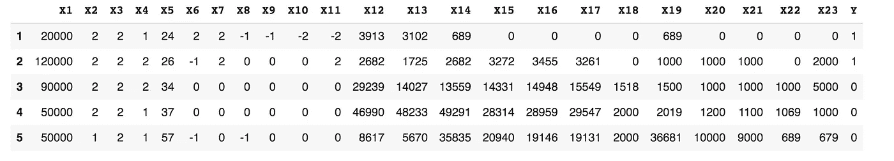

提取和清理后的数据集

X1:给定信用的金额

X2:性别(1 =男性；2 =女性)。

X3:教育(1 =研究生院；2 =大学；3 =高中；4 =其他)。

X4:婚姻状况(1 =已婚；2 =单身；3 =其他)。

X5:年龄(年)。

X6 — X11:以往付款历史(2005 年 4 月至 9 月)。还款状态的衡量标准是:-1 =按时支付；1 =延迟一个月付款；2 =付款延迟两个月；。。。；9 =延迟付款九个月，以此类推。

X12-X17:账单金额(2005 年 4 月至 9 月)

X18-X23:上次付款金额(2005 年 4 月至 9 月)

摆弄违约(或另一个目标变量)的分布可能是一个有趣的练习。

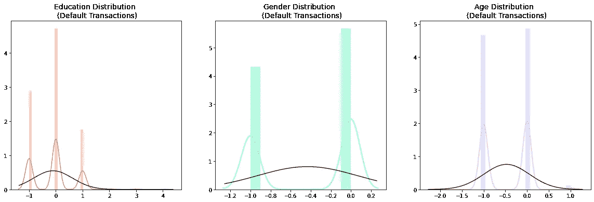

如果绘制不当，多峰分布可能会被掩盖

**勘探和规模数据**

数据集有 3000 多行和 24 列，其中 23 列是解释性的。没有空值(分数！)并且数据集似乎严重偏向(大约 78%)没有默认实例。

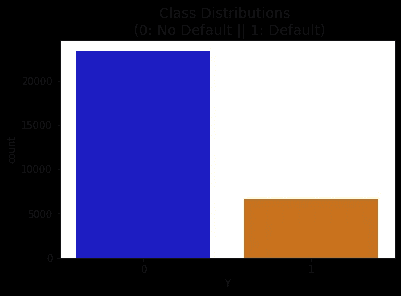

数据集严重偏向非违约案例

特征缩放规范了数据列，是数据预处理的重要步骤。将特定范围内的数据标准化也有助于加快计算速度。

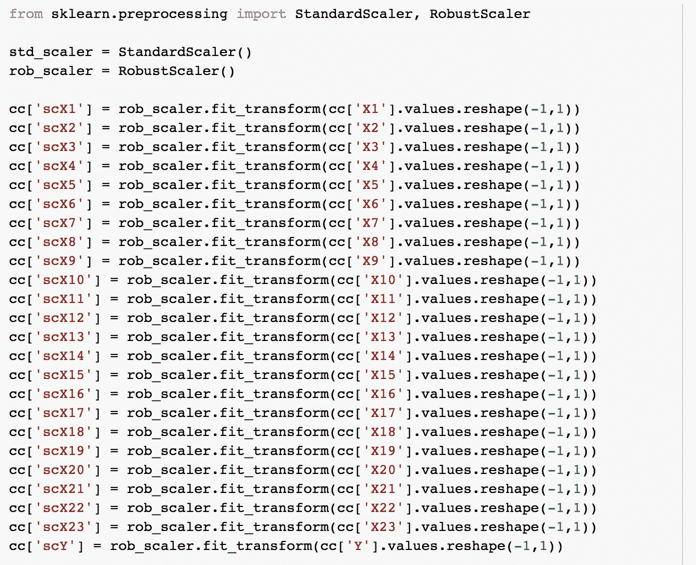

健壮的定标器不容易出现异常值

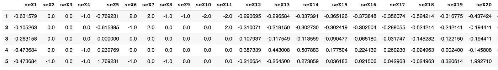

新缩放的数据

**将数据分成测试和训练集**

在机器学习中，构建了可以从数据中学习并对数据进行预测的算法。模型最初适合训练数据集，训练数据集是用于拟合参数的一组示例。使用特定的机器学习方法在训练数据集上训练该模型。然而，你不能做一个简单的训练测试分割，它是一个随机分割，忽略了类的分布或比例。

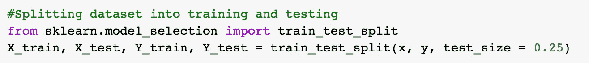

一个好的测试规模目标是大约 20–25%

在这种情况下，您最终会得到数据分布完全不同的训练集和测试集。在与测试集完全不同的数据分布上训练的模型将在验证时表现不佳。

**随机欠采样**

为了获得平衡的数据集并避免过度拟合，删除数据点非常重要。在这个数据集中，大约 70–75%的条目或非默认实例。

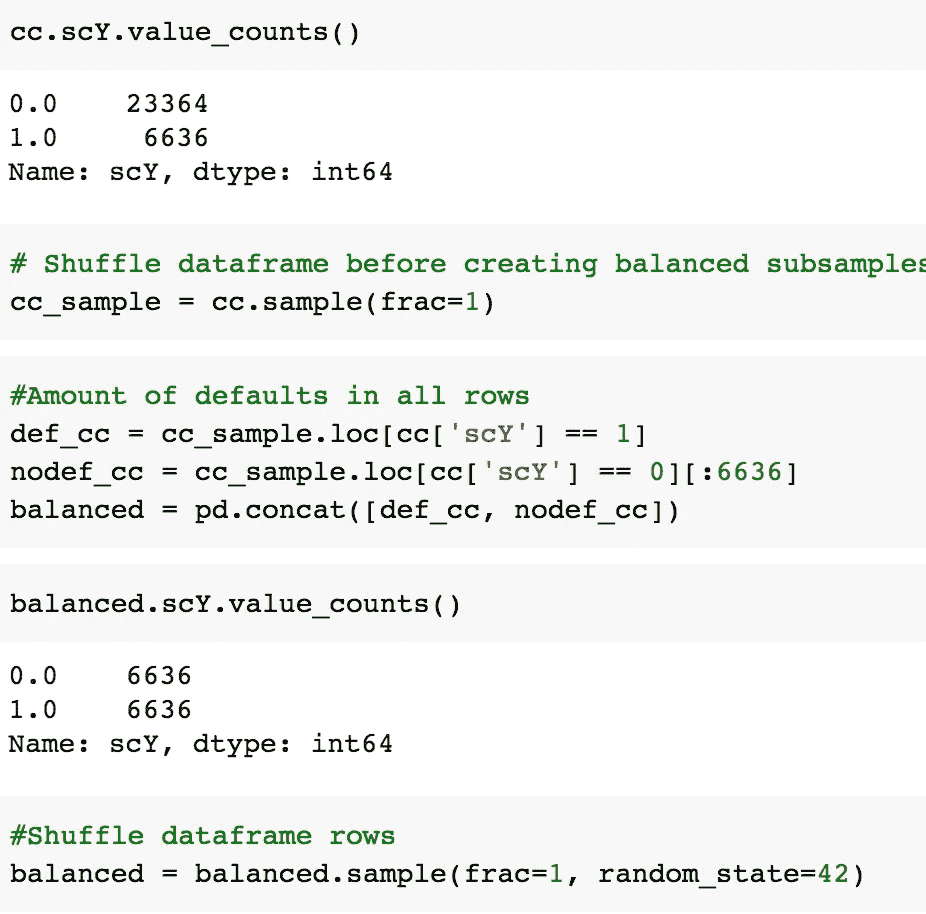

通过移动数据，您可以在每次运行脚本时查看您的模型是否保持其准确性

我们希望避免模型无法区分默认和非默认实例，而是“专注于”后者。

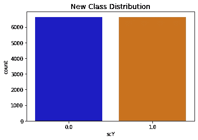

新数据集不再不平衡

因此，我们删除条目，直到默认实例和非默认实例之间的比例达到 50/50。其中一个问题是大量信息丢失。

**相关矩阵**

相关矩阵允许我们确定哪些特征对特定情况是否会成为违约的实例影响最大。重要的是，我们使用正确的子样本，以便我们看到哪些特征与违约实例高度相关。

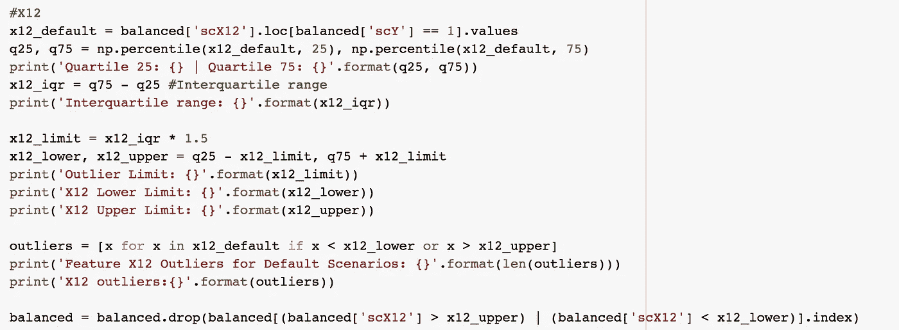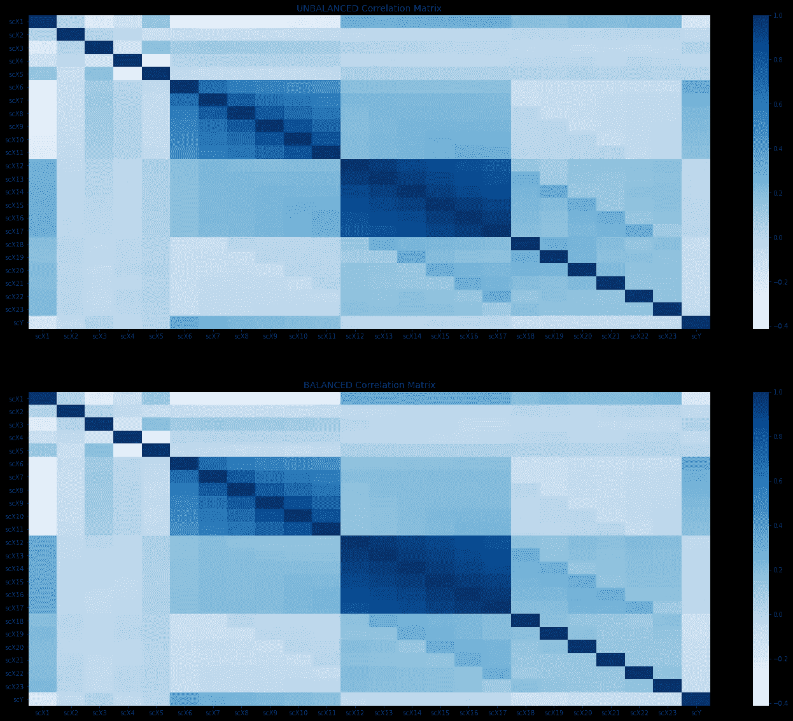

在这种情况下，不平衡数据集和平衡数据集之间没有区别

当这些值越低，最终结果越有可能是违约交易时，就会出现负相关。当这些值越高，最终结果越有可能是违约交易时，就会出现正相关。在这种情况下，余额交易变量 X12-X17 似乎关联最大，因此这是我们将重点关注的内容。

**异常检测**

从与我们的类高度相关的特征中移除异常值将会产生更准确的模型。

应对异常情况进行评估，至少评估上一步中确定的所有特征

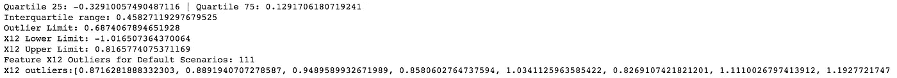

记录输出有助于比较多个范围

一种方法是四分位数范围法(IQR)，它可以消除落在第 25 个和第 75 个百分位数之间的实例。

**降维**

**PCA**

主成分分析(PCA)的思想是降低由大量相关变量组成的数据集的维度，同时尽可能多地保留数据中的方差。

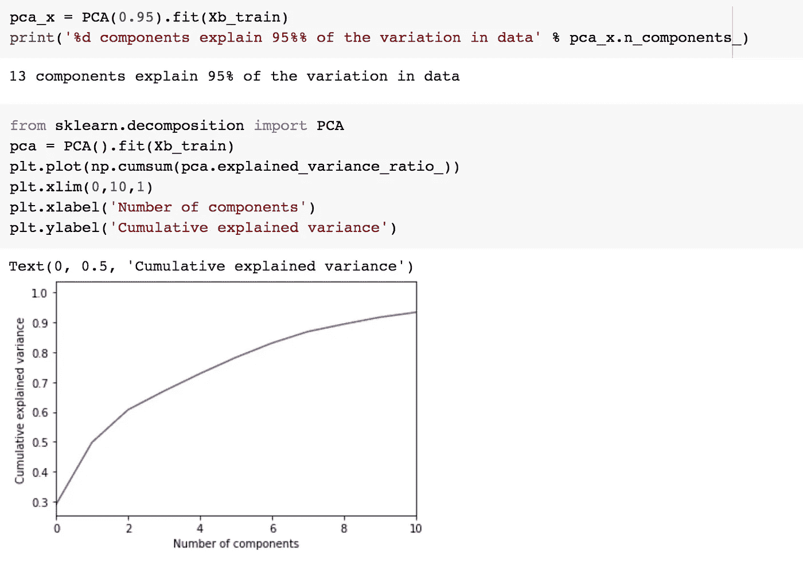

PCA 允许部件的减少

主成分分析帮助我们从现有的大量变量中提取一组新的变量。这些新提取的变量被称为主成分。

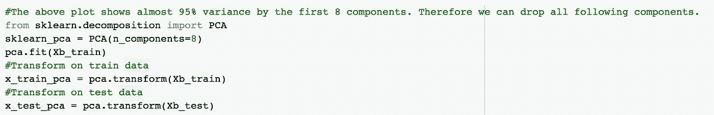

如果您愿意，可以删除剩余的组件

主成分是原始变量的线性组合。其他复杂因素包括:

*   提取主成分，使得第一主成分解释数据集中的最大方差
*   第二主成分试图解释数据集中的剩余方差，并且与第一主成分不相关
*   第三个主成分试图解释前两个主成分无法解释的差异，依此类推

**单变量分解**

奇异值分解(SVD)可用于将我们的原始数据集分解成它的组成部分，这导致维数减少。

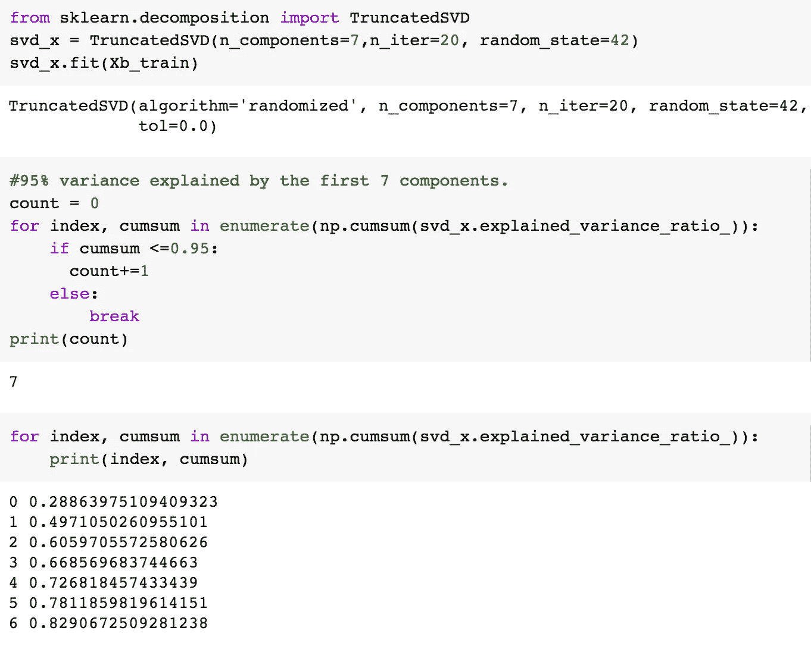

奇异值分解识别出 7 个重要成分，比主成分分析少 5 个

它用于移除数据集中的冗余要素。

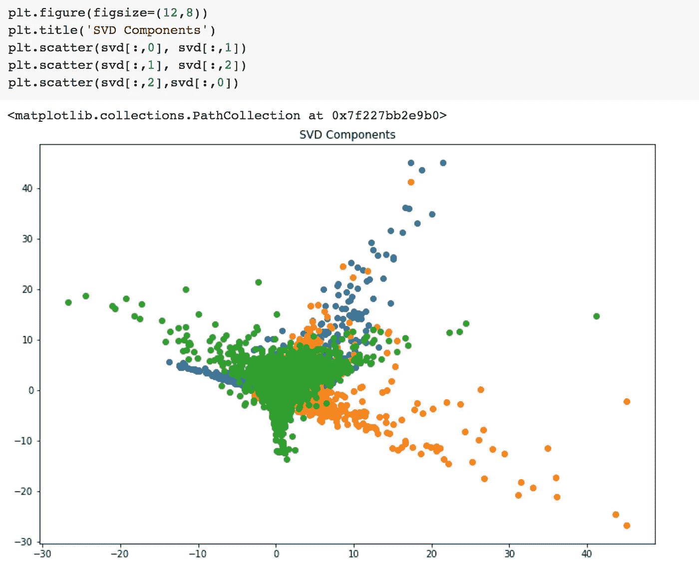

奇异值分解图将揭示其矩阵分解技术

奇异值分解将原始变量分解成三个组成矩阵。特征值和特征向量的概念用于确定这三个矩阵。

**t-SNE**

t-分布式随机近邻嵌入(t-SNE)是一种非线性降维技术，特别适合于在二维或三维的低维空间中可视化高维数据集

基本上，t-SNE 可以让你很容易地想象数据是如何在高维空间中排列的。

t-SNE 算法计算高维空间和低维空间中的实例对之间的相似性度量。然后，它尝试使用成本函数来优化这两个相似性度量。

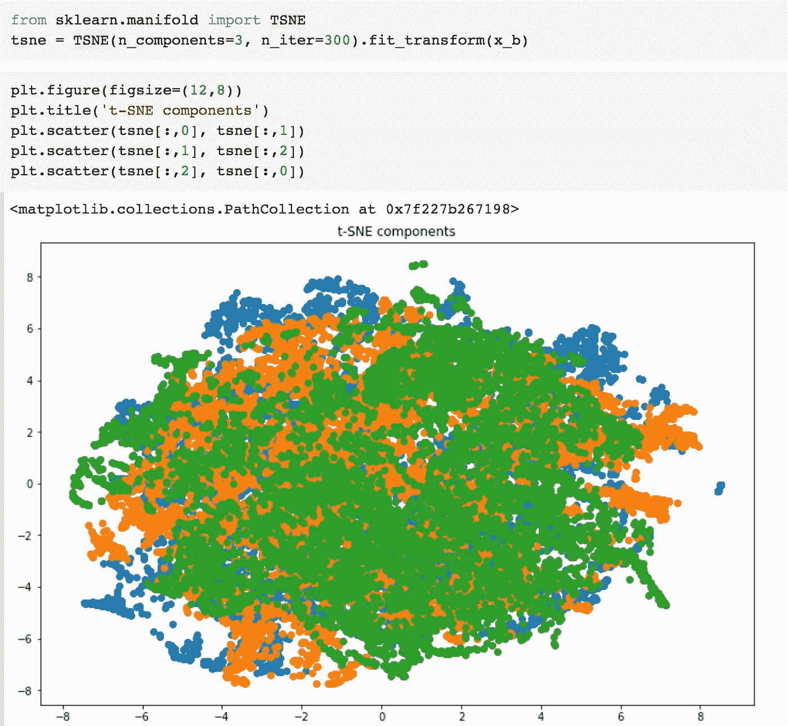

t-SNE 的图受所选参数化的影响很大

t-SNE 不同于 PCA，它只保留小的成对距离或局部相似性，而 PCA 关心的是保留大的成对距离以最大化方差。

**量词与超越**

虽然这是对该数据集的采样降维方法的结束，但还可以做更多的事情！首先，一旦数据集的特征从标签中分离出来，就可以对数据使用分类器。这个特殊的数据集可能需要使用 GridSearchCV 或逻辑回归。

还应该评估模型的欠拟合和过拟合，这可以分别通过高偏差和方差来确定。欠采样或过采样可能会影响模型检测默认情况的准确性。如您所见，在处理高维不平衡数据集时，需要考虑很多因素！