# Python 中探索性数据分析的分步指南

> 原文：<https://towardsdatascience.com/an-introduction-to-exploratory-data-analysis-in-python-9a76f04628b8?source=collection_archive---------9----------------------->


图片由[卢克·切瑟](https://unsplash.com/@lukechesser?utm_source=unsplash&utm_medium=referral&utm_content=creditCopyText)在 [Unsplash](https://unsplash.com/s/photos/data-visualization?utm_source=unsplash&utm_medium=referral&utm_content=creditCopyText) 上拍摄

很多时候，我看到数据科学的初学者跳过探索性数据分析(EDA ),直接进入构建假设函数或模型。在我看来，不应该是这样的。我们应该首先执行 EDA，因为它会在情感层面将我们与数据集联系起来，当然，这将有助于构建良好的假设函数。

EDA 是非常关键的一步。它让我们一瞥我们的数据集是什么，它的独特性，它的异常性，最后它为我们总结了数据集的主要特征。在这篇文章中，我将分享一个执行 EDA 的基本指南。

**第一步:导入你的数据集**，好好看看数据。

为了执行 EDA，我们将需要以下 python 包。

要导入的包:

成功导入包后，我们将继续导入数据集。你必须知道熊猫的 read_csv()工具，用于读取 csv 文件。

导入数据集:

出于本教程的目的，我使用了来自分析 Vidhya 的贷款预测数据集。如果你想继续编码，这里有[链接](https://datahack.analyticsvidhya.com/contest/practice-problem-loan-prediction-iii/#ProblemStatement)。

数据集已成功导入。让我们来看看训练数据集。

```
Train.head()
```

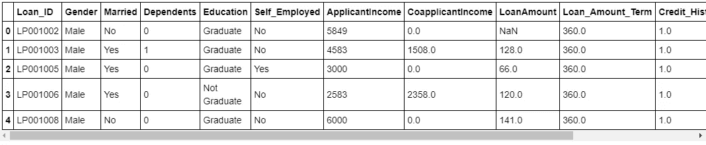

图 1:训练数据集概述

head()让我们对数据集有所了解。可以认为类似于 SQL 中的*select * from database _ table limit 5*。让我们继续深入探讨一下训练数据集中的不同字段。info()使用数据集的所有相关信息。如果数据集有更多的数值变量，也可以考虑使用 describe()来汇总平均值、中值、标准方差、方差等数据。

```
Train.info()
```

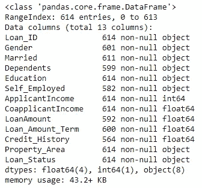

图 2:数据集中的列

我们观察到数据集中有 614 条记录和 13 列。训练数据集将 Loan_ID、性别、已婚、家属、教育、自雇、财产 _ 面积和 Loan_status 作为**对象类型**。pandas 中的对象类型类似于字符串。应用程序输入字段是整数类型的。其他三个字段即共同申请收入、贷款金额期限和信用历史是**浮点类型**。

**步骤 2:** 现在让我们试着**将这些列分类为分类、顺序或数字/连续。**

**分类变量:**分类变量是那些可以被划分成确定组的数据字段。在这种情况下，性别(男性或女性)、已婚(是或否)、教育(毕业或未毕业)、自营职业(是或否)、贷款状况(是或否)是分类变量。

**序数变量:**序数变量是可以分组的变量，但是这些分组是有某种顺序的。像，高，中，低。从属字段可以被认为是有序的，因为数据可以清楚地分为 4 类:0，1，2，3+并且也有明确的顺序。财产面积(城市、半城市或农村)也是如此。

**数值型或连续型变量:**数值型变量是指在给定范围内可以取任意值的变量。例如，申请收入、共同申请收入、贷款期限、贷款金额、信用历史记录。(我假设信用历史可以是 0 到 1 之间的任何值，但对于这一点，它似乎更像是一个分类变量。)

**干得好！你可能会为此感到自豪，因为你现在知道识别不同类型的变量。接下来，我们将逐一进行单变量、双变量和多变量分析。**

**第三步:**现在我们已经准备好执行**单变量分析。**

**单变量**分析涉及一次分析一个变量。假设是“性别”,那么我们将只分析数据集中的“性别”字段。分析通常以计数的形式进行总结。对于可视化，我们有许多选项，如频率表、条形图、饼状图、直方图等。由于我们是初学者，我们将坚持条形图。

下面是 pandas 中 plot()的基本语法。

```
pandas.DataFrame.**plot**(kind='{bar,barh,pie,box,line,...}',
figsize=(x,y), use_index={True,False},
title= Name_of_plot, fontsize={integer},
colormap={colors_from_matplotlib})
```

让我们先从分类变量开始。

```
Train.Gender.value_counts(normalize=True)
```

这段代码将从训练数据集中提取性别字段，并对其执行 groupwise 计数。值已被标准化，因为它将有助于可视化百分比。

```
.plot(kind = 'bar', title = "Gender")
```

pandas 的 plot()工具将有助于绘制特定类型的图表。像 kind = 'bar '这样的参数意味着我们需要一个条形图。随意选派，hist，line 等。根据你的要求。title = 'Gender '，这个很明显，这是剧情的名字。还有其他参数，如 figsize=(x，y)等。

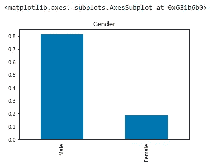

图 3:男性和女性申请者人数

我们可以使用 plt.subplot()将所有分类变量绘制在一起，并使用 plt.tight_layout()在它们之间留出一些空间。

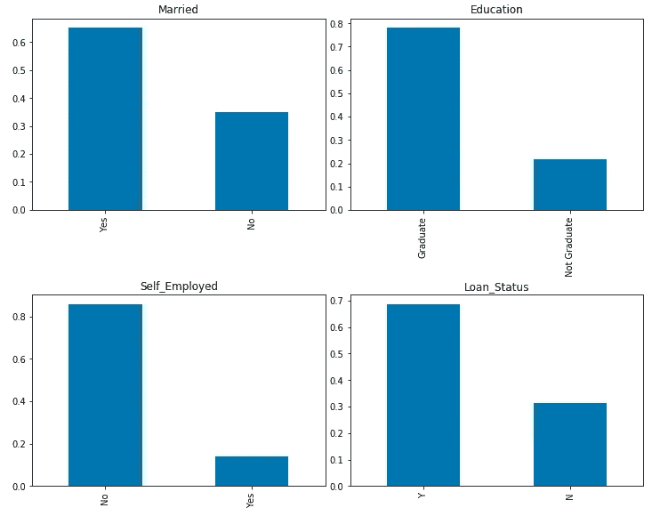

图 4:分类变量的单变量分析

**见解:**

*   在训练数据集中，80%的贷款申请人是男性。
*   近 70%已婚
*   大约 75%的贷款申请者是大学毕业生
*   近 85–90%的贷款申请人是个体经营者
*   超过 65%的申请人获得了贷款批准。

现在我们来看顺序变量。

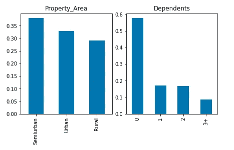

图 5:序数变量的单变量分析

**见解:**

*   几乎 58%的申请人没有家属。
*   来自半城市地区的申请者人数最多，其次是城市地区。

数值变量的可视化与顺序变量和分类变量略有不同。您可以通过首先创建条块来创建条形图，但更好的图是分布图、虚线图或箱线图，因为它有助于我们识别异常值。

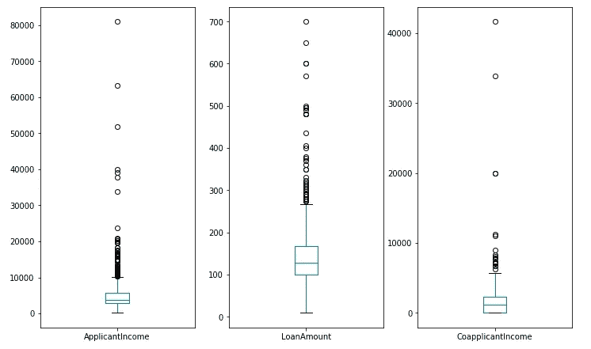

图 6:连续变量的箱线图

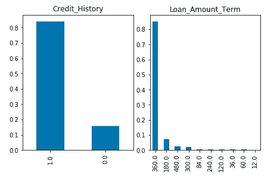

图 7:连续变量的单变量分析

**见解:**

*   85%的申请人有 1 英镑的信用记录
*   近 85%的贷款期限为 360 天。
*   应用程序收入大多在 10000–40000 之间，有一些异常值。
*   联合应用程序收入小于应用程序收入，在 5000–15000 之间，也有一些异常值。
*   贷款金额大多集中在 250–500 之间。

我们可能必须从应用程序传入和协同应用程序传入中删除异常值。但这是数据准备阶段的一部分。

**到目前为止做得很好！！**

**步骤 4:** 现在让我们找出两个变量之间的一些关系，特别是目标变量“贷款 _ 状态”和数据集中的一个预测变量之间的关系。形式上，这被称为**双变量分析**。

**双变量分析:**双变量分析是寻找两个变量之间的某种经验关系。比方说 ApplicantIncome 和 Loan_Status。

在进行任何类型的分析之前，让我们创建一个假设。这个假设将作为一盏指路明灯，指引我们去观察和分析。

在查看了单变量分析的结果后，我提出了以下假设。你可能有自己完全不同的假设。

*   高收入的申请人可能有更多的机会获得贷款批准。
*   受抚养人人数少、共同申请人收入高的申请人可能有更多的机会获得贷款批准。
*   大学毕业生申请人往往收入更高，因此贷款批准率也更高。
*   已婚的申请人可能看起来更有责任感，因此贷款批准的几率更高。
*   申请人谁不是自雇人士，可能有更高的机会贷款批准，因为他们往往有稳定的收入来源。我想说，不确定性减少了。
*   在城市地区拥有房产的候选人可能有更高的贷款批准机会，因为抵押品的成本会很高。
*   良好的信用记录肯定与贷款批准相关。
*   对于性别，我没有什么具体的想法，但可以说女性更有责任感，因此支持率也更高。(P.S .无恨)。

现在，让我们检查这个假设，对于这个数据集是否正确。

为了可视化，我们将使用 seaborn.countplot()。可以认为它类似于分类变量的直方图。

sns.countplot()的基本语法如下:

```
seaborn.countplot(x = 'x_axis_values', y_axis = 'y_axis_values',
*hue='data_field_on_which_colour_of_bars_depend'*, *data=dataset*)
```

在这里，我使用了尽可能少的参数，你可以使用颜色，饱和度等。放大你的情节。

```
sns.set(rc={'figure.figsize':(11.7,8.27)})
```

sns.set()用于设置输出图形的大小。

```
sns.countplot(x="Gender", hue='Loan_Status', data=Train)
```

sns.countplot()将绘制性别字段计数，并根据 loan_status 值对条形进行着色。

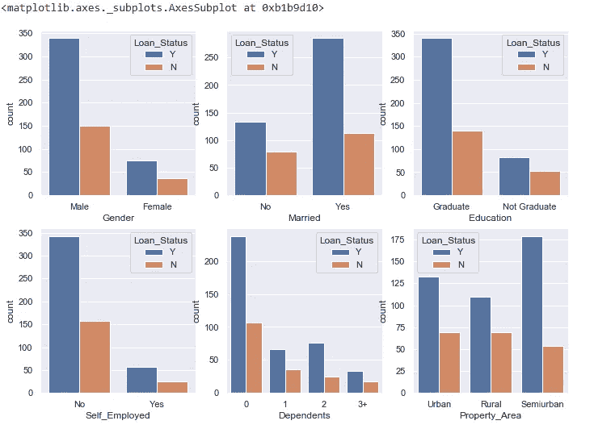

图 8:分类和顺序变量的双变量分析

**见解:**

*   男性和女性的支持率没有实质性差异。
*   已婚申请人获得贷款批准的几率稍高。
*   与非毕业生相比，毕业生获得贷款批准的机会更大。
*   自营职业者和非自营职业者的贷款批准率没有实质性差别。
*   没有受抚养人或有两个受抚养人的申请人获得批准的几率更高。但是这没有很好的关联。
*   在半城市地区拥有房产的申请人贷款批准率更高。

**第五步:**现在让我们继续分析两个以上的变量。耶！！你猜对了，我们称之为“**多元分析**”。你应该首先像第三步那样创建一个假设，并朝这个方向行动。

这是对性别、申请收入和贷款状况的分析。

由于 applicantIncome 是一个连续的字段，我首先使用 np.linspace()函数创建了 12 个区间，区间范围为最小到最大 ApplicantIncome。

```
bins = np.linspace(Train.ApplicantIncome.min(), Train.ApplicantIncome.max(),12)
```

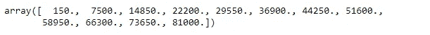

应用程序收件箱

FacetGrid()用于绘制多个变量之间的条件关系。这里，我们在 x 轴上有性别组，在 y 轴上有值计数，在色相上有 Loan_Status。

```
graph = sns.FacetGrid(Train, col="Gender", hue="Loan_Status", palette="Set2", col_wrap=2)
```

接下来，我们将 FacetGrid()绘图与应用程序输入的条块进行了映射。

```
graph.map(plt.hist, 'ApplicantIncome', bins=bins, ec="k")
```

现在一切都在一起了。

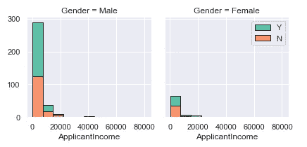

图 9:描述性别、申请收入和贷款状态之间关系的直方图

让我们继续为所有其他可能的组合这样做。

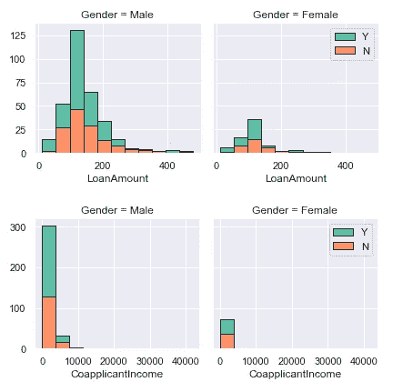

图 10:多元分析的直方图

**见解:**

*   收入高于 7000 英镑的女性获得贷款批准的机会更大
*   女性的贷款额似乎比男性少
*   女性候选人的共同申请人收入低于男性。但是，它并没有反映出 loan_status 的多少信息。

这个挺直观的。你理解这个概念是对的。现在，您可以自由地尝试更多这样的带有其他预测因素的地块，如已婚、自营职业、财产面积等。

寻找数据集中数值变量之间的相关性。

```
correlation_mat = Train.corr()
```

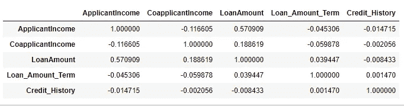

图 11:数值变量的相关矩阵

让我们使用热图来可视化这个关联矩阵中的数据。

我们不需要整个热图。为什么不删除上半部分，因为它重复。可以使用掩模来执行该任务。

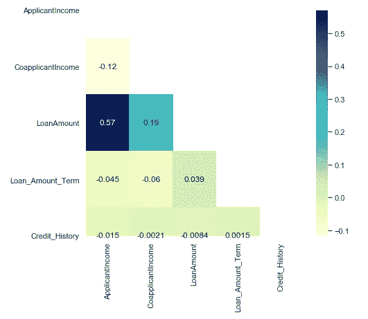

图 13:热图矩阵的有用部分

**见解:**

*   申请收入与贷款金额、共同申请收入与贷款金额之间存在正相关关系。

**简而言之……**

探索和了解数据集是非常重要的一步。它不仅有助于发现数据集中的异常、唯一性和模式，而且有助于我们建立更好的假设函数。如果你想看完整的代码，这里有我的 jupyter 笔记本的链接。