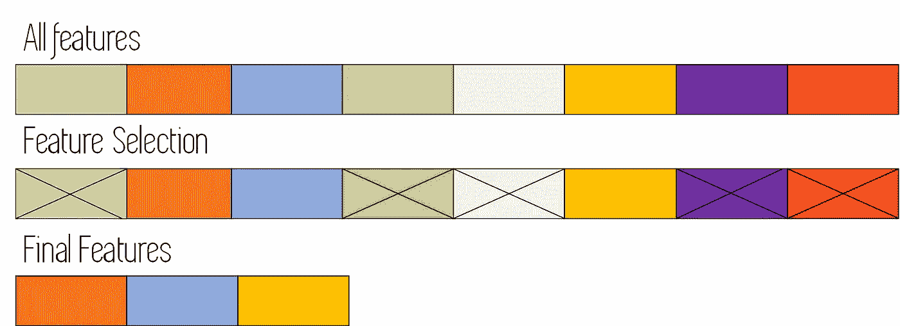
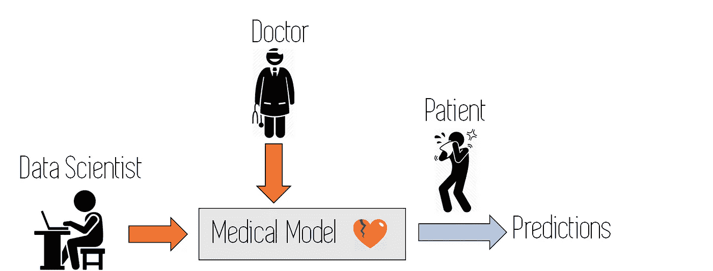
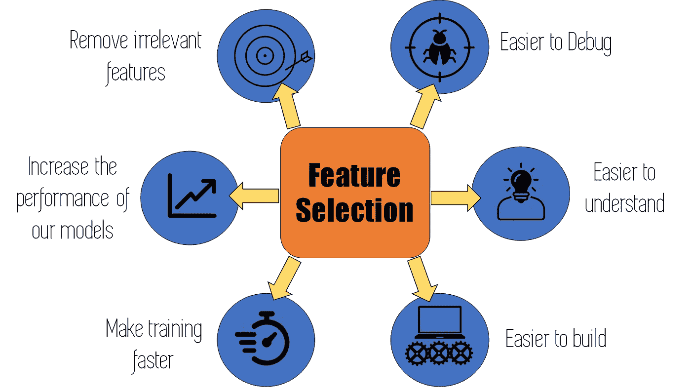

# 特征选择简介

> 原文：<https://towardsdatascience.com/an-introduction-to-feature-selection-dd72535ecf2b?source=collection_archive---------15----------------------->

## 为什么以及如何进行特征选择

图片来自[来源](https://unsplash.com/)。

> 应该使用哪些特征来创建预测性机器学习模型？

这是每一个机器学习从业者在研究为某个应用创建模型时都应该考虑的问题。

我有时觉得，人们普遍认为更多的特性意味着更好的模型性能，然而，这远非事实。

## 什么是特征选择？

**特征选择**包括通过从数据中获取这些见解，自动为我们的模型和算法选择最佳特征，而无需使用专家知识或其他类型的外部信息。

自动意味着我们不手工挑选特征，而是使用一些算法或过程，只保留模型及其应用领域中最重要的特征。

使用特征选择算法后，我们的初始特征会发生什么的模式。

这里需要知道的是**关于模型所针对的应用领域的专业知识非常重要**，因为它允许我们更好地理解将要使用的数据，并因此获得一些关于哪些功能可能是重要的，哪些功能可能应该被丢弃的直觉。

**研究从模型中消除的特征非常重要**。在我们的初始训练数据中存在的特征，但是可能将某种类型的'*未来'*信息引入到模型中的特征，应该被移除，因为它们可能会使结果有偏差，并且我们可能在执行时不会得到它们。

在制作任何一种机器学习模型时，专家知识总是很重要的。例如，在构建医疗诊断模型时，来自医生或应用程序领域的其他代理的信息总是非常有用。来自[信号源的图标。](https://www.shutterstock.com/es/?kw=shutterstock&gclid=CjwKCAiA4Y7yBRB8EiwADV1haSop3r8y6TUz6MfBSt4knRwhSN03v0XjyjrtKP7E_D-V14b2DW44WhoCC_QQAvD_BwE&gclsrc=aw.ds)

应该为每个功能考虑生产时间可用性，而不仅仅是那些可能包含*“未来*”信息的功能。为了清楚起见，让我们来看一个这类特性的例子:

***“未来”特征示例:*** *假设我们正在构建一个 ML 模型，在给定某场比赛的一些统计数据的情况下，计算某支足球队在半场结束时获胜的概率。*

为此，我们必须使用以前完整比赛的数据来训练模型(因为我们需要知道他们在比赛结束时是否赢了；这将是我们的模型的目标)，然而，我们应该只使用从匹配的前半部分取得的特征/变量，因为那些是我们在模型的执行时间将具有的特征。

*此外，如果我们使用来自比如说 80 分钟的训练数据，我们将会在我们的模型中引入一些特征，这会使我们的‘半场’算法产生偏差；除了在我们使用这个模型的时候没有真正可用的变量。*

## 为什么要做特征选择？

好了，现在我们知道什么是特征选择，让我们看看为什么我们应该在训练机器学习模型时使用它:

*   使用特征选择，我们可以**移除那些不会影响或改变我们模型**输出的无关特征。如果我们试图预测西班牙的房价，使用包括中国天气条件在内的变量，这些变量可能不会非常有用*。*
*   这些不相关的功能实际上会通过引入噪声降低你的模型的性能。
*   **更少的特征通常意味着更快的训练模型**:对于线性或逻辑回归等参数模型，这意味着需要计算的权重更少，而对于决策树随机森林等非参数模型，这意味着每次分割时需要评估的特征更少。
*   当将模型投入生产时，更少的特性意味着**构建将使用该模型的应用**的团队工作更少。使用特性选择，我们可以减少应用程序的集成时间。
*   当我们保留最重要的特征，丢弃我们的特征选择方法建议我们删除的特征时，**我们的模型变得更简单，更容易理解**。具有 25 个特征的模型比具有 200 个特征的模型简单得多。
*   一旦应用程序完成，并被定期使用，在出现异常行为的情况下，具有**较少功能的模型比具有大量功能的模型更容易调试**。

***“异常”行为的例子:*** *想象一下，我们已经建立了一个模型来预测某些住院病人患心脏病的概率，突然它开始预测每个人都生病了。这个问题可能是由某些变量引起的，这些变量以不同于训练数据的方式获得信息。*

也许在训练数据中，某些百分比值是以十进制(0.75)给出的，因为它处理这些数据的方式发生了变化，所以我们现在把它作为一个整数来接收(75，意味着 75%)。这显然会使我们的模型行为怪异，因为它期望一个介于 0 和 1 之间的数字，却得到完全不同的结果。

*如果我们必须通过 200 个变量来找出是哪一个导致了问题，我们将不得不比只有 10 个变量时做更多的工作。*

在我们的模型上使用特征选择的好处。来自[的图标来源](https://www.iconfinder.com/)。

## 如何进行特征选择:

有许多方法可以进行特征选择，其中许多都隐含在数据清理阶段，这是任何项目在构建模型之前都应该进行的。

*   例如，**在数据清理阶段消除具有高百分比未通知值的特征**，已经可以被视为特征选择过程的一部分。
*   可被视为特征选择的该过程的其他步骤是**消除相关变量**(冗余或解释相同信息的特征)并移除具有非常高百分比的相似值的特征或具有唯一值的特征。
*   一些**正则化技术**(减少过度拟合的技术)，如 LASSO，也可以用于特征选择，因为它们对于与问题无关的特征收敛到接近零的权重值。
*   **类似随机森林或其他集成的算法**也可用于特征选择。这些算法中的大多数都有办法对参与我们模型的特征的重要性进行排序。为了进行特征选择，我们可以使用这些算法中的一种和我们所有的特征来制作初始模型，按照重要性的顺序对它们进行排序，并保留前 X 个特征用于我们的最终模型。

这种用于特征选择的模型将在下一篇文章中讨论。使用它们时，绘制如下图很有意思:

随着功能数量的增加，特定性能指标也会增加。

上图显示了当我们按照重要性顺序添加特征时，机器学习模型的性能增加(第一个模型仅使用一个特征进行训练:最重要的特征。使用两个最重要的特征来训练第二个模型，等等……)

通过使用这样的图表，我们可以决定在哪里削减，在我们的模型的性能和使用的功能数量之间做出妥协。

*   最后，更多像 BORUTA 这样统计上复杂的方法，将在下面的一篇文章中解释，可以用作特征选择技术。

最后，重要的是要提到**特征选择不同于主成分分析(PCA)等维度缩减**技术。降维技术通常通过组合初始要素以形成新要素来减少数据的要素数量，而要素选择技术则从初始要素集中选择一个子集，而不进行修改。

# 结论和其他资源

*特征选择是机器学习模型构建中非常重要的一步。它可以加快训练时间，使我们的模型更简单，更容易调试，并缩短机器学习产品的上市时间。以下视频涵盖了本帖中提到的特征选择的一些主要特征。*

此外，如果您想了解更多信息，也有一些关于特性选择的书籍会深入探讨这个主题:

*   [*用于知识发现和数据挖掘的特征选择(Springer)*](https://amzn.to/38snFQX)
*   [*特征工程与选择:预测模型的实用方法(Kuhn，Johnson)*](https://amzn.to/32YYHYq)

就这些，我希望你喜欢这个帖子。请随时在 Twitter 上关注我。还有，你可以看看我在数据科学和机器学习上的帖子[**这里**](https://medium.com/@jaimezornoza) 。好好读！

更多类似的帖子请关注我的媒体 ，敬请关注！