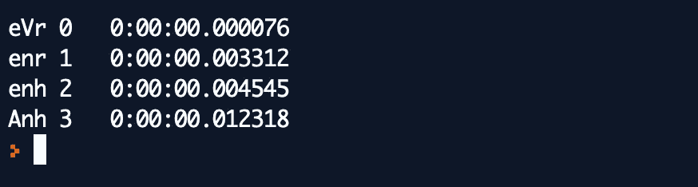

# 遗传算法导论

> 原文：<https://towardsdatascience.com/an-introduction-to-genetic-algorithms-c07a81032547?source=collection_archive---------31----------------------->

## 包括 Python 中的一个例子


Johannes Plenio 在 [Unsplash](https://unsplash.com?utm_source=medium&utm_medium=referral) 上拍摄的照片

遗传算法(GAs)是进化计算(EC)的一部分，进化计算是人工智能(AI)的一个快速发展的领域。它受到基于查尔斯·达尔文自然选择理论的生物进化过程的启发，在这一过程中，更健康的个体更有可能将他们的基因传递给下一代。我们作为人类，也是数千年进化的结果。

# 遗传算法的历史

遗传算法是由霍兰德和他的合作者在 20 世纪 60 年代和 70 年代开发的。

*   早在 1962 年，霍兰德在适应性系统方面的工作就为后来的发展奠定了基础。
*   到了 1975 年，出版了《自然和人工系统中的*适应*》一书，由霍兰德和他的学生及同事合作完成。

遗传算法在 20 世纪 80 年代后期开始流行，被广泛应用于用其他技术不容易解决的问题。

1992 年，John Koza 已经使用遗传算法来进化程序以执行某些任务。他称自己的方法为“*遗传编程*”(GP)。

# 现实世界中的进化是什么？

几千年来，人类一直扮演着基因选择的角色，通过培育具有所需特征的后代。我们所有的驯养动物和粮食作物都是结果。下面让我们回顾一下自然界中的基因术语。

*   生物的每个细胞都包含**染色体**——DNA 链*。*
*   每条染色体包含一组**基因**——DNA 块
*   每个基因决定了生物体的某些方面(比如眼睛的颜色)
*   一组基因有时被称为**基因型**
*   一些方面的集合(比如眼睛的颜色)有时被称为**表现型**
*   生殖(**交叉**)包括来自父母的基因重组，然后是复制中的少量**突变**(错误)
*   一个有机体的适应度是指它在死亡前能繁殖多少
*   基于“适者生存”的进化

# 计算机科学中的遗传算法是什么？

遗传算法被归类为全局搜索试探法。遗传算法是一种在计算中使用的搜索技术，用于找到优化和搜索问题的真实或近似解决方案。它使用受生物进化启发的技术，如遗传、突变、选择和交叉。


遗传算法的五个步骤

我们看看遗传算法背后的基本过程如下。

**初始化群体:**遗传算法从初始化候选解的**群体**开始。这通常是随机进行的，以提供整个搜索空间的均匀覆盖。一个候选的解决方案是 C **染色体**，其特征在于一组被称为**基因**的参数。

**评估:**接下来，通过给群体中的每个个体分配一个适应值来评估群体。在这一阶段，我们通常希望记录当前最适合的解决方案，以及群体的平均适合度。

在评估之后，该算法根据设置的终止条件决定是否应该终止搜索。这通常是因为算法已经达到了固定的世代数或者已经找到了合适的解决方案。

当最终满足终止条件时，算法将跳出循环，通常将其最终搜索结果返回给用户。

**选择:i** 如果不满足终止条件，群体经历选择阶段，在该阶段中，基于个体的适应度分数从群体中选择个体，适应度越高，个体被选择的机会越大。

两对被选中的个体称为**父母。**

**交叉:**下一步是对被选中的个体进行交叉和变异。这个阶段是为下一代创造新个体的阶段。

**突变:**此时，新群体回到评估步骤，该过程再次开始。我们称这个循环的每个周期为一代。

# 用 Python 语言实现遗传算法的实例

现在，让我们看看如何使用遗传算法破解密码。想象一下，一个朋友让你解决下面这个挑战:“*你必须在我的电脑里找到我设置为密码的三个字母的单词*”。

在我的例子中，我们将从长度为 3 的密码开始，密码中的每个数字都是一个字母。密码的一个例子是:`nkA`。我们将从随机生成的初始字母序列开始，然后一次随机更改一个字母，直到单词是“Anh”。

起初，我们猜测任何由三个字母组成的随机生成的单词，如“`Ink, aNj, cDh`”。单词`Ink`和`cDh`与密码`Anh`只有一个相同的字母。我们说他们的得分是 1。单词`aNj`的分数为 0，因为它没有任何与密码匹配的字母。


基因、染色体和种群

既然我们还没有找到解决办法，我们可以通过梳理一些我们已经有的词来产生新一代的词。比如他们是“`Inh, aDj`”。从这两个新词来看，`Inh`这个词得分为 2，非常接近密码。我们说第二代比第一代更好，因为它更接近解决方案。

可以形成第三代，其中单词`Inh`可以产生单词`Anh`，其中`I`被随机突变为`A`。这个例子很容易理解遗传算法。

## 这个算法的伪代码

```
_letters = [a..zA..Z]
target = "Anh"
guess = get 3 random letters from _letters while guess != target:
     index = get random value from [0..length of target] 
     guess[index] = get 1 random letter from _letters
```

## Python 中的示例实现

现在，我们将用 Python 语言实现这个例子。密码中的每个数字将被视为一个`Gene`。我们需要一组基因来建立猜测。在这个例子中，这是一组通用的字母。

```
geneSet = "abcdefghijklmnopqrstuvwxyzABCDEFGHIJKLMNOPQRSTUVWXYZ"
```

它还需要一个目标密码来猜测。

```
target = "Anh"
```

接下来，该算法需要一种从基因集中生成随机字符串的方法。

```
import randomdef generate_parent(length):
    genes = []
    while len(genes) < length:
        sampleSize = min(length - len(genes), len(geneSet))
        genes.extend(random.sample(geneSet, sampleSize))
    return ''.join(genes)
```

遗传算法提供的适应值是引擎得到的唯一的反馈来引导它找到解决方案。在这个项目中，适合度值是猜测中与密码相同位置的字母相匹配的字母总数。

```
def get_fitness(guess):
    return sum(1 for expected, actual in zip(target, guess)
               if expected == actual)
```

接下来，引擎需要一种方法，通过改变当前的猜测来产生新的猜测。

```
def mutate(parent):
    index = random.randrange(0, len(parent))
    childGenes = list(parent)
    newGene, alternate = random.sample(geneSet, 2)
    childGenes[index] = alternate \
        if newGene == childGenes[index] \
        else newGene
    return ''.join(childGenes)
```

我们还需要显示功能来显示信息。正常情况下，显示功能还会输出健身值和经过的时间。

```
import datetimedef display(guess):
    timeDiff = datetime.datetime.now() - startTime
    fitness = get_fitness(guess)
    print("{0}\t{1}\t{2}".format(guess, fitness, str(timeDiff)))
```

最后，我们将尝试使用上面的函数运行这个解决方案，如下所示。

```
random.seed()
geneSet = " abcdefghijklmnopqrstuvwxyzABCDEFGHIJKLMNOPQRSTUVWXYZ"
target = "Anh"
startTime = datetime.datetime.now()
bestParent = generate_parent(len(target))
bestFitness = get_fitness(bestParent)
display(bestParent)
while True:
    child = mutate(bestParent)
    childFitness = get_fitness(child) if bestFitness >= childFitness:
        continue
    display(child)
    if childFitness >= len(bestParent):
        break
    bestFitness = childFitness
    bestParent = child
```

运行上面的代码，我们会看到下面的输出。



遗传算法很容易理解。对吗？

# 参考

[1] [自适应系统的逻辑理论概要](https://dl.acm.org/doi/10.1145/321127.321128)

[2] [自然和人工系统中的适应](https://mitpress.mit.edu/books/adaptation-natural-and-artificial-systems)

[3] [遗传编程:通过自然选择的方式对计算机进行编程](https://mitpress.mit.edu/books/genetic-programming)