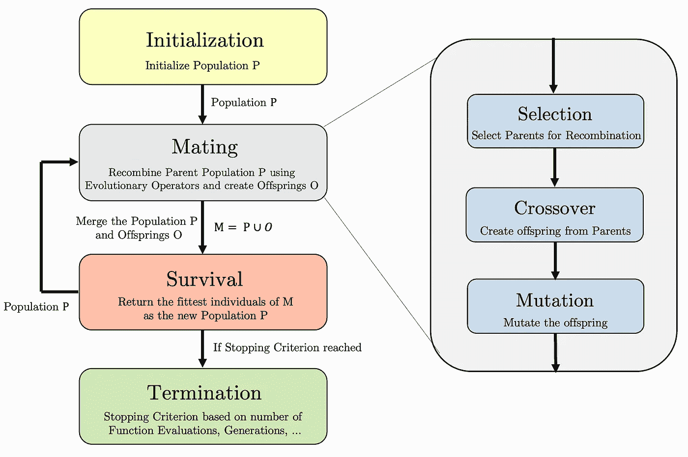
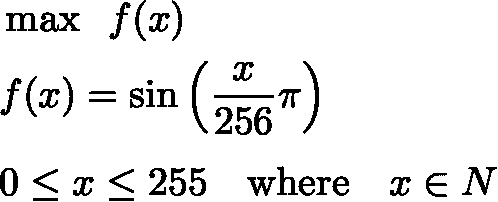
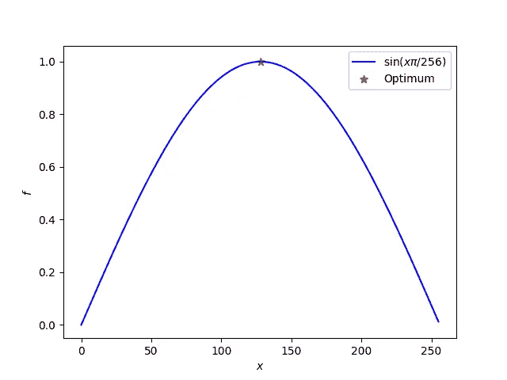
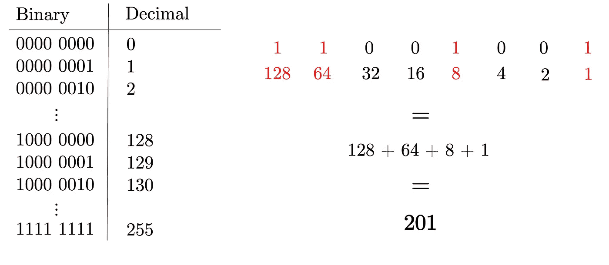
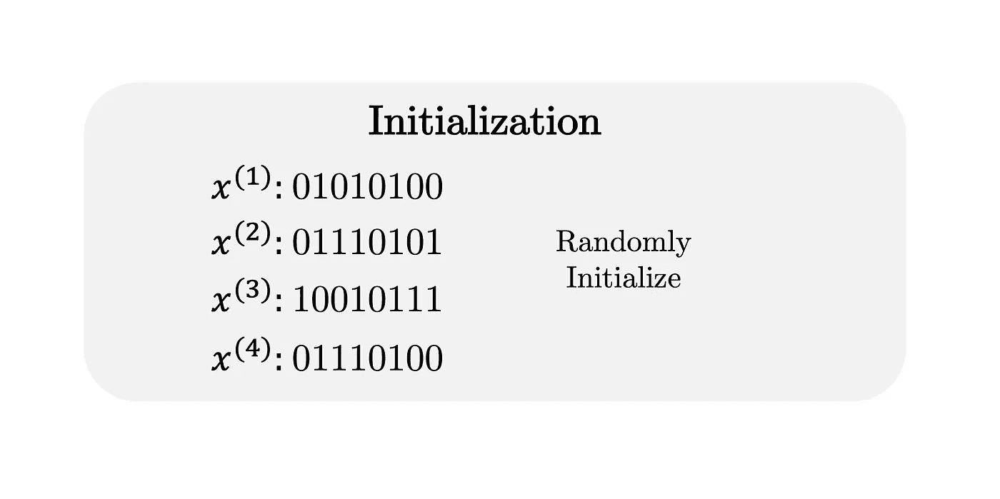
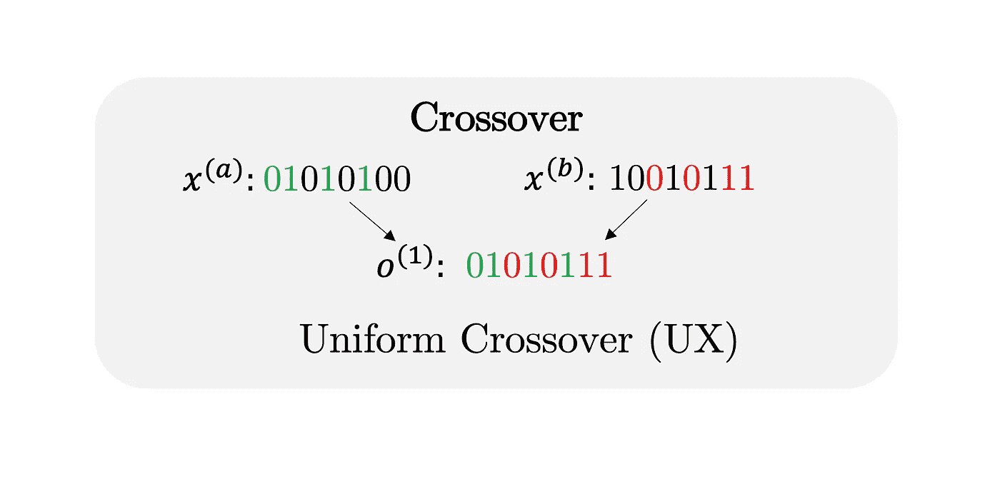
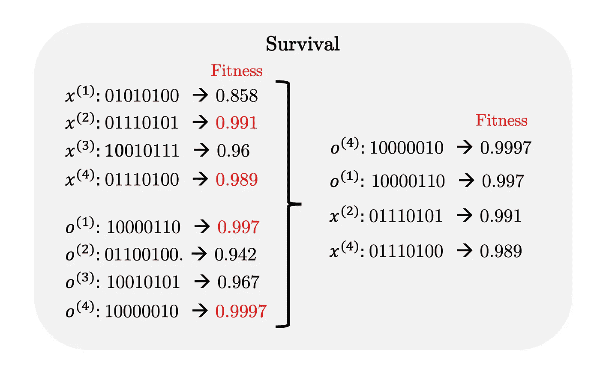

# 遗传算法导论:最优化中的生物进化概念

> 原文：<https://towardsdatascience.com/an-introduction-to-genetic-algorithms-the-concept-of-biological-evolution-in-optimization-fc96e78fa6db?source=collection_archive---------13----------------------->


[Pixabay](https://pixabay.com/illustrations/dna-genetic-material-helix-proteins-3539309/)

## 使用遗传算法解决优化问题的 Python 源代码实用指南。

遗传算法(GA)受到物种自然选择的启发，属于被称为进化算法(EA)的更广泛的一类算法。生物进化的概念被用来解决各种不同的问题，并因其可靠的全局搜索能力而闻名。因此，遗传算法已经被用于解决大量的现实世界的优化问题，并且是优化和相关领域的基本研究课题。它们因在自然科学、社会科学、地球科学、金融或经济学等学科中的多学科应用而闻名。此外，遗传算法已被普遍用于解决数据科学、机器学习和人工智能中众所周知的优化问题，例如，选择数据集中的特征、识别模式或确定神经网络的架构。

在使用遗传算法十多年后，我仍然觉得这个概念很吸引人，很有说服力。本文旨在向您介绍遗传算法和进化算子的用法。介绍了遗传算法的原理，并提供了解决一个数值测试问题的源代码。自己开发一个遗传算法，让你对优化背景下的进化有了更深刻的理解。如果你一直对遗传算法很好奇，但一直没有时间实现它，你应该继续阅读。此外，如果你像我一样对进化计算的概念充满热情，并渴望了解更多复杂的想法，请随时报名参加我的[在线课程](https://anyoptimization.thinkific.com/)。

遗传算法的灵感来自查尔斯达尔文的理论: ***“物竞天择适者生存”*** 。“适应”一词指的是繁殖的成功，或者换句话说，指的是为下一代创造后代的能力。繁殖成功反映了有机体适应环境的程度。因此，遗传算法的两个核心组成部分是 i) **交配**(或繁殖)和 ii) **生存**(或环境选择)。在优化环境中使用生物进化概念的目的是定义有意义的重组和生存算子，并让进化发生。

在我开始解释算法的概要之前，我想谈谈进化计算中的术语。大多数遗传算法不使用单一解，而是在进化计算的背景下称为 ***种群*** 的解集。群体的大小是预先定义的，称为 ***群体大小*** 。群体中的每个解通常称为一个 ***个体*** 。此外，由两个或多个亲代个体重组产生的个体被称为子代。由交配和生存组成的遗传算法的每次迭代称为 ***代*** 。理解进化计算的术语有助于理解本文以及一般文献中的观点。



遗传算法从初始化形成预定大小|P|的群体 P 的个体开始。种群 P 经历交配过程，其目的是通过重组产生后代 O。为了通过交配产生后代，种群必须经历亲代选择、杂交和变异。然后，种群 P 和后代 O 被合并到大小为|P+O|的解集 M 中。通过只选择最适合的个体，生存将 M 再次减少到大小为|P|的解集。然后将所得的截短群体用于下一代的重组。重复该过程，直到满足终止标准。

如果你更喜欢伪代码，下面的描述可能会更吸引你:

```
Define pop_size, n_gen;P = initialize(pop_size)
evaluate(P)

for k in (1, .., n_gen)

    parents = selection(P) O = mutation(crossover(parents))
    evaluate(O) M = merge(P, O) P = survival(M)endfor
```

我们最终的实现看起来与这段伪代码非常相似。通过更仔细地查看此描述，我们可以注意到必须实现以下功能:

*   **评估:**要解决的实际问题，其中函数决定了每个个体的适应度。
*   **初始化:**这个方法返回初始群体 p。
*   **选择:**返回群体中作为重组亲本的个体的函数。
*   **交叉:**给定两个或更多亲本，创建一个或多个子代的函数。
*   **突变:**一种以特定概率突变每个后代的方法。
*   **生存:**通过应用适者生存的原则，将合并的种群减少到等于种群大小的一组解的函数。

看起来很多。不过，不要被吓倒。我将指导你实现每一个方法。其中一些只有一两行代码，在我们的例子中相当简单。但是，它们都有特定的用途，可以根据您的优化问题进行定制。

在我开始描述一个数值优化问题来演示遗传算法的用法之前，我想说几句关于你到目前为止所看到的。我不知道你，但当我第一次接触遗传算法时，整个概念对我来说听起来有点神秘。我无法想象应用进化论的原理如何帮助我解决最优化问题。尽管如此，实现我的第一个遗传算法来解决我在那段时间面临的一个优化问题真的让我大开眼界，让我想知道更多关于进化计算和相关概念的知识。最后，我还想在这个迷人的研究领域攻读博士学位，并将我的兴趣与我的日常工作结合起来。为了分享一点这方面的经验，我们将使用遗传算法解决一个数值问题。用**我们**，我指的是**我们**。我真诚地鼓励您打开自己选择的编辑器或 IDE，并按照本文中的步骤进行操作。

## 问题定义

为什么关注一个特定的优化问题并解决它如此重要？我对这个问题的回答可能更多的是个人性质的。每当我遇到一些我知道的东西，我真的想理解它，我遵循的步骤:*阅读，理解和应用。*和*应用*对我来说往往意味着实现。你不会相信我有多经常有理解一个概念的印象，但是甚至不能为它开发代码。而且，我是一个喜欢看实践的人。当我开始学习编码时，我想我会从头到尾读完一本书，并且我能够编码。做过同样尝试的人都知道，这是根本错误的。编码需要在实践中运用理论。长话短说，本文基于一个数值问题开发了该算法，不仅谈论了遗传算法的好处，而且实际上让您自己体验它们。

应解决以下优化问题:



在这个优化问题中，我们考虑整数值变量 x 的范围从 0 到 255 的正弦函数。正如你们大多数人可能知道的那样(可能真的应该知道)，正弦函数在π/2 处有一个最大值，考虑到范围从(0，2π)。当 x 的范围(仅映射到范围(0，π)中的正弦函数)和 x 除以 256 时，解析导出的最大值位于 x=128。



因为遗传算法对二进制变量进行操作(不用担心，这个概念可以推广到任何变量类型)，我们考虑一个 **8 位二进制**变量。如果你没有遇到过二进制变量和它们到十进制值的转换，那么大量的教程和[转换器](https://www.rapidtables.com/convert/number/binary-to-decimal.html)可以在网上找到。下图向您展示了二进制数`11001001`是如何转换成十进制数 *201* 的。



幸运的是，8 位到小数的转换直接落在从 0 到 255 的范围内，这是变量 x 的定义范围。如果您认为我已经构建了与此编码完全匹配的测试问题，那么您可能不会错(当然，如果您的问题不是这种情况，还有其他方法来处理它)。十进制搜索空间 128 中的适应度函数的最优值等于二进制编码中的`10000000`。因此，这是可以获得的具有最大适应值的二进制串。

让我们开始实现遗传算法中使用的适应度函数。`evaluate`函数采用长度为 8 的一维二进制值数组。该值被转换为一个整数，然后代入等式。

```
import numpy as np

def evaluate(x):
    to_int = (x * [128, 64, 32, 16, 8, 4, 2, 1]).sum()
    return np.sin(to_int / 256 * np.pi)
```

# 遗传算法

遗传算法的力量是可以应用于许多不同优化问题的原理。这种灵活性伴随着为具体的优化问题定义进化算子的负担。幸运的是，对于常见类型的优化问题，这已经完成并可以使用。读到这里，你可能已经怀疑这可能是我把问题转换成二元变量的原因。让我们现在开始定义每个算子，以最终构造遗传算法。

## 初始化

开始时，需要创建初始种群。在实践中，这可能包含了一些专家的领域知识，或者已经引入了对更有前景的解决方案的一些偏好。在我们的情况下，我们保持事情简单。



我们将我们的问题视为一个黑盒优化问题，其中没有特定领域的信息是事先已知的。因此，我们最好的办法是随机初始化种群，或者换句话说，将个体创建为 0 和 1 的随机序列。下面显示的`initialize`方法会处理这个问题，并返回一个长度为 8 的随机二进制数组。

```
def initialize():
    return np.random.choice([0, 1], size=8)
```

## 选择

种群初始化后，从种群中选出个体参与交配。在本文中，我们将实现随机选择父母进行繁殖。随机选择是基本实现；然而，值得注意的是，强化的选择程序是存在的，并且通常在实践中使用。通常使用的更复杂的选择策略是通过让个体在锦标赛的选择过程中相互竞争，或者将选择限制在解决方案的邻域内，来引入所谓的选择压力。对于这个相当简单的测试问题，随机选择就足够了。


更具体地说，`select`方法需要知道算法将执行多少次匹配，以及每次重组需要多少个亲本。因为我们是随机选择父对象，所以可以利用`randint`函数，只需要传递相应的形状。结果是一个二维整数值矩阵，其中每行代表一个交配对象，每列代表一个个体，代表一个亲本。

```
def select(n_matings, n_parents):
    return np.random.randint(0, n_matings, (n_matings, n_parents))
```

## 交叉

选择亲本后，重组就发生了。给定至少两个亲本个体，杂交产生子代。我们将实现*均匀交叉(UX)* ，取两个父代，返回一个后代。子代以相同的概率继承第一个或第二个父代的每个位置的值。均匀概率分布意味着，平均而言，在所有个体中，来自第一个父代的四个值和来自第二个父代的四个值将存在于后代中(每个后代不一定如此)。



在给定两个代表双亲的数组(`parent_a`和`parent_b`)的情况下，`crossover`函数执行复制。`rnd`中的随机值决定是使用第一个还是第二个父值。根据`rnd`，相应的值被设置到`offspring`，最终由该方法返回。

```
def crossover(parent_a, parent_b):
    rnd = np.random.choice([False, True], size=8)

    offspring = np.empty(8, dtype=np.bool)
    offspring[rnd] = parent_a[rnd]
    offspring[~rnd] = parent_b[~rnd]
    return offspring
```

## 变化

基因变异可能来自重组和基因突变。通过对交叉产生的后代应用变异算子，后一种原理也被转移到遗传算法中。对于二元变量，*位翻转突变(BM)* 是实践中经常使用的。顾名思义，这种突变以预定的概率翻转了基因中现有的 but。在我们的实现中，我们以 1/8=0.125 的概率执行比特翻转。


函数`mutate`获得交叉产生的后代，并返回变异的个体。通过首先创建均匀随机的实值数组`rnd` ，然后如果对应的数字小于阈值 *0.125* ，则选择要翻转的位，来考虑位翻转的概率。

```
def mutate(o):
    rnd = np.random.random(8) < 0.125

    mut = o.copy()
    mut[rnd] = ~mut[rnd]
    return mut
```

## 幸存

噗。到目前为止，一切都已经很难消化了。我保证，在我们把所有的东西放在一起之前，只需要再实现一个模块。生存实现需要模仿自然选择，让适者生存。在我们的例子中，适应度直接对应于函数返回的函数值。因此，在合并父代和子代种群后，存活除了按函数值对个体进行排序并让最好的个体存活下来直到达到种群大小之外什么也不做。



合并两个种群通常已经在算法的主循环中完成。因此，`survival`方法直接检索需要选择的`n_survivors`(通常等于群体大小)个体的合并群体的函数值 f。通过对函数值进行相应的排序，并使用`[:index]`符号截断排序后的列表，可以实现个体选择。注意，函数值按升序排序，因此，为了最大化函数，排序需要考虑`-f`。

```
def survival(f, n_survivors):
    return np.argsort(-f)[:n_survivors]
```

此外，在实践中，还有一个更重要的问题需要考虑。这就是**去重**。为了使遗传算法有效，确保种群的多样性是非常重要的。为了确保多样性，每个基因组在群体中最多存在一次。因此，在合并种群和后代后，我们必须注意可能的重复。如果你不理解下面方法的细节，不要担心；然而，请记住，确保多样性和消除重复是至关重要的。

```
from scipy.spatial.distance import cdist

def eliminate_duplicates(X):
    D = cdist(X, X)
    D[np.triu_indices(len(X))] = np.inf
    return np.all(D > 1e-32, axis=1)
```

`elimininate_duplicate`的实现使用了`cdist`函数，该函数计算所有成对距离`D`。成对距离为零表示两个基因组相同。因为我们希望保留其中一个副本，所以在检查个体(行)与其他个体相比是否有显著差异之前，用`np.inf`填充`D`的上三角矩阵。

## 算法

你终于走到这一步了。现在我们准备实现遗传算法的主循环。在开始之前，我们必须定义两个参数:种群大小`pop_size`和世代数`n_gen`。在实践中，这两者都很难确定。对于一些更具挑战性的问题，可能需要更大的群体规模(> 100)来避免初步收敛。迭代的次数可以通过检查每一代最近取得了多少进展来代替。然而，对于这个说明性的例子来说，这并不重要。我们设置了`pop_size=5`和`n_gen=15`，这已经足够解决优化问题了。

```
pop_size = 5
n_gen = 15

# fix random seed
np.random.seed(1)

# initialization
X = np.array([initialize() for _ in range(pop_size)])
F = np.array([evaluate(x) for x in X])

# for each generation execute the loop until termination
for k in range(n_gen):

    # select parents for the mating
    parents = select(pop_size, 2)

    # mating consisting of crossover and mutation
    _X = np.array([mutate(crossover(X[a], X[b])) for a, b in parents])
    _F = np.array([evaluate(x) for x in _X])

    # merge the population and offsprings
    X, F = np.row_stack([X, _X]), np.concatenate([F, _F])

    # perform a duplicate elimination regarding the x values
    I = eliminate_duplicates(X)
    X, F = X[I], F[I]

    # follow the survival of the fittest principle
    I = survival(F, pop_size)
    X, F = X[I], F[I]

    # print the best result each generation
    print(k+1, F[0], X[0].astype(np.int))
```

运行该代码会产生以下结果:

```
1 0.9951847266721969 [1 0 0 0 1 0 0 0]
2 0.9951847266721969 [1 0 0 0 1 0 0 0]
3 0.9951847266721969 [1 0 0 0 1 0 0 0]
4 0.9951847266721969 [1 0 0 0 1 0 0 0]
5 0.9951847266721969 [1 0 0 0 1 0 0 0]
6 0.9996988186962042 [1 0 0 0 0 0 1 0]
7 0.9996988186962042 [1 0 0 0 0 0 1 0]
8 0.9996988186962042 [1 0 0 0 0 0 1 0]
9 0.9996988186962042 [1 0 0 0 0 0 1 0]
10 0.9996988186962042 [1 0 0 0 0 0 1 0]
11 0.9996988186962042 [1 0 0 0 0 0 1 0]
12 0.9999247018391445 [1 0 0 0 0 0 0 1]
13 1.0 [1 0 0 0 0 0 0 0]
14 1.0 [1 0 0 0 0 0 0 0]
15 1.0 [1 0 0 0 0 0 0 0]
```

是啊。遗传算法找到了我们的数值测试问题的最优解。这不是很神奇吗？该算法对我们的问题一无所知，却能够收敛到最优解。我们所做的唯一事情就是定义了一个二进制编码，合适的操作符和一个适应度函数。进化已经找到了一种方法来找到一个与我们以前分析得出的最优解相匹配的解。对于现实世界中的问题，你可能甚至不知道最优解，并且可能会惊讶于你的遗传算法能够得出什么样的解。我希望你和我一样着迷。我希望你已经想象过如何将生物进化概念应用到你将来可能面临的最优化问题中。

## 不要重新发明轮子，使用框架

自己编写代码是有用的，因为它有助于理解每个进化算子的角色。然而，你可能不想一遍又一遍地写同样的代码。出于这个目的，我写了一个叫做 [pymoo](https://pymoo.org) 的框架，它专注于进化优化。更准确地说，是进化多目标优化，这是一个更一般化的概念。接下来，我将向你展示如何在 [pymoo](https://pymoo.org) 中编写这个例子。

[](https://pymoo.org)

pymoo:Python 中的多目标优化框架

首先，问题需要界定。我们的问题有八个变量(`n_var=8`)，一个目标(`n_obj=1`)，没有约束(`n_constr=0`)。然后，重写 _evaluate 函数以设置目标值。请注意，大多数优化框架只考虑最小化(或最大化)问题。因此，需要通过将适应度函数乘以-1 来将问题转换成一个或另一个。由于 [pymoo](https://pymoo.org) 考虑最小化，因此在赋值之前，适应度函数有一个负号。定义问题后，初始化算法对象`GA`，传递进化算子(框架中已经有)。在本文中，我们实现了几个操作符，并了解了它们在遗传算法中的具体作用。最后，将问题和算法对象传递给 minimize 方法，并开始优化。

```
import numpy as np

from pymoo.algorithms.soo.nonconvex.ga import GA
from pymoo.core.problem import Problem
from pymoo.factory import get_sampling, get_crossover, get_mutation
from pymoo.optimize import minimize

class MyProblem(Problem):
    def __init__(self):
        super().__init__(n_var=8,
                         n_obj=1,
                         n_constr=0,
                         elementwise_evaluation=True)

    def _evaluate(self, x, out, *args, **kwargs):
        to_int = (x * [128, 64, 32, 16, 8, 4, 2, 1]).sum()
        out["F"] = - np.sin(to_int / 256 * np.pi)

problem = MyProblem()

algorithm = GA(
    pop_size=10,
    sampling=get_sampling("bin_random"),
    crossover=get_crossover("bin_ux"),
    mutation=get_mutation("bin_bitflip"))

res = minimize(problem,
               algorithm,
               ("n_gen", 10),
               seed=1,
               verbose=True)

print("X", res.X.astype(np.int))
print("F", - res.F[0])
```

结果如下所示:

```
=============================================
n_gen |  n_eval |     fopt     |     favg    
=============================================
    1 |      10 | -9.99925E-01 | -6.63021E-01
    2 |      20 | -9.99925E-01 | -8.89916E-01
    3 |      30 | -9.99925E-01 | -9.57400E-01
    4 |      40 | -1.00000E+00 | -9.88849E-01
    5 |      50 | -1.00000E+00 | -9.91903E-01
    6 |      60 | -1.00000E+00 | -9.95706E-01
    7 |      70 | -1.00000E+00 | -9.96946E-01
    8 |      80 | -1.00000E+00 | -9.97585E-01
    9 |      90 | -1.00000E+00 | -9.97585E-01
   10 |     100 | -1.00000E+00 | -9.97585E-01
X 1
F 1.0
```

同样的结果。代码更少。使用框架有助于你专注于最重要的事情来解决你的问题。如果您喜欢 [pymoo](https://pymoo.org) 并希望支持进一步的开发，请在 [Github](https://github.com/msu-coinlab/pymoo) 上给我们一个赞，或者通过发送 pull 请求为其做出贡献。

## 想要更多吗？

我真心希望你喜欢自己编写遗传算法。你已经掌握了遗传算法的基础，但是相信我，还有很多东西要学。遗传算法不是一个单一的算法，而是一个算法框架。拥有这样的灵活性是非常好的，但是在你的优化问题上设计和应用进化算子是具有挑战性的。

我目前正在创建一门[在线课程](https://anyoptimization.thinkific.com/)，以实践的方式展示遗传算法的秘密(类似于本文)。它不仅教你生物进化的理论，而且让你实现各种遗传算法来解决你可能面临的各种优化问题。在本文中，为了便于说明，我介绍了一个二元变量的优化问题。然而，进化的概念适用于所有类型的数据结构，比如浮点数、整数，甚至是树。拥有这样的技能会让你成为优化专家，让你用不同的眼光看待优化。

[](https://anyoptimization.thinkific.com/)

如果你想在我发布课程时得到通知，你应该在[等候名单](https://anyoptimization.thinkific.com/)上注册。

## 源代码

正如之前所承诺的，我们在本文中开发的源代码:

```
import numpy as np
from scipy.spatial.distance import cdist def evaluate(x):
    to_int = (x * [128, 64, 32, 16, 8, 4, 2, 1]).sum()
    return np.sin(to_int / 256 * np.pi)

def initialize():
    return np.random.choice([0, 1], size=8)

def select(n_matings, n_parents):
    return np.random.randint(0, n_matings, (n_matings, n_parents))

def crossover(parent_a, parent_b):
    rnd = np.random.choice([False, True], size=8)

    offspring = np.empty(8, dtype=np.bool)
    offspring[rnd] = parent_a[rnd]
    offspring[~rnd] = parent_b[~rnd]
    return offspring

def mutate(o):
    rnd = np.random.random(8) < 0.125

    mut = o.copy()
    mut[rnd] = ~mut[rnd]
    return mut

def eliminate_duplicates(X):
    D = cdist(X, X)
    D[np.triu_indices(len(X))] = np.inf
    return np.all(D > 1e-32, axis=1)

def survival(f, n_survivors):
    return np.argsort(-f)[:n_survivors]

pop_size = 5
n_gen = 15

# fix random seed
np.random.seed(1)

# initialization
X = np.array([initialize() for _ in range(pop_size)])
F = np.array([evaluate(x) for x in X])

# for each generation execute the loop until termination
for k in range(n_gen):
    # select parents for the mating
    parents = select(pop_size, 2)

    # mating consisting of crossover and mutation
    _X = np.array([mutate(crossover(X[a], X[b])) for a, b in parents])
    _F = np.array([evaluate(x) for x in _X])

    # merge the population and offsprings
    X, F = np.row_stack([X, _X]), np.concatenate([F, _F])

    # perform a duplicate elimination regarding the x values
    I = eliminate_duplicates(X)
    X, F = X[I], F[I]

    # follow the survival of the fittest principle
    I = survival(F, pop_size)
    X, F = X[I], F[I]

    # print the best result each generation
    print(k + 1, F[0], X[0].astype(np.int))
```