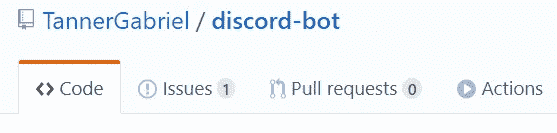
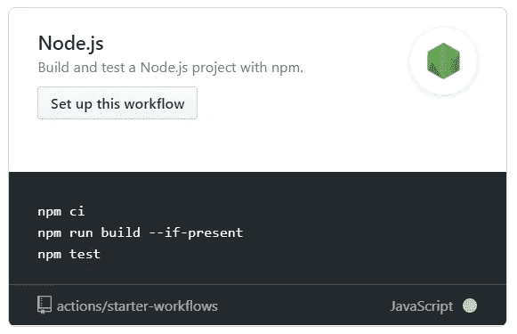
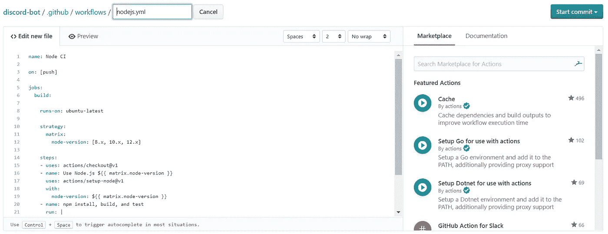
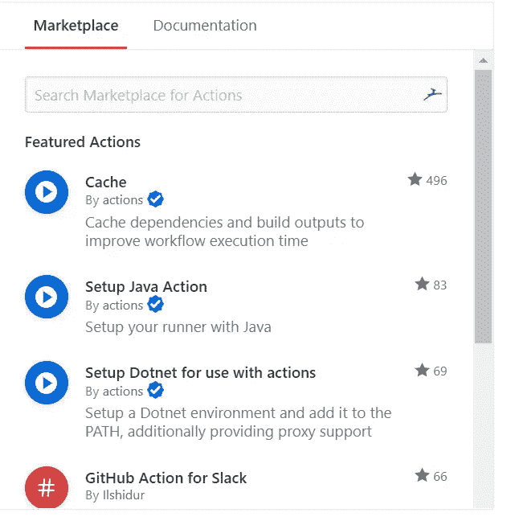
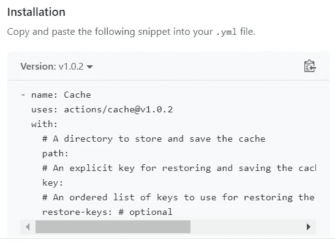
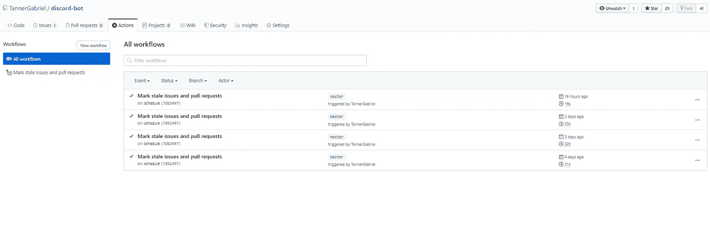
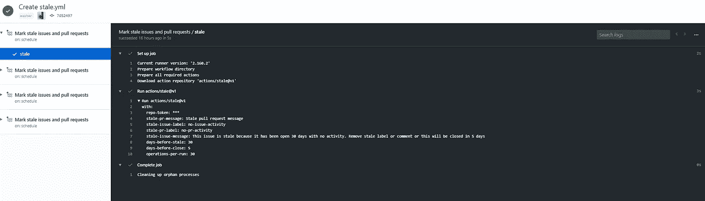

# Github 操作简介

> 原文：<https://towardsdatascience.com/an-introduction-to-github-actions-6abd3f18eb93?source=collection_archive---------21----------------------->

## Github 动作介绍，着眼于核心概念以及它们为何如此有用。


src:[https://github . blog/2019-08-08-github-actions-now-supports-ci-CD/](https://github.blog/2019-08-08-github-actions-now-supports-ci-cd/)

Github Actions 使您能够直接在 Github 存储库中创建定制的软件开发生命周期工作流。这些工作流由不同的任务组成，即所谓的操作，可以在特定事件下自动运行。

这使您能够在存储库中直接包含持续集成(CI)和持续部署(CD)功能以及许多其他特性。

在本文中，我们将探讨 Github 动作的核心概念，甚至深入创建您自己的定制工作流。

# 为什么要关心 Github 的动作？

在我们进入技术细节之前，让我们先讨论一下为什么开发者应该首先关注 Github 动作，以及它们提供了哪些好处。

## 构建到 Github 中:

Github Actions 完全集成到 Github 中，因此不需要外部站点。这意味着它可以在与所有其他与存储库相关的功能(如“拉”请求和问题)相同的位置进行管理。

## 多容器测试:

动作允许您通过在工作流程中添加对 Docker 和 docker-compose 文件的支持来测试多容器设置。

## 多个配置项模板:

Github 为各种 CI(持续集成)配置提供了多种模板，这使得它非常容易上手。您也可以创建自己的模板，然后在 Github Marketplace 上发布。

## 伟大的免费计划:

每个开源库的操作都是完全免费的，包括每个月 2000 分钟的免费构建时间，这与大多数 CI/CD 免费计划相当。如果这还不足以满足你的需求，你可以选择另一个计划或走自主路线。

# 核心概念

下面是 Github 动作中使用的核心概念列表，在使用它或阅读文档时，您应该熟悉这些概念。

## 动作:

操作是工作流的最小可移植构建块，可以组合成创建作业的步骤。您可以创建自己的操作或使用市场上公开共享的操作。

## 事件:

事件是触发工作流运行的特定活动。例如，当有人推送到存储库或创建拉取请求时，就会触发工作流。事件也可以配置为使用 Webhooks 监听外部事件。

## 跑步者:

runner 是安装了 Github Actions runner 应用程序的机器。然后，runner 等待它可以执行的可用作业。在获得一个任务后，它们运行任务的动作，并向 Github 报告进度和结果。Runners 可以托管在 Github 上，也可以自托管在自己的机器/服务器上。

## 工作:

作业由多个步骤组成，在虚拟环境的一个实例中运行。如果当前作业依赖于前一个作业才能成功，则作业可以彼此独立运行，也可以按顺序运行。

## 步骤:

步骤是可以由作业执行的一组任务。步骤可以运行命令或操作。

## 工作流程:

工作流是由一个或多个作业组成的自动化流程，可以由事件触发。工作流是使用中的 YAML 文件定义的。github/workflows 目录。

# 使用工作流和操作模板

让你的工作流运行的最简单的方法是使用 Github Marketplace 上提供的许多工作流和动作模板中的一个。如果你不确定哪些操作是有用的，你可以看看 Github 提供的建议，这些建议对每个库都是独一无二的。

## 添加工作流模板:

在存储库的主页上，导航到**操作**。



图 1:存储库主页

然后选择您想要使用的模板，点击**设置此工作流程**。



图 2: Node.js 动作模板

最后，您可以在编辑器中进行更改，并使用 **Start commit** 按钮将操作提交到您的存储库中。



图 3:工作流编辑器

## 将操作模板添加到您的工作流程:

动作模板可以在 Github Marketplace 上找到，或者直接在最右边的工作流编辑器中找到。



图 4:工作流编辑器中的操作模板

可以通过复制操作代码并将其粘贴到您的。yml 文件。唯一的动作名和版本号需要用**使用**关键字来定义。



图 5:动作安装

**注意:**有些动作需要你设置某些变量，我们稍后会讲到。

# 配置工作流

现在您已经知道了如何为您的工作流使用模板，您可能仍然想知道用于自己编写和配置工作流的语法。

本章将涵盖一般语法以及工作流的核心概念，并提供开始编写自己的工作流所需的所有知识。

## 创建工作流文件:

可以在**中创建工作流。github/workflows** 目录下添加一个**。yml** 工作流文件。比如加上**。github/workflows/continuous-deployment . yml**添加到您的项目中。

创建文件后，您可以开始工作流程。

## 常规语法:

Github 动作文件使用 YAML 语法编写，有八个 a **。yml** 或**。yaml** 文件扩展名。如果你刚到 YAML，想了解更多，我推荐这两篇文章，[五分钟了解 YAML](https://www.codeproject.com/Articles/1214409/Learn-YAML-in-five-minutes)或者，[YAML 介绍](https://dev.to/paulasantamaria/introduction-to-yaml-125f)。

以下是工作流文件最重要的概念。

**名称:**

显示在 Github 操作页面上的工作流名称。如果省略该字段，它将被设置为文件名。

```
name: Continuous Deployment
```

**开:**

关键字上的**定义了触发工作流的 Github 事件。您可以提供单个事件、事件阵列或配置图来安排工作流。**

```
on: push
# or
on: [pull_request, issues]
```

**工作:**

工作流运行由一个或多个作业组成。作业定义将在工作流中运行的功能，并且默认情况下并行运行。

```
jobs:
  my-job:
    name: My Job
    runs-on: ubuntu-latest
    steps:
    - name: Print a greeting
      run: |
        echo Hello there!
```

在后面的章节中会有更多的介绍。

**环境:**

Env 定义了可用于工作流中所有作业和步骤的环境变量的映射。您还可以设置仅适用于作业或步骤的环境变量。

```
env:
  CI: **true**
```

## 选择环境:

在正确的环境中运行您的工作流非常重要，这样您就可以确保它们在生产环境中能够成功。在本节中，我们将讨论如何定义工作流将运行的操作系统和软件版本，以及如何配置您自己的构建矩阵以在多种环境中运行工作流。

**连续运行:**

**runs-on** 关键字让你定义你的工作流应该运行的 OS(操作系统),例如，最新版本的 ubuntu。

```
runs-on: ubuntu-latest
```

**构建矩阵:**

构建矩阵允许您同时跨多个操作系统、平台和语言版本进行测试。您可以使用**策略**关键字指定一个构建矩阵，并将其传递给**运行**。

```
runs-on: ${{ matrix.os }}
strategy:
  matrix:
    os: [ubuntu-16.04, ubuntu-18.04]
    node: [6, 8, 10]
```

在这里，您在两个操作系统和三个不同版本的 Node.js 上运行您的项目。有关构建矩阵和策略关键字的更多信息，请访问[文档](https://help.github.com/en/actions/automating-your-workflow-with-github-actions/workflow-syntax-for-github-actions#jobsjob_idstrategy)。

## 缓存依赖项:

工作流运行通常重用与以前相同的输出，因此可以缓存以提高性能。Github 托管的 runners 上运行的每个作业都在一个干净的虚拟环境中启动，默认情况下不使用缓存。

Github [cache action](https://github.com/actions/cache) 使缓存成为可能，它将尝试根据您提供的密钥恢复缓存。如果没有找到匹配的缓存键，它将在作业成功完成后创建一个新的。

**输入参数:**

*   key(必需):该键标识缓存，并在保存缓存时创建。
*   path(必需):要缓存或恢复的目录的文件路径。
*   restore-key(可选):可选键的有序列表，用于在键没有发生缓存命中时查找缓存。

**输出参数:**

*   cache-hit:具有缓存操作成功状态的布尔变量

**保存 npm 缓存的示例:**

```
name: Caching with npmon: pushjobs:
  build:
    runs-on: ubuntu-latest steps:
    - uses: actions/checkout@v1 - name: Cache node modules
      uses: actions/cache@v1
      with:
        path: node_modules
        key: ${{ runner.OS }}-build-${{ hashFiles('**/package-lock.json') }}
        restore-keys: |
          ${{ runner.OS }}-build-${{ env.cache-name }}-
          ${{ runner.OS }}-build-
          ${{ runner.OS }}- - name: Install Dependencies
      run: npm install - name: Build
      run: npm build - name: Test
      run: npm test
```

在本例中，我们缓存了节点项目的 node_modules 目录，因此不必在每次运行工作流时安装依赖项。

## 持续工作流数据:

工件允许您在运行的作业之间共享数据，并在工作流完成后保存它们。工件是在工作流运行期间产生的文件或文件集合。

要在作业之间共享数据:

*   在作业完成前将文件上传到存档
*   上传后，该文件可用于同一工作流程中的其他作业

有一些保存工件的常见用例。

*   日志文件
*   测试结果、失败和截图
*   压力测试性能输出和代码覆盖率结果

**在作业之间传递数据:**

您可以使用[上传工件](https://github.com/actions/upload-artifact)和[下载工件](https://github.com/actions/download-artifact)动作在工作流中的作业之间共享数据。

```
name: Share data between jobson: [push]jobs:
  upload-data-job:
    name: Upload data to artifact
    runs-on: ubuntu-latest
    steps:
      - shell: bash
        run: |
          echo Hello World! > hello-world.txt
      - name: Upload hello world file
        uses: actions/upload-artifact@v1
        with:
          name: hello-world
          path: hello-world.txt download-data-job:
    name: Download data from artifact
    needs: upload-data-job
    runs-on: windows-latest
    steps:
      - name: Download hello world file
        uses: actions/download-artifact@v1
        with:
          name: hello-world
      - shell: bash
        run: |
          value=`cat hello-world/hello-world.txt`
          echo $value > hello-world/hello-world.txt
      - name: Upload hello world to artifact
        uses: actions/upload-artifact@v1
        with:
          name: hello-world
          path: hello-world.txt
```

在这个例子中，一个服务创建了一个文件，并使用 **upload-artifact** 动作将它上传到工件。下载作业然后下载文件并将其打印到控制台。

有关持久化工作流数据的更多示例，请访问[官方文档](https://help.github.com/en/actions/automating-your-workflow-with-github-actions/persisting-workflow-data-using-artifacts)。

# 管理工作流运行

您可以在存储库的工作流页面上查看和管理您的工作流运行。它允许您启动、取消和重新运行作业，以及查看已经完成的作业的结果。



图 6:工作流页面

您将获得在您的存储库中运行的所有工作流的列表，并且您可以通过单击特定的一个来获得更详细的视图。



图 7:工作流详细页面

更多信息可以在[官方文档](https://help.github.com/en/actions/automating-your-workflow-with-github-actions/managing-a-workflow-run)中找到。

# 建筑动作

您可以通过编写与您的存储库交互的定制代码来创建操作，并在您的工作流中使用它们，或者在 Github Marketplace 上发布它们。

Github 允许你构建 Docker 和 Javascript 动作，它们都需要一个名为 **action.yml** 的元数据文件来定义动作的输入、输出和主入口点。

## 元数据语法:

如上所述，Docker 和 javascript 动作都需要一个文件名为 action.yml 的元数据文件。

*   名称(必需)-将用于在每个作业中标识它的操作的名称
*   描述(必需)—操作功能的简短描述
*   runs(必需)-执行操作时要运行的命令
*   作者(可选)—操作作者的姓名
*   输入(可选)-可在运行时传递的输入参数列表
*   输出(可选)-输出参数列表，后续操作可以在工作流中稍后使用

一个示例文件可能如下所示:

```
name: 'Hello World'
description: 'Greet someone and record the time'
inputs:
  who-to-greet:  
    description: 'Who to greet'
    required: **true**
    default: 'World'
outputs:
  time:
    description: 'The time we greeted you'
runs:
  using: 'node12'
  main: 'index.js'
```

## Javascript 操作:

JavaScript 动作可以直接在任何 GitHub 托管的虚拟机上运行，并将动作代码与用于运行代码的环境分开。与 Docker 相比，它们执行速度更快，也更容易构建。

## 码头工人行动:

Docker 容器将您的动作代码与环境打包在一起，从而创建一个更加一致和可靠的工作单元。Docker 容器允许您使用特定版本的操作系统、依赖项、工具和代码。

这里有一些资源可以帮助你开始编写你的第一个行动并发布它们:

*   [创建一个 Javascript 动作](https://help.github.com/en/actions/automating-your-workflow-with-github-actions/creating-a-javascript-action)
*   [创建 Docker 容器动作](https://help.github.com/en/actions/automating-your-workflow-with-github-actions/creating-a-docker-container-action)
*   [在 Github 市场发布操作](https://help.github.com/en/actions/automating-your-workflow-with-github-actions/publishing-actions-in-github-marketplace)

## 来源:

*   [官方文件](https://help.github.com/en/actions/automating-your-workflow-with-github-actions)
*   [Github 博客](https://github.blog/)
*   [无意中全面介绍了 GitHub Actions CI](https://dev.to/bnb/an-unintentionally-comprehensive-introduction-to-github-actions-ci-blm)

# 结论

你一直坚持到最后！我希望这篇文章能帮助你理解 Github 动作，以及如何使用它们来自动化你的 Github 工作流程。

如果您发现这很有用，请考虑推荐并与其他开发人员分享。如果您有任何问题或反馈，请在 twitter 上告诉我。