# 梯度下降和反向传播导论

> 原文：<https://towardsdatascience.com/an-introduction-to-gradient-descent-and-backpropagation-81648bdb19b2?source=collection_archive---------1----------------------->

从[安迪·凯利](https://unsplash.com/@askkell)在 [Unsplash](https://unsplash.com/)

# 机器如何学习？

> **机器学习** ( **ML** )是对通过经验自动改进的计算机算法的研究。它被视为[人工智能](https://en.wikipedia.org/wiki/Artificial_intelligence)的子集。机器学习算法基于样本数据构建[数学模型](https://en.wikipedia.org/wiki/Mathematical_model)，称为“[训练数据](https://en.wikipedia.org/wiki/Training_data)，以便在没有明确编程的情况下进行预测或决策。

作为人类，我们可以研究数据以发现行为，并根据行为预测一些事情，但机器不能像我们一样真正地操作。因此，在大多数情况下，它试图从已经建立的例子中学习。比方说，对于一个经典的分类问题，我们有很多机器可以学习的例子。每个示例都是一个特定的环境或描述，由特征及其相应标签的组合来描述。在我们的现实世界中，我们对每个不同的物体都有不同的描述，我们知道这些不同的物体有不同的名字。例如，汽车和自行车只是两个对象名或两个标签。它们有不同的描述，比如自行车有两个轮子，汽车有四个轮子。所以，轮子的数量可以用来区分汽车和自行车。区分这两个标签可能是一个特征。

对不同对象的描述的每一个共同的方面都可以用来将它彼此区分开，并且适合用作在其他对象中唯一识别特定对象的特征。同样，我们可以假设，房子的年龄，房间的数量和房子的位置将在决定房子的成本中起主要作用。这在现实世界中也很常见。所以，房子描述的这些方面对于预测房价非常有用，因此，对于这样的问题来说，它们是非常好的特征。

在机器学习中，我们主要有两类问题，分类和回归。汽车和自行车之间的识别是分类问题的一个例子，而房价的预测是一个回归问题。

我们已经看到，对于任何类型的问题，我们基本上依赖于与对象相对应的不同特征来得出结论。机器做类似的事情来学习。还要看对象的不同特征才能得出结论。现在，为了区分汽车和自行车，你更看重哪一个特征，轮子的数量还是最高速度还是颜色？答案显然首先是车轮数量，然后是最高速度，然后是颜色。机器做同样的事情来了解哪个特征最有价值，它给每个特征分配一些权重，这有助于它了解在给定的特征中哪个特征最重要。

现在，它试图设计一个公式，比如回归问题，

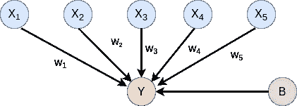

等式 1

这里 w1、w2、w3 是对应特征如 x1、x2、x3 的权重，b 是称为偏差的常数。它的重要性在于它提供了灵活性。因此，使用这样一个等式，机器试图预测一个值 y，它可能是我们需要的一个值，比如房子的价格。现在，机器试图通过调整这些权重来完善它的预测。这是通过将预测值 y 与我们的训练集中示例的实际值进行比较，并使用它们的差异函数来实现的。这个函数叫做损失函数。

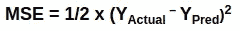

等式 2

机器试图减少这种损失函数或误差，即试图使预测值接近实际值。

# 梯度下降

这种方法是最小化损失函数和实现我们目标的关键，我们的目标是预测接近原始值。

MSE 的梯度下降

在这张图中，我们可以看到上面的损失函数图。如果我们观察，我们会看到它基本上是一个抛物线形或凸形，它有一个特定的全局最小值，我们需要找到它，以便找到最小的损失函数值。因此，我们总是试图使用一个凸形的损失函数来得到一个合适的最小值。现在，我们看到预测结果取决于等式中的权重。如果我们替换等式 2 中的等式 1，就会得到这个图，其中 X 轴是权重，Y 轴是损耗。

最初，模型为特征分配随机权重。假设它初始化了权重=a，我们可以看到它产生了一个损失，这个损失远离最小点 L-min。

现在，我们可以看到，如果我们将权重更多地移向 x 轴的正方向，我们可以优化损失函数并实现最小值。但是，机器怎么知道呢？我们需要优化权重以最小化误差，因此，显然，我们需要检查误差如何随权重变化。为此，我们需要找到误差相对于重量的导数。这个导数叫做梯度。

> **坡度= dE/dw**

其中 E 是误差，w 是重量。

让我们看看这是如何工作的。比方说，**如果损失随着重量的增加而增加，那么梯度将是正的，**所以我们基本上在 C 点，我们可以看到这个陈述是正确的。**如果损失随着重量的增加而减少，那么梯度将为负**。我们可以看到 A 点，对应着这样一种情况。现在，从 A 点我们需要向 x 轴的正方向移动，梯度是负的。从 C 点开始，我们需要向负 x 轴移动，但是梯度是正的。**因此，梯度的负值总是表示权重应该移动的方向，以便优化损失函数。**因此，梯度以这种方式指导模型是增加还是减少权重，以便优化损失函数。

模型找到了移动的方向，现在模型需要找到应该移动多少重量。这由称为**的参数决定，学习率由α**表示。我们看到的图表中，重量从 A 点移动到距离为 *dx 的 B 点。*

> **dx = alpha * |dE/dw|**

因此，移动的距离是学习率参数α和误差变化幅度与该点权重变化的乘积。

现在，我们需要非常仔细地决定学习率。如果它很大，权值会有很大的变化，会超过最佳值。如果它非常低，它需要很小的步骤，需要很多步骤来优化。根据以下公式改变更新的权重。

> **w=w — alpha * |dE/dw|**

其中 w 是之前的权重。

对于每个时期，模型根据梯度移动权重以找到最佳权重。

现在，这是我们训练数据集中一个特定示例的损失优化。我们的数据集包含成千上万个这样的例子，所以要找到所有例子的最佳权重需要很长时间。实验表明，如果我们仅对训练集的一个样本进行优化，权重优化对整个数据集来说已经足够好了。因此，根据不同的方法，我们有不同类型的梯度下降机制。

## 梯度下降法

1.  **随机梯度下降:**当我们仅使用数据集中的一个特定示例来训练模型以优化损失函数时，这被称为随机梯度下降。
2.  **批量梯度下降:**当我们使用我们整个数据集中所有个体损失的平均值来训练模型以优化损失函数时，它被称为批量梯度下降。
3.  **小批量梯度下降:**现在，正如我们所讨论的，批量梯度下降需要很多时间，因此有些低效。如果我们看一下 SGD，它只使用一个例子进行训练。所以，如果只给一个婴儿看一辆自行车，并告诉他去学习所有其他的自行车，你认为他会学得多好？这很简单，它的决定会有点偏向于所示示例的特性。所以，对于 SGD 来说也是一样的，这个模型可能会因为这个特殊例子的特殊性而变得过于偏向。因此，我们使用一批 10-1000 个样本的平均值来检查优化损失，以便处理问题。

## 数学

如果我们使用上面的等式 1 和 2，我们得到

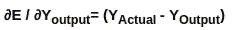

该等式显示了 E= MSE 时输出预测的误差变化。

现在，

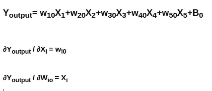

所以，从基础数学来看，这是很清楚的。这里**‘I’**可以是从 0 到特征数-1 的任意整数。

根据问题，我们需要找到 dE/dwi0，即随着权重变化的误差变化。

现在，根据链式法则，我们可以得出以下结论:

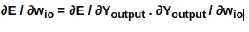

所以，我们从上面的等式中知道了这两个值。

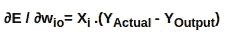

这是砝码误差的最终变化。现在，让我们寻找更新新的权重。

*我在这里漏掉了几个符号，Y 输出和 Y 预测是一样的。*

这些是更新后的新重量值。

我们还需要更新偏差值。它是以类似的方式完成的。

# 反向传播

在上述单元中，我们讨论了线性问题。

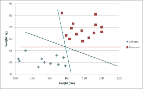

线性分类

换句话说，像这样的问题，这两个类别，可以很容易地通过画一条直线来分开，我们可以很容易地用等式 1 来设计。

现在，想象这样做，如下图所示。

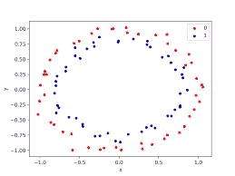

非线性相关数据

可以使用正常的线性模型对这些点进行分类吗？答案是否定的。嗯，需要注意的一点是，我们可以使用**特征交叉**并从这些非线性特征中创建线性特征来解决这类问题。这些用于机器学习的**内核方法**。我们不会谈论它，因为它超出了这个博客的范围。但是，在所有这些情况下，我们都需要告诉机器如何设计一个可以很容易地将非线性问题转化为线性问题的特征。

在我们的日常生活中，我们通常只面临非线性问题，所以每次我们都很难设计出特征交叉来进行以下类别的分类。这是使用神经网络的地方。神经网络能够提出适合作为非线性类之间的边界的非线性方程。

神经网络实现这种非线性方程的方式是通过激活函数。这些激活函数是非线性的单位。它们用于神经网络的每一层。现在，在神经网络中，我们将这些层一层一层的堆叠起来。最后，我们使用像 f(f(x))这样的级联函数来获得复函数。

激活功能的常见类型有:

1.  ReLU: f(x)= max(0，x)
2.  乙状结肠:

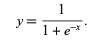

乙状结肠的

3.双曲正切

## 为什么需要反向传播？

神经网络损失函数的最小值不太容易定位，因为它不像我们看到的 MSE 那样简单。

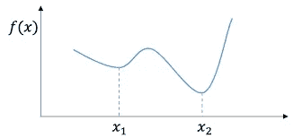

神经网络的损失。

现在，正如我们在图中看到的，损失函数可能是这样的。正如我们所见，它有两个极小值，一个局部极小值和一个全局极小值。所以，如果我们以某种方式停留在局部状态，我们将停留在次优状态。所以，权重初始化的点很重要。例如，如果权重初始化为 x1 附近的某个值，我们很有可能会陷入局部最小值，这与正常的 MSE 不同。

其次，神经网络具有不同的结构。

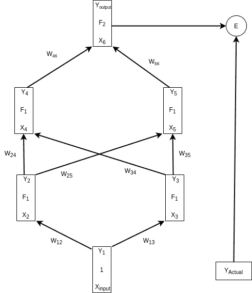

神经网络图。

因此，在神经网络中，结果 Y 输出依赖于所有边的所有权重。因此，误差是在最后一个输出节点获得的，然后我们需要相应地改变 w-12 和 w-13。因此，我们需要将误差从输出节点一直反向传播到输入节点。

所以，让我们说，

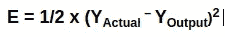

Wij 是从第 I 个节点的输出到第 j 个节点的输入的边的权重。这里 x 是每个节点的输入。y 是每个节点的输出。除了输入节点，对于所有节点，

> Y=F(X)。

其中 F 是激活函数。

对于输入节点，

> Y=X

现在，我们可以看到，隐藏层节点有一个函数 F1，但在输出层，它是 F2。F1 通常是 ReLU，F2 通常是 s 形。

因此，为了优化权重，我们需要知道网络中每个 Wij 的 dE /dWij。

为此，我们还需要找到网络中每个节点的 dE/dXi 和 dE/dYi。

## 正向传播

我们知道神经网络据说使用前向传播。这是因为层 k 中节点的输入依赖于层 k-1 中节点的输出。

举个例子，

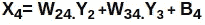

所以，概括一下，

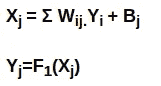

我们可以用这些公式。

我们将尝试跟踪几个节点。

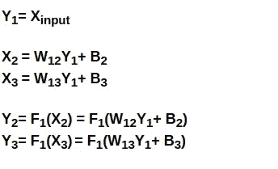

在这里，我们可以非常清楚地跟踪每个节点的输入和输出的路径或路线。现在，我们将看到级联功能的构建。

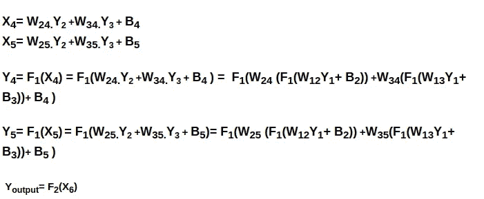

在 Y4 和 Y5 中，我们可以看到非线性激活函数的级联，以创建分类器方程。我们堆叠的层次越多，层叠发生得越多，我们的分类器功能就变得越复杂。

## 反向传播数学

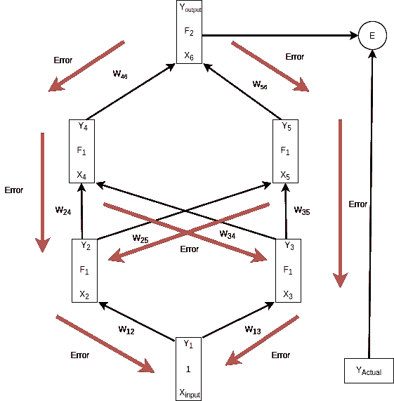

产生的误差通过相同的节点和相同的边反向传播，通过这些节点和边发生正向传播，并从输出节点到达输入边。

第一步，输出节点，

这是误差相对于最终节点 Y 输出的导数。

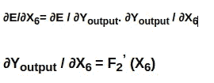

来自链式法则。

现在将 F2 视为 sigmoid 函数，

对于 sigmoid，f ' (x)具有这种性质。

现在，我们需要找到 dE/dW56

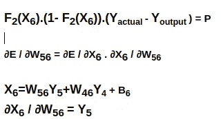

这里我们也使用链式法则。我们获得了这些值:

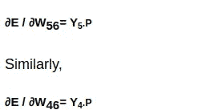

我们将尝试这两个以上的层，并尝试推广一个公式。

我们试着计算 dE/ dY5，这样我们可以移动到下一个层次。

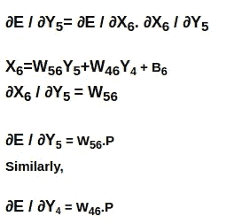

我们得到了 dE/dY5 和 dE/dY4。现在我们来看看节点 5 和节点 4 的输入变化的误差变化。

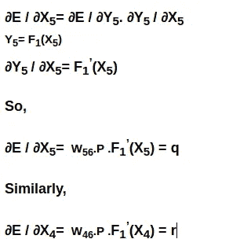

一旦我们获得了输入的变化，我们就可以使用与 W56 相同的方法，很容易地计算出输入边权重变化的误差变化。这里我直接写结果。

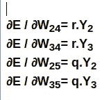

这些是误差随着边权重的变化而变化。现在，计算 Y2 和 Y3。但是，需要注意的一点是，当我们通过反向传播计算 Y2 和 Y3 的误差变化时，它们会受到 Y5 和 Y4 两个边沿的影响。

因此，这种变化将是节点 4 和节点 5 的变化效果之和。

我们可以用计算 dE/dY5 的类似方法来计算影响

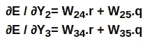

所以，我们可以将其概括为:

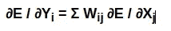

其中第 I 个节点在第 L 层，第 j 个节点在第(L+1)层。

现在，一旦我们发现，误差的变化和所有边的权重的变化。我们可以更新权重，并使用公式开始下一个时期的学习。

其中α是学习率。这就是反向传播算法的实际工作方式。

## 优化者

现在我们已经看到损失函数具有各种局部最小值，这可能误导我们的模型。如果我们能够适当地监控和调整学习速度，就可以防止这种情况发生。现在，手动这样做是不可能的，**优化器**为我们做到了这一点。它自动优化学习速率，以防止模型进入局部最小值，并负责加快优化过程。

最常用的优化器有:

1.  圣经》和《古兰经》传统中）亚当（人类第一人的名字
2.  阿达格拉德
3.  RMSProp
4.  新币。

Adam 是最常用的优化器。

## 结论

在本文中，我们已经详细讨论了梯度下降和反向传播。希望这篇文章有助于理解这些概念。