# 用于结构化数据分析的图形神经网络(GNN)简介

> 原文：<https://towardsdatascience.com/an-introduction-to-graph-neural-network-gnn-for-analysing-structured-data-afce79f4cfdc?source=collection_archive---------0----------------------->

## 了解 GNN 是什么，GNN 能做什么

来源:[马努奇](https://pixabay.com/users/manuchi-1728328/?tab=popular&pagi=2)，via [pixabay](https://pixabay.com/en/labrador-breed-dogs-animal-animals-805838/) (CC0)

图形神经网络(GNN)由于其分析图形结构数据的能力最近受到了很多关注。本文对图形神经网络作了简要介绍。为了便于理解图和分析图中的问题，它涵盖了一些图论。然后介绍了不同形式的图形神经网络及其原理。它还涵盖了 GNN 可以做什么和 GNN 的一些应用。

# 图论

首先，我们需要知道什么是图。

图是由两部分组成的数据结构: ***顶点、*** 和 ***边*** 。它被用作一种数学结构来分析对象和实体之间的成对关系。通常，一个图被定义为 *G=(V，E)，*，其中 *V* 是一组节点， *E* 是它们之间的边。

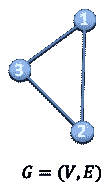

一个简单的图表。按作者分列的数字

一个图往往用一个邻接矩阵来表示， *A.* 如果一个图有 *N 个*节点，那么 A 的维数为( *N* x *N* )。人们有时会提供另一个特征矩阵来描述图中的节点。如果每个节点有 *F* 个特征，那么特征矩阵 *X* 的维数为( *N* x *F* )。

## 为什么一个图很难分析？

首先，一个图不存在于欧几里得空间中，这意味着它不能用我们熟悉的任何坐标系来表示。与波形、图像或时间序列信号(“文本”也可以被视为时间序列)等其他类型的数据相比，这使得图形数据的解释更加困难，这些数据可以很容易地映射到二维或三维欧几里德空间。

其次，图形没有固定的形式。为什么？看看下面的例子。图(A)和图(B)结构完全不同，视觉上也不同。但是当我们将其转换为邻接矩阵表示时，这两个图具有相同的邻接矩阵(如果不考虑边的权重)。那么我们应该认为这两幅图是相同的还是不同的呢？

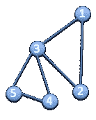

图表(A)。按作者分列的数字

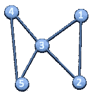

图表(B)。按作者分列的数字

最后，一个图表通常很难被人类理解。我说的不是上面例子中的小图。我说的是包含成百上千个节点的巨型图。维度非常高，节点密集分组，使得人类甚至难以理解图形。因此，训练一台机器来完成这项任务具有挑战性。下面的例子显示了集成电路中逻辑门的模型图。

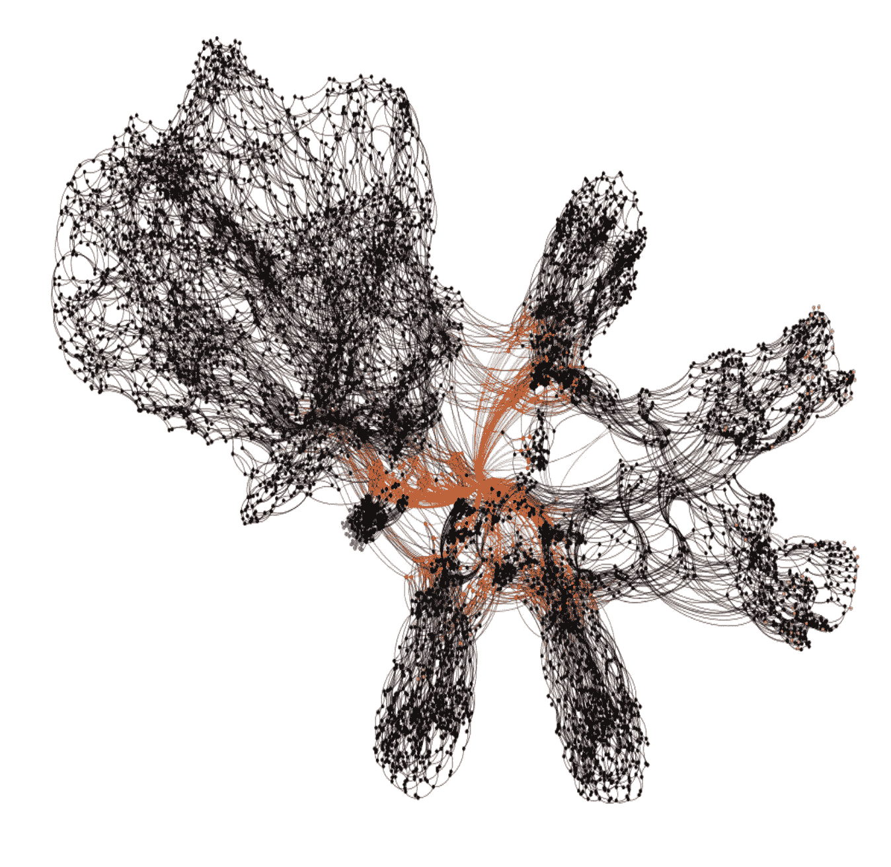

巨型图的例子:电路网表。图来自 J. Baehr 等人。艾尔。“机器学习和逆向工程的结构特征”

## 为什么要用图表？

人们选择处理图表的原因可以总结为以下几点:

1.  图形提供了一种更好的处理抽象概念的方式，比如关系和交互。它们还提供了一种思考这些概念的直观方式。图表也是分析社会关系的自然基础。
2.  图形可以通过将问题简化为更简单的表示来解决更复杂的问题，或者从不同的角度将问题转换为表示。
3.  图论和概念用于研究和建模社交网络、欺诈模式、功耗模式、病毒式传播和社交媒体中的影响。社交网络分析(SNA)可能是图论在数据科学中最著名的应用。

# 传统图形分析方法

传统方法大多基于算法，例如:

1.  搜索算法，例如 BFS、DFS
2.  最短路径算法，例如 Dijkstra 算法、最近邻算法
3.  生成树算法，例如 Prim 算法
4.  聚类方法，例如高度连接的组件、k 均值

这种算法的局限性在于，在应用该算法之前，我们需要以一定的置信度获得图的先验知识。换句话说，它没有给我们提供研究图形本身的方法。而且最重要的是，没有办法进行图级分类。

# 图形神经网络

图形神经网络，顾名思义，是一种可以直接应用于图形的神经网络。它为节点级、边级和图级预测任务提供了一种方便的方式。

文献中主要有三种类型的图形神经网络:

1.  递归图神经网络
2.  空间卷积网络
3.  光谱卷积网络

GNN 的直觉是，节点是由它们的邻居和连接自然定义的。为了理解这一点，我们可以简单地想象，如果我们删除一个节点周围的邻居和连接，那么该节点将丢失其所有信息。因此，节点的邻居和到邻居的连接定义了节点的概念。

记住这一点，然后我们给每个节点一个状态 *(x)* 来表示它的概念。我们可以使用节点状态 *(x)* 来产生一个输出 *(o)* ，即关于概念的决策。节点的最终状态 *(x_n)* 通常称为“节点嵌入”。所有 GNN 的任务是通过查看其相邻节点的信息来确定每个节点的“节点嵌入”。

我们将从图形神经网络的最先锋版本开始，递归图形神经网络，或 *RecGNN* 。

## 递归图神经网络

正如在[最初的 GNN 论文](https://ieeexplore.ieee.org/document/4700287)中所介绍的，RecGNN 是基于 Banach 不动点定理的假设而建立的。Banach 不动点定理陈述:*设(X，d)为完备度量空间，设(T:X→X)为压缩映射。那么 T 有一个唯一的不动点(X∫),对于任何 x∈X，n→∞的序列 TN(X)收敛于(X∫)。*这意味着如果我将映射 *T* 应用到 *x* 上 *k* 次，x^k 应该几乎等于 x^(k-1)，即:

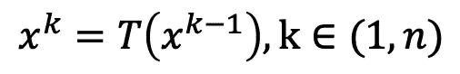

RecGNN 定义了一个参数化函数 *f_w:*

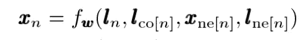

其中 ***l_n，l_co，x_ne，l_ne*** 表示当前节点***n***的特征，节点***n***的边，邻居节点的状态，邻居节点的特征。(在原始论文中，作者将节点特征称为节点标签。这可能会造成一些混乱。)

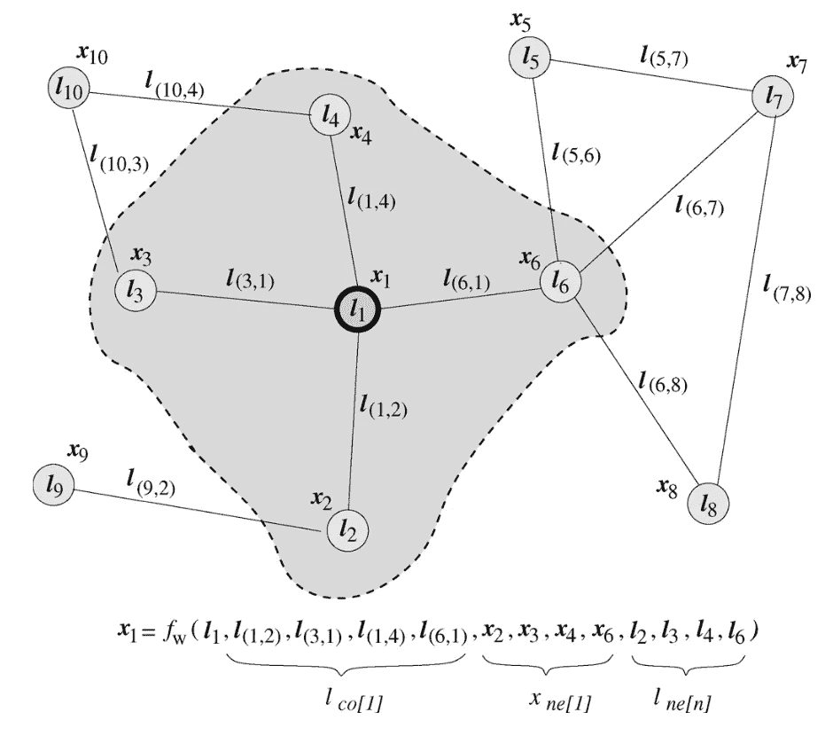

基于邻居信息的节点状态更新示意图。图来自“图形神经网络模型”

最后，在 k 次迭代之后，最终的节点状态被用于产生输出，以对每个节点做出决定。输出函数定义为:

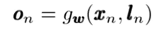

## 空间卷积网络

空间卷积网络的直觉类似于著名的 CNN，它主导了图像分类和分割任务的文献。要了解 CNN 的图片，你可以看看这篇详细解释 CNN 的[帖子](/a-comprehensive-guide-to-convolutional-neural-networks-the-eli5-way-3bd2b1164a53)。

简而言之，图像卷积的思想是对中心像素周围的相邻像素求和，中心像素由具有参数化大小和可学习权重的过滤器指定。空间卷积网络采用同样的思想，将相邻节点的特征聚集到中心节点。

左图:图像等常规图形上的卷积。右图:任意图形结构上的卷积。图来自[图神经网络综述](https://arxiv.org/abs/1901.00596)

## 光谱卷积网络

与其他类型的 GNN 相比，这种图形卷积网络有很强的数学基础。谱卷积网络是建立在图形信号处理理论基础上的。以及通过图形卷积的简化和近似。

通过*[【切比雪夫多项式逼近】(Hammond et al. 2011)](https://arxiv.org/pdf/0912.3848.pdf) ，图形卷积可以简化为如下形式:*

*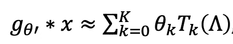*

*经过进一步简化， [GCN 论文](https://arxiv.org/abs/1609.02907)提出了一种两层神经网络结构，可以用下面的一个等式来描述:*

*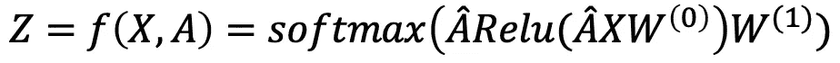*

*其中 A_head 是原始图邻接矩阵 A 的预处理拉普拉斯算子。(数学的细节可以在 GCN 论文中找到。要完全解释清楚还需要很大的努力。)*

*如果你有一些机器学习的经验，这个公式看起来非常熟悉。这不过是两个常用的全连接层结构。但在这种情况下，它确实起到了图形卷积的作用。我将在下面展示为什么它可以执行图形卷积。*

*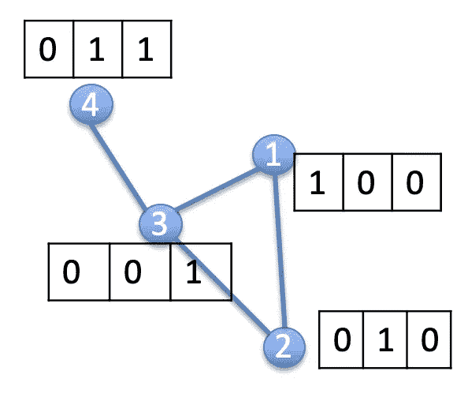*

*为每个节点分配了一个功能的图表示例。由作者描绘*

*让我们考虑一个有 4 个节点的简单图形。如上图所示，每个节点都被分配了一个特征矩阵。很容易得出如下所示的图邻接矩阵和特征矩阵:*

*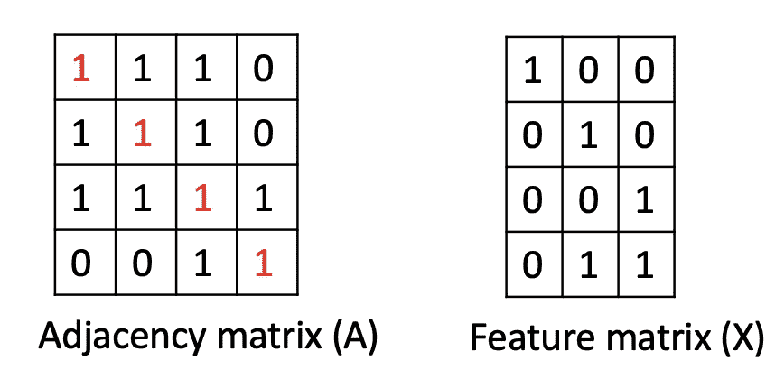*

*邻接矩阵和特征矩阵的例子。按作者分列的数字*

**请注意，邻接矩阵的对角线特意更改为“1 ”,以便为每个节点添加自循环。这是为了在我们执行特征聚合时包括每个节点本身的特征。**

*然后我们执行 *A* x *X (* 为了解释简单起见，我们先忘掉 A 的拉普拉斯算子和权重矩阵 *W* 。 *)**

*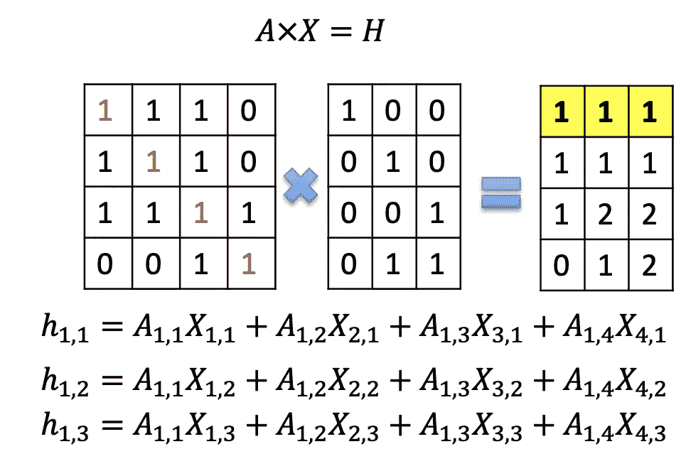*

*用矩阵乘法进行图形卷积的例子。按作者分列的数字*

*矩阵乘法的结果显示在最右边的矩阵中。让我们以第一个节点的结果特性为例。不难注意到，结果是[节点 1]的所有特征的总和，包括[节点 1]本身的特征，并且不包括[节点 4]中的特征，因为它不是[节点 1]的邻居。从数学上来说，图的邻接矩阵只有在有边的情况下才具有值“1”，否则为“0”。这使得矩阵乘法成为连接到参考节点的节点的特征的总和。*

*因此，虽然频谱卷积网络和空间卷积网络是在不同的基础上开始的，但是它们共享相同的传播规则。*

*目前可用的所有卷积图神经网络共享相同的格式。它们都试图学习一个函数，通过这个消息传递过程来传递节点信息和更新节点状态。*

*任何图神经网络都可以表示为一个消息传递神经网络(J. Gilmer et al .，2017)，具有一个 ***消息传递*** 函数，一个 ***节点更新*** 函数和一个 ***读出*** 函数。*

*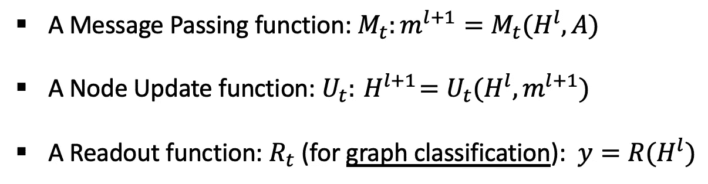*

# *GNN 能做什么？*

*GNN 解决的问题可以大致分为三类:*

1.  *节点分类*
2.  *链接预测*
3.  *图形分类*

*在*节点分类*中，任务是预测图中每个节点的节点嵌入。这种类型的问题通常以半监督的方式训练，其中只有部分图被标记。节点分类的典型应用包括引用网络、Reddit 帖子、Youtube 视频和脸书朋友关系。*

*在*链接预测*中，任务是理解图中实体之间的关系，并预测两个实体之间是否有连接。例如，推荐系统可以被视为链接预测问题，其中模型被给定一组用户对不同产品的评论，任务是预测用户的偏好并根据用户的兴趣调整推荐系统以推送更相关的产品。*

*在*图形分类*中，任务是将整个图形分为不同的类别。它类似于图像分类，但是目标变成了图形域。图分类可以应用于广泛的工业问题，例如，在化学、生物医学、物理学中，模型被给定一个分子结构，并被要求将目标分类成有意义的类别。它加速了原子、分子或任何其他结构化数据类型的分析。*

# *一些真实的应用*

*了解了 GNN 可以执行的分析类型后，你一定想知道我可以用图形做什么真正的事情。嗯，这一节将让你更深入地了解 GNN 在现实世界中的应用。*

## *自然语言处理中的 GNN*

*GNN 广泛应用于自然语言处理领域。实际上，这也是 GNN 最初开始的地方。如果你们中的一些人有 NLP 的经验，你一定会认为文本应该是一种时序或时态数据，这种数据可以用 RNN 或 LTSM 来最好地描述。GNN 从一个完全不同的角度看待这个问题。GNN 利用单词或文档的内在联系来预测类别。例如，引用网络试图预测网络中每篇论文的标签，这些标签由论文引用关系和其他论文中引用的词给出。它还可以通过查看句子的不同部分来建立句法模型，而不是像 RNN 或 LTSM 那样纯粹按顺序排列。*

## *计算机视觉中的 GNN*

*许多基于 CNN 的方法已经在图像中的对象检测中实现了最先进的性能，但是我们还不知道对象之间的关系。GNN 在 CV 中的一个成功应用是使用图形来模拟由基于 CNN 的检测器检测到的对象之间的关系。在从图像中检测到对象后，它们被送入 GNN 推理中进行关系预测。GNN 推理的结果是一个生成的图形，它模拟了不同对象之间的关系。*

*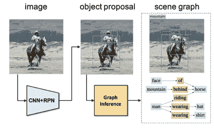*

*场景图生成。图来自徐达明、朱永源、蔡志斌和，“通过迭代消息传递生成场景图”，在 *Proc。2017 年 CVPR**

*CV 中另一个有趣的应用是从图形描述生成图像。这可以解释为几乎与上述应用相反。传统的图像生成方式是使用 GAN 或自动编码器进行文本到图像的生成。图形到图像的生成提供了关于图像语义结构的更多信息，而不是使用文本来描述图像。*

*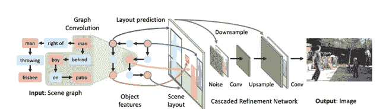*

*从场景图生成的图像。图来自 j .约翰逊、a .古普塔和 l .飞飞，“从场景图生成图像”，*会议录。2018 年 CVPR**

*我想分享的最有趣的应用是零起点学习(ZSL)。你可以找到[这篇文章](/applications-of-zero-shot-learning-f65bb232963f)全面介绍 ZSL。简而言之，ZSL 正在尝试学习给定**根本没有**训练样本(目标班级)的情况下对班级进行分类。这非常具有挑战性，因为如果没有给定训练样本，我们需要让模型进行逻辑“思考”来识别目标。举个例子，如果给我们三张图片(如下图所示)，并让我们在其中找到“okapi”。我们以前可能没见过“okapi”。但是，如果我们也被告知“霍加皮”是一种有四条腿的鹿脸动物，有斑马条纹的皮肤，那么我们就不难猜出哪一个是“霍加皮”。典型的方法是通过将检测到的特征转换成文本来模拟这种“思维过程”。然而，文本编码是相互独立的。很难对文本描述之间的关系进行建模。在其他方面，图形表示很好地模拟了这些关系，使机器以更“类似人类”的方式思考。*

*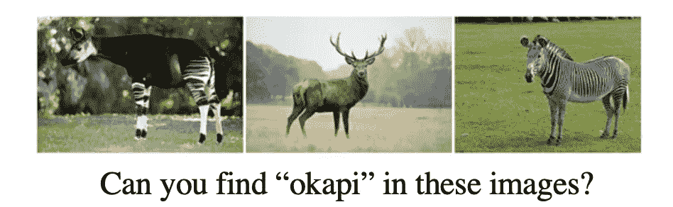*

*图来自 X. Wang，Y. Ye，A. Gupta，“基于语义嵌入和知识图的零镜头识别”，*2018**

## *其他领域的 GNN*

*GNN 的更多实际应用包括人类行为检测、交通控制、分子结构研究、推荐系统、程序验证、逻辑推理、社会影响预测和对抗性攻击预防。下图展示了社交网络中人们关系的模型。GNN 可以用来把人们分成不同的社区群体。*

**

*社交网络图。图片来自 [GDJ](https://pixabay.com/vectors/social-media-connections-networking-3846597/) ，通过 Pixabay*

# *结论*

*在本文中，我们介绍了一些图论知识，并强调了分析图的重要性。人们总是把机器学习算法看成一个“**黑箱**”。大多数机器学习算法只从训练数据的特征中学习，但没有实际的逻辑来执行。有了图，我们或许可以把一些“逻辑”传递给机器，让它更自然地“思考”。*

*GNN 仍然是一个相对较新的领域，值得更多的研究关注。它是分析图形数据的有力工具。然而，它不仅限于图中的问题。它可以很容易地推广到任何可以用图表建模的研究。图形建模是分析问题的自然方法。*

# *参考资料:*

1.  *F.Scarselli，M.Gori，“图形神经网络模型”， *IEEE 神经网络汇刊，2009**
2.  *T.N. Kipf 和 M. Welling，“使用图卷积网络的半监督分类”，载于 *Proc。ICLR 的*，2017。*
3.  *Z.吴，潘世安，陈芳芳，龙国光，张春春，俞，图神经网络综述，arXiv:1901.00596*
4.  *D.徐，朱，蔡志斌，和，“通过迭代信息传递生成场景图”，*会议录。CVPR*2017 年第 2 期*
5.  *J.约翰逊、a .古普塔和 l .飞飞，“从场景图生成图像”，*会议录。2018 年 CVPR**
6.  *X.王，叶，古普塔，“基于语义嵌入和知识图的零镜头识别”，*2018**