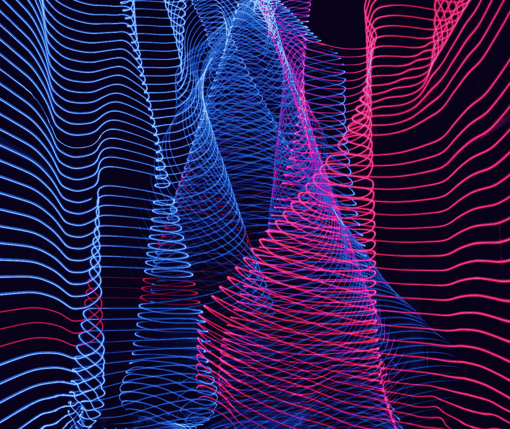
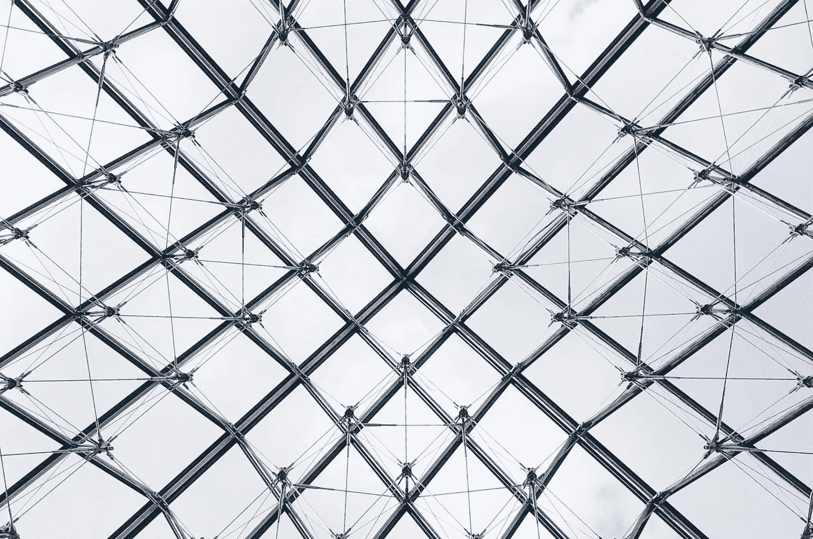
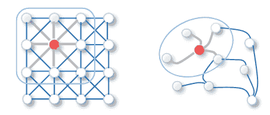
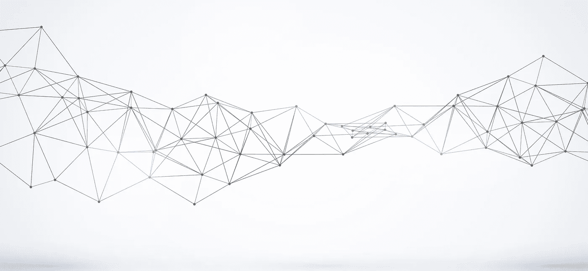
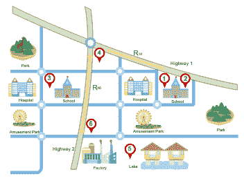

# 图形神经网络导论

> 原文：<https://towardsdatascience.com/an-introduction-to-graph-neural-networks-e23dc7bdfba5?source=collection_archive---------1----------------------->

## 旨在有效处理图形数据的神经网络。

艾莉娜·格鲁布尼亚克在 [Unsplash](https://unsplash.com/s/photos/network?utm_source=unsplash&utm_medium=referral&utm_content=creditCopyText) 上的照片

图形结构化数据在各个领域都很常见，例如分子、{社会、引用、道路}网络，只是可以用图形表示的大量数据中的一部分。随着机器学习的进步，我们见证了对可用数据应用智能算法的潜力。图形神经网络是机器学习的一个分支，它关注以最有效的方式为图形数据建立神经网络。

尽管 ML 在卷积网络的计算机视觉领域取得了进展，*图形神经网络***【GNNs】*面临着一个更具挑战性的问题，它们处理图形的尴尬性质。与图像和文本不同，图形没有明确定义的结构。一个图的节点可能没有连接，也可能有许多连接，这些连接可能是有向的，也可能是无向的。数据集中的图可能具有可变数量的节点和边，并且不能适当地“调整大小”，并且它们可能是非循环的、循环的、接合的、不相交的。总而言之，这使得处理数据的过程更具挑战性。*

**

*[来自萨林等人](https://www.nature.com/articles/s41587-019-0071-9)。*

*处理图形的一个简单方法是连接节点，并建立一个更友好的结构化数据集，该数据集可以输入到*多层感知器(MLP)* ，尽管这不是一个非常优雅的方法，但它可以提供良好的结果。尽管这不足以处理那些需要处理不同大小和拓扑的多张图或者会严重增加输入维数的大型图的问题。通过使用*递归神经网络(RNN 的)*将图形转换成节点序列，可以处理可变大小的图形。但是，这种策略也是注定要失败的，图中最重要的信息之一是它的结构，它不会在节点序列中留下任何痕迹。图形数据需要更健壮的方法来处理它们的结构。*

*然而，处理图形的困难，卷积网络的进步激发了 GNN 领域的许多研究和新方法。卷积层享有一些有用的属性，例如:*局部连通性*，它们假设靠得很近的像素高度相关。*平移不变性*，卷积学习物体的特征，不管它们的空间位置。他们还能够对任何尺寸的图像进行卷积。所有这些对于图中的神经网络来说都是非常有吸引力的特征，它们应该重视局部连通性，因为节点的邻居与节点本身相关，它们应该是移位不变的，也就是说，不管在图中的特定位置在哪里，邻域都应该对卷积具有相同的意义，并且它们也应该对图的大小不变。*

*这导致了在图中应用卷积的不同方法，这些方法主要可以分为基于**空间**的图卷积或基于**光谱**的图卷积。*

**

*照片由 [Zak Sakata](https://unsplash.com/@zaks?utm_source=unsplash&utm_medium=referral&utm_content=creditCopyText) 在 [Unsplash](https://unsplash.com/s/photos/network?utm_source=unsplash&utm_medium=referral&utm_content=creditCopyText) 上拍摄*

# *光谱图卷积*

*谱 GNN 方法是一种基于信号预处理理论的更有原则的卷积方法。*

*无需深入了解频谱卷积背后的理论细节，已经表明空间域中的卷积等于频域中的乘法([卷积定理](https://en.wikipedia.org/wiki/Convolution_theorem))。同样的定理可以应用于图，但是我们使用图的拉普拉斯的特征向量，而不是使用离散傅立叶变换矩阵作为基础。*

*其中图的拉普拉斯被定义为:L = I-D-1/2 A D-1/2*

*其中 I 是单位矩阵，D 是对角顺序矩阵，A 是图的邻接矩阵。*

*谱卷积的主要限制是它们对拉普拉斯矩阵的特征向量的依赖性，这在每次计算中都是需要的，这对于向后传播具有 O(n2)的时间复杂度，对于计算特征分解具有 O(n3)的时间复杂度。*

*进一步的工作通过使用切比雪夫多项式和凯莱多项式来近似方程，减轻了时间复杂度。*

*GCN ( [图卷积网络](https://arxiv.org/pdf/1609.02907.pdf))进一步简化成使用切比雪夫多项式的切比雪夫网络。*

**

*阿什利·惠特拉契在 [Unsplash](https://unsplash.com/s/photos/network?utm_source=unsplash&utm_medium=referral&utm_content=creditCopyText) 上拍摄的照片*

# ***空间图形卷积***

*空间卷积是图卷积的一个更宽松的版本，它是由 GCN 在以前的谱 GNN 的基础上所做的简化而得到推广的。*

*空间卷积在节点上进行空间卷积的方式类似于常规卷积。卷积从像素本身(放置在与新像素相同位置的像素)及其周围的像素生成新像素，空间图形卷积通过将一个节点及其邻居聚合到一个新节点来进行卷积。*

*该图说明了网格结构图像中的常规卷积和图形中的空间图形卷积之间的差异。*

**

*[摘自吴等著](https://arxiv.org/pdf/1901.00596.pdf)*

*单个节点的空间图形卷积可以定义为:*

*hi = (sum(N) + **ni** ) * W*

*其中 **ni** 表示属于 Rc 的节点 I，N 表示 ni 的邻居， **w** 是属于 Rc x f 的权重矩阵， **hi** 是节点 I 的新表示。*

*我们注意到这个卷积将把一个节点的局部信息聚集成一个新的节点。从 GCN 的论文中我们了解到:*

**

*这类似于前面的等式。θ是应用于卷积的非线性激活函数。*

*是图邻接矩阵加上单位矩阵，这将使承担聚合每个节点及其邻居的角色。*

*d 是阶对角矩阵。如果我们在第一个等式中注意到，我们对节点 I 的所有邻居求和，并且图中的节点可以有任意数量的邻居，我们应该注意到，我们必须将求和的结果归一化。乘以对角逆矩阵就可以了。*

*这个简单的操作是空间卷积的基础。将其中几个与漏失层叠加，L2 正则化，并使用 ReLU 作为激活函数，Adam 作为优化器，GCN 能够在现场实现 3 节点分类基准的 SOTA。*

**注意，目前使用的实际方法是基于空间的卷积。这为图形卷积提供了更有效和简单方法。**

***图形神经网络可以处理各种各样的问题，**列举几个并给出关于如何解决这些问题的主要直觉:*

***节点预测**，是预测一个或多个图中某个节点的值或标签的任务。《出埃及记》预测引文网络中的论文主题。*

*这些任务可以简单地通过应用上述卷积来解决。大多数基准测试都是在半监督的环境中进行的，其中数据集由一个图组成，图中的一些节点标签用于训练/验证，其他节点标签用于测试。*

***图预测**，预测一个值或标签给一个图。前任。预测特定分子的毒性。*

*这些任务通常通过应用几个图卷积层来聚集节点间的信息，然后使用某种读出操作来将图中的所有节点聚集成固定大小的表示，然后应用 MLP 模型来获得最终结果。*

*读出操作可以简单地在所有节点上取平均值/平均/最大池。*

***图形生成**，生成图形。前任。产生具有所需性质如药物相似性和合成可及性的新分子。*

*这些都可以用*图形自动编码器解决。**

***边缘预测**，模拟到节点预测，预测边缘的值或标签，例如。预测知识库中的两个实体是否相关。*

*预测边缘通常通过应用图卷积层来解决，尽管大多数数据集和论文都是针对节点预测的，但是也有专注于边缘预测的模型，并且大多数节点预测模型都可以推广到边缘预测。*

*更多任务示例(以及基准和论文)可以在[这里](https://paperswithcode.com/area/graphs)找到。*

*此外，我们探索了一些扩展图卷积网络和 GNNs。*

**

*[由 starline 创作](https://www.freepik.com/free-photos-vectors/background)*

# ***时空图神经网络***

*GNN 的方法也可以用来处理时间预测问题或处理时变数据的预测问题(例如交通流量预测)。*

*时空图表数据以多个图表的形式出现，每个图表代表一个时间步长，其中图表可能具有不同的大小。*

*有两种主要的方法来处理顺序图，通过应用 *RNNs* 或 *CNNs* 。*

*RNN 解决方案通常应用图卷积来聚合节点级信息，并应用 RNN 来聚合时间级信息。*

***卷积**方法遵循相同的精神，通常对聚合节点应用图卷积，然后对时间级信息应用 1D 卷积。*

*然后，根据任务是否基于*图表*，将对图表进行读出操作，以生成单个输出值。*

***卷积神经网络**的一个警告 **是它们不能很好地处理非局部相关性。***

*图卷积只考虑一阶邻居，虽然多个卷积层可以堆叠在一起，以便从更大的邻居获得信息，但输入图的大小是任意的，不能适当调整大小，因此节点通常不会获得图的全局信息。*

***举个例子。***

*在交通流量预测任务中，考虑下图。*

**

*[*出自耿旭*](http://www-scf.usc.edu/~yaguang/papers/aaai19_multi_graph_convolution.pdf) *。**

*该图像包含几个感兴趣的点(POI ),应该预测这些点的交通流量。这是一项非常适合时空 GNN 的任务，因为道路天生就是图形结构，所有区域信息(例如附近学校或公园的存在)都可以嵌入到图形中。该任务还与时间有关，交通流量将根据一天中的小时或一周中的天而变化。*

*很自然地，我们看到预测有一个重要的局部相关性，交通流量依赖于它周围的事物。我们还注意到了一个非局部的、上下文相关的关系。特别是，我们可以假设 POI 1 和 3 将具有高度相关的交通流，因为这两个点都位于附近有医院和游乐园的学校。能够识别这样的上下文相关性应该提高模型的泛化能力。由 [*耿旭和*](http://www-scf.usc.edu/~yaguang/papers/aaai19_multi_graph_convolution.pdf) 李亚光提出的解决方案是对兴趣点之间的相似性进行度量，如果它们高度相似，该信息将被考虑:*

**

*as’是一个 N×N 矩阵，其作用类似于上述 GCN 方程中的邻接矩阵。*

*尽管这是一个任务特有的问题，但是许多任务没有非局部相关性，并且在基于图形的任务中，这个问题通过读出操作得以缓解。*

## ***基于注意力的方法。***

*新研究的另一个巨大的灵感来源是注意力机制和完整的端到端注意力模型的发展，它们在 NLP 的广泛基准中实现了新的艺术状态。*

*注意力方法被成功应用于许多图卷积网络，如 [GAT](https://arxiv.org/pdf/1710.10903.pdf) 和 [GAAN](https://arxiv.org/pdf/1803.07294.pdf) 。不同于标准的图卷积网络，如 GCN 在执行卷积时给所有相邻节点相同的权重，GAT 引入了一种注意机制，该机制给节点的邻居分配不同的权重。*

*有趣的是，NLP 中最初的 Transformer 模型也适用于图形数据，不出所料，该模型被命名为[图形转换器](https://arxiv.org/pdf/1911.07470.pdf)。*

*它应用于图形到序列的任务中，其中模型接收图形并输出序列，模型必须从[抽象含义表示](https://en.wikipedia.org/wiki/Abstract_Meaning_Representation) (AMR)图形中生成文本。解决该任务的常见方法是为图生成嵌入(主要通过使用 GNN 的),然后用它训练 NLP 模型。*

*虽然图卷积通常用于生成嵌入，但作者指出，这些嵌入在学习节点之间的远距离关系时有困难。简而言之，他们使用基于节点间最短距离的图形自动编码器来创建图形嵌入。*

# ***结论:***

*与机器学习的每个其他领域类似，图神经网络是一个不断增长和快速发展的领域。*

*但是与其他许多问题不同的是，GNN 的大多数问题并没有一个很好的解决方案，也没有一个优秀的模型架构作为即插即用的解决方案。图形领域的问题肯定需要垂直思考，根据问题和数据，广泛的解决方案可能会产生更好的结果。一个来自 [kaggle 竞赛](https://www.kaggle.com/c/champs-scalar-coupling/overview)的例子，其任务是预测分子特定键中原子之间的相互作用力，第一个解决方案使用端到端图形转换器解决了该问题，而第二个到第四个解决方案使用图形手工制作序列并使用标准 NLP 转换器，其他方法使用更通用的图形卷积神经网络，如 GAT 和 GCN，或使用 GNN 专门构建的用于处理该领域数据的网络，如 [SchNet](https://arxiv.org/pdf/1706.08566.pdf(https://arxiv.org/pdf/1706.08566.pdf) 。这显示了该领域内方法的异质性。*

*在 GNN 的书中还有许多有趣的主题没有在这里提及。一些没有提到的主题:图递归神经网络，图自动编码器，图对抗方法，图强化学习。*

*GNN 是一个有趣的领域，我在过去的几个月里一直在研究它，但我绝不是这方面的专家。如果您注意到任何错误，请务必留下评论。*

## *参考资料:*

*[图形神经网络综述—吴宗翰](https://arxiv.org/pdf/1901.00596.pdf)*

*【图的深度学习:一项调查——张*

*【图神经网络:方法与应用综述——周杰，崔干渠，张正彦*