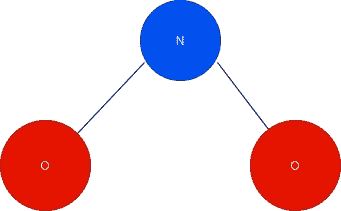
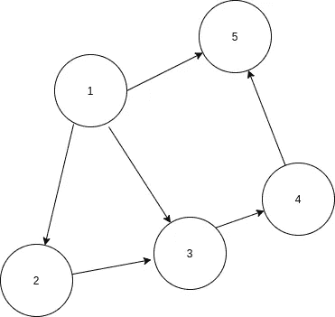
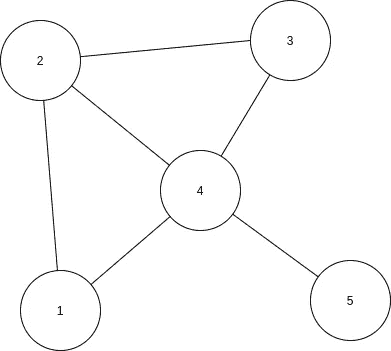

# 图形神经网络导论(一)

> 原文：<https://towardsdatascience.com/an-introduction-to-graph-neural-networks-part-1-57335bca9a79?source=collection_archive---------35----------------------->

## 图形神经网络及其应用

艾莉娜·格鲁布尼亚克在 [Unsplash](https://unsplash.com/s/photos/network?utm_source=unsplash&utm_medium=referral&utm_content=creditCopyText) 上的照片

在过去的三年里，图形神经网络(GNN)的受欢迎程度呈指数级增长。这是因为他们能够有效地从图表数据中学习。大多数系统背后都有一个错综复杂的网络连接，它定义了网络组件之间的交互。这种相互作用可以用图表来表示。要对这些系统建模，理解它们背后的网络是至关重要的。图形神经网络帮助我们利用网络的关系结构来更好地建模和预测结果。

## **什么是图形？**

图是一种结构化的非线性数据类型，具有节点(也称为顶点)和边。数学上表示为 G(V，E)。例如，NO₂的分子可以被认为是一个图，其中氮原子和两个氧原子被认为是节点，原子之间的键被认为是边。另一个图的例子可以是你的家庭，每个人是一个节点，两个人的关系是边。

作为图表的 NO₂(图片由作者提供)

一个图在其节点和边上都可以有标签。它可以是数字，也可以是文本。每个节点都有一些定义该节点的特征。在 NO₂图中，每个节点的原子序数、原子量和价电子数等元素可以是其各自的特征。根据图表的类型，边可能有也可能没有特征。在 NO₂，边缘的特征可以是键强度、键类型(单键或双键)等。

图表是在许多不同的基础上分类的。最常见的是基于图的边。这些是有向和无向图。在有向图中，从一个节点到另一个节点的边是有向的，而在无向图中，节点通过边连接，没有方向。

有向图(图片由作者提供)

无向图(图片由作者提供)

有向图的一个实际例子是 Instagram。你跟着一个人，他不一定跟着你回去。从某种意义上说，这是单向的。另一方面，脸书朋友请求是无向图的一个例子。一旦好友请求被接受，双方都可以看到对方的内容。

## **图表示例**

1.  **社交网络:**社交网络是以节点代表人的图，两个人的关系就是边。这种关系可以是任何东西，从简单的熟人到家庭。
2.  **分子**:一个分子可以用一个图来表示，图中的节点代表原子，边代表它们之间的键。
3.  **互联网**:互联网是一个图形，设备、路由器、网站和服务器是节点，互联网连接是边。

## **分析图表(详解)**

1.  **节点分类** —预测给定节点的类型。例如，社交网络中给定的人可以基于他们的兴趣、信仰或特征进行分类。
2.  **链接预测** —预测两个节点是否链接以及如何链接。例如，查找两个给定的人(节点)之间是否有任何关系。
3.  **社区检测** —识别密集链接的节点集群。例如，发现一群人是否有任何话题相似之处。
4.  **网络相似度** —测量两个节点/网络的相似度。在这里你可以发现两个人或两个不同的群体是否彼此相似。

## **图形神经网络的一些应用**

1.  **推荐系统**:使用 GNNs，推荐系统的能力可以成倍增加。使用 GNNs，推荐将基于从附近的节点借用信息，从而使节点嵌入更准确。Pinterest 使用基于 GNN 的推荐系统。
2.  处理错误信息:一篇恶作剧文章可以通过它的链接识别出来。真文章链接比较连贯，假文章会有散尾。根据 2016 年一篇题为“网络上的虚假信息”的论文，人类可以在 100 次中检测到 66 次恶作剧文章，而 GNN 可以在 100 次中检测到 86 次。
3.  **药物开发**:所有的分子都可以用一个图形来表示。使用 GNNs，可以模拟复杂的网络，如蛋白质-蛋白质相互作用(PPI)网络和代谢网络。这种模式有助于开发更好、更稳定的疾病治疗药物。
4.  Twitter 上的两极分化:根据一个人喜欢的帖子和他们关注的人，可以检测出一个人是否对某个话题(政治、环境等)持特定观点。)还是没有。
5.  **社交圈检测:**使用 GNNs，可以根据一个人与他人的互动来检测他的社交圈。这个圈子可以是同事，大学朋友，家人，同班同学等。

**为什么卷积不能应用于图？**

图像具有固定的大小和基于网格的结构数据，具有定义的空间位置。另一方面，图具有任意的大小、复杂的拓扑和非欧几里得结构。它也没有固定的节点顺序。众所周知，神经网络是为特定的大小、网格和结构定义的。因此卷积不能直接应用于图。

## 结论

在接下来的博客中，我会写关于将图转换成矩阵的内容，比如邻接矩阵、关联矩阵、度矩阵和拉普拉斯矩阵。此外，我将讨论在图上使用卷积的不同方法及其优缺点，创建图的节点嵌入，以及 GNN 中的前向传播。