# 知识图导论

> 原文：<https://towardsdatascience.com/an-introduction-to-knowledge-graphs-841bbc0e796e?source=collection_archive---------11----------------------->

## 如何以图表形式表示和操作数据

由[克林特·王茂林](https://unsplash.com/@clintadair?utm_source=unsplash&utm_medium=referral&utm_content=creditCopyText)拍摄

这是论文 [***“知识图的关系机器学习综述(2015 年 9 月 28 日)”***](https://arxiv.org/abs/1503.00759)*【1】中一些要点的**总结**，它很好地介绍了知识图以及用于构建和扩展它们的一些方法。*

# *关键的外卖*

*信息可以以图形的形式组织，节点代表实体，边代表实体之间的关系。知识图可以手动构建，也可以在某些源文本(例如维基百科)上使用自动信息提取方法构建。给定一个知识图，统计模型可以用来通过推断缺失的事实来扩展和完善它。*

# *真相*

*涵盖的主题:*

1.  ***知识图表的基础知识***
2.  ***统计关系学习**
    **2.1 潜在特征模型**
    2.1.1 重标度
    2.1.2 多层感知器
    2.1.3 潜在距离模型
    **2.2 图特征模型**
    2.2.1 路径排序算法
    **2.3 结合潜在和图特征模型***
3.  *一些更酷的东西*

# *1.知识图的基础*

*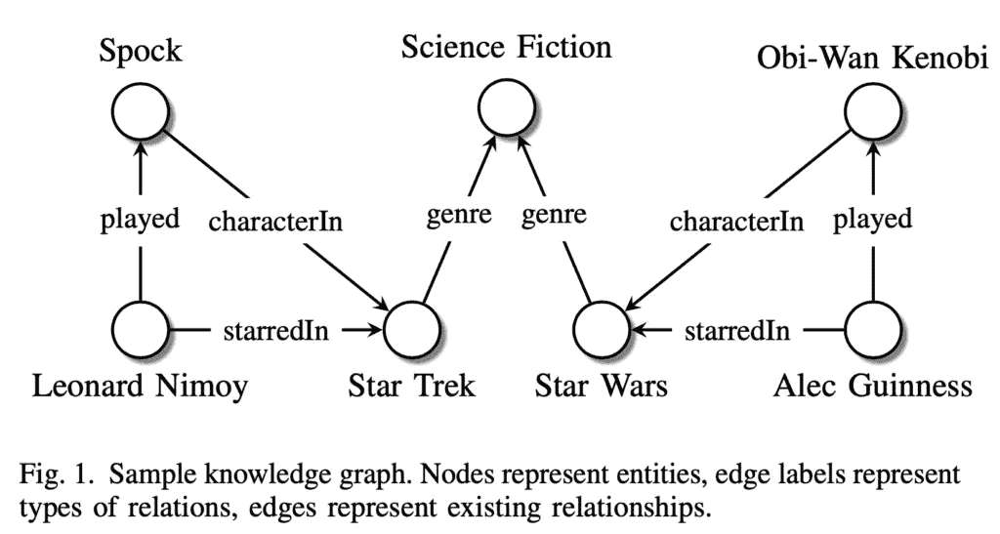*

*摘自论文[1]*

*知识图(KGs)是一种以图表形式组织信息的方式，通过将**实体**(例如:人、地点、物体)表示为节点，将实体之间的**关系**(例如:结婚、位于)表示为边。**事实**典型表示为“SPO”三元组:*(主语、谓语、宾语)*。本质上，由关系连接的两个节点形成一个事实。例如，上图中的一个事实可能是:“斯波克是《星际迷航》中的一个角色”。这个事实是由两个节点`Spock`和`Star Trek`以及关系`characterIn`形成的 SPO 三元组 *(Spock，characterIn，Star Trek)* 。*

*所以，现有的边表示已知的事实。缺边怎么办？
有两种可能:*

*   ****封闭世界假设*【CWA】**:不存在的三元组/边表示虚假关系:例如，既然《伦纳德·尼莫伊到星球大战》中没有`starredIn` 边，我们就推断《星球大战》中伦纳德·尼莫伊*没有*星*
*   ****开放世界假设* (OWA)** :不存在的三元组/边简单代表未知数:由于从伦纳德·尼莫伊到星战没有`starredIn` 边，我们*不知道*伦纳德·尼莫伊是否出演过星战*

*KGs 一般包括各种类型的**等级制度**(*伦纳德·尼莫伊是演员，是人，是活物*)**约束**(*一个人只能娶另一个人，不能娶一个东西*)。*

## *构建知识图表的方法:*

*   *由专家或志愿者手动操作*
*   *通过从半结构化文本中自动提取它们(例如:维基百科信息框)*
*   *通过从非结构化文本中自动提取它们(使用自然语言处理技术)*

## *知识图管理的主要任务:*

*   ***链接预测**:预测图中缺失的边(即:缺失的事实)*
*   ***实体解析**:寻找实际上指同一事物的不同节点和/或不同边。例如，一个系统可能包含三元组，如(*奥巴马，博宁，夏威夷*)和(*巴拉克·奥巴马，普莱瑟夫伯斯，檀香山*)。我们可能想要合并`Obama`和`Barack Obama`节点，因为它们可能指的是同一个实体。*
*   ***基于链接的聚类**:根据链接的相似性对实体进行分组*

# *2.知识密集型企业的统计关系学习(SRL)*

***假设**:一个图中所有的实体和*类型*的关系都是已知的(有 N_e 个实体和 N_r 种类型的关系)。然而，三元组是*不完全的*:也就是说，图中的一些节点是连接的，但也有一些节点对*应该*连接但没有连接。这意味着:有一定数量的真实事实，但我们只知道其中的一部分。还可能存在实体和关系的副本。*

*我们姑且称 *e_i* 为主语节点(例如:`Spock`)， *e_j* 为宾语节点(`Star Trek`)，而 *r_k* 为关系类型(`characterIn`)。我们现在可以将每个可能的三元组 x_ijk = ( *e_i，r_k，e_j* )建模为一个二元随机变量 *y_ijk* ∈ {0，1}。这里，如果三元组存在， *y_ijk* 为 1，否则为 0。在封闭世界假设中，0 表示错误的三元组，而在开放世界中，它表示未知。这些随机变量彼此相关，因为某些三联体的存在可以预测其他三联体的存在/不存在。*

*我们可以把所有可能的三元组组合成一个维度为 N_e x N_e x N_r 的三阶张量 **Y** ∈ {0，1}，见下图。*

*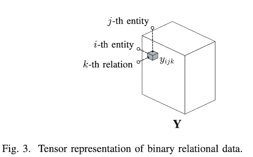*

**摘自论文[1]**

*对 **Y** 的每一个可能的实现都是一个可能的“世界”，是事实的某种组合。我们想弄清楚，在已知的有限数量的三元组中，哪一种实现最有可能是准确的。为此，我们需要从 N_d 个观察到的三元组的子集𝒟中估计分布 P( **Y** )。Y 可能非常大，所以这个任务可能非常复杂。例如， [*Freebase*](https://en.wikipedia.org/wiki/Freebase_(database)) 有大约 4000 万个实体和 35k 个关系，给出 10 个⁹可能的三元组。*

*然而，由于某些限制，这些三元组中只有一小部分是可行的。例如，我们知道关系`marriedTo`只能链接指向人的两个节点，所以我们已经可以排除所有的三元组( *e_i，r _ marriedTo，e_j* )，其中一个或两个实体都不是人。理想情况下，我们希望找到一种方法来轻松识别并丢弃所有这些“不可能的”三元组。*

## *知识图的统计性质*

*正如已经看到的，kg 通常遵循一组**确定性规则**，例如:*

*   ***类型约束**:关系`marriedTo`只能指一个人*
*   ***传递性**:如果 A 位于 B and B 位于 C，那么 A 位于 C*

*他们也经常松散地遵循一套统计模式:*

*   ***同向**(或“**自相关**”):实体倾向于与具有相似特征的实体相关*
*   ***块结构**:一些实体可以被分组为“块”，使得一个块的所有成员与另一个块的成员具有相似的关系*

## *SRL 模型的类型*

*本文涵盖了 3 种主要类型的统计关系学习模型:*

1.  ***潜在特征模型**:我们假设给定一些潜在特征和附加参数，所有 y_ijk 都是独立的*
2.  ***图形特征模型**:我们假设给定观察到的图形特征和附加参数，所有 y_ijk 都是独立的*
3.  *马尔可夫随机场:我们假设所有的 y_ijk 都有局部相互作用[不在本概述中]*

**潜在特征模型*和*图形特征模型*使用评分函数 f(x _ ijk；θ)，其中θ是某组参数。*

# *2.1 潜在特征模型*

*在潜在特征模型中，我们通过潜在变量来解释三元组。例如，我们可以用“亚历克·伊兹高尼是一个好演员”这一潜在变量来解释“亚历克·伊兹高尼获得奥斯卡奖”这一事实。*

*给定一个实体 e_i，我们用向量 **e** _i ∈ ℝ^{H_e}.来表达它的潜在特征例如，假设我们有两个潜在的特征(H_e = 2):成为一个好演员，和获得一个有声望的奖项。我们可以将实体`AlecGuinness`和`AcademyAward`的潜在特征向量表示如下:*

**

*其中，潜在向量的第一元素表示“好演员”，第二元素表示“有声望的奖项”。*

*为了预测三元组，我们需要对这些潜在变量之间的相互作用进行建模。本文回顾了已开发的几种方法，我将总结其中的主要方法:*

*   *重新校准*
*   *多层感知器*
*   *潜在距离模型*

## *重新校准*

*也许最直观的是，RESCAL“通过潜在特征的成对相互作用来解释三元组”，因此三元组的得分由下式给出:*

**

*其中 **W** _k 是维数为 H_e x H_e 的权重矩阵“其条目 *w_abk* 指定了潜在特征 *a* 和 *b* 在 *k 个*关系中相互作用的程度”。以亚历克·伊兹高尼获得奥斯卡奖为例，第 k 个关系是`receivedAward`，其权重矩阵可以是:*

**

*其中右上元素指示“好演员”和“有声望的奖项”的组合(使用之前的潜在向量的结构)。这将模拟一个潜在的事实，即好演员会获得有声望的奖项。*

*因此，在 RESCAL 中，每个实体有一个潜在向量，每个关系类型有一个权重矩阵，因此参数θ为:*

**

***重写评分函数**
我们也可以用不同的方式编写 RESCAL 的评分函数。正如我们将看到的，这将有助于稍后比较 RESCAL 与其他方法。以前我们有:*

**

*我们可以看到，我们可以通过首先创建一个包含潜在特征向量元素的所有组合的向量来重写这个(在上面的公式中，这些都是组合 *e_ia* x *e_jb* )。我们可以这样得到这个向量:*

**

*其中，⊗是两个向量 **a** ∈ ℝ^N 和 **b** ∈ ℝ^M 的克罗内克乘积，这给出了维度为 *NM* 的向量:*

*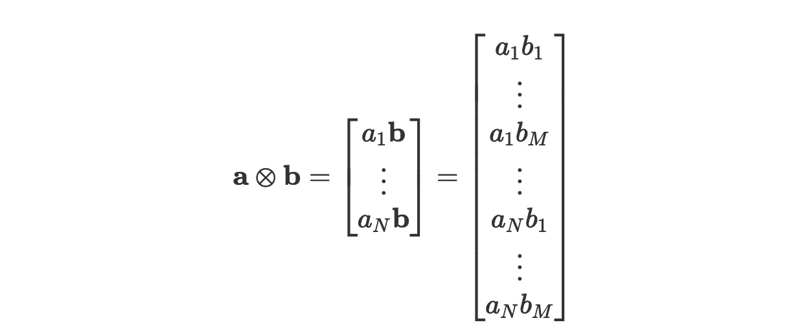*

*因此，使用克罗内克乘积，我们可以重写评分函数:*

*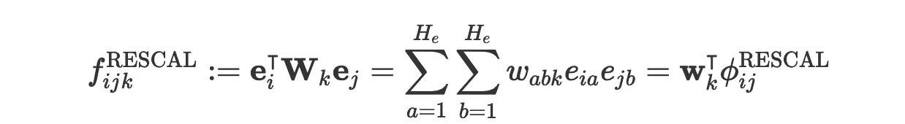*

*其中 **w** _k = vec( **W** _k)(即:矩阵 **W** 的元素存储为一个向量)。*

*总而言之，我们可以将重标模型改写如下:*

**

*直观地表示出来(这里，潜在向量的大小是 H_e = 3):*

*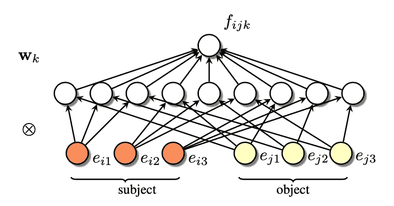*

*摘自论文[1]*

## *2.1.2 多层感知器(MLP)*

***实体多层感知器(E-MLP)***

*我们也可以选择使用标准的 MLP，以主体和客体实体的潜在向量作为输入，来模拟潜在特征的相互作用。因此，我们将有一个输入层，它接受潜在向量的串联:*

**

*然后我们有一个大小为 H_a 的隐藏层 **h** _{ijk}^a，它通过一个矩阵**a**k 来模拟潜在特征之间的相互作用:*

**

*注意 RESCAL 总是通过产品 **e** _i ⊗ **e** _j 考虑潜在特征的所有可能的交互，而 E-MLP 模型*通过 **A** _k 学习*这些交互。最后，我们输出分数:*

**

*其中 **g** (⋅)是某个激活函数。*

*我们可以形象地表示这一点(这里，潜在向量的大小是 H_e = 3，隐藏层的大小是 H_a = 2):*

*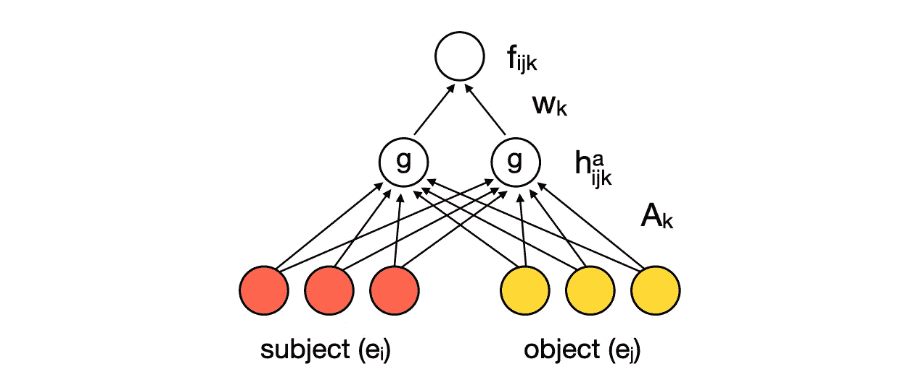*

*根据我们对 H_a 的选择，与 RESCAL 相比，这可以减少所需的参数数量。*

***实体关系多层感知器(ER-MLP)***

*如何进一步减少所需的参数数量？*

*我们可以将关系的潜在向量嵌入向量 **r** _k ∈ ℝ^{H_r}，并将其与输入中的主体和客体向量连接在一起:*

**

*然后我们建立我们的隐藏层:*

**

*我们的输出层:*

**

*注意，通过嵌入关系，我们现在有了一个**全局**矩阵 **C** 而不是 k 相关的 **A** _k，以及一个**全局**向量 **w** 而不是 **w** _k。这可以大大减少所需的参数数量。*

*我们可以直观地表示这一点(这里潜向量的大小为 H_e = 3，H_r = 3，隐藏层的大小为 H_c = 3):*

*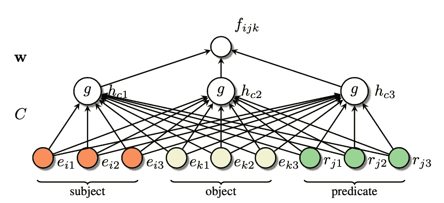*

*摘自论文[1]*

*比较这三种不同模型的结构:*

*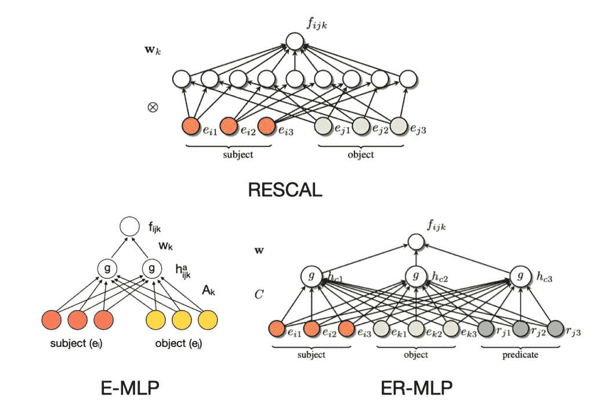*

## *2.1.3 潜在距离模型*

*在这些模型中，两个实体之间存在关系的概率由它们潜在表示的*距离*给出。这些表示越接近，这两个实体就越有可能处于关系中。对于单关系数据(因此当只有一种关系时)，这是相当简单的:我们可以通过一个得分函数来模拟成对关系 x_ij 的概率*

**

*其中 d(⋅，⋅)是一些距离的措施(如:欧几里德距离)。*

*我们如何将此扩展到多关系数据？
一种可能的解决方案是**结构化嵌入** (SE)模型，该模型对三重 x_ijk 使用以下评分函数:*

**

*因此，潜在特征通过矩阵 **A** _k^s 和 **A** _k^o 进行转换并进行比较。这些矩阵是“以现有关系中的实体对比不存在关系中的实体对彼此更接近的方式”学习的*

# *2.2 图形特征模型*

*潜在特征模型使用潜在变量来预测图中的新链接。相比之下，图特征模型直接根据观察到的三元组进行预测。*

*一些类型的图形特征模型:*

*   ***单一关系数据的相似性度量**:这里的想法是使用某种相似性度量来预测两个节点之间的链接，因为相似的实体很可能是相关的。这种相似性可以以各种方式导出，例如通过查看节点的邻居(例如:“这两个节点有许多共同的邻居吗？”)*
*   ***规则挖掘和归纳逻辑编程**:如果我们能从观察到的三元组中提取出一些逻辑规则，就可以用它们来预测图中新的三元组。这可以使模型具有高度的可解释性，因为它只是由一组规则给出的。然而，学会所有的规则和模式并不容易*
*   ***路径排序算法**，如下所述*

## *路径排序算法(PRA)*

*路径排序算法实质上是在图中寻找*路径*，这些路径对于预测某些新边是有用的。例如，假设有两个节点 *e_i* 和 *e_j* ，它们都从第三个节点接收类型为`bossOf`的输入链接。那么 PRA 可能了解到 *e_i* 和 *e_j* 被边`colleagueOf`连接的概率很高。*

*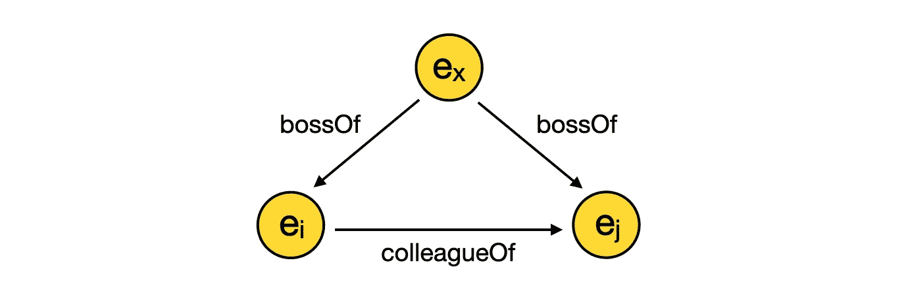*

*更一般地说，我们对构建一个模型感兴趣，该模型可以使用两个节点之间的更长路径来预测连接它们的某条直接边。*

*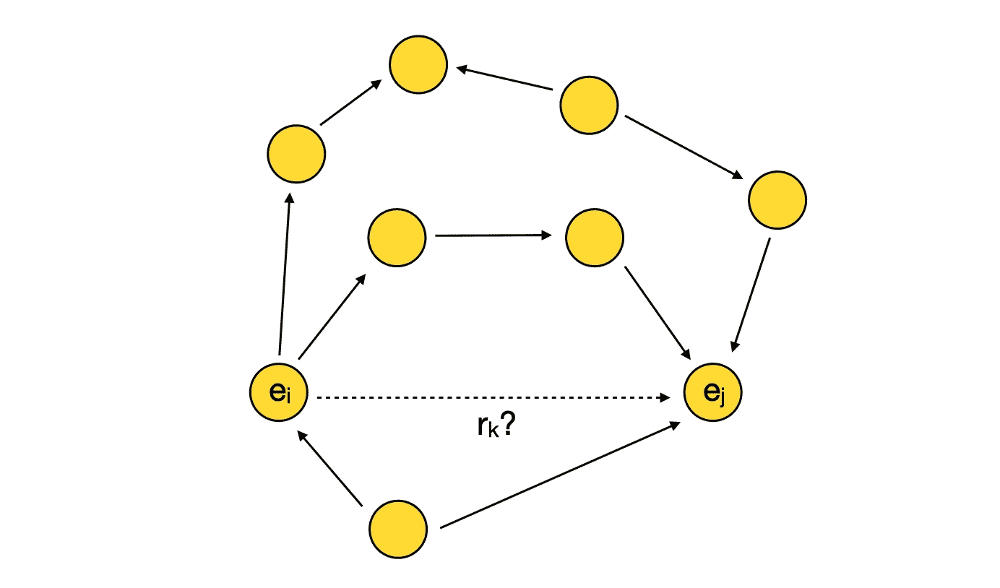*

*连接 e_i 和 e_j 的更长的路径能帮助我们预测它们之间直接关系 r_k 的存在吗？*

*我们可以使用逻辑回归模型来构建评分函数*

**

*其中，ϕ_ij 是对应于 e_i 和 e_j 之间所有可能路径的特征。
[ *注*:我使用的符号与本文中用于路径特征的符号略有不同。我发现这与其他论文中使用的路径排序算法更清晰、更一致。]*

*所以我们现在需要找到一些方法来表达这些不同的路径，用一种数字的，可量化的形式，我们可以用它作为ϕ_ij.*

*设π=⟨R1，r_2,…,r_L⟩是一个长度为 l 的*路类型*，即:一个确定的边类型序列【2】。我们如何表达 e_i 和 e_j 之间的路径，该路径遵循路径类型π作为特征？如果我们从 e_i 开始，沿着严格遵循π定义的边类型的路径，假设在每个交叉点，我们将随机均匀地选择一个可能的输出链接，我们可以使用我们将在 e_j 结束的概率。
我们可以把这个概率表示为 P(i → j，π)。*

*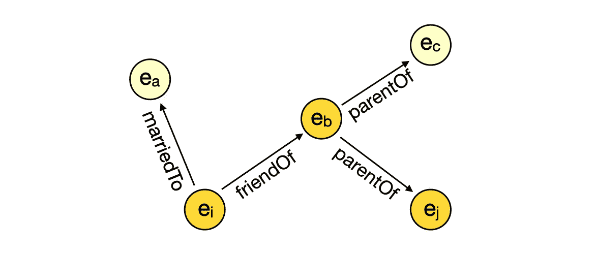*

*例如，让我们定义一个路径类型π=⟨f *里恩多夫，⟩.*的父母如果我们看上面的图表，我们可以看到 P(i → j，π) = 0.5。事实上，从 e_i 开始，只有一条链路满足关系`frienfOf`，所以我们将以 1 的概率到达节点 e_b。然而，从 e_b 有两个可能的`parentOf`链接，所以从这里我们将以 1/2 的概率到达 e_j。*

*如果我们称π= {π₁，π₂，…，π_n}为我们要考虑的所有路径类型的集合，我们可以将我们的特征向量定义为:*

**

*我们的评分函数是:*

**

*使用这个模型的一个优点是它很容易解释。事实上，我们可以查看获得最高权重的路径类型，并将它们视为模型已经识别的“规则”。论文以学习到的权重为例，预测三元组 *(p，college，c)* ，从而预测一个人上过哪所大学。其中权重最高的是由⟩、*学校*起草的路径类型⟨ *，这意味着如果一个人是由某个*学校*(学院)所属的*团队起草的*，那么他很可能去了那个学院。**

**

*摘自论文[1]*

# *2.3 结合潜在和图形特征模型*

*潜在特征模型和图形特征模型具有不同的优势:*

*   *潜在特征模型适用于建模全球关系模式，当只有少量潜在变量足以解释三元组时*
*   ***图形特征模型**适用于本地关系模式的建模，当三元组可以用图形中实体的邻域或短路径来解释时*

*因此，将这两种类型的方法结合起来利用它们各自的优势是很有用的。一种可能的方法是通过**加性关系效应** (ARE)模型。例如，我们可以将 RESCAL 和 PRA 结合起来:*

**

*通过这种方式，PRA 可以模拟*可观察的图形模式*，而 RESCAL 可以模拟 PRA 无法模拟的“残余误差”。这意味着，与必须自己对所有事物建模相比，RESCAL 需要的潜在特征数量要少得多。*

# *3.一些更酷的东西*

*我会给你留下一些潜在的主题来研究，以扩展我在这篇文章中提到的内容:*

*   ***马尔可夫随机场**:另一种值得研究的统计关系学习模型。这在论文中有所涉及，不过如果你以前从未见过它们，我会建议你寻找一些对初学者更友好的资源*
*   ***高阶关系**:本文关注的是二元关系(我相信这是知识图的默认设置)，但是也可以构建包含两个以上术语的关系图*
*   ***时间呢？有些事实只在某个时刻或某个时间间隔内成立，我们如何对此建模？***

## ***参考文献***

*[1] Nickel，m .，Murphy，k .，Tresp，v .和 Gabrilovich，E. [知识图的关系机器学习综述](https://arxiv.org/abs/1503.00759) (2015)。IEEE 会议录，104(1)。
【2】Gardner，m .、Talukdar，p .、Kisiel，b .和 Mitchell，T. [利用潜在的句法线索提高大型知识库中的学习和推理](https://www.aclweb.org/anthology/D13-1080.pdf) (2013)。2013 年自然语言处理经验方法会议录。*

**觉得这个故事有帮助？考虑* [*订阅*](https://chiaracampagnola.medium.com/membership) *到媒体支持作家！**