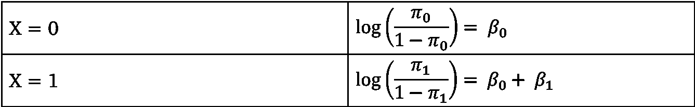
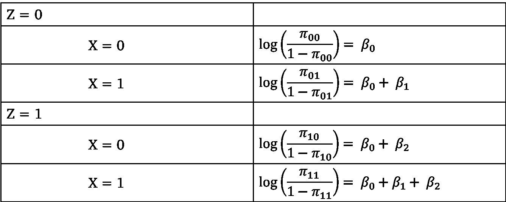
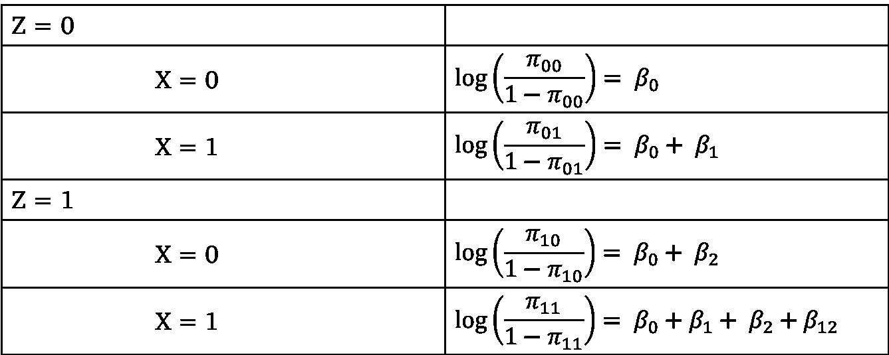
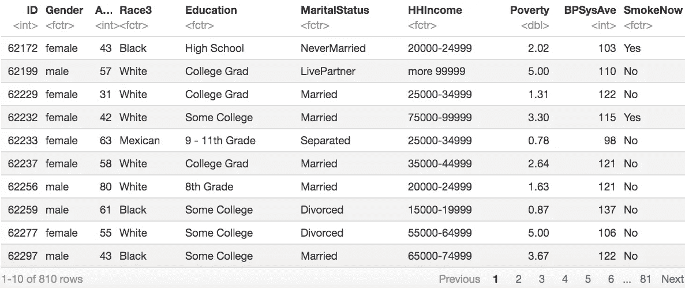
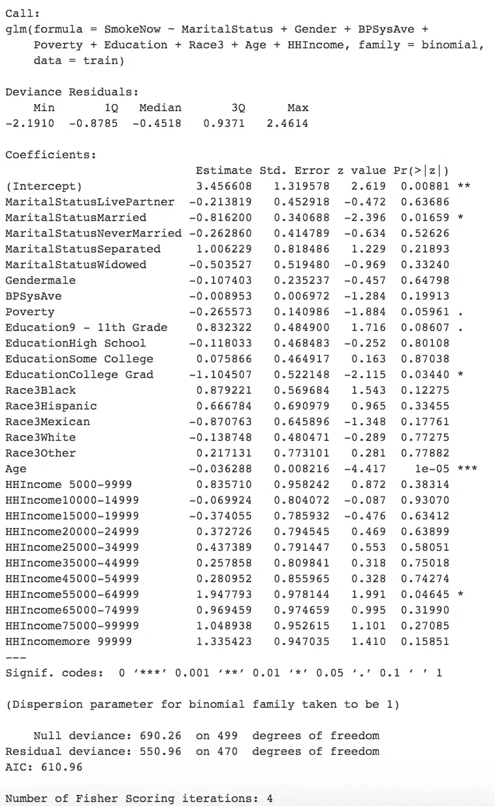

# 分类数据分析的逻辑回归导论

> 原文：<https://towardsdatascience.com/an-introduction-to-logistic-regression-for-categorical-data-analysis-7cabc551546c?source=collection_archive---------8----------------------->

## 从逻辑回归的推导到解释

# 导出分类数据的模型

通常，当我们有一个连续变量 y(响应变量)和一个连续变量 x(解释变量)时，我们假设关系 E(Y|X) = β₀ +β₁X.这个等式对您来说应该很熟悉，因为它代表了简单线性回归的模型。这里，E(Y|X)是一个随机变量。

另一方面，如果 Y 是一个取值为 0 或 1 的二元变量，那么 E(Y|X)是一个概率。这意味着 0 < β₀ +β₁X < 1，这是一个不总是成立的假设。但是，如果我们考虑 log(E(Y|X))，我们将得到-∞ < β₀ +β₁X < 0。这又是一个受限空间，但比最初的情况好得多。如果你熟悉简单的逻辑回归模型，你会注意到我们正在接近它的实际形式。让我们考虑一个比值比，它被定义为ω=π/(1-π)其中 0

所以我们有范围(-∞，∞)。最后一个方程是普通逻辑回归方程。

# 理解范畴分析中的第三变量

在试图建立我们的模型或解释逻辑回归参数的意义之前，我们必须首先考虑可能影响我们实际建立和分析模型的额外变量。在处理分类数据分析时，通常会有被称为第三个变量的东西，它会对您将要尝试构建的模型产生一定的影响。根据你正在处理的第三个变量的类型，应该采取不同的措施来避免错误的结论。

## 混淆术语

与混杂变量 Z 的关系

当从 Z 到 X 和 Z 到 Y 存在直接关系，而 Y 依赖于 X 时，第三分类变量 Z(具有 k 个分类)是混杂变量。换句话说，混杂变量影响因变量和自变量，并且经常“隐藏”关联。后一种现象被称为虚假关系，这是一种两个或两个以上变量相关联，但由于第三个变量的存在而没有因果关系的关系。

## 相互作用项

一个相互作用的术语，通常意味着第三个变量改变了比如说一个暴露对结果的影响。也就是说，如果两个感兴趣的变量相互作用，那么它们和因变量之间的关系取决于另一个相互作用项的值。

# 解释逻辑回归

首先考虑简单的线性回归，其中 Y 是连续的，X 是二进制的。当 X = 0 时，E(Y|X=0) = β₀，当 X = 1 时，E(Y|X=1) = β₀ + β₁.因此，当解释β₁的含义时，我们说它代表两组之间的平均差异，即 X = 0 时(参考组)和 X = 1 时(比较组)的平均差异。

现在，让我们假设一个简单的例子，Y 和 X 是取值为 0 或 1 的二元变量。说到逻辑回归，β₁differs 的解释就像我们不再看的意思。回想一下，逻辑回归的模型 log(E(Y|X)/(1-E(Y|X)) = β₀ + β₁X，或者为了简化起见，log(π/(1-π)) = β₀ + β₁X.，这都是基于优势比。当我们考虑 X 的所有可能值时，

如果我们希望从上述两个例子中解释β₁，我们将把它当作一个简单的线性回归来分析。也就是说，β₁是从 X = 1 时的结果减去 X = 0 时的结果得到的:

这表明β₁是一个对数比值比，而 exp(β₁是一个比值比。

## 混杂解释

如果逻辑模型考虑了第三个变量，无论它是混杂项还是交互项，都可能有不同的方式来解释模型参数。

设 Y 和 X 如前所述，Z 是第三个变量，取值为 0 或 1。调整混杂因素的模型是 log(E(Y|X，Z)/(1-E(Y|X，Z))) = log(π/(1-π)) = β₀ + β₁X + β₂Z.。再次，让我们看看独立变量的每个值会得到什么:

类似地，我们会发现，对于每个 z，β₁是 X = 1 和 X = 0 之间的对数(比值)，而 exp(β₁是比值比。

## 带交互项的解释

当第三个变量是交互项时，为其进行调整的模型是 log(E(Y|X，Z)/(1-E(Y|X，z))= log(π/(1-π))=β₀+β₁x+β₂z+β₁₂xz.这里，我们说β₁、β₂是主要效应，β₁₂是交互效应。

所以我们注意到，当 Z = 0 时，exp( β₁)又是一个优势比，当 Z = 1 时，exp( β₁ + β₁₂)又是一个优势比。那么，β₁₂一个人呢？事实上，exp(β₁₂)被解释为比值比根据 z 的水平变化多少。这被称为“比值比的比率”或“差异中的差异”。

# 示例和解释

让我们考虑 R 中一个大型内置数据集的随机子集，称为美国国家健康和营养检查研究(NHANES)。

上面显示的数据是原始数据的子集，只包括原始数据集中的几个变量。如果您想了解关于数据集的更多信息，您可以在此阅读更多信息[。](https://cran.r-project.org/web/packages/NHANES/NHANES.pdf)

然后，我们将对数据拟合逻辑回归模型，因为我们希望预测受试者是否是吸烟者(SmokeNow)。拟合的模型汇总如下所示。

对于这一特定模型，显著变量是那些 p 值小于 0.05 的变量。你会注意到它们旁边都有*、**、**，或者它们是否接近那个显著性水平。注意，这只是 R 中的特性，帮助用户直观地识别重要的协变量。

## 婚姻状况

MaritalStatus 变量是一个有六个类别的分类变量。请注意，这比上面的回归总结中列出的类别数多了一个。这意味着未列出的类别是参考类别。如果我们查看这个变量的所有级别，我们会发现类别是离婚(参照组)、同居伴侣、已婚、未婚、分居和丧偶。在这种情况下，已婚群体是显著的，其β估计值为-0.8162。这个数字到底是什么意思？回想一下，我们之前已经确定 exp(β)通常是两组之间的优势比。这里，这两个组是已婚组和离婚组(即参照组)。那么，exp(-0.8162) = 0.4421。因此，当控制所有其他变量时，已婚组吸烟的几率是离婚组吸烟的 0.4421 倍。

## 年龄

年龄变量是一个连续变量，因此不需要考虑类别/级别。这个的β = -0.0363，所以 exp(β) = 0.9644。我们将此解释为，在其他条件不变的情况下，年龄每变化一个单位，优势比就会变化 0.9644 个单位，因为该模型适用于 log(odds) = log( π/(1-π))。

## 家庭收入

与 MaritalStatus 类似，这是一个分类变量，我们会发现它有 12 个级别:0–4999(参考组)、5000–9999、10000–14999、15000–19999、20000–24999、25000–34999、35000–44999、45000–54999、55000–64999、55000–64999 综上所述，55000–64999 组具有显著性，估计值为β = 1.9478。那么，当控制所有其他变量时，在 55000-64999 收入组中吸烟的几率是在 0-4999 收入组中吸烟的几率的 7.0132 倍。

## 教育

如果需要，可以对最高教育水平得出类似的解释。