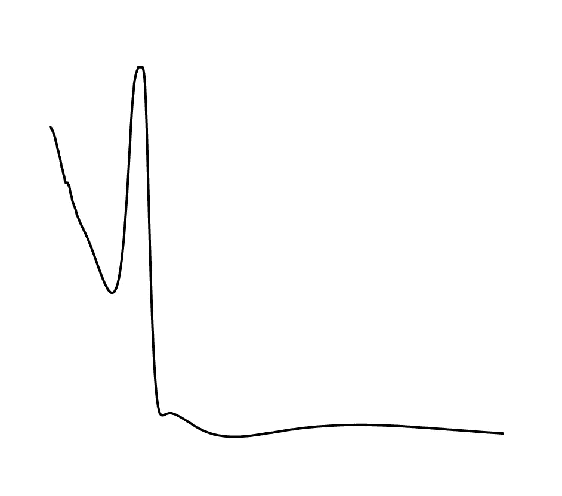
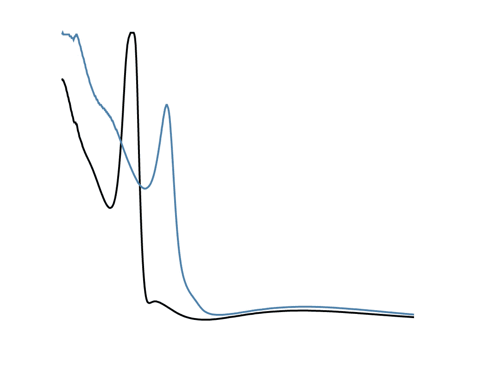
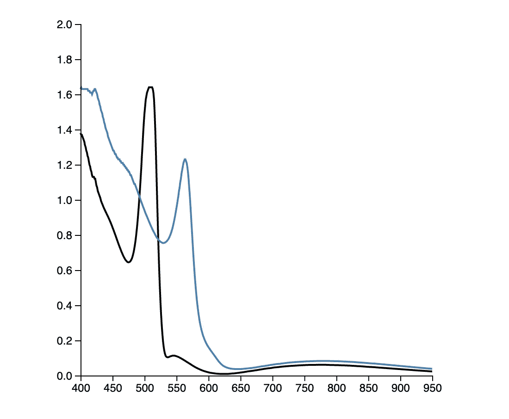
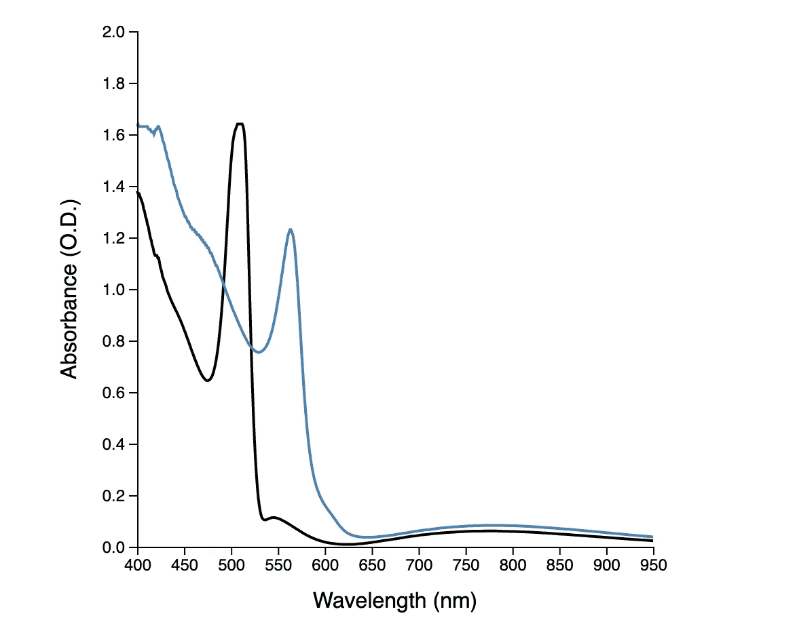
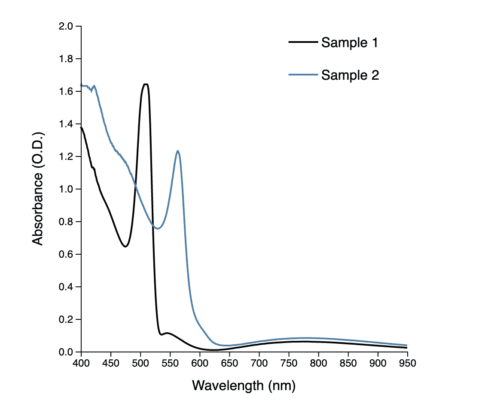
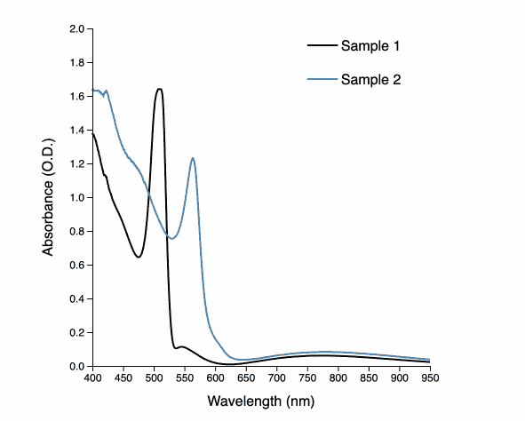
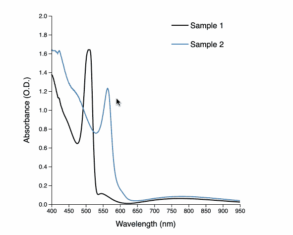

# 用 D3 制作动态交互式图形的介绍

> 原文：<https://towardsdatascience.com/an-introduction-to-making-dynamic-and-interactive-plots-with-d3-a9e859413c5a?source=collection_archive---------22----------------------->

## 使用 D3.js 让您的科学数据变得生动


照片由 [chuttersnap](https://unsplash.com/@chuttersnap?utm_source=medium&utm_medium=referral) 在 [Unsplash](https://unsplash.com?utm_source=medium&utm_medium=referral) 上拍摄

我一直对学习如何使用 D3.js 犹豫不决。它似乎总是比其他库(如`matplotlib`)更不直观，我已经写了很多关于它的文章。然而，在这里，我发现自己正在编写一个关于在 D3 中制作绘图的教程——如果你正在开发一个网站或 web 应用程序，并且想要动态和交互式的数据可视化，熟悉这个库可能会很有用。在本文中，我收集了许多反复试验的结果，希望它既能作为参考，又能帮助您在这个过程中避免一些简单的初学者错误。本文的目标是再现我早期作品中的样本吸光度图:

[](/an-introduction-to-making-scientific-publication-plots-with-python-ea19dfa7f51e) [## 用 Python 制作科学出版物图简介

### 介绍如何使用 Python 为科学出版物绘制数据

towardsdatascience.com](/an-introduction-to-making-scientific-publication-plots-with-python-ea19dfa7f51e) 

在我们开始之前，我想先退一步。我以前在培养基方面的很多工作都是面向实验科学家的，因为这是我自己的个人背景。说到这一人群，我相信将这一新工具(D3)添加到您的工具箱将有助于您使您的数据变得生动，并且能够接触到比通常仅通过共享您发布的期刊文章更广泛的受众。所以，事不宜迟，我们开始吧。作为免责声明，对 JavaScript、HTML 和 CSS 的基本理解肯定会对读者有所帮助。

# **创建我们的文件**

首先，我们需要创建 3 个文件(将它们都放在计算机上的同一个文件夹中):

1.  `index.html` —这是主 HTML 文件，我们将能够在我们的网络浏览器中打开它来查看我们的可视化
2.  `style.css`——我们将使用 CSS 样式化我们可视化中的一些元素
3.  `plot.js`——这将是我们项目的主力，包含我们绘制地图所需的所有 D3 代码

# **设置我们的 HTML 文件**

我们的`index.html`不会包含太多内容，因为我们将使用 JavaScript 操作文档。我们从任何 HTML 文件的一般框架代码开始。

```
<!DOCTYPE html><html>

</html>
```

在我们的`html`标签中，我们将创建两个部分:`head`和`body`。在`head`部分，我们将添加对 CSS 样式表的引用，以及到 D3.js 的链接，这样我们以后就可以使用所有的模块。

```
**<!--Import D3 and our CSS in the head section-->**<head>
  <link *rel*='stylesheet' *href*='./style.css'>
  <script *src*="https://d3js.org/d3.v5.min.js"></script>
</head>
```

现在，在我们的 HTML 文件的`body`中，我们将创建一个名为`plot_area`的`div`，我们将用我们的`plot.js`文件操作它，我们也将把它导入到当前文件中。

```
**<!--Create div for our plot and import plot.js-->**<body>
  <div *id*='plot_area'></div>
  <script *src*='./plot.js'></script>
</body>
```

我们已经完成了对`index.html`的所有编辑——现在让我们继续我们可视化的主要工作，JavaScript。

# **使用 D3.js**

D3 是一个 JavaScript 库，是数据驱动文档的缩写，提供了一系列使用和操作 SVG(可缩放矢量图形)的函数。我们要做的第一件事是定义我们的 SVG 的高度和宽度(以像素为单位)—除此之外，我们将定义一个填充值，以确保我们的绘图轴不与我们的 SVG 框架的边界垂直。

```
**// Set SVG width, height, and padding**const w = 500;
const h = 500;
const padding = 60;
```

## **加载我们的数据**

接下来，我们需要加载我们的数据——为此，我们可以利用一个内置函数，其中`format_fnc()`是我们格式化数据的 JavaScript 函数，而`manipulate_fnc()`是我们将用来操作数据的函数:

```
d3.csv('path_to_file', format_fnc()).then(manipulate_fnc());
```

我们将使用的文件路径是我上一篇文章中的 CSV 文件，我们将把它传递给一个回调函数，该函数将我们的数据重新格式化为多维数组。我们可以通过列名(' Wavelength '，' Sample _ 1 _ absorption '和' Sample _ 2 _ absorption ')引用每个 CSV 行中的字段—我们必须添加一个`+`，因为默认情况下`d3.csv()`将数据作为字符串加载，所以这可以确保我们存储的是数值。我们的最终数据数组将包含每个数据点的子数组，其中第一个元素是波长，第二个元素是样品 1 的吸光度，第三个元素是样品 2 的吸光度。最后，我们将格式化后的数据传递给我们接下来要编写的`plot_data()`函数。

```
**// Load our CSV data**d3.csv('https://raw.githubusercontent.com/naveenv92/python-science-tutorial/master/intro/Absorbance_Data.csv', function (d) {
return [
  +d['Wavelength'],
  +d['Sample_1_Absorbance'],
  +d['Sample_2_Absorbance']
]
}).then(plot_data);
```

现在，我们可以开始构建`plot_data()`函数——我们要做的第一件事是定义轴限值:

```
**// Data plotting function**function plot_data(data) { **// Set axis limits**const xMin = 400;
  const xMax = 950;
  const yMin = 0;
  const yMax = 2;
}
```

## **创建轴刻度**

我们将继续添加这个函数的主体——我们现在需要设置轴缩放，我们将使用`d3.scaleLinear()`来完成，因为我们的两个轴都将具有线性缩放。在此基础上，我们将链接另外两个方法:`domain()`和`range()`。域对应于我们将传递给标尺的输入值，范围对应于将在 SVG 上绘制的输出(以像素为单位)。你会注意到 D3 的一个主题是我们可以链接任意数量的方法。在这两个范围中，我们将通过我们的`padding`变量的值来偏移端点，以便我们在轴周围有一些空白。你会注意到的另一个有趣的事情是，y 轴范围似乎是向后的！这是因为 SVG 的原点在左上角，所以我们需要翻转 y 值，以便将这个原点移到左下角。

```
**// Set x and y-axis scales**const xScale = d3.scaleLinear()
                 .domain([xMin, xMax])
                 .range([padding, w - padding]);const yScale = d3.scaleLinear()
                 .domain([yMin, yMax])
                 .range([h - padding, padding]);
```

尽管我们已经为输入值指定了一个域，但我们的缩放函数仍将绘制这些范围之外的数据。为了确保所有数据都在我们的 x 轴域中，我们将创建一个新数组，只包含该区域中的点:

```
**// Trim data points to only be in range of x-axis**let data_in_range = [];
data.forEach(function (e) {
  if (e[0] >= xMin && e[0] <= xMax) {
  data_in_range.push(e);
  }
});
```

## **创建初始 SVG**

我们现在可以创建 SVG 对象了——在 D3 中，这通常是由函数`d3.select()`和`d3.selectAll()`驱动的。我们将选择我们之前用`id=plot_area`创建的`div`，并用`append('svg')`为它附加一个 SVG。然后我们可以用`attr()`编辑 SVG 的属性，并传递我们已经定义的高度和宽度值。

```
**// Append an svg to the plot_area div**const svg = d3.select('#plot_area')
              .append('svg')
              .attr('width', w)
              .attr('height', h);
```

## **绘制我们的第一行**

为了绘制第一条线(样品 1 的吸光度)，我们将在 SVG 中添加一个`path`对象。然后，我们可以使用`datum()`函数将相关数据绑定到该行。然后我们可以像上面一样编辑属性，但是要实际创建行，我们需要编辑`d`属性并使用`d3.line()`。我们将为 x 和 y 数据传递回调函数，其中我们将数据点与我们之前创建的`xScale`和`yScale`函数结合使用。

```
**// Append path object for sample 1**svg.append('path')
   .datum(data_in_range)
   .attr('stroke', 'black')
   .attr('stroke-width', 2)
   .attr('fill', 'none')
   .attr('d', d3.line()
                .x((d) => xScale(d[0]))
                .y((d) => yScale(d[1])));
```

如果一切顺利，我们现在可以在浏览器中打开`index.html`文件，应该会看到以下内容:



婴儿学步！现在让我们添加第二行，就像我们添加第一行一样:

```
**// Append path object for sample 2**svg.append('path')
   .datum(data_in_range)
   .attr('stroke', 'steelblue')
   .attr('stroke-width', 2)
   .attr('fill', 'none')
   .attr('d', d3.line()
                .x((d) => xScale(d[0]))
                .y((d) => yScale(d[2])));
```



我们已经成功地绘制了两条线，但是没有任何轴，没有数据的上下文，所以让我们添加这些。

## **给我们的剧情添加了坐标轴**

为了创建 x 轴，我们使用`d3.axisBottom()`，为了创建 y 轴，我们使用`d3.axisLeft()`。然而，这两种方法都是让 x 和 y 轴指向正确的方向(x 轴在 SVG 的顶部，y 轴在 SVG 的左侧)——我们仍然需要将它们转换到 SVG 中它们各自的部分，这可以通过`transform`属性来实现:

```
**// Add x-axis**svg.append('g')
   .style('font-size', '12px')
   .attr('transform', 'translate(0,' + (h - padding) + ')')
   .call(d3.axisBottom(xScale));**// Add y-axis**svg.append('g')
   .style('font-size', '12px')
   .attr('transform', 'translate(' + padding + ',0)')
   .call(d3.axisLeft(yScale));
```



## **添加轴标签**

D3 没有直接创建轴标签的方法，所以我们通过添加`text`对象来实现。我们可以使用已经存储的高度和宽度变量轻松定位标签。在下面的代码块中，我将标签从 SVG 的边缘偏移 15 个像素。同样，但是将`text-anchor`属性设置为`middle`，我们可以将文本对象在轴上居中。

对于 y 轴标签，我们必须做一个额外的步骤。当旋转一个文本对象时，默认情况下它会围绕原点旋转，即使我们手动设置了`x`和`y`属性。为了解决这个问题，我们将在旋转的同时使用平移来重置旋转点，并旋转-90 度。

```
**// Add x-axis label**svg.append('text')
   .attr('x', w/2)
   .attr('y', h - 15)
   .attr('text-anchor', 'middle')
   .style('font-family', 'sans-serif')
   .text('Wavelength (nm)');**// Add y-axis label**svg.append('text')
   .attr('text-anchor', 'middle')
   .attr('transform', 'translate(15,' + h/2 + ')rotate(-90)')
   .style('font-family', 'sans-serif')
   .text('Absorbance (O.D.)');
```



## **添加图例**

再说一次，就创造一个传奇而言，我们几乎只能靠自己了。我们的行动方针如下:

1.  通过创建两点数据集为图例创建线
2.  为每个图例标签追加文本对象

在我们的图中，图例从[750，800]开始，样本 1 的 y 值为 1.9，样本 2 的 y 值为 1.7。

```
**// Add legend**svg.append('path')
   .datum([[750, 1.9], [800, 1.9]])
   .attr('stroke', 'black')
   .attr('stroke-width', 2)
   .attr('d', d3.line()
                .x((d) => xScale(d[0]))
                .y((d) => yScale(d[1])));svg.append('path')
   .datum([[750, 1.7], [800, 1.7]])
   .attr('stroke', 'steelblue')
   .attr('stroke-width', 2)
   .attr('d', d3.line()
                .x((d) => xScale(d[0]))
                .y((d) => yScale(d[1])));
```

现在，我们可以在每条新绘制的线旁边附加文本标签:

```
svg.append('text')
   .attr('x', xScale(805))
   .attr('y', yScale(1.9))
   .attr('alignment-baseline', 'central')
   .style('font-family', 'sans-serif')
   .style('font-size', '16px')
   .text('Sample 1');svg.append('text')
   .attr('x', xScale(805))
   .attr('y', yScale(1.7))
   .attr('alignment-baseline', 'central')
   .style('font-family', 'sans-serif')
   .style('font-size', '16px')
   .text('Sample 2');
```



## **让我们的剧情动态化**

现在，如果你认为我们费了很大的劲才做出你在上面看到的这个简单的图，你可能是对的。用 R 或 Python 等其他编程软件制作静态图形非常简单。但是让我们的剧情动态化才是 D3 真正展示威力的地方。首先，让我们创建一个小动画，其中两条线都从 0 开始，然后在一秒钟内上升到它们的值。

为此，我们将返回并编辑路径的初始绘图。我们使用`transition()`方法和`duration()`来改变我们的属性，在本例中是`d`属性。我们最初将所有的 y 值设置为 0，然后将它们更改为各自的值。

```
**// Append path object for sample 1**svg.append('path')
   .datum(data_in_range)
   .attr('stroke', 'black')
   .attr('stroke-width', 2)
   .attr('fill', 'none')
   .attr('d', d3.line()
                .x((d) => xScale(d[0]))
                .y(yScale(0)))
   .transition()
   .duration(1000)
   .attr('d', d3.line()
                .x((d) => xScale(d[0]))
                .y((d) => yScale(d[1])));**// Append path object for sample 2**svg.append('path')
   .datum(data_in_range)
   .attr('stroke', 'steelblue')
   .attr('stroke-width', 2)
   .attr('fill', 'none')
   .attr('d', d3.line()
                .x((d) => xScale(d[0]))
                .y(yScale(0)))
   .transition()
   .duration(1000)
   .attr('d', d3.line()
                .x((d) => xScale(d[0]))
                .y((d) => yScale(d[2])));
```



现在，让我们制作它，这样我们就可以用鼠标悬停在实际的数据点上，并获得它们的确切值。为此，我将为每个数据点添加圆圈。在这种情况下，我们将使用`d3.selectAll()`来选择我们将要创建的圆形对象。我们使用`data()`而不是`datum()`来绑定数据，因为我们正在为每个数据点创建一个新的圆，而不是像上面那样使用所有的数据点来创建一个路径。

对于每个圆，我们分别为圆的 x 和 y 坐标编辑属性`cx`和`cy`，为圆的半径编辑属性`r`。我们将填充颜色设置为与线条相同。然后每个圆被赋予一个类值`points`，我们将使用 CSS 来修改它。最后，我们将`pointer-events`设置为`all`，这样如果圆圈的任何部分进入鼠标指针，我们就可以触发一个事件。

为了创建工具提示，我们将`title`对象附加到每个圆上，并将它们的`text`属性设置为对应于该点的数据。所以当我们悬停在其中一个点上时，我们会看到数据。

```
**// Append circles for hovering points for sample 1**svg.selectAll('circle_samp_1')
   .data(data_in_range)
   .enter()
   .append('circle')
   .attr('cx', (d) => xScale(d[0]))
   .attr('cy', (d) => yScale(d[1]))
   .attr('r', 4)
   .attr('fill', 'black')
   .attr('class', 'points')
   .style('pointer-events', 'all')
   .append('title')
   .text(function (d) {
      return (
      'Wavelength: ' + d[0] + ' nm' + '\n' + 'Absorbance: ' + d[1]
      );
   });**// Append circles for hovering for sample 2**svg.selectAll('circle_samp_2')
   .data(data_in_range)
   .enter()
   .append('circle')
   .attr('cx', (d) => xScale(d[0]))
   .attr('cy', (d) => yScale(d[2]))
   .attr('r', 4)
   .attr('fill', 'steelblue')
   .attr('class', 'points')
   .style('pointer-events', 'all')
   .append('title')
   .text(function (d) {
   return (
      'Wavelength: ' + d[0] + ' nm' + '\n' + 'Absorbance: ' + d[2]
      );
   });
```

## **编辑 CSS 将所有内容整合在一起**

我希望我们在上面画的圆圈是看不见的，直到我们悬停在它们上面。我们可以通过编辑`visibility`属性在 CSS 中非常简单地做到这一点。我们从隐藏它们开始，然后在触发`points:hover`事件时使它们可见。

```
**/* Make points visible on hover */** *.points* {
visibility: hidden;
}.points:hover {
visibility: visible;
}
```



现在你知道了！用 D3 制作的吸光度图的交互式版本！

# **结束语**

感谢您的阅读！本文的所有分析都可以在这个 [Github 资源库](https://github.com/venkatesannaveen/medium-articles)中找到。我很感激任何反馈，你可以在 [Twitter](https://twitter.com/naveenv_92) 上找到我，并在 [LinkedIn](https://www.linkedin.com/in/naveenvenkatesan/) 上与我联系以获得更多更新和文章。