# 用 Python 制作科学出版物图简介

> 原文：<https://towardsdatascience.com/an-introduction-to-making-scientific-publication-plots-with-python-ea19dfa7f51e?source=collection_archive---------4----------------------->

## [Python 科学绘图](http://towardsdatascience.com/tagged/python-science-plotting)

## 介绍如何使用 Python 为科学出版物绘制数据


照片由 [Isaac Smith](https://unsplash.com/@isaacmsmith?utm_source=unsplash&utm_medium=referral&utm_content=creditCopyText) 在 [Unsplash](https://unsplash.com/s/photos/graph?utm_source=unsplash&utm_medium=referral&utm_content=creditCopyText) 上拍摄

几年来，我一直在使用 Python 进行科学计算，绘制我所有的图。我的主要动机是:( 1) Python 是开源的，以及(MATLAB 占用的硬盘空间(尤其是在我的笔记本电脑上，那里的硬盘空间非常宝贵)。此外，永远不必担心保持软件许可证最新也是一个额外的优势。在为我的情节找到“完美”的参数之前，我不得不进行一连串的试错和谷歌搜索，这促使我撰写了这篇文章——既是为外部读者提供信息的工具，也是我为自己记录事情的一种方式。审美是主观的，但我希望本教程可以指出重要的设置和参数，允许您根据个人喜好定制任何数据集。这是我希望成为的系列教程的第一篇文章——我将继续为不同类型的可视化添加章节。如果你还没有 Anaconda 的话，我建议你安装它，因为它包含了所有你需要的数据分析和可视化所需的包。

# **导入包**

使用的大多数函数在`matplotlib`包中(大多数绘图函数来自`matplotlib.pyplot`子包)。此外，我通常导入`numpy`用于快速计算，导入`pylab`用于从任何内置色图中快速生成颜色。很多时候，当我们导入包时，我们会创建一个简短的别名(*即* `mpl`代表`matplotlib`)，这样我们就可以使用别名来引用它的函数，而不是每次都键入`matplotlib`。

```
# Import required packages
import matplotlib as mpl
import matplotlib.pyplot as plt
import numpy as np
from pylab import cm
```

# 加载数据

由于科学仪器数据通常相当简单(通常只有一个我们控制的自变量和一个测量的因变量)，我们可以使用`numpy.loadtxt`来导入我们的数据。对于更复杂的数据集，我强烈推荐使用`pandas`，它有非常复杂的功能来加载和净化可视化数据——在这里可以找到全面的文档。对于这个例子，我有一个名为`Absorbance_Data.csv`的文件，其中有一些在分光光度计上收集的两个样品的吸光度数据。

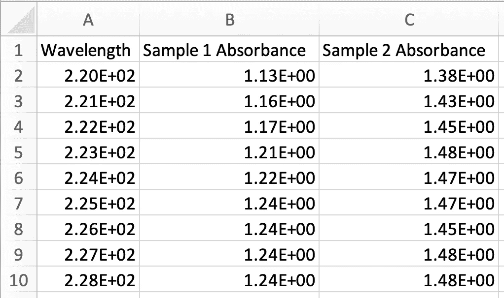

两个样品吸光度数据的 CSV 文件

我们可以使用以下命令将这些数据加载到我们的脚本中:

```
# Use numpy.loadtxt to import our datawavelength, samp_1_abs, samp_2_abs = np.loadtxt('Absorbance_Data.csv', unpack=True, delimiter=',', skiprows=1)
```

我们将文件和参数一起传递给`numpy.loadtxt`函数:

`unpack` —将每一列转置到一个数组中，允许您一次解包多个变量(`wavelength`、`samp_1_abs`、`samp_2_abs`)

`delimiter` —用于分隔列的分隔符

`skiprows` —在文件顶部跳过的行数(因为第一行是列标题，所以我们想跳过它`skiprows=1`)

# **绘制我们的数据**

加载吸光度数据后，我们可以使用以下代码快速绘制和检查两个数据集:

```
# Create figure and add axes object
fig = plt.figure()
ax = fig.add_axes([0, 0, 1, 1])# Plot and show our data
ax.plot(wavelength, samp_1_abs)
ax.plot(wavelength, samp_2_abs)
plt.show()
```

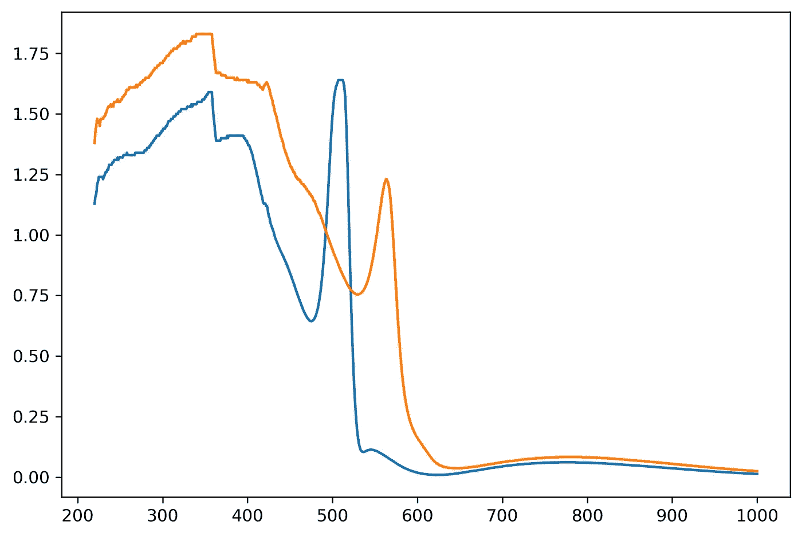

使用默认 matplotlib 设置绘制吸光度数据的初始图

数据绘制正确，但默认的`matplotlib`设置不能给出出版质量的数字。当我们改变下面的一些参数时，我们会得到一个更好看的图。

# **字体**

这是一个我花费了大量时间的场景——为我的情节选择合适的字体。您的系统已经预装了一长串字体，您可以通过以下方式检查哪些字体已经可供`matplotlib`使用:

```
import matplotlib.font_manager as fm# Collect all the font names available to matplotlib
font_names = [f.name for f in fm.fontManager.ttflist]
print(font_names)
```

如果你想安装一个新的字体到你的电脑，然后用它来绘图，这也是可能的。首先，你必须下载并安装你想要的字体——在这里你可以找到很多选项。安装后，您必须重新构建字体缓存，以便在您制作图形时可用于`matplotlib`。我们的做法如下:

```
import matplotlib.font_manager as fm# Rebuild the matplotlib font cache
fm._rebuild()
```

如果您现在检查可用字体列表，您应该会看到刚刚安装的新字体。

# **通用绘图参数**

我在绘图脚本开始时设置的三个常规参数是:(1)字体，(2)字体大小，和(3)轴线宽度。这些基本上是全局参数，我以后不会编辑它们，所以在开始时设置它们会使一切变得更容易(*即*不必为每个标签明确设置字体/大小)。在生成任何图形之前，我们必须添加以下代码，所以我通常在导入包之后立即将它放在脚本的顶部。

```
# Edit the font, font size, and axes widthmpl.rcParams['font.family'] = 'Avenir'
plt.rcParams['font.size'] = 18
plt.rcParams['axes.linewidth'] = 2
```

# 生成一组颜色

如果你有一套你喜欢用的颜色，你可以跳过这一步。在这种情况下，由于我们只有两个样本，最好手动选择两种高对比度的颜色。但是，如果你想生成一个颜色列表而不需要太多的努力，我们可以使用我们导入的`pylab`包从各种`matplotlib`内置颜色图中生成一个颜色列表，可以在[这里找到](https://matplotlib.org/3.1.1/gallery/color/colormap_reference.html)。当您需要大量颜色时，这变得非常有用，因为您可以通过编程生成它们。

对于我们的数据集，我们只对轻松区分我们的轨迹感兴趣，因此我们最好使用定性部分中的一个颜色图(在本例中，我将使用“tab10”)。我们使用以下代码—第一个参数是色彩映射表名称，第二个参数是我们想要生成的颜色数量:

```
# Generate 2 colors from the 'tab10' colormap
colors = cm.get_cmap('tab10', 2)
```

例如，如果我们要测量单个样品的温度依赖性，并想要绘制不同温度下的光谱，我们可以使用发散色图，如“coolwarm”。最终，您选择的色彩映射表将由您决定，并基于您正在绘制的数据类型。

# **创建图形和轴**

我们必须创建一个图形，它是一个空白窗口，然后为我们的绘图添加一个 axes 对象。为了生成该图，我们有以下内容:

```
# Create figure object and store it in a variable called 'fig'
fig = plt.figure(figsize=(3, 3))
```

`figsize` —我们的图形尺寸(宽度、高度)，以英寸为单位，默认为(6.4，4.8)

现在，我们必须通过指定左下角坐标和相对坐标中的宽度和高度(1 是图形窗口的全尺寸)来将 axes 对象添加到空白图形中。如果我们希望它填充整个图形，我们可以指定`[0, 0, 1, 1]`，它将左下角设置为(0，0)，宽度和高度设置为 1。

```
# Add axes object to our figure that takes up entire figure
ax = fig.add_axes([0, 0, 1, 1])
```

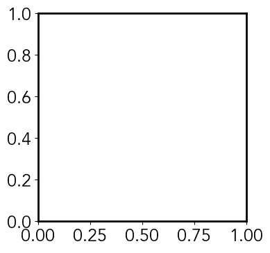

轴在(0，0)处的空白图形，宽度和高度为 1

我们可以使用这种轴结构，通过制作多个轴对象来创建嵌板图形和插图，如下所示:

```
# Add two axes objects to create a paneled figure
ax1 = fig.add_axes([0, 0, 1, 0.4])
ax2 = fig.add_axes([0, 0.6, 1, 0.4])
```

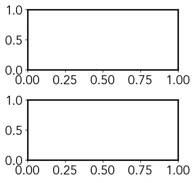

带有两个面板轴的空白图形，一个位于(0，0)，另一个位于(0，0.6)，宽度为 1，高度为 0.4

```
# Add two axes objects to create an inset figure
ax1 = fig.add_axes([0, 0, 1, 1])
ax2 = fig.add_axes([0.5, 0.5, 0.4, 0.4])
```

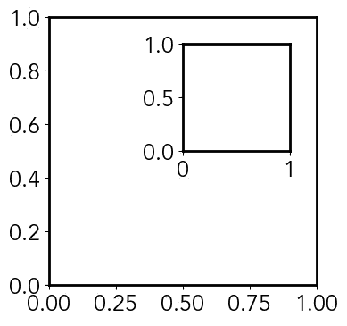

带插图的空白图形-第一个轴占据整个图形，第二个轴在(0.5，0.5)处，宽度和高度为 0.4

# **去除棘刺**

如果我们不希望我们的地块完全封闭，我们可以删除顶部和右侧的脊柱如下:

```
# Hide the top and right spines of the axis
ax.spines['right'].set_visible(False)
ax.spines['top'].set_visible(False)
```

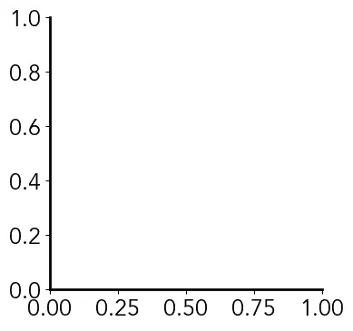

去掉顶部和右侧脊线的空白图形和轴

# **勾选参数**

我们可以用下面的代码编辑记号的宽度和长度，以匹配我们的轴参数。如果我们有次要分笔成交点，我们还可以编辑这些属性:

```
# Edit the major and minor ticks of the x and y axesax.xaxis.set_tick_params(which='major', size=10, width=2, direction='in', top='on')ax.xaxis.set_tick_params(which='minor', size=7, width=2, direction='in', top='on')ax.yaxis.set_tick_params(which='major', size=10, width=2, direction='in', right='on')ax.yaxis.set_tick_params(which='minor', size=7, width=2, direction='in', right='on')
```

`which` —我们是在编辑`major`、`minor`还是`both`分笔成交点

`size` —以点为单位的刻度长度

`width` —刻度的线宽(我们可以将其设置为与我们的轴线宽相同)

`direction` —分笔成交点是面向`in`、`out`还是`inout`(两者)

`top` / `right` —次轴(上/右)上是否有刻度

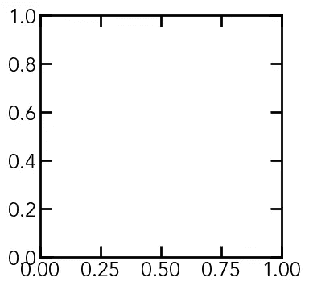

带有更新记号参数的空白图形和轴

# **绘制和调整范围/刻度**

我们现在可以再次绘制我们的数据，使用我们从色图生成的颜色来区分样本:

```
# Plot the two sample absorbances, using previously generated colorsax.plot(wavelength, samp_1_abs, linewidth=2, color=colors(0), label='Sample 1')ax.plot(wavelength, samp_2_abs, linewidth=2, color=colors(1), label='Sample 2')
```

`linewidth` —图中线的线宽

`color` —图中线条的颜色

`label` —跟踪标签(图例参考)

现在，我们可以使用以下代码行设置 x 和 y 轴范围:

```
# Set the axis limits
ax.set_xlim(370, 930)
ax.set_ylim(-0.2, 2.2)
```

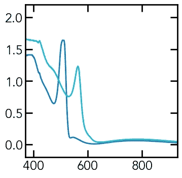

使用生成的颜色和手动设置的轴限值绘制样品吸光度图

我们注意到两个轴之间的刻度线似乎不平衡——我们也可以使用一个名为`MultipleLocator`的函数进行半自动编辑，该函数将在我们提供的基数的每个倍数处创建刻度线。我们必须编辑主要刻度的`major_locator`和次要刻度的`minor_locator`。我们将为 x 轴设置每 100 纳米的主刻度，每 50 纳米的次刻度，为 y 轴设置每 0.5 纳米的主刻度和每 0.25 纳米的次刻度。

```
# Edit the major and minor tick locationsax.xaxis.set_major_locator(mpl.ticker.MultipleLocator(100))
ax.xaxis.set_minor_locator(mpl.ticker.MultipleLocator(50))
ax.yaxis.set_major_locator(mpl.ticker.MultipleLocator(0.5))
ax.yaxis.set_minor_locator(mpl.ticker.MultipleLocator(0.25))
```

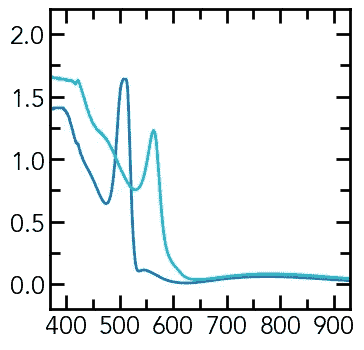

手动调整刻度间隔后的先前吸光度图

# **轴标签**

我们必须向 x 轴和 y 轴添加标签，这可以通过下面的代码轻松完成:

```
# Add the x and y-axis labelsax.set_xlabel('Wavelength (nm)', labelpad=10)
ax.set_ylabel('Absorbance (O.D.)', labelpad=10)
```

`labelpad` —刻度标签和轴标签之间的额外填充

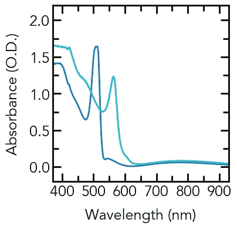

添加了轴标签的吸光度图

如果您想在标签中包含希腊字符，可以使用 LaTeX 语法来实现。我们通过在字符串前面加上`r`并在 LaTeX 命令后面加上`$$`来创建一个原始字符串。然而，这将为希腊字符使用默认的 LaTeX 字体——如果我们想使用相同的字体作为情节的其余部分(假设字符存在)，我们用`$\mathregular{'Command goes here'}$`括起我们的命令。

```
# Add the x-axis label with λ for wavelengthax.set_xlabel(r'$\mathregular{\lambda}$ (nm)', labelpad=10)
```

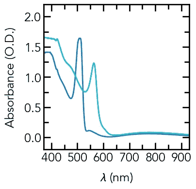

使用 LaTeX 排版波长λ，用 x 轴标记的吸光度图

# **副轴刻度**

如果我们想要在其中一个辅助(顶部/右侧)轴上放置刻度，以显示不同的数据集或缩放比例，我们可以使用寄生轴来实现。此轴对象复制原始绘图的一个轴，允许您更改另一个轴的缩放比例。为了说明这一点，我们可以使用我们的吸光度数据作为例子。当前的 x 轴是吸收光的波长，但是基于应用，该光的能量可能是更相关的参数。

我们可以在图的顶部创建第二个 x 轴来显示能量比例。首先，我们必须用`twinx()`或`twiny()`命令创建一个寄生轴，分别克隆 x 轴或 y 轴。在本例中，我们想要 y 轴数据常量，因此我们将克隆 y 轴。我们还需要将这个新 x 轴的刻度参数与旧图的 x 轴匹配(并从原始 x 轴参数中删除`top='on'`)。

```
# Create new axes object by cloning the y-axis of the first plot
ax2 = ax.twiny()# Edit the tick parameters of the new x-axis
ax2.xaxis.set_tick_params(which='major', size=10, width=2, direction='in')ax2.xaxis.set_tick_params(which='minor', size=7, width=2, direction='in')
```

为了使我们向该轴添加以能量单位表示的记号的工作更容易，我们可以编写一个函数来将能量转换为波长(因为我们将把记号放在波长轴上能量值对应的点上)。我们将输入 E 视为一个数组，这样我们就可以一次完成所有转换:

```
# Function to convert energy (eV) to wavelength (nm)
def E_to_WL(E):
    return [1240/i for i in E]
```

由于这是一个非线性转换，我们不能轻易使用`MultipleLocator`函数，我们将使用一个名为`FixedLocator`的函数手动添加刻度线。为了使用`FixedLocator`,我们提供了一个我们希望有刻度线的所有位置的数组:

```
# Add ticks manually to energy axisax2.xaxis.set_major_locator(mpl.ticker.FixedLocator(E_to_WL(np.linspace(1.5, 3.0, 4))))ax2.xaxis.set_minor_locator(mpl.ticker.FixedLocator(E_to_WL(np.linspace(1.4, 3.2, 19))))
```

因为我们手动添加了记号，所以我们也必须手动添加主要记号标签。

```
# Add tick labels manually to energy axisax2.set_xticklabels(['1.5', '2.0', '2.5', '3.0'])
```

最后，我们还想为新的 x 轴添加一个轴标签，并确保轴限制与原始的 x 轴相同:

```
# Add energy axis label
ax2.set_xlabel('Energy (eV)', labelpad=10)# Set energy axis limits
ax2.set_xlim(370, 930)
```

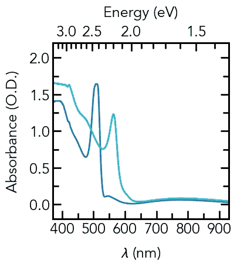

具有二次非线性能量 x 轴的吸光度图

# **添加图例**

我们必须在我们的图中添加的最后一件事是一个图例，以便读者可以知道哪个轨迹对应于哪个样本。为此，我们可以使用以下代码:

```
# Add legend to plot
ax.legend(bbox_to_anchor=(1, 1), loc=1, frameon=False, fontsize=16)
```

`bbox_to_anchor` —图例边界框的坐标

`loc` —使用`bbox_to_anchor`值的坐标的边界框的哪一部分(`0`为自动，`1`为右上角，`2`为左上角，`3`为左下角，`4`为右下角，`5`为右侧，`6`为中间偏左，`7`为中间偏右，`8`为中间偏下，`9`为中间偏上，`10`为中间偏上)

`frameon` —是否在图例周围画一个框

`fontsize` —图例条目的字体大小(如果不同于通用参数)

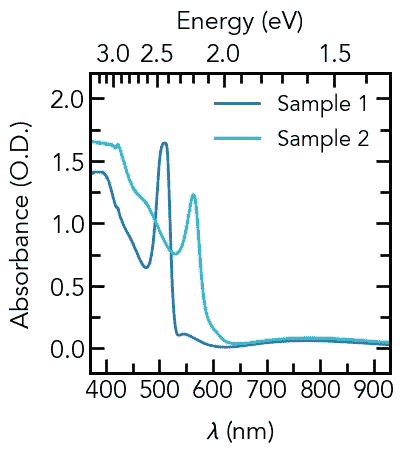

最终吸光度图，带有波长和能量 x 轴，以及图例

# **保存你的剧情**

最后，保存你的最终图非常简单——我们可以使用函数`plt.savefig`来完成。

```
# Save figure
plt.savefig('Final_Plot.png', dpi=300, transparent=False, bbox_inches='tight')
```

`dpi` —光栅图像文件格式的分辨率(在这种情况下，我们保存为`.png`文件，这意味着我们以每英寸 300 点的分辨率保存。您可以保存的其他可能的文件格式有`.ps`、`.pdf`和`.svg`，它们都是矢量图形格式，在这种情况下，您不需要指定一个`dpi`值)

`transparent` —是使图形透明，还是带有白色背景

`bbox_inches`-定义图形周围的边界框(`tight`确保图形周围没有多余的空白)

要在图形窗口中实际查看我们的最终绘图，我们必须在保存图形后添加一个`plt.show()`命令。

```
# Show figure
plt.show()
```

# **结论**

就是这样！我们已经成功地使用 Python 制作了出版物质量图！这个例子和所有后续的例子都可以在这个 [Github 库](https://github.com/venkatesannaveen/python-science-tutorial)上免费获得。

感谢您的阅读，我将继续用新的例子和教程来更新这个系列！你可以在 Twitter 上关注我，或者在 T2 的 LinkedIn 上联系我，获取更多文章和更新。