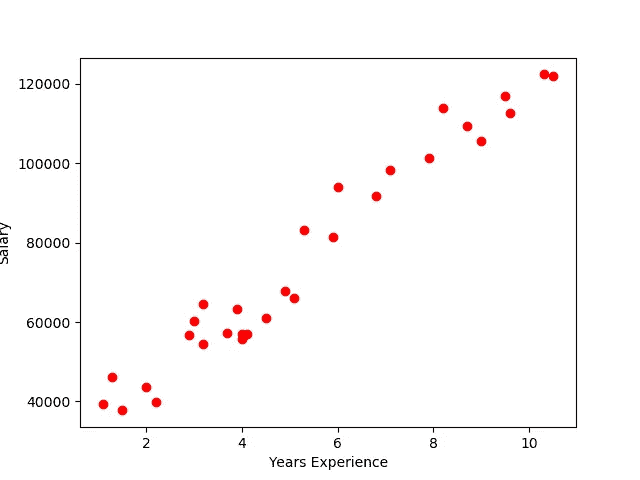
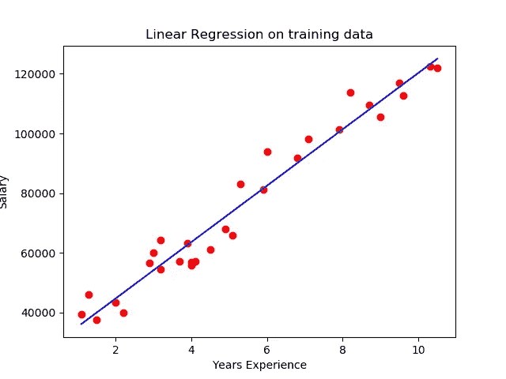
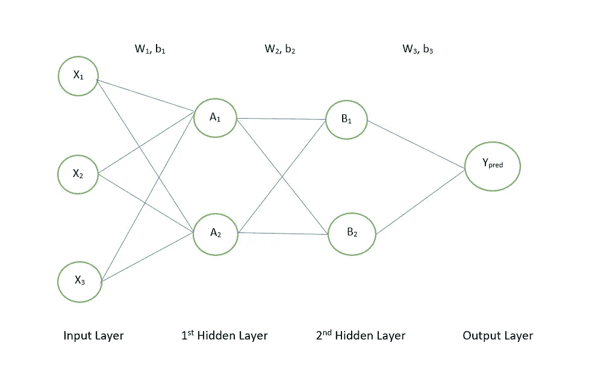
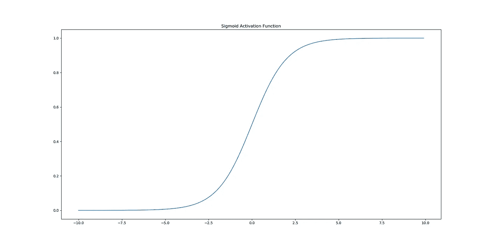
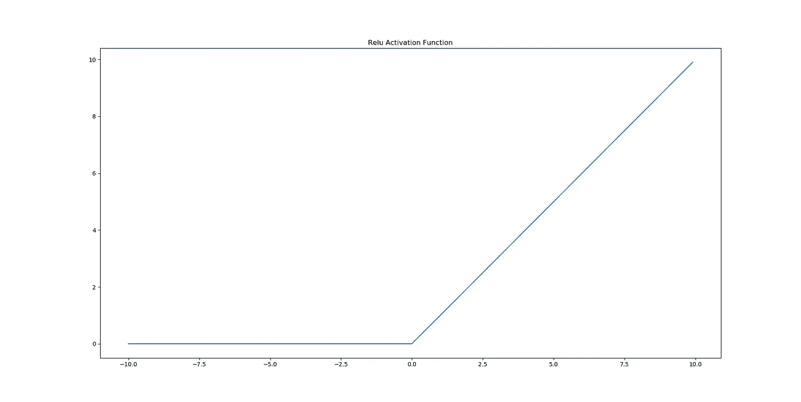
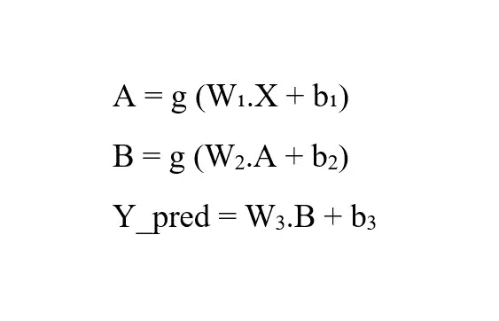
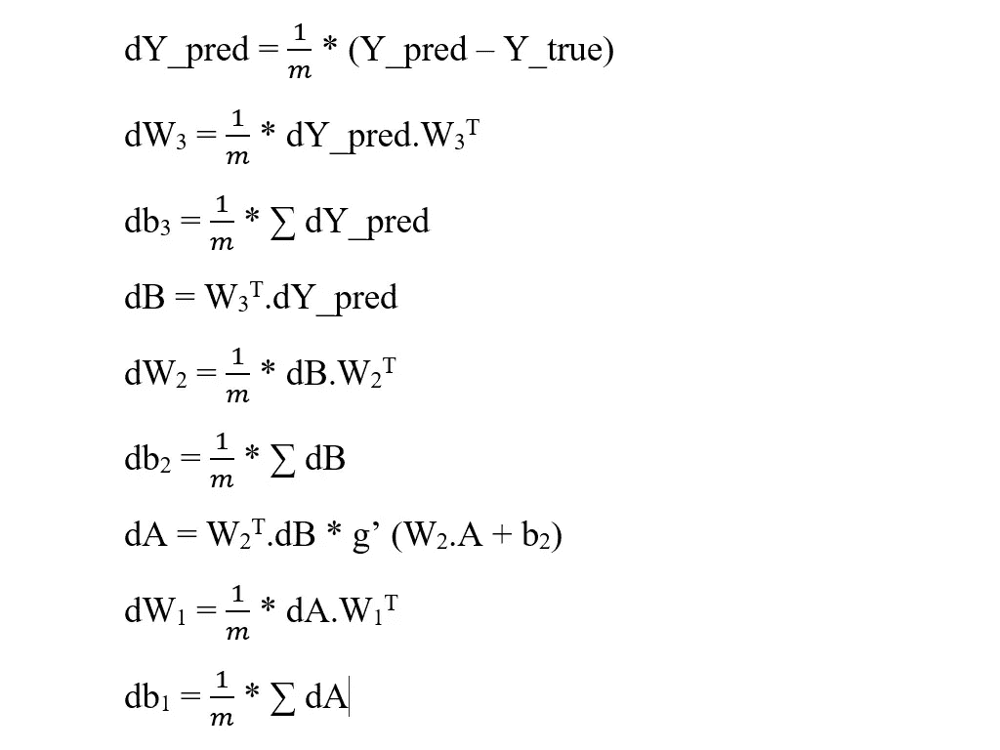

# 神经网络入门，用 Python 从头开始实现

> 原文：<https://towardsdatascience.com/an-introduction-to-neural-networks-with-implementation-from-scratch-using-python-da4b6a45c05b?source=collection_archive---------1----------------------->

## 神经网络初学者指南，以及如何在没有任何框架的情况下使用 Python 从头开始实现一个神经网络

[来源](https://pixabay.com/illustrations/artificial-neural-network-ann-3501528/)

深度学习是人工智能在过去二十年中蓬勃发展的领域之一。它是机器学习的一个子集，以一种受人脑工作启发的方式处理复杂模式的学习。

深度学习在最近一段时间激增的原因是它能够扩展到大型数据集。众所周知，机器学习模型的性能会在一定数量的数据和额外的数据没有区别后饱和，但我们不希望这样。随着大数据的出现，如今产生了大量可用的数据集，我们希望我们的算法能够在越来越多的数据下保持更好的性能。这就是深度学习发挥作用的地方。

通常，深度学习与术语“人工神经网络”或简单的神经网络互换使用。这是因为深度学习本质上是由从这个模型的许多变体中派生出来的模型组成的。但你想到的第一个问题可能是这样的:“为什么我们需要深度学习模型，它们与机器学习模型有什么不同？”先来回答这个问题。

# 为什么是神经网络？

我假设你们都熟悉回归，或者至少知道它是什么。如果你不知道它是什么，让我简单总结一下。基本上，回归意味着“将一组输入数据映射到一个连续的输出形式”。让我们看看机器学习中最流行的回归形式:线性回归。

工资和工作经验的数据集

看看上面的数据集，它基本上有一个输入特征:员工的工作年限和一个输出特征:薪水。现在假设你得到了一个新员工的多年经验数据，并被告知去预测他的工资会是多少。你的大脑会怎么做？你会试图在这些数据中找到一个合理的模式，并据此进行预测。对于本例，近似值可能采用直线形式，如下所示:

最佳拟合线

似乎是一个很好的近似，对不对？这就是线性回归，找到最符合数据的直线。但是这是不是看起来不现实？现实世界中的数据很少具有如此简单的模式，以至于您可以用一条直线来拟合它，您可能需要二次、三次、双二次函数来更好地逼近数据(称为多项式回归)。但是，如何最好地确定应该为该任务使用什么样的次数多项式呢？为什么只有多项式，难道不应该也考虑其他函数吗？此外，真实世界的数据集远不止 2 个变量，它们可能有数百个变量，在这种情况下，可视化和获得关于数据的直觉几乎是不可能的。最终的问题是这样的:“我们能有一个模型，自动归纳并选择最适合我们的数据，就像人脑一样，不受可用函数类型的限制吗？”答案是神经网络。

# 什么是神经网络？

简化的神经网络

让我们以一个简化的回归问题为例，其中我们必须基于 3 个输入特征来预测房价 y:平方 feet(X₁的大小、bedrooms(X₂的数量以及与城市 hub(X₃).的距离让我们使用如上所示的简单神经网络，而不是应用回归模型。神经网络的特征如下

1.  有一个神经元层的集合(每个神经元保存一个称为该神经元激活的值)。总共有 3 层，因为输入层没有计算在内。
2.  有一个由 3 个神经元组成的输入层，每个神经元保存输入变量，还有一个输出层保存预测的房价。
3.  中间有两层，每层两个神经元。这些被称为隐藏层，因为它们仅用于计算目的，我们不关心它们在运行时的值。
4.  第一隐藏层中的第一神经元的激活(或值)是 A₁，第二神经元是 A₂，第二隐藏层的第一神经元是 B₁，第二隐藏层的第二神经元是 B₂.
5.  每个神经元通过称为权重(W)和偏差(b)的数字连接到前一层的所有神经元。权重以形状矩阵的形式组织(当前层中的单元数，前一层中的单元数)。这基本上意味着 Wᵢⱼ指的是从当前层的第 I 个神经元到前一层的第 j 个神经元的连接的权重。偏置以(当前层中的单元数，1)的形状组织，因此 Bᵢ对应于当前层中第 I 个神经元的偏置。因此，W₁的形状为(2，3)，,b₁的形状为(2，1)，W₂的形状为(2，2)，以此类推。
6.  A₁的计算如下

> f(x₁,x₂,x₃)=w₁₁*x₁+w₁₂*x₂+w₁₃*x₃+b₁₁

然后通过激活函数 g(x)。因此，

> a₁=g(f(x₁,x₂,x₃))=g(w₁₁*x₁+w₁₂*x₂+w₁₃*x₃+b₁₁)

这里 f 是线性函数，g 是非线性函数，因此请注意，神经元正在逼近或计算的函数是非线性函数。激活函数的用途是，首先，它将非线性引入模型，其次，它将结果转换成更易解释的形式。让我们看几个激活函数。

Sigmoid 激活函数

这是 sigmoid 激活函数，给出为 g(x) = 1/(1 + e^-x)。它是一个单调函数，当 x 变得非常负时接近 0，当 x 非常正时接近 1，当 x=0 时接近 0.5。它将输入压缩到范围(0，1)内，由于这种简单的可解释性，它在很多年前被广泛使用。但是，由于饱和区域较大(梯度较小),训练速度较慢，因此被 relu 函数(即校正线性单元)取代。

ReLU 激活功能

ReLU 定义为 g(x) = max(0，x)。x 为负时为 0，为正时等于 x。由于其较低的饱和区域，它是高度可训练的，并且比 sigmoid 更快地降低成本函数。

总的来说，我们的神经网络采用一个输入层，并通过计算计算所有隐藏层中神经元的值，并产生与输出神经元的值相对应的最终输出，这就是房价的预测。直观上，我们可以说 A₁和 A₂是输入的一些非线性函数，B₁和 B₂是 A₁和 A₂本身的非线性函数，输出层将它们组合在一起进行预测。有趣的是，层次越深，它们计算的函数就越复杂。您可以将 A₁和 A₂视为计算要素，例如居住空间和污染水平，而 B₁和 B₂可能代表生活水平和房屋的位置质量。最终的价格预测将 B₁和 B₂考虑在内。这是一个简化的神经网络，真实模型的每一层都有数百个这样的单元，从 3 层到 100 层不等。

让我们从建立第一个神经网络开始。我们将使用流行的波士顿房价数据集。它由 13 个输入变量和 1 个目标(或输出)变量组成。我们使用 ReLU 激活。第一项工作是定义 relu 函数并初始化我们网络的参数。

# 神经网络中的学习

我们将使用回归的标准均方损失函数-

J(W，B) = 1/(2*m) * ∑ (Y_pred - Y_true)并使用梯度下降将其最小化。但是我们如何计算梯度呢？我们做了以下事情-

1.  从输入层开始。用 b₁w₁来计算 a₂.a₁使用等式- A = W₁.X + b₁.在这里，W₁的形状是(2，3)，而 x 的形状是(3，1)，所以它们将相乘产生一个形状为(2，1)的矩阵，并与相同形状的 b₁相加。这是第一个隐藏层的激活。对所有图层重复相同的过程，直到得到 Y_pred。请注意，这里您没有将激活应用到输出层，因为我们不会使用它来计算任何其他神经元值。此外，您必须对训练集中的所有 m 个示例执行此过程。哦，顺便说一下，这个过程被称为**前向传播**，因为你是从先前的神经元计算神经元的激活，直到你得到输出。矢量化的方程如下-

正向传播方程

在所有情况下，我们都假设训练样本按列堆叠，行表示神经元的激活。

2.使用训练集中的 Y_pred 值和 Y_true 值计算上述 MSE 损失。

3.现在，让我们找到成本相对于每个权重和偏差的梯度，以便我们可以相应地调整它们，从而改变 Y_pred 并最小化成本。这是使用**反向传播**算法完成的，因为我们没有明确的给定函数来区分我们自己。从名字就可以看出，它是前进道具的反义词。这里，我们使用下一层的权重和偏差的梯度来找出上一层的权重和偏差的梯度。这部分有点数学化，如果你对微积分没有理解，可以跳到下一步。

我们的神经网络

这里是我们之前的神经网络，让我们从输出层开始。在这里，我将只考虑从单个训练示例计算的梯度，以避免事情进一步复杂化。那里有 Y_pred。我们的成本取决于 Y_pred 吗？是的，它是。怎么会？梯度 w.r.t Y_pred 会告诉我们。*∂j/∂y_pred = 1/m *(y _ pred—y _ true)*。现在我们要找出 j 是如何依赖 W₃和 B₃.的我们知道 *∂J/∂Y_pred* ，那么我们可以用它来找到 *∂J/∂W₃* 和 *∂J/∂b₃* 吗？是的，我们可以！还记得链式法则吗？

*∂j/∂w*₃*= ∂j/∂y_pred * ∂y_pred/∂w*₃

我们知道第一项。让我们找到第二个。W₃有两个组成部分/值= w₁₁和 w₁₂.假设我们想求出 w₁₁.的梯度 Y_pred 是怎么依赖的？还记得函数-f(x₁,x₂,x₃)=w₁₁*x₁+w₁₂*x₂+w₁₃*x₃+b₁₁换 A₁吗？同样，对于最后一层，Y_pred = w₁₁*B₁ + w₁₂*B₂ + b₁₁.对这个 w . r . t .w₁₁求微分得到 B₁，然后我们把它乘以 *∂J/∂Y_pred* ，这就是梯度 wrt Y_pred。同样，对于 w₁₂，我们乘以 B₂(区分并查看)。通常，特定 wᵢⱼ的梯度是当前层(它所连接的层)中第 I 个神经元的梯度和前一层(它所连接的层)的第 j 个神经元的激活的乘积。这不是很美吗？对于偏差 b₁₁， *∂Y_pred/∂b₁₁* 为 1，因此其梯度等于 Y_pred 的梯度。现在我们将利用这些梯度来计算前一层激活的梯度，根据-

*∂j/∂b = ∂j/∂y_pred * ∂y_pred/∂b*

我们来计算第二项。b 有两个组成部分 B₁和 B₂.让我们找出 B₁.的梯度再看最后一层的函数——y _ pred =w₁₁*b₁+w₁₂*b₂+b₁₁.区分 B₁和 w₁₁.因此，*∂j/∂b*₁*=*w₁₁* y _ pred 的梯度和*∂j/∂b*₂=w₁₂* y _ pred 的梯度。现在，我们准备计算∂j/∂w₂和∂j/∂b ₂.就像上次一样，从 *W* ₂中抓取每个权重，并将其设置为(它所连接的神经元的激活)*(它所连接的神经元的梯度)。对于 *b* ₂中的每个偏置，将其设置为等于其被添加到的相应神经元的梯度。让我们计算一下 *∂J/∂A -*

*∂J/∂A = ∂J/∂B * ∂B/∂A*

这和我们之前做的有点不同，上次当我们计算 *∂Y_pred/∂B，* Y_pred 只有一个神经元，但这里 b 本身有两个神经元。那么 *∂J/∂B* 在这里是什么意思呢？嗯，这是一个矩阵本身有两个组成部分- *∂J/∂B* ₁和 *∂J/∂B* ₂.我们将使用它们来确定梯度 w . r . t . a(a₁和 A₂ -这将是∂J/∂A 的两个组成部分)。现在正确地看神经元 A₁，改变它会导致 B₁和 B₂都改变，所以为了计算 A₁的总梯度，我们可以把这些变化加在一起。所以我们写-*∂j/∂a*₁*=(∂j/∂b*₁**∂b*₁*/∂a*₁)+(*∂j/∂b*‎*∂b*‎/*∂a*‎)。形式上，这样做是因为微分运算是线性的(换句话说，变化是相加的)。我们知道∂j/∂b₁和∂j/∂b ₂.*∂b*₁*/∂a*₁=w₁₁*g'(w₁₁*a₁+w₁₂*a₂+b₁₁)和*∂b*‖*/∂a*‖=w‖* g '(w‖* a‖+ w‖* a‖+ b)这个术语是从哪里来的？你猜对了，B 是由 A 上的一个线性函数 f 后接一个激活函数 g 导出的，所以我们先区分 g 后接 f(又是链式法则)。最后，我们计算∂j/∂w*₁*和∂j/∂b*₁*，我们就完成了。我们不需要关于输入层神经元的梯度，因为我们不会改变它们，它们是来自我们训练集的特征。如果你都做到了，那么恭喜你。你已经成功地掌握了这个题目最难的部分。这是矢量化的方程-

反向传播方程

关于我所用的符号，有些词指的是逐元素乘法，而。指矩阵乘法。此外，求和符号对各列求和。我将把它作为一项任务留给您，让您来弄清楚它与我上面讨论的计算有什么关系。

4.现在，我们已经费力地计算了成本相对于参数的梯度，我们将执行梯度下降并更新参数，从而降低成本，并再次执行正向传播并保持迭代，直到达到收敛。如果想详细了解梯度下降和优化，可以参考我的博客:[https://towardsdatascience . com/understanding-gradient-descent-and-Adam-optimization-472 AE 8 a 78 c 10](/understanding-gradient-descent-and-adam-optimization-472ae8a78c10)

# 将这一切结合在一起

让我们再构建 3 个函数:model()训练整个神经网络，compute_accuracy()使用均方根误差度量计算精确度，predict()对数据样本进行预测。

现在剩下的就是将数据加载到训练集和测试集中，设置隐藏层的大小(输入层和输出层的大小固定为 13 和 1，我们无法更改)，设置学习率和迭代次数，最后训练模型并找到精确度。顺便说一下，隐藏层的大小、学习速率、迭代次数——这些也统称为超参数，因为它们控制模型的学习，但不被模型学习。相反，我们必须分别调整它们以获得最佳性能。激活函数的类型，隐藏层的数量也是模型的超参数，还有很多，但超出了这个博客的范围。完整的代码如下-

我们在训练和测试数据上的 RMSE 分数分别为 8 和 8.5 左右，考虑到我们设计的神经网络模型是如此简单，这已经算不错了。尝试自己看看是否可以通过调整超参数获得更好的结果。您可以尝试通过改变优化器、使用批量梯度下降、引入正则化或使用 Tensorflow 和 Keras 等框架来创建更好的模型，但我的朋友们，这是另一个故事了！