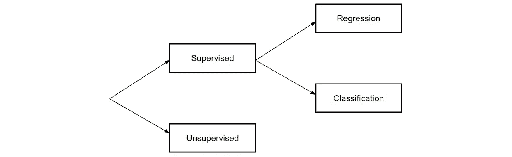
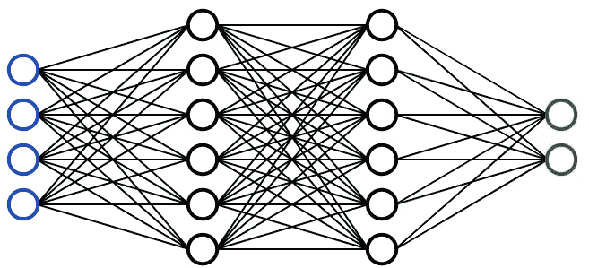
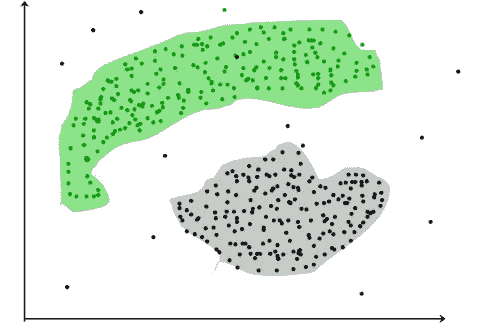

# 九种基本机器学习算法简介

> 原文：<https://towardsdatascience.com/an-introduction-to-nine-essential-machine-learning-algorithms-ee0efbb61e0?source=collection_archive---------28----------------------->

## 最流行的机器学习模型的直观解释。

***如果这是你喜欢的那种东西，成为第一批订阅*** [***我的新 YouTube 频道在这里***](https://www.youtube.com/channel/UCmy1ox7bo7zsLlDo8pOEEhA?view_as=subscriber) ***！虽然还没有任何视频，但我会以视频的形式分享很多像这样的精彩内容。感谢大家的支持:)***

[在我之前的文章](https://medium.com/swlh/predicting-life-expectancy-w-regression-b794ca457cd4)中，我解释了什么是**回归**，并展示了如何在应用程序中使用它。本周，我将回顾实践中使用的大多数常见机器学习模型，以便我可以花更多的时间来建立和改进模型，而不是解释其背后的理论。让我们深入研究一下。

机器学习模型的基本分段

所有的机器学习模型被分类为**监督的**或**非监督的**。如果模型是监督模型，那么它被细分为**回归**或**分类**模型。我们将讨论这些术语的含义以及下面每个类别中对应的模型。

# 监督学习

**监督学习**涉及学习基于示例输入-输出对将输入映射到输出的函数[1]。

例如，如果我有一个包含两个变量的数据集，年龄(输入)和身高(输出)，我可以实现一个监督学习模型，根据年龄预测一个人的身高。

监督学习的例子

重复一下，在监督学习中，有两个子类别:回归和分类。

# 回归

在**回归**模型中，输出是连续的。下面是一些最常见的回归模型。

## 线性回归

线性回归的例子

线性回归的概念就是找到一条最符合数据的直线。线性回归的扩展包括多元线性回归(例如，找到最佳拟合的平面)和多项式回归(例如，找到最佳拟合的曲线)。你可以在我的[上一篇文章](https://medium.com/swlh/predicting-life-expectancy-w-regression-b794ca457cd4)中了解更多关于线性回归的知识。

## 决策图表

图片来自 Kaggle

**决策树**是一种流行的模型，用于运筹学、战略规划和机器学习。上面的每个方块被称为一个**节点**，节点越多，你的决策树就越精确(一般来说)。决策树中做出决策的最后节点被称为树的**叶**。决策树直观且易于构建，但在准确性方面有所欠缺。

## 随机森林

**随机森林**是一种基于决策树的[集成学习](https://en.wikipedia.org/wiki/Ensemble_learning)技术。随机森林包括使用原始数据的[自举数据集](https://machinelearningmastery.com/a-gentle-introduction-to-the-bootstrap-method/)创建多个决策树，并在决策树的每一步随机选择变量的子集。然后，该模型选择每个决策树的所有预测的模式。这有什么意义？依靠“多数获胜”模型，它降低了单个树出错的风险。

例如，如果我们创建一个决策树，第三个，它会预测 0。但是如果我们依赖所有 4 个决策树的模式，预测值将是 1。这就是随机森林的力量。

StatQuest 做了一项了不起的工作，更详细地说明了这一点。见[此处](https://www.youtube.com/watch?v=J4Wdy0Wc_xQ&vl=en)。

## 神经网络

神经网络的可视化表示

一个**神经网络**是一个受人脑启发的多层模型。就像我们大脑中的神经元一样，上面的圆圈代表一个节点。蓝色圆圈代表**输入层，**黑色圆圈代表**隐藏层，**绿色圆圈代表**输出层。**隐藏层中的每个节点代表一个功能，输入经过该功能，最终导致绿色圆圈中的输出。

神经网络实际上是非常复杂和非常数学化的，所以我不会进入它的细节，但…

饶彤彤的文章对神经网络背后的过程给出了直观的解释(见[此处](/understanding-neural-networks-19020b758230))。

如果你想更进一步，理解神经网络背后的数学，请点击这里查看这本免费的在线书籍。

如果你是一名视觉/音频学习者，3Blue1Brown 在 YouTube 上有一个关于神经网络和深度学习的惊人系列[这里](https://www.youtube.com/watch?v=aircAruvnKk)。

# 分类

在分类模型中，输出是离散的。下面是一些最常见的分类模型。

## 逻辑回归

逻辑回归类似于线性回归，但用于模拟有限数量结果的概率，通常为两个。在对结果的概率建模时，使用逻辑回归而不是线性回归的原因有很多(见[这里](https://stackoverflow.com/questions/12146914/what-is-the-difference-between-linear-regression-and-logistic-regression))。实质上，逻辑方程是以这样一种方式创建的，即输出值只能在 0 和 1 之间(见下文)。

## 支持向量机

一个**支持向量机**是一种监督分类技术，实际上可以变得非常复杂，但在最基本的层面上非常直观。

让我们假设有两类数据。支持向量机将找到一个**超平面**或两类数据之间的边界，以最大化两类数据之间的差距(见下文)。有许多平面可以分隔这两个类别，但只有一个平面可以最大化类别之间的边距或距离。

如果你想了解更多细节，Savan 在这里写了一篇关于支持向量机的文章。

## 朴素贝叶斯

朴素贝叶斯是数据科学中使用的另一种流行的分类器。背后的想法是由贝叶斯定理驱动的:

虽然有许多关于朴素贝叶斯的不切实际的假设(这就是为什么它被称为‘朴素’)，但它已经被证明在大多数情况下都是有效的，而且构建起来也相对较快。

如果你想了解更多，请点击这里。

## 决策树，随机森林，神经网络

这些模型遵循与前面解释的相同的逻辑。唯一区别是输出是离散的而不是连续的。

# 无监督学习

与监督学习不同，**非监督学习**用于从输入数据中进行推断和发现模式，而不参考标记的结果。无监督学习中使用的两种主要方法包括聚类和降维。

# 使聚集

摘自 GeeksforGeeks

聚类是一种无监督的技术，涉及数据点的分组或**聚类**。它经常用于客户细分、欺诈检测和文档分类。

常见的聚类技术有 **k-means** 聚类、**分层**聚类、**均值漂移**聚类、**基于密度的**聚类。虽然每种技术在寻找聚类时有不同的方法，但它们的目标都是一样的。

# 降维

降维是通过获得一组主变量来减少所考虑的随机变量的数量的过程[2]。简单来说，就是减少特性集的维数的过程(更简单来说，就是减少特性的数量)。大多数降维技术可以分为**特征消除**或**特征提取。**

一种流行的降维方法叫做**主成分分析。**

## 主成分分析

从最简单的意义上来说， **PCA** 涉及到将高维数据(如 3 维)投影到更小的空间(如 2 维)。这导致数据的维度降低(2 维而不是 3 维)，同时保持模型中的所有原始变量。

这涉及到相当多的数学问题。如果你想了解更多…

点击查看这篇关于 PCA [的精彩文章。](/a-one-stop-shop-for-principal-component-analysis-5582fb7e0a9c)

如果你更想看视频，StatQuest 在 5 分钟内解释 PCA[这里](https://www.youtube.com/watch?v=HMOI_lkzW08&vl=en)。

# 结论

显然，如果你深入到任何特定的模型，都会有大量的复杂性，但这应该会让你对每个机器学习算法是如何工作的有一个基本的了解！

*查看此* [***链接***](/basic-statistics-you-need-to-know-for-data-science-1fdd290f59b5) *如果你想学习* ***所有数据科学的基础统计学。***

*看看这个**[***链接***](/an-extensive-guide-to-exploratory-data-analysis-ddd99a03199e) *如果你想学习一个* ***的循序渐进的过程来进行探索性的数据分析(EDA)。****

# *参考*

*[1] Stuart J. Russell，Peter Norvig，人工智能:一种现代方法(2010 年)，普伦蒂斯霍尔*

*[2] Roweis，S. T .，Saul，L. K .，通过局部线性嵌入进行非线性降维(2000)，*科学**

# *感谢阅读！*

*如果你喜欢我的工作，想支持我…*

# *感谢阅读！*

*如果你喜欢我的工作，想支持我…*

1.  *支持我的最好方式就是在**媒体**T2 上关注我。*
2.  *在**推特** [这里](https://twitter.com/terence_shin)成为第一批关注我的人之一。我会在这里发布很多更新和有趣的东西！*
3.  *此外，成为第一批订阅我的新 **YouTube 频道** [这里](https://www.youtube.com/channel/UCmy1ox7bo7zsLlDo8pOEEhA?view_as=subscriber)！*
4.  *在 **LinkedIn** [这里](https://www.linkedin.com/in/terenceshin/)关注我。*
5.  *在我的**邮箱列表** [这里](https://forms.gle/UGdTom9G6aFGHzPD9)报名。*
6.  *查看我的网站，[**terenceshin.com**](https://terenceshin.com/)。*