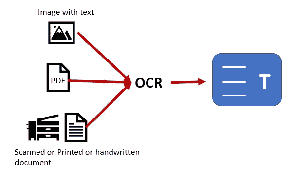
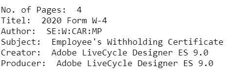
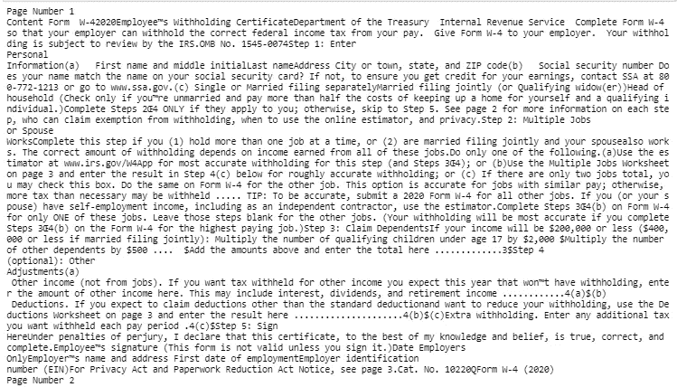
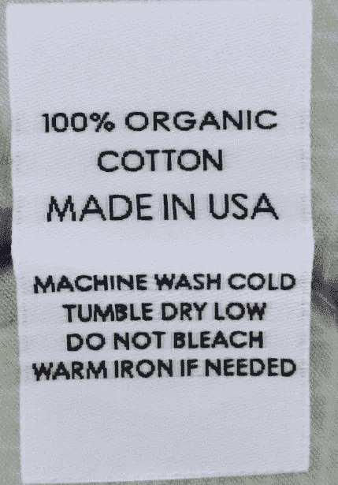
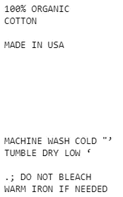

# 初学者光学字符识别入门

> 原文：<https://towardsdatascience.com/an-introduction-to-optical-character-recognition-for-beginners-14268c99d60?source=collection_archive---------18----------------------->

## 从非结构化数据中读取文本的第一步

***在这篇文章中，你将学习***

*   ***什么是光学字符识别(OCR)？***
*   ***OCR 的用法***
*   ***从 PDF 文件中读取文本和图像的简单代码***

你已经扫描了几份文件，比如候选人所学课程的证书。课程证书可以是 PDF 或 JPEG 或 PNG 文件。如何提取重要信息，如考生姓名、完成的课程名称以及课程开始的日期？

## 光学字符识别(OCR)

**OCR 是一种将手写、打字、扫描文本或图像中的文本转换为机器可读文本的技术。**



您可以对任何包含文本的图像文件、PDF 文档或任何可清晰提取文本的扫描文档、打印文档或手写文档使用 OCR。

## OCR 的使用

OCR 的一些常见用法有

*   通过跨不同业务部门数字化 PDF 文档来创建自动化工作流程
*   通过数字化打印文档，如阅读护照、发票、银行对账单等，消除手动数据输入。
*   通过数字化身份证、信用卡等创建对敏感信息的安全访问。
*   数字化印刷书籍，如古腾堡项目

## 阅读 PDF 文件

在这里，您将阅读 PDF 文件的内容。您需要安装 pypdf2 库，它是基于 python 构建的，用于处理不同的 pdf 功能，如

*   提取文档信息，如标题、作者等
*   逐页拆分文档
*   加密和解密 PDF 文件

```
**!pip install pypdf2**
```

你可以下载一份 PDF 格式的[W4 表格样本](https://www.irs.gov/pub/irs-pdf/fw4.pdf)

**导入库**

```
**import PyPDF2**
```

**提取页数和 PDF 文件信息**

使用模式' **rb'** '以二进制模式打开要读取的 PDF 文件。将 pdfFileObj 传递给***PdfFileReader()***来读取文件流。 ***numPages*** 将获得 PDF 文件的总页数。使用***getDocumentInfo()***在字典中提取 PDF 文件的作者、创建者、制作者、主题、标题等信息

```
**filename=r'\PDFfiles\W4.pdf'
pdfFileObj = open(filename,'rb')
pdfReader = PyPDF2.PdfFileReader(pdfFileObj)
num_pages = pdfReader.numPages
info=pdfReader.getDocumentInfo()****print("No. of Pages: ", num_pages)
print("Titel: ", info.title)
print("Author: ",info.author)
print("Subject: ",info.subject)
print("Creator: ",info.creator)
print("Producer: ",info.producer)**
```



**从 PDF 文件的所有页面中检索文本**

遍历 PDF 文件中的所有页面，然后使用***【get page()，*** 从 PDF 文件中按编号检索页面。您现在可以使用 ***extractText()从 PDF 文件中提取文本。*** 最后，使用***【close()】***关闭文件

```
**count = 0
text = “”
#The while loop will read each page.
while count < num_pages:
 pageObj = pdfReader.getPage(count)
 count +=1
 text += pageObj.extractText()
 print(“Page Number”,count)
 print(“Content”,text)
pdfFileObj.close()**
```



**提醒一句:**使用 ***extractText*** ()提取的文本并不总是按正确的顺序排列，间距也可能略有不同。

## 从图像中读取文本

您将使用 **pytesseract** ，它是用于光学字符识别(OCR)的 Google tesseract 的 python 包装器，用来读取图像中嵌入的文本。

您需要了解一些可以使用 pytesseract 应用的配置选项

*   页面分段模式(psm)
*   OCR 引擎模式(oem)
*   语言(左)

**页面分割方法**

psm 定义了 tesseract 如何将图像分割或分段为文本行或单词行

**页面分割模式(psm)选项:**

0:仅方向和脚本检测(OSD)。
1:带 OSD 的自动页面分割。
2:自动页面分割，但是没有 OSD，或者 OCR。
3:全自动页面分割，但没有 OSD。 ***(默认)***
4:假设一列可变大小的文本。
5:假设一个垂直对齐的文本的单一统一块。假设一个单一的统一文本块。7:将图像视为一个单独的文本行。
8:把图像当成一个单词。
9:把图像当成一个圆圈里的一个单词。
10:将图像视为单个字符。
11:稀疏文字。不按特定顺序查找尽可能多的文本。
12:带有 OSD 的稀疏文本。
13:生线。将图像视为单个文本行，绕过特定于 Tesseract 的 hacks。

**OCR 引擎模式(oem)**

宇宙魔方有不同的引擎模式来提高速度和性能

0:仅传统引擎。
1:神经网络仅适用于 LSTM 发动机。2:莱格赛+ LSTM 发动机。
3: ***默认*** ，根据什么可用。

**语言(l)**

Pytessercat 支持多种语言，您可以在安装 pytesseract 时指定想要使用的语言，它将下载语言包。默认情况下，英语是默认语言



用于阅读文本的图像

**导入所需的库**

```
**import pytesseract
import cv2**
```

使用 openCV 读取图像文件。为 pytesseract 应用配置选项以从图像中读取文本。您可以尝试 psm 和 oem 的不同选项，并检查输出中的差异

```
**image_Filename=r'\Apparel_tag.jpg'***# Read the file  using opencv and show the image*
**img=cv2.imread(image_Filename)
cv2.imshow("Apparel Tag", img)
cv2.waitKey(0)**#set the configuration for redaing text from image using pytesseract
**custom_config = r'--oem 1 --psm 8 -l eng'**
**text=pytesseract.image_to_string(img, config=custom_config)
print(text)**
```



从图像中提取文本

## 使用 pytesseract 进行 OCR 的最佳实践

*   尝试 pytesseract 的不同配置组合，以获得适合您的用例的最佳结果
*   文本不应倾斜，在文本周围留一些空白以获得更好的效果，并确保图像有更好的照明以消除深色边框
*   最低 300- 600 DPI 效果很好
*   字体大小为 12 磅。或更多给出更好的结果
*   应用不同的预处理技术，如二值化、图像去噪、旋转图像以消除扭曲、增加图像的锐度等。

## 结论:

OCR 结果取决于输入数据的质量。文本的清晰分割和背景中的无噪声给出了更好的结果。在现实世界中，这并不总是可能的，因此我们需要为 OCR 应用多种预处理技术以给出更好的结果。

## 参考资料:

[](https://pypi.org/project/pytesseract/) [## 宇宙魔方

### Python-tesseract 是 Python 的光学字符识别(OCR)工具。也就是说，它会识别并“读取”…

pypi.org](https://pypi.org/project/pytesseract/) 

[https://pypi.org/project/PyPDF2/](https://pypi.org/project/PyPDF2/)

[https://stack overflow . com/questions/9480013/image-processing-to-improve-tessera CT-ocr-accuracy](https://stackoverflow.com/questions/9480013/image-processing-to-improve-tesseract-ocr-accuracy)