# 熊猫简介

> 原文：<https://towardsdatascience.com/an-introduction-to-pandas-29d15a7da6d?source=collection_archive---------42----------------------->


照片由[施洋许](https://unsplash.com/@ltmonster?utm_source=medium&utm_medium=referral)在 [Unsplash](https://unsplash.com?utm_source=medium&utm_medium=referral)

我想，既然您发现自己导航到了这个页面，那么您可能有大量的数据需要分析，并且您可能想知道最好和最有效的方法来回答一些关于您的数据的问题。你的问题的答案可以通过使用 python 包:Pandas 找到。

# 如何接触熊猫

由于熊猫的受欢迎程度，它有自己的常规缩写，所以任何时候当你将熊猫导入 python 时，使用下面的命名法:

```
import pandas as pd
```

# **熊猫套餐的主要用途是数据框**

pandas API 将 pandas 数据帧定义为:

> 二维的、大小可变的、潜在异构的表格数据。数据结构还包含带标签的轴(行和列)。算术运算在行标签和列标签上都对齐。可以被认为是一个类似 dict 的系列对象容器。初级熊猫数据结构。

基本上，这意味着您的数据包含在如下所示的格式中。在行和列中找到的数据:

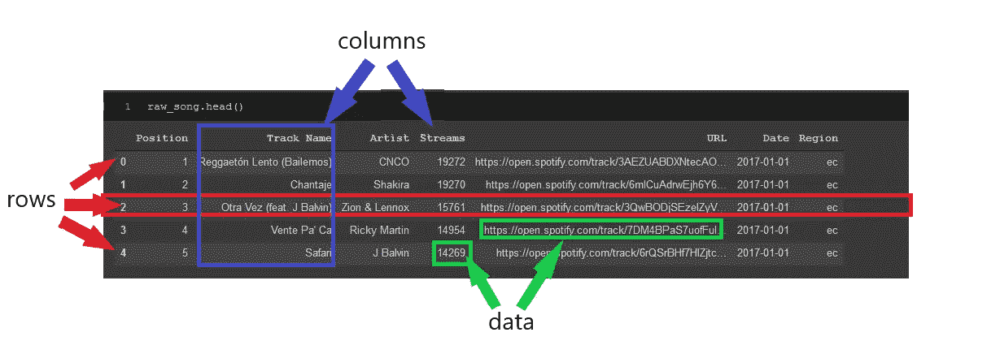

带有数据、行和列标签的示例数据帧。来自[https://www . ka ggle . com/yamerenay/Spotify-dataset-19212020-160k-tracks](https://www.kaggle.com/yamaerenay/spotify-dataset-19212020-160k-tracks)的数据集

数据帧非常有用，因为它们提供了一种简单的方法来打印可视化表格，然后按照您想要的方式操作它。这些行可以很容易地被索引引用，索引是数据帧最左边的数字。索引将是从零开始的相应行的编号，除非您为每一行指定名称。也可以通过列名(如“轨道名”)或它们在数据帧中的位置方便地引用这些列。我们将在本文后面更详细地讨论引用行和列。

# 创作时间！


照片由[瑞德·韦斯利](https://unsplash.com/@rhett__noonan?utm_source=medium&utm_medium=referral)在 [Unsplash](https://unsplash.com?utm_source=medium&utm_medium=referral) 拍摄

创建熊猫数据框架有几种方法:

1.  从. csv 文件(或其他文件类型，如 Excel、SQL 数据库)导入数据
2.  从[列表中选择](https://www.w3schools.com/python/python_lists.asp)
3.  来自一本[字典](https://www.w3schools.com/python/python_dictionaries.asp)
4.  从一个 [numpy](https://numpy.org/doc/stable/reference/generated/numpy.array.html) 数组
5.  很多很多！

一般来说，您主要是将. csv 文件或某种类型的数据源(即 SQL 数据库)中的数据放入 pandas 数据帧中。你不会从零开始，因为根据你所拥有的数据量，这将需要很长的时间。然而，如果你需要，这里有一个来自 python 字典的快速、简单的例子:

```
import pandas as pd
dict1 = {'Exercises': ['Running','Walking','Cycling'],
         'Mileage': [250, 1000, 550]}
df = pd.DataFrame(dict1)
df
```

输出:

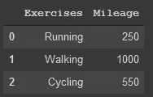

由上述代码构成的基本数据框架

字典关键字(“练习”和“里程”)成为相应的列标题。本例中作为列表的字典中的值成为数据帧中的单个数据点。由于跑步是“练习”列表中的第一项，因此列表的顺序将放在第一行，而 250 将放在第二列的第一行，因为它是“里程”列表中的第一项。另外，您会注意到，因为我没有为数据帧的索引指定标签，所以它会自动标记为 0、1 和 2。

然而，就像我之前说过的，创建熊猫数据框架的最有可能的方式是从 csv 或其他类型的文件中导入，以分析数据。这可以通过以下方式轻松完成:

```
df = pd.read_csv("file_location.../file_name.csv")
```

pd.read_csv()是一个非常强大和通用的方法，根据您导入数据的方式，它将非常有用。如果您的 csv 文件已经带有标题或索引，您可以在导入时指定，这样会使您的生活更加轻松。为了了解 pd.read_csv()的全部能力，我建议你看看熊猫 API [这里](https://pandas.pydata.org/pandas-docs/stable/reference/api/pandas.read_csv.html?highlight=read_csv)。

# 重要的事情先来

现在，您已经将数据导入到 python 编辑器中，并准备对其进行分析。然而，在我们开始回答你的分析问题的有趣部分之前，你必须熟悉你的数据，看看它是什么样子的。作为分析这些数据的人，你必须熟悉数据集。我喜欢用四种方法来了解我的数据，以及哪些熊猫让这变得超级简单。

1.  。head() &。尾部()
2.  。信息()
3.  。描述()
4.  。样本()

```
raw_song.head()
```

上面的线是我在这一页顶部的图片中的线。它将显示数据帧的前 5 行和每一列，为您提供数据外观的简单摘要。如果您愿意，也可以在方法的()中指定一定数量的行来显示更多的行。

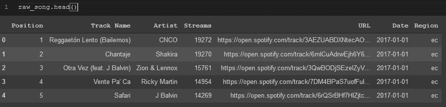

。来自 Spotify 数据集的歌曲数据的 head()方法

。tail()同样只显示最后 5 行。

```
raw_song.tail()
```

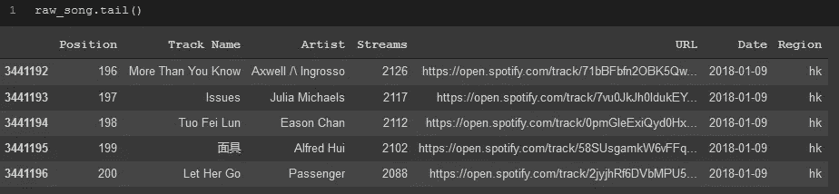

。Spotify 数据集中歌曲数据的 tail()方法

通过这两个快速的方法，我从数据集的一个小样本中对列名和数据的样子有了一个大概的了解。这些方法也非常有用，特别是在 Spotify 数据集处理超过 300 万行的情况下，您可以轻松显示数据集并快速了解情况，并且您的计算机不会花费很长时间来显示数据。

。info()也很有用，它向我显示了所有列、它们的数据类型以及是否有空数据点的简明列表。

```
raw_song.info(verbose=True, null_counts=True)
```

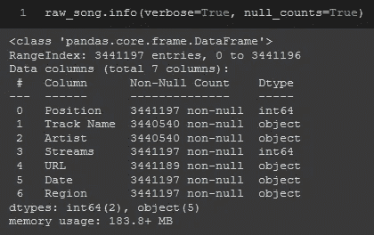

。Spotify 数据集中歌曲数据的 info()方法

如果您有完整的整数或浮点列(即“位置”、“流”)，那么。describe()是了解数据集更多信息的有用方法，因为它将显示关于这些列的许多描述性统计信息。

```
raw_song.describe()
```

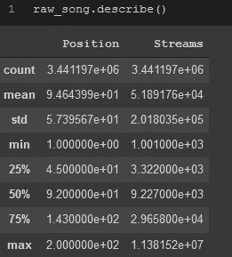

。对 Spotify 数据集中的歌曲数据使用 describe()方法。请注意，只显示了“Position”和“Streams”列，因为它们是仅有的两个整数列，其他列是字符串，没有描述性统计信息。

最后，。sample()将允许您对数据帧进行随机采样，并查看您所做的任何操作是否错误地更改了数据集中的某些内容，当您第一次浏览数据集时，如果您只是想了解数据集到底包含了哪些在前面的方法中没有显示的内容，这也是非常有用的。

```
raw_song.sample(10)
```

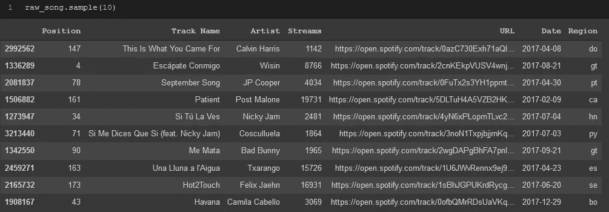

。Spotify 数据集中歌曲数据的 sample()方法。

在探索和准备用于分析的数据集时，我始终如一地使用这些方法。每当我更改列中的数据、更改列名或添加/删除行/列时，我都会通过至少快速运行前面 5 种方法中的一些方法来确保一切都按照我想要的方式进行了更改。

# 选择一行或一列

太棒了，现在你知道如何把你的数据集作为一个整体来看了，但是你真的只想看几列或几行，而把其余的放在一边。

**。loc[]和。iloc[]**

这两种方法会以不同的方式来完成，这取决于你引用某一行或列的方式。

如果您知道行或列的标签，请使用。loc[]。

如果您知道行或列的索引，请使用。iloc[]。

如果你两个都知道，就选你最喜欢的，抛硬币，或者用你知道不会改变的那个。例如，如果您向数据帧添加行或列，这些行/列的索引将会改变，并可能导致您以后引用错误的行/列。

因此，回到 Spotify 数据集。您可以使用以下任意一种方法来查看“曲目名称”栏。loc[]或。iloc[]。与。loc[]因为我知道列的标签，所以我将使用以下内容:

```
raw_song.loc[:,'Track Name']
```

第一个括号后面的冒号指定了我引用的行，因为我希望所有的行都在“Track Name”列中，所以我使用了“:”。

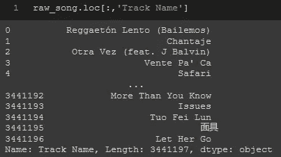

。位置[]

我将收到与。iloc[]只是这次需要指定“曲目名称”列的索引:

```
raw_song.iloc[:,1]
```

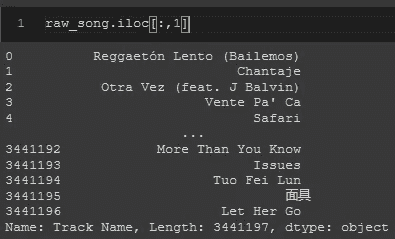

。iloc[]

。loc[]和。iloc[]对行的作用是相同的，除了在这种情况下，因为行的标签和索引都是相同的，所以它们看起来完全一样。

# 切片和切块


安妮·斯普拉特在 [Unsplash](https://unsplash.com?utm_source=medium&utm_medium=referral) 上的照片

获取数据帧一部分的另一个简单方法是使用[]并在括号内指定列名。

```
raw_song[['Artist','Streams']].head()
```

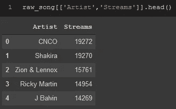

如果你只用一根柱子和一组支架，你将会得到一个熊猫系列。

```
raw_song['Streams']
```

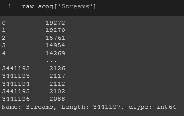

# 从数据帧添加行和列

利用我们已经知道的。loc[]我们可以用它在数据帧中添加一行或一列。您还可以使用其他两种方式添加列。insert()或通过添加数据帧的一部分并在方括号[]内指定列名来实现。如果您尝试添加多行和多列，您可以创建一个单独的数据帧，并将新列或行的新数据帧连接到原始数据帧，以添加该列或行。为此，您可以使用 pd.merge()、concat()或 join()；然而，这些方法的进一步讨论和示例将在以后的文章中讨论，不在本文的讨论范围之内。

**增加一行:**

如果你决定使用。loc[]要将一行添加到数据帧，只能将其添加到数据帧的底部。用指定 dataframe 中的任何其他索引，将擦除当前在该行中的数据，并用插入的数据替换它。在这个例子中，我将一个新索引命名为“last ”,它显示在数据帧的底部。请注意，它不必是一个特定的名称，只要它不同于任何其他索引。

```
raw_song.loc['last'] = [0,'hello','bluemen',1,"https://open.spotify.com/track/notarealtrack", '2017-02-05','ec']
```

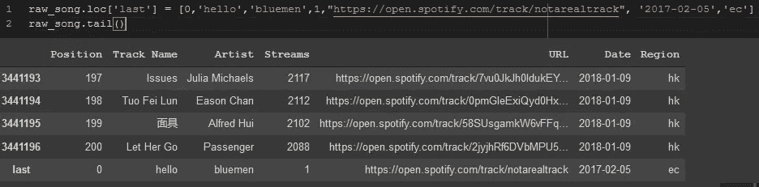

您可以使用同样的方法将列添加到 dataframe。loc[]。同样，为该列创建一个新名称，除非您尝试用新值替换一个列。您必须放置一个可以为所有行复制的单个值，或者一个长度与数据帧中的行数相同的列表。

```
raw_song.loc[:,'new_col'] = 0
raw_song.tail()
```

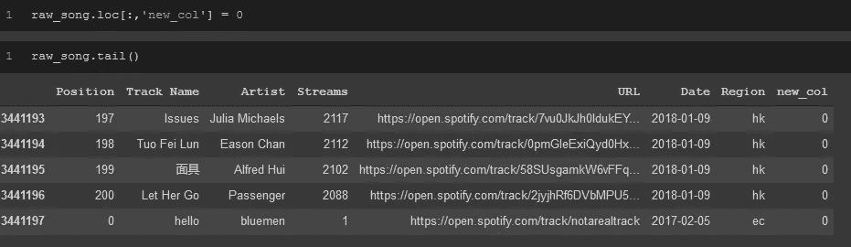

。loc[]向 Spotify 数据集添加一列。我用 0 来简化输入。

除了在末尾插入新列之外，还有两种方法可以在数据框中插入新列。

的方法。insert()将允许您指定希望将列放入数据帧的位置。它有 3 个参数，放置它的索引、新列的名称和作为列数据放置的值。

```
raw_song.insert(2,'new_col',0)
raw_song.tail()
```

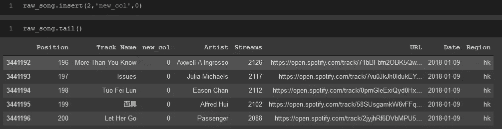

使用。insert()在 Spotify 数据集中创建一个新列。

向数据帧添加列的第二种方法是，通过使用[]命名新列并使其等于新数据，就像它是数据帧的一部分一样。

```
raw_song['new_col'] = 0
raw_song.tail()
```

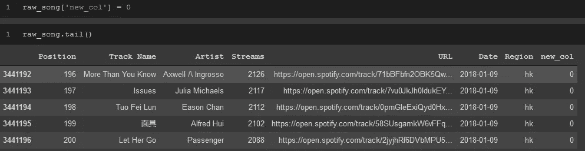

向数据帧的末尾添加新列

这样，我无法指定新列的位置，但这是执行操作的另一种有用方式。

# 从数据帧中删除行、列


简·廷伯格在 [Unsplash](https://unsplash.com?utm_source=medium&utm_medium=referral) 上拍摄的照片

如果你想去掉一些行或列，很简单，只需删除它们。

只需指定要删除的轴(0 表示行，1 表示列)以及要删除的行或列的名称，就可以了！

```
raw_song.drop(labels='new_col',axis=1)
```

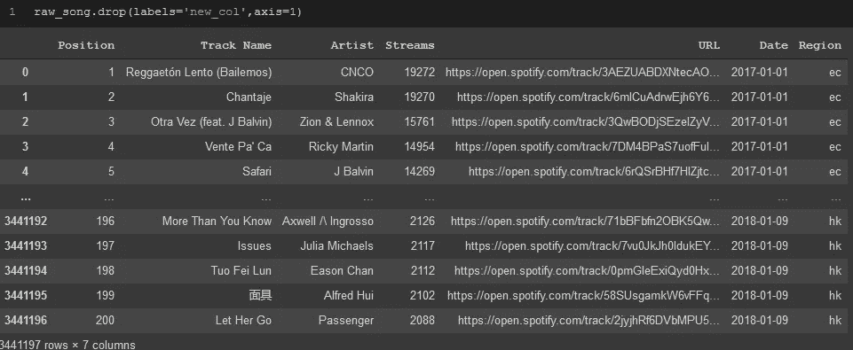

。drop()允许我去掉在上一节中添加的“new_col”列。

# 重命名索引或列

如果您希望将数据帧的索引更改为数据帧中的不同列，请使用。set_index()并在括号中指定列的名称。但是，如果您确切地知道您想要为索引命名什么，请使用。rename()方法。

```
raw_song.rename(index={0:'first'}).head()
```

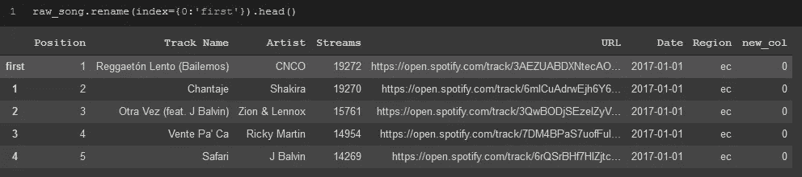

此数据帧的第一个索引已从 0 更改为“第一个”

若要重命名列，请在。rename()方法要重命名的列以及您希望在{}中为其命名的内容类似于重命名索引。

```
raw_song.rename(columns={'Position':'POSITION_RENAMED'}).head()
```

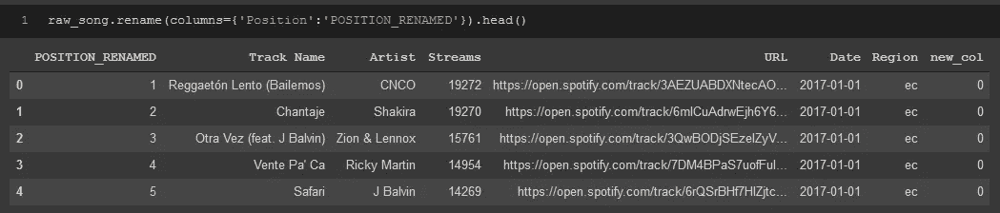

第一列已从“位置”更改为“位置 _ 重命名”

# 如何迭代你的数据框架

很多时候，当您处理数据帧中的数据时，您需要以某种方式更改数据，并迭代数据帧中的所有值。最简单的方法是在 pandas 中内置一个 for 循环:

```
for index, col in raw_song.iterrows():
    # manipulate data here
```

# 如何将数据帧写入文件

完成对数据帧的所有操作后，现在是时候导出它了，这样您就可以将它发送到其他地方。类似于从文件导入数据集，现在正好相反。Pandas 有各种不同的文件类型，您可以将数据帧写入其中，但最常见的是将其写入 csv 文件。

```
pd.to_csv('file_name.csv')
```

现在你知道熊猫和数据框的基本知识了。在你的数据分析工具箱中，这些都是非常强大的工具。