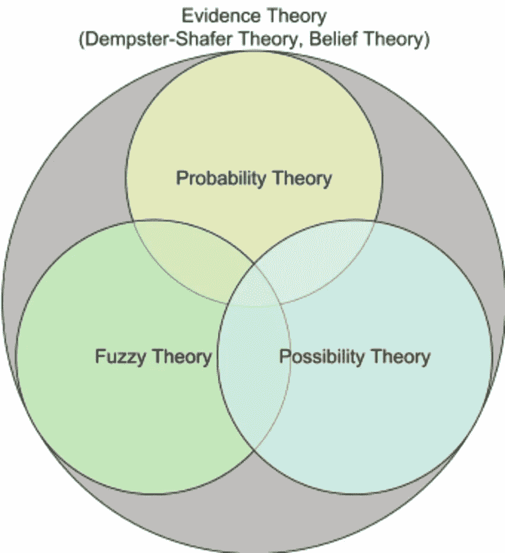
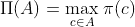
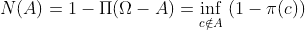
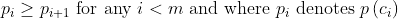
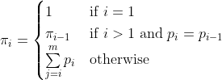
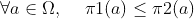

# 可能性理论导论

> 原文：<https://towardsdatascience.com/an-introduction-to-possibility-theory-142f99bf1961?source=collection_archive---------21----------------------->

## 可能性理论的基本背景

可能性理论是由扎德[1]提出的，并由 Dubois 和 Prade [2]进一步发展，目的是为语言陈述提供一种定义明确和正式的数学表示，允许处理不精确或模糊的信息。例如，根据每个人对廉价的主观定义和上下文，单词 *cheap* 可以被赋予一大组值。

[https://www . research gate . net/figure/Theory-embedded-in-evidence-Theory-demps ter-Shafer-Theory-some-called-Belief _ fig 2 _ 221912990](https://www.researchgate.net/figure/Theories-embedded-in-evidence-theory-Dempster-Shafer-Theory-sometimes-called-Belief_fig2_221912990)

可能性值可以解释为事件发生的可行性的*程度。*

与概率论的一个重要区别是高可能性值是非信息性的，而高概率值是信息性的。事实上，事件 *A* 发生的可能性非常高，这意味着，无论 *A* 发生与否，我们都不会感到意外。如果 *A* 有非常高的概率质量，那么我们会惊讶于 *A* 没有发生。相反，低可能性和概率值都是信息性的，因为它们都表明*和*不太可能发生。

可能性理论也与信念函数理论相关，因为可以证明，如果质量函数是一致的(即，它具有嵌套的焦点元素)，那么它与可能性分布是双射对应的。更一般地说，可能性是一类特殊的不精确概率，在这种框架中，概率值只能用两个界限来表示。事实上，可能性框架中事件的不确定性可以通过一对值(可能性和必要性)更好地提升，这对值可以被视为概率界限。

可能性理论源于模糊集理论。实际上，假设 **T** 是为真的事件*b*⊆ω的集合，而 **U** 是未判定事件(即既非真也非假的事件)的集合。又假设 **T** 和 **U** 是模糊的，那么必然性是 **T** 的隶属函数，可能性是 **T∪U** 的隶属函数。

## 可能性分布

在可能性理论中，可能性分布是最简单的一类对象，它完全捕捉了我们不确定性的所有信息。可能性分布π将论域中的每个元素映射到单位区间[0，1]，其极值对应于不可能和完全可能的状态。由可能性π导出的具有上下界约束的容许概率分布集合用**p**(π)⊆**p**(ω)表示。

如果任何状态*c***∈**ω具有等于 1 的可能性度，那么这个状态(即这个类)是完全可能的，并且按照惯例，可能性分布π被称为归一化的。不精确的概率解释只有在可能性分布是正态的情况下才是有效的，否则我们将得到*P*(ω)<1，用于某些概率分布 *p* 中的 **P** ( **π** )。****

****在处理可能性分布时，我们可以区分零确定性和完全确定性的两种特殊情况:****

****1.完全确定:∃*a*∈ω，π( *a* )=1 且π( *b* )=0，∀*a*≦*b*。****

****2.零确定性(无知):π(*a*)=1∀*a*∈ω。****

## ****可能性和必要性措施****

****可能性理论和其他与不精确概率兼容的理论的一个典型方面是存在两种描述不确定性的度量:必要性和可能性。****

****一个*必要性度量*考虑了根据可用信息对每个事件的合理信任度。****

****相应的*可能性度量*评估在没有任何矛盾信息的情况下，人们在多大程度上仍然可以说一个事件是可能的。****

****必要性和可能性测度分别是不精确概率解释中的下概率和上概率。****

****给定ω的子集 *A* ，可能性度量由下式给出:****

********

****这意味着子集 *A* 的可能性等于该子集中的最大可能性度。因此，可能性度量是最大的:****

*****π(A∪B)= max(π(A)，π(B))*与概率度量相反，概率度量是求和的。****

****请注意，该属性说明了这样一个事实，即可能性分布是计算任何子集的可能性度量的足够信息。****

****必要性度量由下式给出:****

********

****必要性度量是这样的: *N(A ∩ B) =min(N(A)，N(B))* 并且，在归一化的情况下，我们有*π(ω)= n(ω)= 1 并且π(∅)=n(∅)= 0*。****

## ****概率-可能性转换****

****假设我们正在处理客观概率分布，我们的目标是将它们转换成可能性分布。因此，推荐的选择是 Dubois 和 Prade [3]提出的变换，它保留了概率中包含的统计信息。****

****考虑ω上的离散概率分布 *p* ，我们总是可以置换ω的元素的索引，使得概率值的集合以降序排序:****

********

****转换内容如下:****

********

****这种转变是可逆的[4](从这个意义上说， *p* 可以从π中恢复过来)。它产生一个标准化的可能性分布。如果 *p* 是均匀的，那么 *p* 被映射到一个常数π。如果 *p* 是狄拉克质量，那么 *p* 映射到自身。它还有三个重要的特性[5]:****

1.  ******一致性**:∀*a*⊆ω，π(*a*)≥*p*(*a*)其中π为π跨越的可能性测度。所以π是一个明确定义的上概率。****
2.  ******偏好保留** : ∀ ( *a* ，*b*)∈ω，*p*(*a*)>*p*(*b*)⇔π(*a*)>π(*b*)，所以在由ψ编码的偏好之间存在一种形式的兼容性****
3.  ******最大特异性** : π在那些与 *p* 一致且保持偏好的可能性分布中达到最大特异性。考虑两种可能性分布π1 和π2。如果满足以下条件，则称概率分布π1 比π2 信息量更大:****

********

# ****结论****

****这是关于可能性理论的简要介绍。如上所述，它是用来处理语言陈述中模糊和不精确的信息的。我们在第一部分提供了一个基本背景，然后我们介绍了可能性分布以及从这些分布中计算出来的可能性和必要性度量。然后我们引入了一个概率-可能性转换，它适合客观概率。就我个人而言，我在关于分类器组合的博士论文中使用了这个框架(可能性框架),其中我使用 Tnorm 函数组合了可能性分布。****

****[链接](https://ori-nuxeo.univ-lille1.fr/nuxeo/site/esupversions/3c84dfb2-c274-442f-b760-1ab5701fa8b5)到我的博士手稿:****

****[将](https://arxiv.org/pdf/1908.06475.pdf)链接到相关论文:****

## ****参考资料:****

****[1]扎德，洛特菲·阿斯克尔。"模糊集是可能性理论的基础."*模糊集与系统*1.1(1978):3–28。****

****[2]杜布瓦，迪迪埃和亨利·普拉德。可能性理论:一种计算机处理不确定性的方法。斯普林格科学&商业媒体，2012 年。****

****[3]杜布瓦，迪迪埃和亨利·普拉德。“在几个不确定的证据主体的陈述。模糊信息和决策过程，167-181，古普塔和桑切斯(1982).****

****[4]杜布瓦、迪迪埃和亨利·普拉德。“可能性理论及其应用:我们站在哪里？."*斯普林格计算智能手册*。施普林格，柏林，海德堡，2015。31–60.****

****[5] Dubois，Didier 等人，“概率-可能性转换，三角模糊集和概率不等式。”*可靠计算*10.4(2004):273–297。****