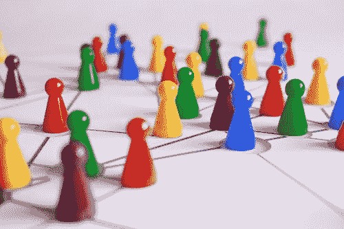
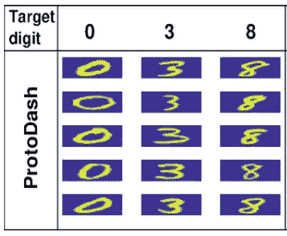

# ProtoDash 介绍-一种更好地理解数据集和机器学习模型的算法

> 原文：<https://towardsdatascience.com/an-introduction-to-protodash-an-algorithm-to-better-understand-datasets-and-machine-learning-613c24b23719?source=collection_archive---------19----------------------->

照片由[像素](https://www.pexels.com/photo/close-up-photography-of-yellow-green-red-and-brown-plastic-cones-on-white-lined-surface-163064)上的 [Pixabay](https://www.pexels.com/@pixabay) 拍摄

写这篇文章是希望你能发现一种新的方法来探索和采样你的数据。

为了理解我们的数据，我们从描述性分析开始，切片和切块以寻找预期的和有趣的模式。然后我们可能会寻找星团。在文本数据中，这些可能代表主题，而对于客户来说，这些可能代表人物或群体。

或者，我们可能希望在我们的数据中找到与我们感兴趣的子集相似的其他例子。

通过在数据中选择有代表性的例子，可以使用 ProtoDash 来支持这些活动。

# **什么是原破折号？**

ProtoDash 算法是由亚马逊和 IBM Research 合作开发的。这是一种选择能捕捉数据集基本分布的原型示例的方法。它还对每个原型进行加权，以量化它代表数据的程度。

ProtoDash 需要三个关键输入:要解释的数据集、要从中选择原型解释的数据集以及要选择的原型数量。

ProtoDash 的一个主要优点是，它旨在找到不同的原型，即以不同方式反映数据集的示例，以提供更完整的图片。

一旦最初的原型——最典型的数据点——被发现，算法将搜索第二个原型。虽然它再次寻找具有共同行为的例子，但它也试图确保发现新的特征，即第二个原型不同于第一个原型。这种搜索一直持续到找到所请求的原型数量。

# 用例

## 子集选择的原划

通过按设计使用 ProtoDash，您可以在一个数据集中发现最能代表另一个数据集分布的例子。当您希望根据以前的客户来确定特定产品的目标客户，或者回顾性地了解某个事件的影响时，这可能非常有用。

例如，您可能想探究某项行动的效果，如“收到营销电子邮件是否影响了销售？”。由于有许多其他因素会影响销售，我们希望确保在比较收到营销邮件的人时，*治疗组*和没有收到营销邮件的人，*对照组*具有相似的特征。为此，您可以将处理组作为您希望解释的数据集传递，将对照组作为从中寻找原型的数据集传递。

## 可解释人工智能的原型

如果您只传递一个数据点作为您想要解释的数据集，那么您需要在第二个数据集中找到与这个例子最相似的原型。

为了信任机器学习模型，我们希望更好地理解它们是如何工作的。其中一个关键问题是“相似的例子会得到相同的结果吗？”。例如，如果一笔贷款被拒绝，我们可能希望确保类似的申请也被拒绝。如果不是这种情况，它可能表明机器学习模型没有按预期运行。

通过使用 ProtoDash 识别相似的示例，您可以评估每个示例的机器学习模型预测是否与您预期的方式相似，如果它按预期工作的话。

## 分段的原划

如果您只将一个数据集传递给 ProtoDash，表明应该从您希望解释的数据集中选择原型解释，那么所选择的原型将总结底层数据分布。

这可以作为用于分段的聚类的替代方案。每个原型都是一个代表特定细分的例子。例如，您可能想要了解客户电子邮件中的常见主题，而 ProtoDash 可能会提供一些示例，代表有关支付、交付、注册等方面的查询。

要从原型生成聚类，可以将原型用作聚类质心，并将数据集中的所有其他示例分配给它们最近的原型。

# 它是如何工作的？

ProtoDash 算法的目标是用另一个数据集的加权样本来近似一个数据集的分布。为此，它选择最小化最大平均差异(MMD)的样本。MMD 表示一个数据集的分布被另一个分布的样本所代表的程度。

ProtoDash 要求指定 MMD 的内核。如果使用“线性”,这意味着基础分布将只关注每个特征的平均值。然而，当使用“高斯”时，要考虑均值、方差、偏斜等。对于每个特性，获取更详细的数据理解。

当选择原型和权重时，MMD 的简单重构成为最大化的目标函数。方法如下:

1.给定当前原型集，计算目标函数的值(步骤 2 需要)

2.计算每个例子相对于目标函数的梯度

3.选择具有最大梯度值的示例，并将其添加到原型集中

4.通过使用二次规划优化目标函数来计算权重

5.重复上述步骤，直到选择了适当数量的原型

# 例子

ProtoDash 白皮书包括一个 MNIST 示例，这是一个包含数字 0 到 9 示例的影像数据集。这些实验旨在验证 ProtoDash 从源数据集中选择与不同目标数据集的分布相匹配的原型的能力。例如，数字 0 的实例作为要解释的数据集被传递，而包含所有数字(0 到 9)的实例的数据集被传递以从中查找原型。

以下是算法发现的原型示例。您可以看到，对于 digit，算法已经发现了底层特性，因为每个返回的特性都被正确地发现了。此外，示例本身的宽度、厚度和倾斜度也各不相同。

图片来自[论文:通过选择具有重要性权重的原型进行有效的数据表示](https://arxiv.org/abs/1707.01212)

ProtoDash 从一个数据集选择与另一个数据集的分布紧密匹配的原型的能力在迁移学习、多任务学习和协变量偏移校正中有应用。

# 摘要

ProtoDash 是 AI Explainability 360 Toolkit 的一部分，这是一个开源库，支持数据集和机器学习模型的可解释性和可解释性。

通过寻找原型实例，ProtoDash 提供了一种理解数据集潜在特征的直观方法。对于一系列场景来说，这可能是一个有价值的解决方案，包括子集选择、分割和支持机器学习可解释性。

# **链接**

[论文:通过选择具有重要性权重的原型进行有效的数据表示](https://arxiv.org/abs/1707.01212)

[视频:proto dash:kart hik Gurumoorthy 的快速可解释原型选择](https://www.youtube.com/watch?v=xKB8e6NZ8Tw)

[AI 可解释性 360 工具包(AIX360)](https://github.com/Trusted-AI/AIX360)

[AIX 360 proto dash 笔记本示例](https://github.com/Trusted-AI/AIX360/tree/master/examples/protodash)