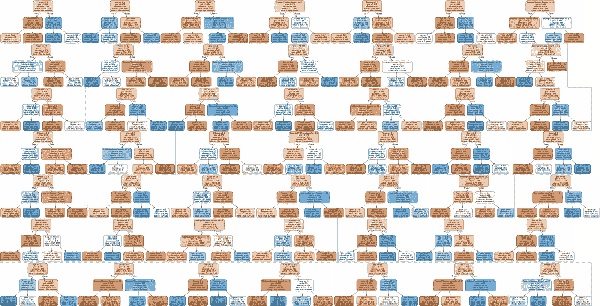
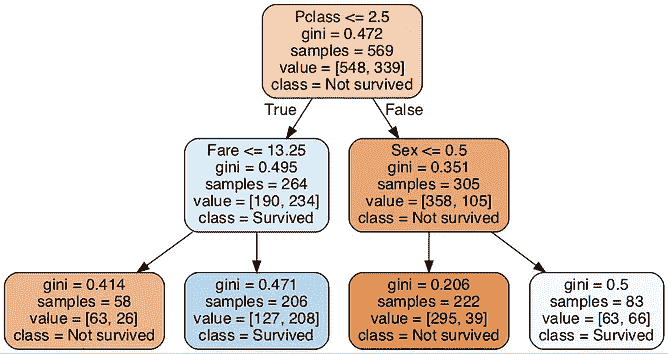
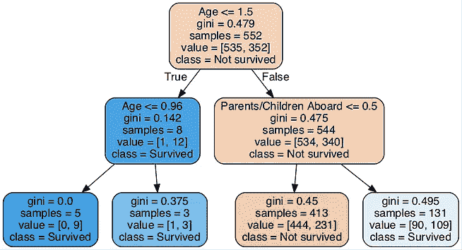
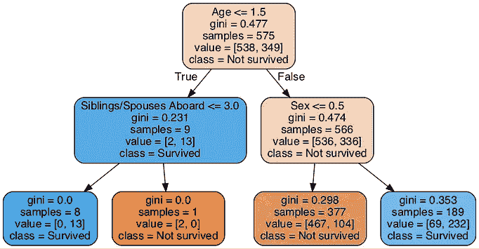

# 用 Python 和 scikit 介绍随机森林-学习

> 原文：<https://towardsdatascience.com/an-introduction-to-random-forest-with-python-and-scikit-learn-acf44e514034?source=collection_archive---------41----------------------->

## 获得对随机森林的直观理解和数学理解的完整指南，使用 scikit 实现您的第一个模型——学习 Python



随机森林可视化与 50 个不同的决策树

> 注意:这篇文章假设你对决策树有基本的了解。如果您需要更新决策树的工作方式，我建议您首先阅读[Python 和 scikit 决策树介绍-学习](/an-introduction-to-decision-trees-with-python-and-scikit-learn-1a5ba6fc204f)。

关于随机森林的好处是，如果我们很好地理解了决策树，那么理解随机森林应该也很容易。随机森林这个名字实际上很好地描述了添加的额外功能。首先，我们现在有了*随机*，我将更深入地解释它。其次，提醒你自己一个森林是由什么组成的，也就是一堆树，所以我们基本上有一堆决策树，它们被称为一个森林。非常直观地将这两个术语联系起来，实际上只有森林是随机的，因为它由一堆基于随机数据样本的决策树组成。

# 了解随机森林

为了理解随机森林，我们实际上只需要理解什么是自举，或者换句话说，置换随机抽样。对于每个单独的决策树，我们随机选择给定次数的随机观察(通常对应于观察的总数)。唯一微小的细节是，相同的观察可能会出现多次(否则，我们基本上只会以随机顺序获得每个决策树的相同数据，这将导致每个树的结果完全相同)。

如果你还记得我在[决策树](/an-introduction-to-decision-trees-with-python-and-scikit-learn-1a5ba6fc204f)上发布的代码(如果不记得，更新后的代码会在下面发布)，下面这一行实际上是我们唯一需要添加的内容:

```
bootstrap = data[np.random.randint(0, rows-1, rows)].reshape(rows, columns)
```

这行代码所做的，基本上是从完整的数据集中随机地获取一些观察值，也就是带有替换的自举/采样。此外，我们还必须为算法添加一个新的外部循环，它对应于我们想要生成的决策树的数量。

> 注意:我在外部树循环(第 14 行)之后的第一行中添加了一行选择随机特征，该行随机选择与特征数量的平方根相对应的多个随机特征。为了简单起见，在之前的文章中 GitHub Gist 没有添加这一点。我在这里添加了它，因为它是 sklearn 中的默认设置，它使代码运行得更快，因为我的算法根本没有优化，已经运行得很慢了。

```
**Out [1]:**TREE 1: Best split-feature     : Fare
TREE 1: Value to split on      : 52.5542
TREE 1: Weighted gini impurity : 0.42814

TREE 2: Best split-feature     : Sex
TREE 2: Value to split on      : 1.0
TREE 2: Weighted gini impurity : 0.32462

TREE 3: Best split-feature     : Parents/Children Aboard
TREE 3: Value to split on      : 0.0
TREE 3: Weighted gini impurity : 0.45518
```

因此，这将是林中每个决策树的第一次拆分。实际上，我们不应该只给每棵树做一个裂口，而是让它们完全生长出来。类似地，如果你用 3 棵完全生长的不同的树建立一个随机的森林，你会得到这样的结果:



基于自举数据的由 3 棵决策树组成的随机森林

> 注意:随机森林中的三个决策树不会在相同的初始注释上分裂，因为您必须控制几个随机因素才能获得完全相同的结果，这将导致更多的代码。

# 使用随机森林进行预测

现在到了随机森林的简单部分，来做预测。我们要做的一切，实际上只是在每棵树上输入一个观察值，看看它能预测什么。然后，我们采用大多数树选择的预测，例如，在上图中，如果三棵树中的两棵树预测有乘客幸存，那么这也将是我们的最终预测。

为什么这是个好主意呢？决策树往往会过度拟合数据，但是通过利用大量的单独决策树来预测最终结果，我们至少可以在某种程度上防止这种过度拟合。

希望这篇文章对你更深入的了解随机森林，理解算法的工作原理有所帮助。请随意留下您的评论或问题。