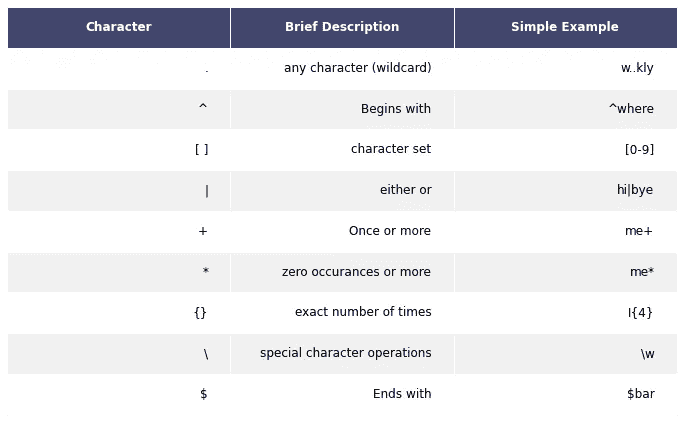

# 正则表达式简介

> 原文：<https://towardsdatascience.com/an-introduction-to-regular-expressions-5dd762afc5e4?source=collection_archive---------20----------------------->

## 轻松使用正则表达式的初学者指南



作者图片

# **简介**

这篇博客的目标是为那些没有经验或知识的人提供一个简单而直观的 python 正则表达式介绍。正则表达式，也称为正则表达式，是用于在一个字符串或一系列字符串中查找模式的字符序列。为了加深我们对正则表达式及其工作原理的理解，我将在下面进行一些教程。

# **教程**

在以下教程中，我们将学习如何:

*   获得 python 中正则表达式模块的访问权限
*   使用 re.search()匹配字符串的模式
*   使用 regex 的元字符创建更复杂的模式

## 如何访问正则表达式模块

实际上有两种方法可以导入 regex 模块和搜索函数。

第一种方法是导入整个 regex 模块，然后在想要使用搜索功能时使用模块名作为前缀。

```
import re
re.search(<regex>, <string>)
```

第二种方法是通过名称从正则表达式模块导入搜索函数，因此可以直接调用该函数，而不需要任何前缀。

```
from re import search
search(<regex>, <string>)
```

正如您所看到的，在使用这种方法调用搜索函数时，没有使用前缀。还要记住，在搜索函数中，第一个参数“regex”是要搜索的模式，第二个参数“string”是要搜索的字符串。此外，需要记住的一个重要注意事项是，regex 搜索函数将只返回查询的第一个匹配项。

## 正在应用搜索()

为了全面理解搜索功能以及如何使用它，我们来看一些简单的例题。

```
Code Input:
import re
s='A-b_123_e3'
re.search('123', s)Code Output:
<re.Match object; span=(4, 7), match='123'>
```

从上面可以看出，regex 搜索函数返回两条重要的信息。

首先是跨度。Span 本质上是子字符串在整个字符串中的位置。所以在这种情况下，span 告诉我们我们想要的第一个字符从哪里开始(第四个元素)以及我们想要的最后一个字符从哪里结束。(第七元素)

请记住，end 元素不包括在内，因此即使“3”字符的索引实际上是 6，搜索函数也将返回 7。

搜索函数给出的第二条信息是匹配项。本质上，匹配是您搜索的也在更大的字符串中找到的字符。

总而言之，search 函数是一个强大的工具，因为它允许您确定一个字符串序列是否在一个更大的字符串序列中，如果是，该函数会通知您搜索查询的相对位置。

关于正则表达式搜索函数的另一个有趣的事实是，它可以很容易地集成到布尔条件语句中。请看下面的例子。

```
Code Input:
a='Jonny paid $5 for lunch and $10 dollars for dinner.'
if re.search('$', a):
     print('Found $ signs.')
else:
    print("Did not find $ signs.")
Code Output:
Found $ signs.
```

如您所见，正则表达式搜索本质上是真或假，其中带有解决方案的搜索被认为是真的，而失败的搜索将返回假的。

当然，这些都是非常简单的例子，但是上面例子中使用的概念仍然适用于更复杂的问题。

## 使用元字符的复杂正则表达式查询

到目前为止，我们所做的查询肯定是有用的，但实际上，到目前为止的应用非常有限。到目前为止，我们只能匹配精确的子字符串。

但是，如果我们使用元字符，我们真的可以看到正则表达式的威力。

方括号是一个对查询非常有用的元字符。任何放在方括号中的字符形成一个**字符类。**使用搜索功能时，将返回字符类中的任何字符。为了更好地理解这一点，我们来看一个例子。

```
#First Method
Code Input: 
A = 'AB#$_+*87ba_seven'
re.search('[0-9]+', A)
Code Output:
<re.Match object; span=(7, 9), match='87'>
#Second Method
Code Input:
A = 'AB#$_+*87ba_seven'
re.search('[0-9][0-9]', A)
Code Output:
<re.Match object; span=(7, 9), match='87'>
```

正如您所看到的，上面显示了两种方法。正则表达式的好处之一是通常有多种方法来解决一个问题。

在这种情况下，括号构成了一个数字字符类，其中 0 到 9 之间的任何整数都是有效的。第一种方法使用表中引用的“+”字符。它查找一个或多个子字符串。因此，在这种情况下，因为有两个数字，所以“+”告诉搜索函数在第一个数字后面寻找第二个数字。第二种方法只是重复方括号方法两次。

另一个重要的元字符是句点。点(。)是一个通配符，可以匹配除换行符之外的任何字符。要了解这是如何工作的，让我们看另一个例子。

```
Code input:
print(re.search('123.abc','123abc'))
print(re.search('123.abc','123\abc'))
print(re.search('123.abc','123/abc'))
Code Output:
None
None
<re.Match object; span=(0, 7), match='123/abc'>
```

如您所见，点(。)元字符仅在较长字符串中的等效位置存在有效字符时才返回结果。任何字符或反斜杠(换行符)都不会返回任何内容，但是正如您在第三个示例中看到的，任何其他字符都可以。

## 元字符\d，\D，\w，\s，\S

这些元字符用于标识特定类型的字符。\d 代表任何十进制数字字符，\D 代表任何非十进制数字的字符。同样的想法也适用于带有\w 的字母数字字符。w 相当于我们前面讨论过的[a-zA-Z0–9 _]。像\D 一样，\W 是它的小写对等词的反义词。/s 和/S 对空白字符使用相同的概念。让我们看一些例子。

```
Code input:
print(re.search('\w', '#@! .h3.&'))
print(re.search('\W', '#@! .h3.&'))
print(re.search('\d', '#@! .h3.&'))
print(re.search('\D', '#@! .h3.&'))
print(re.search('\s', '#@! .h3.&'))
print(re.search('\S', '#@! .h3.&'))
Code Output:
<re.Match object; span=(5, 6), match='h'>
<re.Match object; span=(0, 1), match='#'>
<re.Match object; span=(6, 7), match='3'>
<re.Match object; span=(0, 1), match='#'>
<re.Match object; span=(3, 4), match=' '>
<re.Match object; span=(0, 1), match='#'>
```

正如您所看到的，使用这些特殊字符，我们可以确认这个字符串是否包含字母数字字符和空白。假设我们确实找到了这些字符，那么我们也将找到这些独特字符的确切位置。

## \字符

反斜杠是 regex 工具箱中非常特殊和强大的工具。正如我们之前看到的，反斜杠字符可以用来引入特殊的字符类，如字母数字字符或空格。它也用于另一种元字符类型的**锚**。它还可以用于转义元字符。

## 锚点\A，\Z，\B

\A 是一个有用的定位点，用于将查询附加到搜索字符串的开头。因此，只有当搜索字符串的开头与查询完全匹配时，搜索才会返回结果。

```
Code Input:
print(re.search('\Achoc', 'chocolate bar'))
print(re.search('\Abar', 'chocolate bar'))
Code Output:
<re.Match object; span=(0, 4), match='choc'>
None
```

/Z 本质上是/A 的反义词。因此，在这种情况下，只有当搜索字符串的结尾与查询完全匹配时，搜索函数才会返回结果。

```
Code Input:
print(re.search('bar\Z', 'chocolate bar'))
print(re.search('late\Z', 'chocolate bar'))
Code Output:
<re.Match object; span=(10, 13), match='bar'>
None
```

正如您在上面看到的，只有第一种情况返回结果，因为搜索字符串的结束字符与查询匹配。然而，在第二种情况下，由于我们选择了不同的字符段，搜索函数不返回任何内容。

/b 非常有用，因为它将匹配锚定到边界。所以/b 需要有字界才有结果。/b 断言解析器的当前位置要么是这可能很难用文字来理解，所以让我们看一个例子。

```
Code Input:
print(re.search(r'\bbar', 'chocolate bar'))
print(re.search(r'\bbar', 'chocolatebar'))
Code Output:
<re.Match object; span=(10, 13), match='bar'>
None
```

正如你所看到的，当有像第一种情况(空白)的边界时，那么使用/b，我们确实得到了使用搜索函数的结果。然而，在第二种情况下，单词之间没有边界，那么就没有输出。

**结论**

regex 库非常强大，查询可能会变得非常复杂。因此，这篇博客的目的是让初学者了解什么是正则表达式以及如何使用它。然而，为了保持简单和简洁，许多更复杂的查询和方法从这个条目中被省略了。因此，我建议任何觉得这很有帮助的人，请查看更多的在线正则表达式文档，因为那里有很多。