# Python 统计分析和建模简介

> 原文：<https://towardsdatascience.com/an-introduction-to-statistical-analysis-and-modelling-with-python-ef816b67f8ff?source=collection_archive---------16----------------------->

> 统计建模给你评估、理解和预测数据的能力，它是推理统计学的最底层，可以被认为是那些“必须知道”的主题。


卢卡斯在 Unsplash.com 的照片

# **内容列表:**

*   介绍
*   图形表示和绘图
*   选择正确的功能
*   参数估计
*   预测值的优度评估
*   统计测试
*   常态检验

# 介绍

在统计分析中，可以进行的一种可能的分析是验证数据符合特定的分布，换句话说，数据“匹配”特定的理论模型。

这种分析称为分布拟合，包括寻找一个代表观察现象的插值数学函数。

例如，当您有一系列观察值 **𝑥1,𝑥2,𝑥𝑛…** 时，您希望验证这些观察值是否来自密度函数**𝑓(𝑥,θ**所描述的特定总体，其中 **θ** 是基于可用数据进行估计的参数向量。

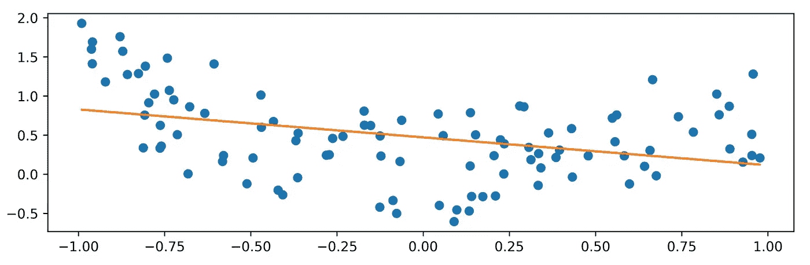

橙色:拟合(插值)一组观察值的线性函数(蓝色)

统计分析的两个主要目的是**描述**和**调查**:

*   描述:估计移动平均值，估算缺失数据…
*   调查:寻找一个理论模型，适合我们已经开始的观察。

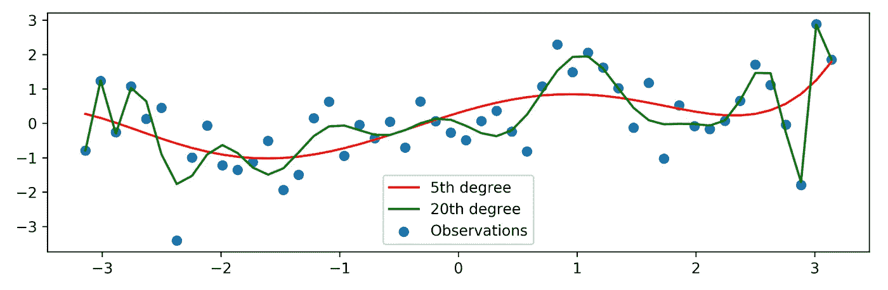

适用于相同数据的不同插值函数

这个过程可以分为四个阶段:

*   选择更符合数据的模型
*   模型的参数估计
*   计算所选模型和理论模型之间的“相似度”
*   应用一组统计测试来评估拟合优度

# 图形表示和绘图

探索数据的第一种方法是图形分析。用直方图对数据进行图形化分析，可以很好地帮助评估要选择的正确模型。

让我们绘制一个大小为 500、平均值为 50、标准差为 2 的随机样本，并绘制一个直方图:

```
import numpy as npimport matplotlib.pyplot as pltx_norm = np.random.normal(50, 2, 500)plt.hist(x_norm)
```

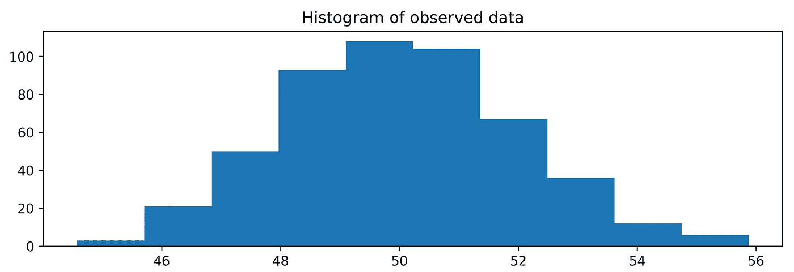

显示数据的另一种方法是估计概率密度函数:

```
from scipy.stats.kde import gaussian_kdefrom numpy import linspace# estimate the probability density function (PDF)kde = gaussian_kde(x_norm)# return evenly spaced numbers over a specified intervaldist_space = linspace(min(x_norm), max(x_norm), 100)# plot the resultsplt.plot(dist_space, kde(dist_space))
```

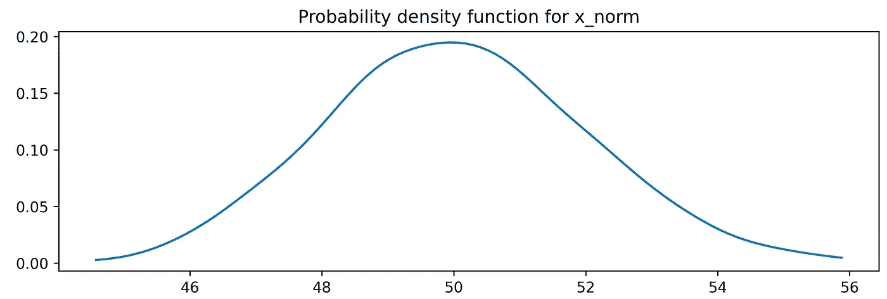

仅仅通过观察这些表现，就有可能对更适合我们数据的理论模型形成一些想法。也可以计算经验分布函数:

```
plt.plot(np.sort(x_norm), np.linspace(0, 1, len(x_norm)))plt.title(‘Empirical CDF for x_norm’)
```

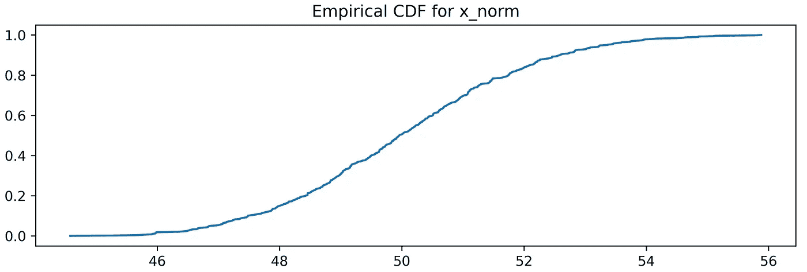

另一个可以提供帮助的图形工具是 QQ 图，它在 y 轴上显示观察数据的分位数与数学模型的理论分位数。

使用分位数这个术语，我们可以确定比特定值低**的那部分观察值，即分位数。例如，0.75 分位数(或 75%)是 75%的数据(样本)低于该值**的**和高于**的**的 25 %的点。**

```
from scipy import statsstats.probplot(x_norm, plot=plt)
```

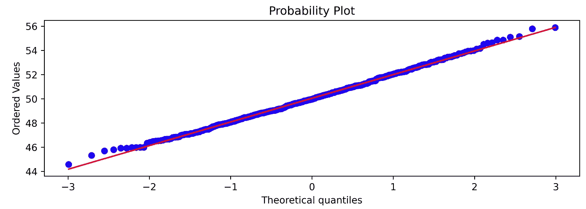

当图上的点倾向于位于对角线上时，这意味着数据(样本)以“良好”的方式拟合高斯模型。

如果我们有另一种观察值，例如，威布尔密度函数，我们可以做如下:

```
x_wei = np.random.weibull(2, 500) # A Weibull sample of shape 2and size 500plt.hist(x_wei)
```

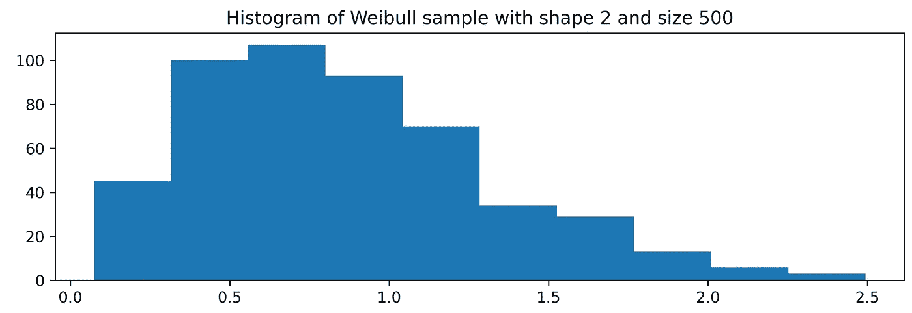

以及相对的 QQ 剧情:

```
stats.probplot(x_wei, plot=plt)
```

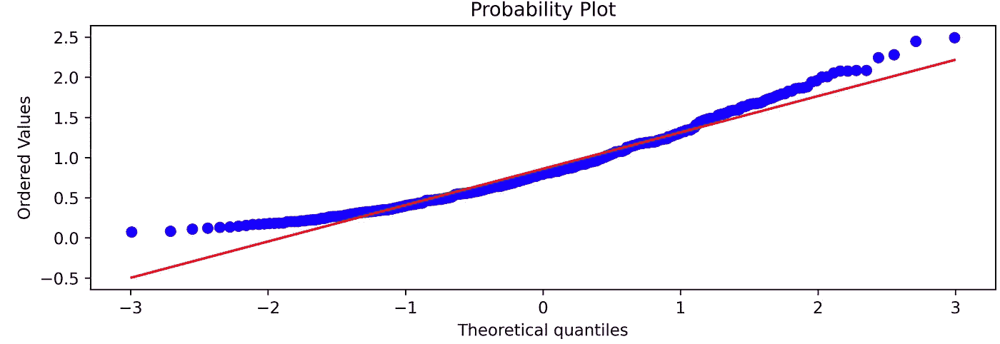 [## 米尔斯形式

### 编辑描述

无情-创造者-2481.ck.page](https://relentless-creator-2481.ck.page/68d9def351) 

# 选择正确的功能

我们看到，在某些情况下，模型的类型(功能)可以从模型的结构和性质中推导出来。然后选择一个模型，我们验证它是否符合观察到的数据。

在其他情况下，图形表示可能会有所帮助:从直方图的形状来看，可以逼近更好地表示数据的函数，但是，这种方法可能会有偏差。

皮尔逊准则是一种没有偏见的方法，用来选择最适合数据的函数。

皮尔逊准则源于微分方程的解，该微分方程“生成”一族代表不同经验分布的不同类型的函数。该功能完全取决于四个不同的特征:

*   意思是
*   差异
*   不对称
*   峭度

在标准化分布时，曲线(函数)的类型仅取决于不对称度和峰度的度量。

# 参数估计

一旦选择了更好地代表数据的函数，就有必要根据可用数据来估计表征该模型的参数。一些最常用的方法包括矩估计法、最小二乘法和最大似然估计法。在本简介中，我们将深入探讨以下方法:

*   天真的方法
*   矩量法
*   最大似然

朴素方法是最基本的方法，也是非常直观的:它包括通过估计模型的参数，例如，从正态分布中抽取样本的平均值来估计模型的参数

```
>>> print(np.mean(x_norm))
50.03732572479421
```

# 矩量法

矩方法包括将总体矩表示为感兴趣参数的函数。然后，它被设置为等于由所选函数和要估计的参数数量确定的理论矩。

让我们看看如何用 python 解决这个问题:

```
x_gamma = np.random.gamma(3.5, 0.5, 200) # simulate a gamma distribution of shape 3.5 and scale (λ) 0.5mean_x_gamma = np.mean(x_gamma) # mean of the datavar_x_gamma = np.var(x_gamma) # variance of the datal_est = mean_x_gamma / var_x_gamma # lambda estimation (rate)a_est = (mean_x_gamma ** 2) / l_est # alpha estimationprint(‘Lambda estimation: {}’.format(l_est))print(‘Alpha estimation: {}’.format(a_est))Lambda estimation: 2.25095711229392 
Alpha estimation: 1.2160321117648123
```

# 最大似然法

最大似然法是推断统计学中使用的一种方法。它从𝑓(𝑥,θ).密度函数开始它包括通过最大化似然函数来估计θ，或者在实践中，使用似然函数的自然对数(称为对数似然)通常更方便。

让我们来看看它的实际应用:

```
# generate datax = np.linspace(0,20, len(x_gamma))y = 3*x + x_gammaimport statsmodels.api as smols = sm.OLS(y, x_gamma).fit()print(ols.summary())
```

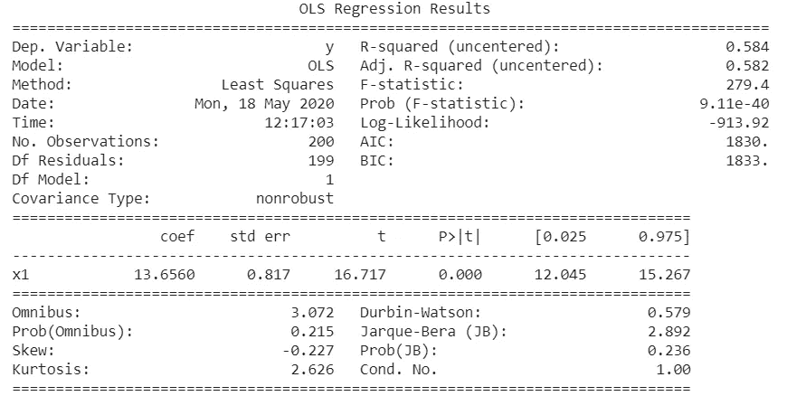

一个非常有用的包是`fitter`包，默认情况下，它估计从中抽取样本的分布。这非常有用，因为不需要知道似然函数，但只需指定样本和要测试的分布列表就足够了:

```
#!pip install fitterfrom fitter import Fitterf = Fitter(x_gamma, distributions=[‘gamma’, ‘dweibull’, ‘uniform’])f.fit()f.summary()
```

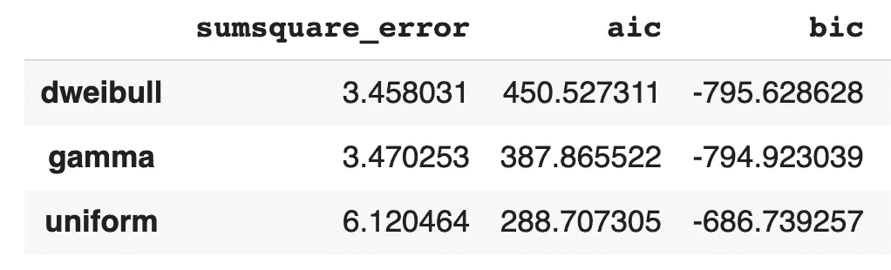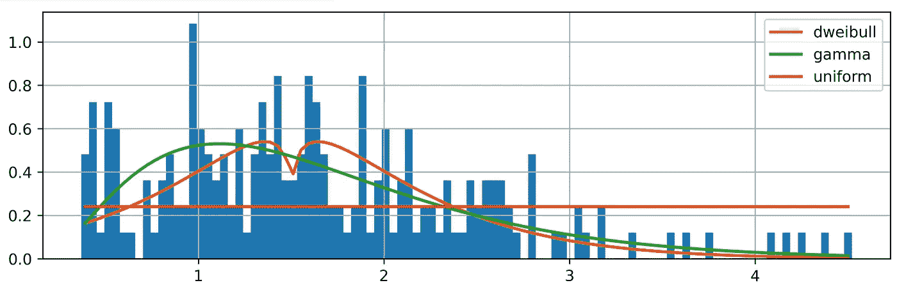

# 预测值的优度评估

需要评估预测值(成本函数、损失函数)的优良性，以评估观测数据和模型计算(预测)数据之间的近似程度。因此，损失函数计算经验数据和观测数据之间的差异，它应该对相同大小但符号不同的误差给予相同的权重，并且应该随着误差的增加而增加。损失函数可以是相对的，也可以是绝对的。在最常见的损失函数之间我们可以有:

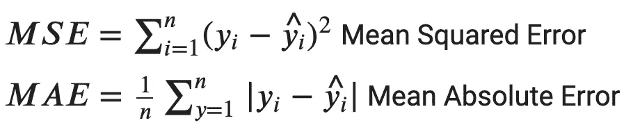

其中，𝑦是观测值，𝑦̂是理论(预测)值。通常，这些值要乘以 100，以便用百分比表示。

让我们看一个来自泊松分布的样本的例子:

```
import pandas as pddef dpois(x,mu):“””Calculates the density/point estimate of the Poisson distribution“””from scipy.stats import poissonresult=poisson.pmf(k=x,mu=mu)return resultx_poi = np.random.poisson(2.5, 200)lambda_est = np.mean(x_poi)table_os = pd.Series(x_poi).value_counts().sort_index().reset_index().reset_index(drop=True)table_os = table_os.valuesfreq_os = []freq_ex = []for i in range(len(table_os)):freq_os.append(table_os[i][1])freq_ex.append(dpois(x = range(0, np.max(x_poi) + 1), mu=lambda_est) * 200)from sklearn.metrics import mean_absolute_erroracc = mean_absolute_error(freq_os, freq_ex[0])print(‘Mean absolute error is: {:.2f}’.format(acc))acc_prc = acc / np.mean(freq_os) * 100print(‘Mean absolute percentage error is: {:.2f}’.format(acc_prc))Mean absolute error is: 3.30 
Mean absolute percentage error is: 14.84
```

评估预测值优劣的另一个示例是将密度函数与数据重叠:

```
x_norm = np.random.normal(10, 2, 200)(n, bins, patches) = plt.hist(x_norm, bins=15)table_os = pd.Series(x_norm).value_counts().sort_index().reset_index().reset_index(drop=True)table_os = table_os.valuesdef dnorm(x, mean=0, sd =1):“””Calculates the density of the Normal distribution“””from scipy.stats import normresult=norm.pdf(x,loc=mean,scale=sd)return resultx_fit = np.linspace(start=np.min(x_norm), stop=np.max(x_norm))y_fit = dnorm(x_fit, mean=np.mean(x_norm), sd = np.std(x_norm))fig, ax = plt.subplots(1, 1)ax.hist(x_norm, bins=15)ax2 = ax.twinx()ax2.plot(x_fit, y_fit, c=’orange’)plt.draw()
```

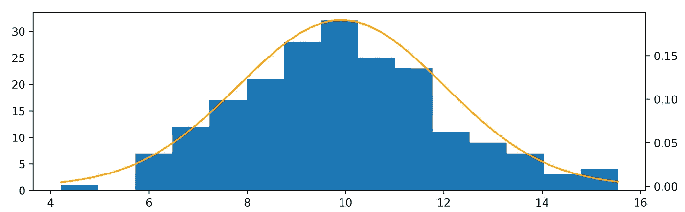

# 统计测试

可以进行不同的统计测试来评估拟合优度，即理论模型与数据的拟合程度。这些测试从“全局”的角度考虑样本，考虑了被研究样本的所有特征(均值、方差、分布形状……)，并且是分布不可知的，这意味着它们独立于被研究的分布。

分析中评估拟合优度的第一个测试是χ2(卡方检验)。它基于经验频率(预期频率)和观察频率之间的比较，建立在期望的密度函数上。χ2 可用于离散变量和连续变量，其数学公式如下:

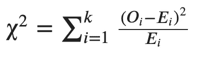

其中，𝑂𝑖是观测频率，𝐸𝑖是理论频率，𝑘是类别或区间数。该统计量渐近分布在具有𝑘−𝑝−1 自由度的名为χ2 的随机变量周围，其中𝑝是模型估计的参数数量。

当统计值低于某个阈值时，即当 p 值高于预先确定的显著性水平时，零假设被拒绝。

该测试在以下条件下有效:

*   样本应该足够大*(因为分布是渐近χ2)*
*   *每个类别的预期频率数不能少于 5。*
*   *需要应用耶茨连续性校正(连续性校正)，包括从每个观察值和其预期值|𝑂𝑖−𝐸𝑖|.之间的差中减去 0.5*

*让我们看看如何实现它:*

```
*import scipyobs = np.bincount(x_poi)lam = x_poi.mean()expected = scipy.stats.poisson.pmf(np.arange(len(obs)), lam) * len(x_poi)chi2 = scipy.stats.chisquare(obs, expected)[1]print(‘Chi-sqaure significance level is: {:.4f}’.format(chi2))Chi-sqaure significance level is: 0.4288 plt.bar(list(range(0, len(obs))), height=obs)plt.scatter(list(range(0, len(expected))), expected,c=’red’)plt.plot(expected,c=’red’, alpha=.5, linestyle=’dashed’)*
```

*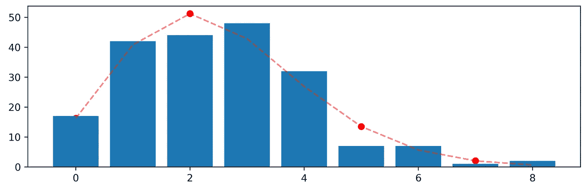*

*在连续变量的情况下，在这种情况下来自伽马分布，具有从观察数据估计的参数，可以如下进行:*

```
*a = 3.5 # shape parametermean, var, skew, kurt = gamma.stats(a, moments=’mvsk’)x = np.linspace(gamma.ppf(0.01, a), gamma.ppf(0.99, a), 1000) # percent point function# Generate random numbers from the gamma distribution with paramter shape of 3.5r = gamma.rvs(a, size=1000)plt.plot(x, gamma.pdf(x, a), lw=5, alpha=0.6)plt.hist(r, density=True, alpha=0.2)*
```

*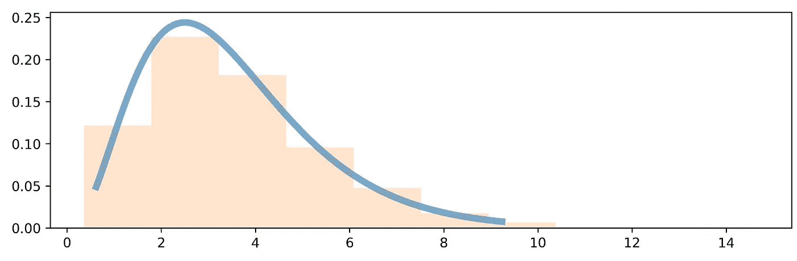*

```
*# Compute the chi-sqaure test between the random sample r and the observed frequencies xfrom scipy.stats import chisquarechisquare(r, x)>>> Power_divergenceResult(statistic=2727.3564204592853, pvalue=3.758371304737685e-160)*
```

*卡方检验的零假设是观察到的频率和预期的频率之间没有关系，但是，在这种情况下，p 值小于 0.05 的显著性水平，因此我们拒绝零假设。*

*另一个广泛使用的统计检验是 Kolmogorov-Smirnov 拟合优度检验。该检验是非参数检验，可用于离散数据、分类存储的连续数据(然而，一些作者不同意这一点)和连续变量。该检验基于数据的经验分布函数和相关分布的累积分布函数之间的距离的比较。*

*当样本量不太大时，Kolmogorov-Smirnov 检验比卡方检验更有效。对于大样本，两种测试具有相似的功效。Kolmogorov-Smirnov 检验最严重的限制是分布必须完全指定，也就是说，位置、比例和形状参数不能从样本中估计。由于这些限制，有时最好使用安德森-达林检验。然而，安德森-达林检验只适用于一小部分分布。*

*在 Python 中，我们可以使用`scipy`来执行这个测试，让我们用参数`mu`为 0.6 的泊松`pdf`的两个样本来实现它:*

```
*from scipy.stats import ks_2sampfrom scipy.stats import poissonmu = 0.6 # shape parameterr = poisson.rvs(mu, size=1000)r1 = poisson.rvs(mu, size=1000)ks_2samp(r, r1)>>> Ks_2sampResult(statistic=0.037, pvalue=0.5005673707894058)*
```

*在他的测试中，零假设表明两个分布之间没有差异，因此它们来自一个共同的分布。在这种情况下，p 值 0.68 无法拒绝零假设，换句话说，样本来自相同的分布。*

*但是让我们看看泊松和正态样本之间的关系:*

```
*from scipy.stats import normn = norm.rvs(0.6, size=1000)ks_2samp(r, n)>>> Ks_2sampResult(statistic=0.306, pvalue=9.933667429508653e-42)*
```

*相反，在这种情况下，p 值小于 0.05 的显著性水平，这表明我们可以拒绝零假设，因此两个样本来自两个不同的分布。*

*我们还可以用图形比较两个 CDF:*

```
*def cdf(x, plot=True):x, y = sorted(x), np.arange(len(x)) / len(x)plt.title(‘Normal VS Poisson CDF’)return plt.plot(x, y) if plot else (x, y)cdf(r)cdf(n)*
```

*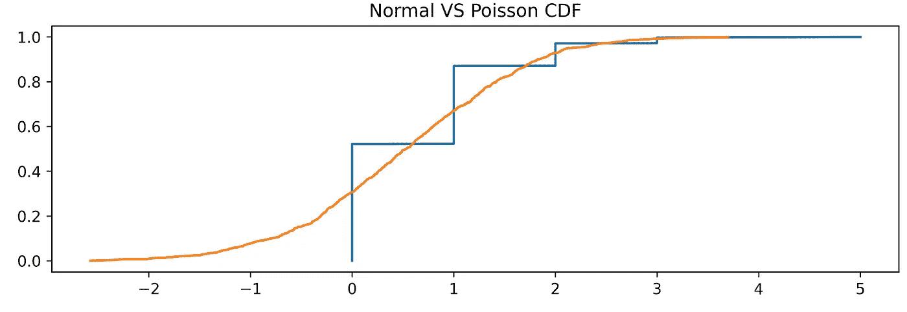*

# *常态检验*

*可能发生的另一个挑战是验证收集的样本是否来自正态分布，为此，有一个测试族称为正态性测试。夏皮罗-维尔克检验是最强大的正态性检验之一，它对小样本也非常有效。通过匹配两个备选方差估计来检验正态性:通过有序样本值的线性组合计算的非参数估计和参数估计。*

*`Scipy`还提供了一种执行该测试的方法:*

```
*from scipy.stats import norm, shapiron = norm.rvs(size=1000)shapiro(n)>>> (0.9977349042892456, 0.18854272365570068)*
```

*经过检验的零假设(H0)是数据来自正态分布，p 值为 0.188，在这种情况下，我们无法拒绝它，说明样本来自正态分布。*

*另一种常见的正态性检验是 Jarque-Bera 检验:*

```
*from scipy.stats import norm, jarque_beran = norm.rvs(size=1000)jarque_bera(n)>>> (0.8127243048627657, 0.6660689052671738)*
```

*和以前一样，我们不拒绝数据来自正态总体的无效假设。*

```
***I have a newsletter 📩.**Every week I’ll send you a brief findings of articles, links, tutorials, and cool things that caught my attention. If tis sounds cool to you subscribe.*That means* ***a lot*** *for me.**
```

 *[## 米尔斯形式

### 编辑描述

无情-创造者-2481.ck.page](https://relentless-creator-2481.ck.page/68d9def351)* 

# *附录:*

*   *用 NumPy 掌握数值计算:掌握科学计算，轻松完成复杂的运算(于米特·梅尔特·卡马克，梅尔特·库哈大罗格卢)*
*   *Python 中的正态性测试([https://datascienceplus.com/normality-tests-in-python/](https://datascienceplus.com/normality-tests-in-python/))*
*   *用最大似然法拟合数据的概率分布([https://ipython-books . github . io/75-fitting-a-probability-distribution-to-data-with-the-maximum-likelihood-method/](https://ipython-books.github.io/75-fitting-a-probability-distribution-to-data-with-the-maximum-likelihood-method/))*
*   *用 R([https://cran . R-project . org/doc/contrib/Ricci-DISTRIBUTIONS-en . pdf](https://cran.r-project.org/doc/contrib/Ricci-distributions-en.pdf))拟合分布*
*   *分布拟合到数据([https://python health care . org/2018/05/03/81-distribution-fitting-to-data/](https://pythonhealthcare.org/2018/05/03/81-distribution-fitting-to-data/))*