# 统计学导论—第一部分

> 原文：<https://towardsdatascience.com/an-introduction-to-statistics-part-1-e056837afa8e?source=collection_archive---------31----------------------->

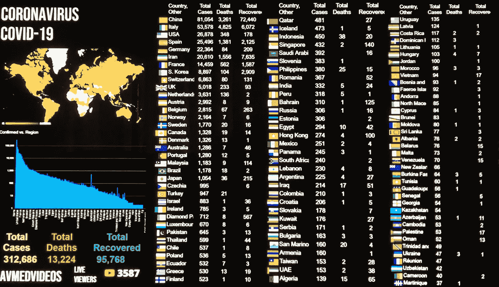

想象给了你一些你不知道的问题的答案。

如果你曾经翻到笔记本的最后一页，读到一些有趣的事实和陈述，比如“一个普通人一生中行走的距离相当于绕地球两圈”，请举手。我们中的许多人都对给出的统计数据感兴趣。难道不是吗？我当然这么认为，从大量定量数据中解读有用信息的艺术(使用基于数学的方法)就是**统计学。**

> **在统计学中，我们总是对研究大量的人或物体感兴趣。**

**人群** —所有拟研究对象的集合。

**样本** —我们为了对总体做出推断而研究的总体子群。

**参数** —参数是总体的数字属性。

**统计量** —统计量是样本的数值属性，用于估计总体的相应参数。*示例包括*均值、中值、众数、标准差等。

例如，假设您想知道某个特定杂志的订阅者的平均收入，这是一个总体参数。你随机抽取 100 名订户，并确定他们的平均收入是₹27,500(一个统计数字)。你得出结论，人口平均收入μ也可能接近₹27,500。这是统计推断的一个例子。

## 如何挑选样本？

*   样本应该永远是总体的真实代表。
*   样本应涵盖所有地区/所有类型的人口。

选择样本的不同方法有:

**简单随机抽样:**

简单随机抽样是一种抽样技术，其中总体中的每个项目都有均等的机会和可能性在[样本中被选中。在这里，项目的选择完全取决于机会或概率，因此这种抽样技术有时也被称为机会法。](https://www.questionpro.com/audience/)

人们是随机挑选的。

**整群抽样:**

当**自然群体(年龄、性别等)出现时，在统计中使用整群抽样..)**存在于一个种群中。整个群体被细分为群或组，然后从每个组中收集随机样本。

*   单阶段聚类采样:*使用每个所选聚类中的所有元素。*
*   两阶段整群抽样:对选定的整群应用随机抽样技术。例如，一旦您决定了您的分类，您可以使用简单的随机抽样从这些选择的分类中选择您的

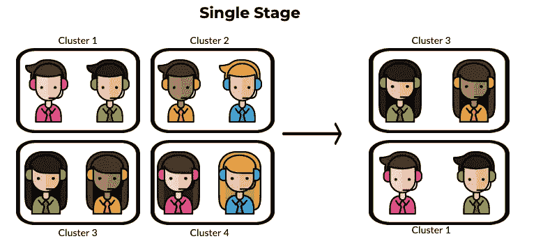

选择聚类 3 和聚类 1。

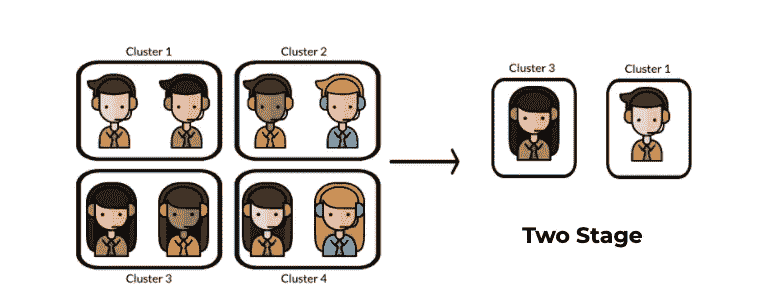

简单的随机抽样应用于聚类 3 和聚类 1。

**分层抽样:**

这种技术基于相似性将群体的元素划分为小的子群(层),使得组内的元素是同质的，而形成的其他子群中的元素是异质的。然后从这些地层中随机选择元素。我们需要有关于人群的先验信息来创建子群。

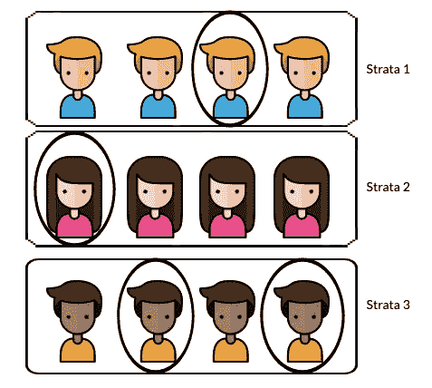

从每个阶层中随机选择。

## 我们如何描述和总结数据？

让我们假设您被要求分析表格形式的网飞用户数据，并回答以下问题。

> **用表格形式很难回答哪怕是简单的问题。**

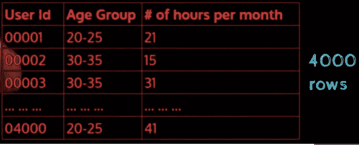

资料来源:PadAI 四分之一实验室

20-25 岁年龄段的用户看电视节目的最少/最多时间是多少？

工作时间较短(5-10 小时)或较长(60-70 小时)的用户多吗？

这就是**描述性统计**发挥作用的地方。

**描述性统计**是对给定数据集进行概括的简要描述性系数，该数据集可以是总体的代表，也可以是总体的样本。

**不同类型的数据:**

数据通常有两种类型。

1) **定性** —名词性和序数。

*   定性数据是用 ***有限离散类描述对象的数据。*** 例子包括颜色、图案等。
*   没有自然排序的定性数据是名义上的。
*   具有**自然排序**的定性数据是有序的。

2) **定量** —离散和连续

*   定量数据是用 ***数值描述对象的数据。***
*   只能取有限个数值的定量数据是离散的(整数或整数)。
*   定量数据可以取有限个数值，以及**分数值，**是连续的(实数)。

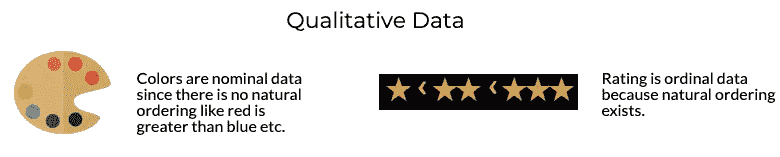

## 描述定性数据

定性数据的典型特征是重复值。

**频率图:**

*   一个值出现的总次数被称为**频率。**
*   数据的频率可以用频率表来描述。
*   表格有点老派，因此频率图用于可视化频率。
*   当值较多时，频率图变得难以处理。
*   因此，根据频率对数据进行分类有助于更好的可视化。
*   有许多类型的频率图可用。用法取决于需要回答的问题。

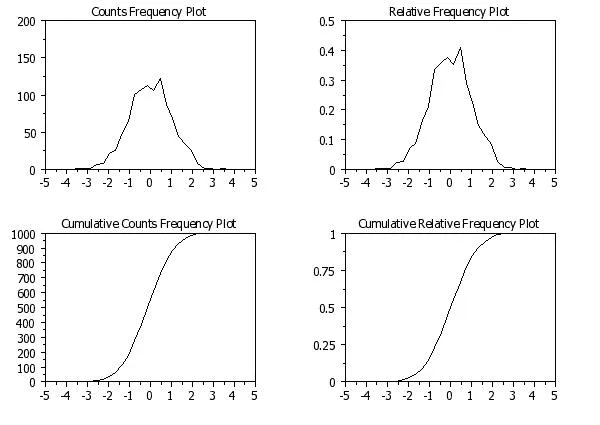

图片来源:NIST

## 描述定量数据

*   直方图用于描述定量数据。
*   直方图中 x 轴上的值有一个自然的顺序。
*   如果 x 轴上有许多值，我们可以使用**容器大小**概念来使用类间隔。随着仓大小的增加，粒度受到很少细节的影响。
*   理想的箱大小揭示有意义的模式既不隐藏也不揭示太多数据。
*   Bin 大小取决于感兴趣的领域和所需的洞察力。

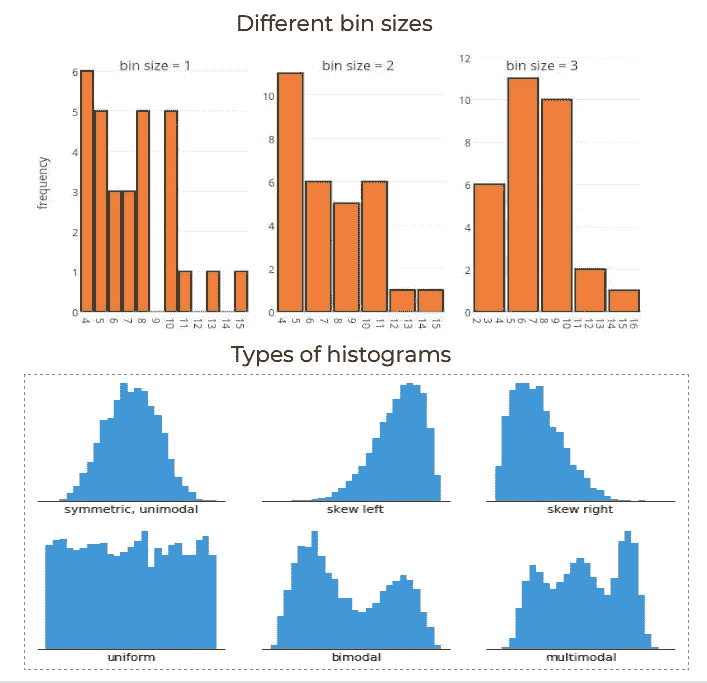

## 茎和叶图

茎叶图是一种显示某类值出现频率的方法。你可以为这些值制作一个频率分布表或直方图，或者你可以使用一个茎-叶图，让数字本身显示几乎相同的信息。例如，假设您有以下值列表:12，13，21，27，33，34，35，37，40，40，41。

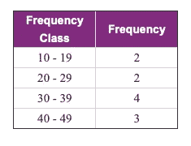

你可以做一个频率分布表，显示你有多少个十岁、二十岁、三十岁和四十岁。

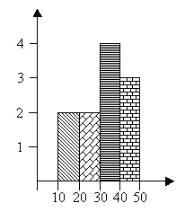

你可以做一个柱状图，它是一个显示发生次数的条形图，每一类都是十次、二十次、三十次和四十次。

频率分布表和直方图的缺点是，虽然每个类别的频率很容易看到，但原始数据点已经丢失。例如，您可以判断出，列表中一定有三个 40 多的值，但是无法从表格或直方图中判断出这些值可能是多少。另一方面，您可以为相同的数据绘制茎和叶图。

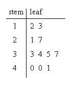

“stem”是包含十位数字的左侧列。“叶子”是右栏中的列表，显示了 10、20、30 和 40 的所有一位数。如你所见，原始值仍然可以确定；你可以从底部的叶子看出，四十年代的三个数值分别是 40，40 和 41。

我希望你理解了所解释的概念。你可以在这里阅读[这篇文章的下一部分。](https://medium.com/datadriveninvestor/introduction-to-statistics-part-2-25fb0f3e0b93)