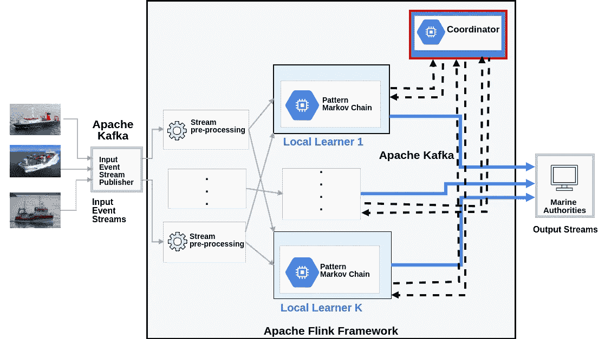
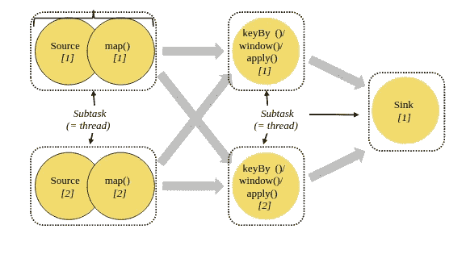
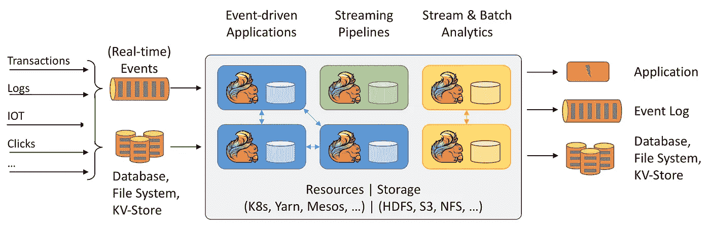

# Apache Flink 流处理简介

> 原文：<https://towardsdatascience.com/an-introduction-to-stream-processing-with-apache-flink-b4acfa58f14d?source=collection_archive---------7----------------------->

## 探索 Apache Flink 的分布式流处理引擎的功能！

由[帕特里克市长](https://unsplash.com/@pmayor?utm_source=unsplash&utm_medium=referral&utm_content=creditCopyText)在 [Unsplash](https://unsplash.com/s/photos/data-streams?utm_source=unsplash&utm_medium=referral&utm_content=creditCopyText) 拍摄的照片

在许多应用领域，大量的流数据是从不同的来源生成的，例如，用户在网上的活动、来自物联网(IoT)设备的测量、来自金融服务的交易以及位置跟踪源。这些数据流(无界的)过去通常存储为数据集(有界的)，稍后由批处理作业进行处理。尽管由于数据的时间价值，这在某些情况下不是一种有效的方式，但实时处理是企业所希望的，以使他们能够从数据中获得洞察力，并在数据产生时主动响应变化(*运动中)*)。

为此，必须使用实时流处理器更新应用程序，使其更加基于流。这就是 Apache Flink 的用武之地；Flink 是一个用于有状态、大规模、分布式和容错流处理的开源框架。

这篇博客文章概述了 Apache Flink 及其用于流应用程序的关键特性。它重点介绍了 Flink 的 DataStream API，并探讨了一些底层的架构设计概念。

这篇文章的大部分细节都是基于我在参与 datAcron EU 研究项目期间在 Flink 的亲身经历，本文[对此进行了总结](http://ceur-ws.org/Vol-2083/paper-17.pdf)。

`Distributed Online Learning System Archircture using Apache Flink.` 作者图片|图片来自 [*一种针对运动事件流的模式预测的分布式在线学习方法*](http://datacron1.ds.unipi.gr:9082/publication/a-distributed-online-learning-approach-for-pattern-prediction-over-movement-event-streams-with-apache-flink/) 。

Apache Flink 越来越受欢迎，并被用于生产中，以构建大规模数据分析和处理海量流数据的组件，其中它为世界上一些要求最苛刻的流处理应用程序提供动力，例如，它是阿里巴巴搜索引擎的重要组件。

# Apache Flink 概述

Apache Flink 是一个开源平台，提供可伸缩、分布式、容错和有状态的流处理能力。Flink 是最新和最具开拓性的大数据处理框架之一。

Apache Flink 允许从不同来源接收大量流数据(高达数 TB ),并在将派生的流推送到其他服务或应用程序(如 Apache Kafka、DBs 和 Elastic search)之前，在多个节点上以分布式方式进行处理。简单地说，Flink 管道的基本构件:输入、处理和输出。其运行时以容错方式支持极高吞吐量的低延迟处理。Flink 功能能够实时洞察流数据和基于事件的功能。Flink 支持流数据的实时数据分析，非常适合流数据的连续提取-转换-加载(ETL)管道以及事件驱动的应用程序。

它给出了流数据和批处理数据的处理模型，其中批处理模型被视为流模型(即有限流)的特例。Flink 的软件栈包括分别用于处理无限和有限数据的数据流和数据集 API。Flink 提供了对数据流或数据集的多种操作，如映射、过滤、分组、更新状态、连接、定义窗口和聚合。

Flink 的两个主要数据抽象是数据流和数据集，它们表示数据元素的只读集合。元素列表在数据集中是有界的(即有限的)，而在数据流的情况下是无界的(即无限的)。

Flink 程序由在 Flink 核心上执行的数据流图(即，有向非循环图 DAG)表示，Flink 核心是分布式流数据流引擎。数据流图由有状态操作符和中间数据流分区组成。每个操作符的执行由多个并行实例处理，其数量由并行级别决定。每个并行操作符实例在计算机集群中的机器上的独立任务槽中执行。下图显示了 Flink 应用程序的数据流图示例。

**Apache Flink-**[Flink](https://ci.apache.org/projects/flink/flink-docs-release-1.9/concepts/runtime.html)中的并行数据流图

以下是对 Flink 主要特性的简要描述:

*   健壮的有状态流处理:Flink 应用程序能够处理需要上下文状态的业务逻辑，同时使用其[数据流 API](https://ci.apache.org/projects/flink/flink-docs-release-1.9/dev/datastream_api.html) 以任何规模处理数据流
*   容错:Flink 提供了一种基于定期异步检查点的故障状态恢复机制(将内部状态保存到外部持久存储，如 HDFS)
*   恰好一次一致性语义:Flink 的核心确保在失败的情况下，流中的每个事件都恰好被提交和处理一次
*   可扩展性:应用程序被并行化，以扩大或缩小处理任务的数量
*   内存性能:Flink 应用程序通过访问本地(通常在内存中)状态来执行所有计算，产生非常低的处理延迟
*   Flink 提供了与各种数据源的无缝连接，包括 Apache Kafka、Elasticsearch、Apache Cassandra、Kinesis 等等
*   灵活的部署:Flink 可以部署在各种集群环境上，比如 YARN、Apache Mesos 和 Kubernetes
*   复杂事件处理(CEP)库，用于检测数据流中的模式(即事件序列)
*   Java 和 Scala 中流畅的 API
*   与 Spark 流的微批处理模型相比，Flink 是一个真正的流引擎

# 摘要

在这篇博文中，我们介绍了作为 Flink 框架构建块的高级流处理组件。简而言之，Apache Flink 是一个强大的系统，用于实现事件驱动、数据分析和 ETL 管道流应用程序，并大规模运行它们。在这篇文章中，我仅仅触及了表面，我鼓励你查看 Apache Flink 的文档。

**Apache Flink——数据流上的有状态计算**

# 资源:

*(1)* [*艾哈布·卡达赫、迈克尔·莫克、埃利亚斯·阿列维佐斯和格奥尔格·富克斯。基于 Apache Flink 的运动事件流模式预测的分布式在线学习方法。在 2018 年经济技术发展局/ICDT 研讨会上。*](http://datacron1.ds.unipi.gr:9082/publication/a-distributed-online-learning-approach-for-pattern-prediction-over-movement-event-streams-with-apache-flink/)

[*https://flink . Apache . or*](https://flink.apache.org/)g

 [## Blink:阿里巴巴如何使用 Apache Flink

### 在电子商务网站上，是什么造就了一个伟大的搜索引擎？实时的结果，就像…

www.ververica.com](https://www.ververica.com/blog/blink-flink-alibaba-search) 

[由 Flink 提供动力](https://flink.apache.org/poweredby.html)

 [## 阿帕奇弗林克培训

### Apache Flink 是一个用于可伸缩流和批处理数据处理的开源平台。它提供了富于表现力的 API 来…

training.ververica.com](https://training.ververica.com/)  [## 扩展雅虎！流式基准测试

### 2017 年 12 月 18 日更新:在这篇初始帖子发布近两年后，我们在另一篇文章中讨论了雅虎流媒体基准测试…

www.ververica.com](https://www.ververica.com/blog/extending-the-yahoo-streaming-benchmark)