# 支持向量回归机简介

> 原文：<https://towardsdatascience.com/an-introduction-to-support-vector-regression-svr-a3ebc1672c2?source=collection_archive---------0----------------------->

## 使用支持向量机进行回归

支持向量机在分类问题中是众所周知的。然而，在回归中使用支持向量机并没有很好的记录。这些类型的模型被称为支持向量回归(SVR)。

在本文中，我将介绍 SVR 与其他回归模型相比的用处，深入研究算法背后的数学，并提供一个使用波士顿房价数据集的示例。

## 简单线性回归

在大多数线性回归模型中，目标是最小化误差平方和。以普通最小二乘法(OLS)为例。具有一个预测值(特征)的 OLS 的目标函数如下:

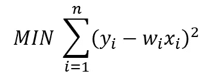

其中，yᵢ是目标，wᵢ是系数，xᵢ是预测值(特征)。

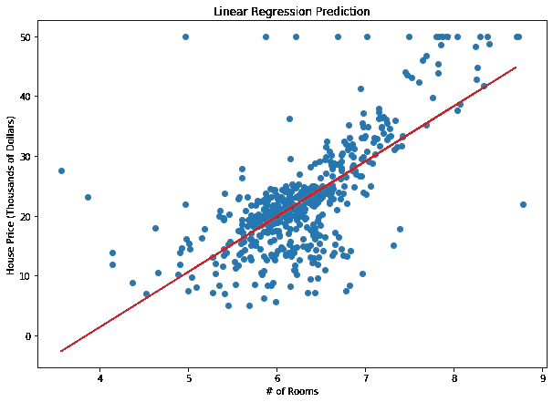

OLS 对波士顿房价的预测

Lasso、Ridge 和 ElasticNet 都是这个简单方程的扩展，带有一个额外的惩罚参数，旨在最小化复杂性和/或减少最终模型中使用的特征数量。不管怎样，和许多模型一样，目标是减少测试集的误差。

然而，如果我们只关心在一定程度上减少误差呢？如果我们不在乎我们的误差有多大，只要它们在可接受的范围内，会怎么样？

以房价为例。如果我们认为预测在一定的金额范围内——比如说 5000 美元——是可以接受的，那会怎么样呢？只要误差在这个范围之内，我们就可以在寻找预测值时给我们的模型一些灵活性。

## SVR FTW

输入支持向量回归。SVR 让我们可以灵活地定义模型中可以接受的误差，并找到合适的线(或更高维的超平面)来拟合数据。

与 OLS 相反，SVR 的目标函数是最小化系数——更具体地说，是系数向量的 *l* 2 范数——而不是平方误差。误差项改为在约束中处理，其中我们将绝对误差设置为小于或等于指定的裕量，称为最大误差ϵ(ε)。我们可以调整 epsilon 来获得我们的模型所需的精度。我们新的目标函数和约束如下:

**最小化:**

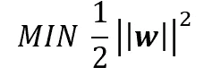

**约束:**

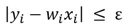

**说明性示例:**

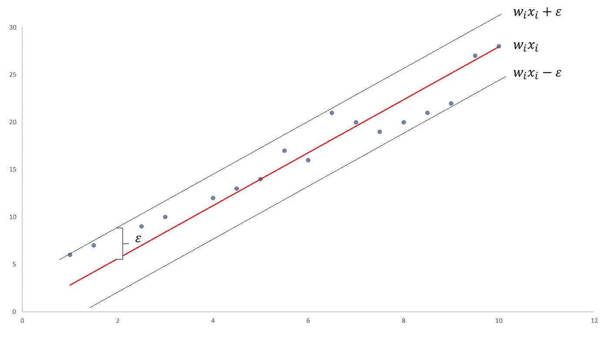

简单 SVR 的说明性示例

让我们在数据集上尝试简单的 SVR。下图显示了训练好的 SVR 模型对波士顿房价数据的结果。红线代表最佳拟合线，黑线代表误差幅度，ϵ，我们将其设置为 5(＄5000)。

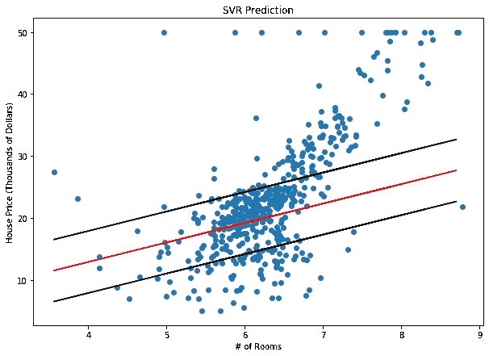

基于ϵ=5 的波士顿房价 SVR 预测

你可能会很快意识到这个算法并不适用于所有的数据点。该算法尽可能好地解决了目标函数，但是一些点仍然落在边界之外。因此，我们需要考虑比ϵ.更大的误差的可能性我们可以用松弛变量做到这一点。

## 给我们自己一些空间(和另一个超参数)

松弛变量的概念很简单:对于任何落在ϵ之外的值，我们可以用ξ来表示它与边距的偏差。

我们知道这些偏差有可能存在，但是我们仍然希望尽可能地减少它们。因此，我们可以将这些偏差添加到目标函数中。

**最小化:**

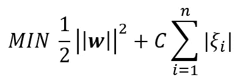

**约束:**

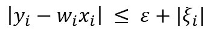

**例证:**

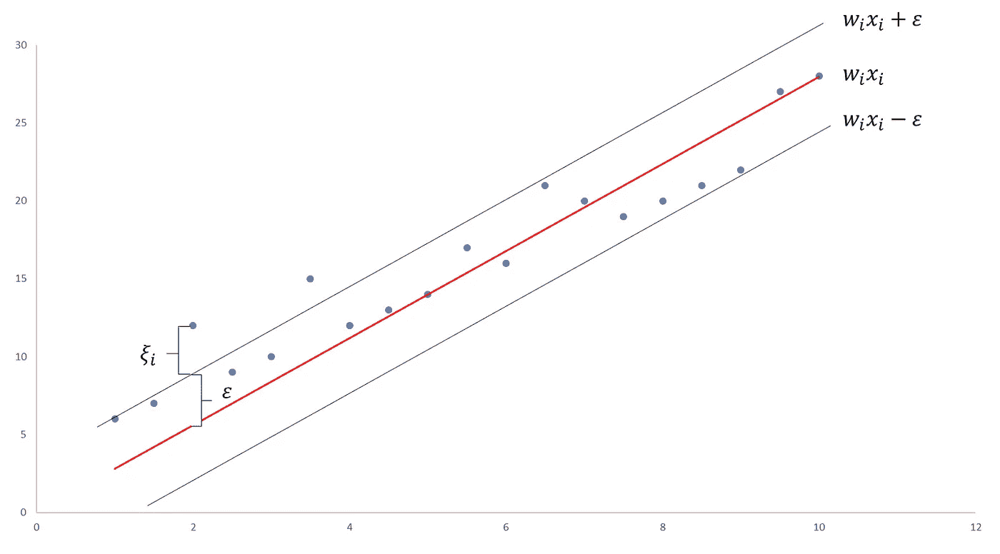

带有松弛变量的支持向量回归的示例

我们现在有了一个额外的超参数， *C* ，，我们可以对其进行调整*。*随着 *C* 的增加，我们对ϵ以外积分的容忍度也在增加。当 *C* 接近 0 时，容差接近 0，方程就变成了简化的(尽管有时不可行)方程。

让我们设置 *C* =1.0，重新训练上面的模型。结果绘制如下:

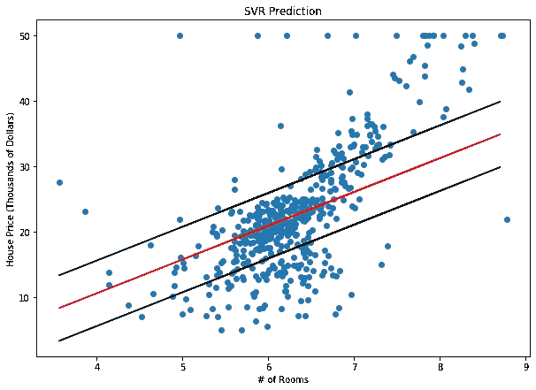

用ϵ=5，C=1.0 的 SVR 预测波士顿房价

## 寻找 C 的最佳值

上述模型似乎更符合数据。我们可以更进一步，在 *C* 上进行网格搜索，以获得更好的解决方案。让我们定义一个评分标准，ε内的 *%。该指标衡量测试集中的总点数有多少落在我们的误差范围内。我们还可以监控平均绝对误差( *MAE* )如何随 *C* 变化。*

下面是网格搜索结果图，x 轴上的值为 *C* ，左右 y 轴上的值分别为ε和 *MAE* 内的值为 *%。*

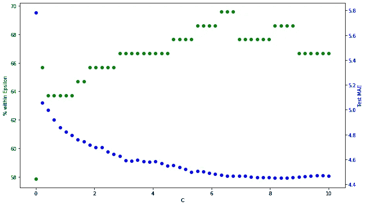

C 语言网格搜索

我们可以看到， *MAE* 一般随着 *C* 的增加而减少。然而，我们看到ε指标中的 *%出现最大值。因为我们这个模型的最初目标是在我们的误差范围(＄5000)内最大化预测，我们想要找到在ε*内最大化 *%的 *C* 的值。因此， *C* =6.13。*

让我们用我们最终的超参数，ϵ=5， *C* =6.13，建立最后一个模型。

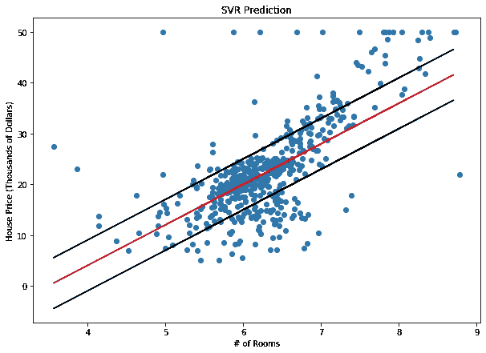

用ϵ=5 的 SVR 预测波士顿房价，C=6.13

如上图所示，正如预期的那样，这个模型又比以前的模型有所改进。

## 结论

SVR 是一种强大的算法，允许我们通过可接受的误差 margin(ϵ和调整我们对超出可接受误差率的容忍度来选择我们对误差的容忍度。希望本教程已经向您展示了 SVR 的来龙去脉，并让您有足够的信心将它添加到您的建模武库中。

感谢阅读！如果你喜欢这个帖子或者有任何问题/评论，请在下面留下评论！

如果你想更新我正在写的东西、我正在构建的辅助项目或我觉得有趣的文章，请随时加入我的时事通讯— [**【有抱负的数据科学家**](http://aspiringdatascientist.com/) 。

*这篇帖子的代码可以在我的* [*GitHub*](https://github.com/tomsharp/SVR/blob/master/SVR.ipynb) *页面找到。*

*关于这个话题的附加信息:*[https://sci kit-learn . org/stable/modules/generated/sk learn . SVM . SVR . html](https://scikit-learn.org/stable/modules/generated/sklearn.svm.SVR.html)[https://en . Wikipedia . org/wiki/Support-vector _ machine # Regression](https://en.wikipedia.org/wiki/Support-vector_machine#Regression)[https://www.saedsayad.com/support_vector_machine_reg.htm](https://www.saedsayad.com/support_vector_machine_reg.htm)